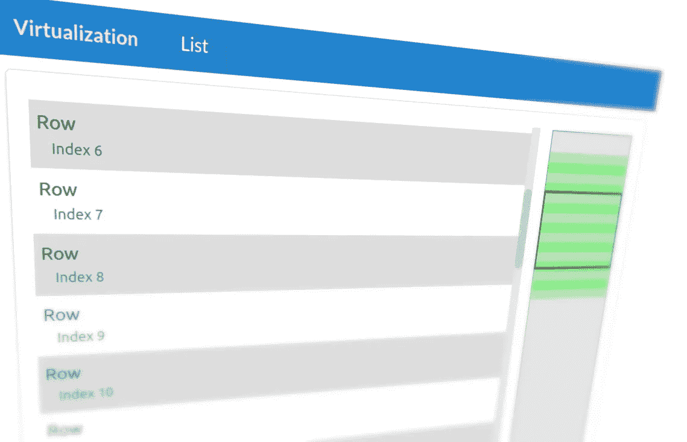
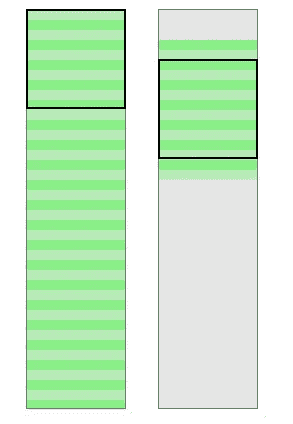
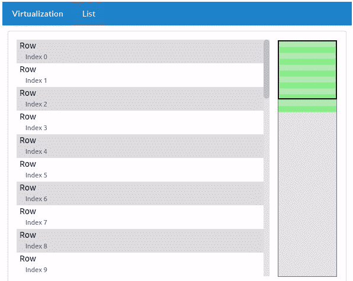
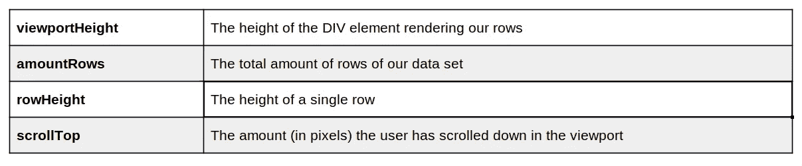
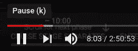

# React 中从头开始的虚拟化渲染

> 原文：<https://betterprogramming.pub/virtualized-rendering-from-scratch-in-react-34c2ad482b16>

## 让我们了解虚拟化是如何工作的



我们今天将创造什么！作者照片。

许多年前，我是一个开发团队的成员，该团队正在创建一个必须呈现大量数据的 Flash 应用程序。我们努力将它呈现为一个列表。滚动列表很慢，但我想出了一个解决办法。

今天，我将解释我当时在[动作脚本 3.0](https://en.wikipedia.org/wiki/ActionScript#ActionScript_3.0) 中创作的东西。不用说，我们将使用 JavaScript 来代替。我们将创建一个非常高级的演示，我将指导您完成所有步骤，以便您对这个高性能解决方案背后的逻辑有一个坚实的理解。渲染几百万个项目(！)没问题。我们最后会谈到这一点。

我知道存在第三方解决方案，如流行的[反应虚拟化](https://www.npmjs.com/package/react-virtualized)。但是在我看来，学习如何自己创建虚拟化是一个有用的练习。你不仅可以定制最终组件的每一个方面，还可以理解它的所有小部分，这将有助于你成为最好的开发人员。

在我们写代码之前，先说几句关于虚拟化的话。

# 虚拟化

虚拟化意味着“创造物理上不存在的东西。”就呈现 web 应用程序而言，您可以说这意味着“在内存中创建您的 web 应用程序，但不实际在 DOM 中呈现它。”例如，在内存中，我们定义我们的 web 应用程序由一个`div`元素组成，但是我们实际上并不在浏览器的 DOM 中呈现这个`div`元素。

请看下图:



非虚拟化与虚拟化渲染。

黑色边框表示视口。可以说是我们的班长。

在左侧，有一个 40 行的列表(绿色元素)正在被渲染。我们在屏幕上看到了其中的 10 行，但是剩下的 30 行也被渲染了。更准确地说，我们指示我们的浏览器渲染它们(浏览器是否实际渲染它们是另一回事)。我们已经将它们添加到 DOM 中。除非我们向下滚动，否则我们看不到这些行。

在右侧，我们可以看到虚拟化在发挥作用。我们只指示我们的浏览器呈现当前应该在视口中可见的行——加上之前和之后的一些行，我们称之为*缓冲行*。有时这种技术被称为*过扫描，*虽然我不认为使用这个术语是完全准确的。它指的是从 20 世纪 30 年代到 21 世纪初在某些电视机上使用的一种旧技术。但确实有一些相似之处。

可以想象，使用左侧的技术呈现数千行(如果不是数百万行的话)是有问题的。如果我们指示我们的浏览器呈现成千上万的行，它将会很困难。

让我们从头开始创建一个使用虚拟化渲染许多行的视口，这样我们就可以了解发生了什么。

和往常一样，所有的代码都可以在 GitLab 上我的知识库中找到。

是时候写一些代码了！

# 列表组件



动画:虚拟化在行动。

我们将像这样初始化我们的(虚拟)数据:

有两件事值得一提:我们定义了我们的`rowHeight` (40 个像素)，对于每一行，我们计算它的`top`位置(index *一行的高度)。这是解决方案的关键部分。将以相对于其父级(视口)的绝对位置来渲染行。因为我们正在创建一个垂直列表，所以我们只需要计算行的垂直位置。

*注意:大多数虚拟化库使用绝对定位。React-virtualized 的* [*列表组件*](https://github.com/bvaughn/react-virtualized/blob/master/docs/List.md) *要求你定义一个* `*rowHeight*` *属性，该属性应该是一个数字或者一个函数，返回给定索引的行高，增加了对动态行高的支持。*

# 相关变量

在我们实现实际的逻辑之前，您应该知道相关的变量。您现在应该明白，在渲染我们的行之前，我们必须进行一些计算。这些计算需要几个变量:



即将进行的计算的相关变量。

唯一的动态值(在我们的例子中)是`scrollTop`的值。当用户滚动视窗时，我们必须重新计算和渲染。我们很快会研究这个问题，但是首先，我们会做一个初始渲染。

# 初始渲染

首先，我们将只渲染当前在视口中可见的行。他们是哪几个？

如果用户没有向下滚动，我们将呈现索引为`0`到`9`的行。我们如何计算这个？

我们可以像这样计算第一个可见行(在我们的视窗顶部)的索引:

```
// indexStart
Math.floor(scrollTop / rowHeight);
```

如果用户没有向下滚动，结果是`0`(零)。这是有意义的，因为在这种情况下，第一行也将是第一个*可见的*行。如果我们的用户向下滚动，比如说 40 个像素，结果将是`1`(一)。这也是符合逻辑的，因为第一行(索引为`0`)会从屏幕上消失。注意我们如何在一个`Math.floor`调用中包装我们的计算。这确保了部分可见的行也将被返回。

以类似的方式，我们也可以计算应该呈现的最后一行的索引:

```
// indexEnd
Math.ceil((scrollTop + viewportHeight) / rowHeight - 1);
```

请注意，现在有一点点不同。我们使用`Math.ceil`代替，由于我们的零索引列表，我们必须在表达式中减去`1`(一)。

# 缓冲行(过扫描)

上面的计算将返回一系列行(`indexStart`到`indexEnd`)，这些行代表应该在视口中可见的行。但是正如我们在动画中看到的，如果我们缓冲一些行，这实际上是非常好的。这样，当我们的用户开始滚动时，我们已经为此做好了准备，我们已经为他们准备好了一些行。你可以将它与 YouTube 为你缓冲的一些帧进行比较:



YouTube 播放曲目。

上图中播放轨道的浅灰色部分(红色部分之后)代表缓冲帧。每当用户向前跳过几秒或几分钟，视频就已经为此“准备好”了，用户就有了流畅的体验。

我们可以通过从我们的`indexStart`中减去一定的数量，并向`indexEnd`中添加一个数量来轻松实现类似的事情。因为我们没有索引小于零的行，也没有索引大于总行数的行(减去`1`,因为我们有一个零索引列表)，所以我们也必须考虑这一点。`Math.min`和`Math.max`可以帮助我们。确定索引的最终代码如下所示:

您应该缓冲多少行？这取决于几个可变因素。你的视窗高度是多少？你的用户实际滚动的速度有多快？渲染一行有多重？这是一个调整你的解决方案并找到平衡的问题。我们很快就会看到，这将对我们的虚拟化列表的几个方面产生影响。

# 呈现可见行和缓冲行

现在我们实际上可以做一些渲染:

这里提几点意见。首先，我们确保我们的视窗(第一个`div`元素)与我们在计算中使用的高度相同。

其次，我们硬编码第二个`div`元素的高度(该元素充当所有行的包装器)。理论上，这是因为我们从不一次渲染所有的行。它充当我们所有行的占位符。它的高度通过简单的乘法来确定:

```
amountRows * rowHeight
```

我们必须为所有的行保留空间，即使我们从不一次渲染它们。这样，视窗的滚动条也有正确的大小。

这并不总是能实现。当你滚动一个没完没了的列表时，比如像脸书这样的网站，你会注意到向下滚动时滚动条会“跳动”。这是因为列表不知道内容的总高度有多大(因为越来越多的数据被动态加载)。

在我们的例子中，我们知道总高度。因此，我们设置它，我们将有一个漂亮的和正确大小的滚动条。

最后，在第 11-13 行，我们对行项目(来自数据数组)进行切片并呈现它们。记住，我们还设置了 CSS 属性`top`的值，它确保行在正确的垂直(绝对)位置呈现。

# 监听滚动事件

最后但同样重要的是，我们必须确保每当用户滚动时`scrollTop`的值都会更新。这听起来相当简单，在某种程度上，的确如此。但是我们必须小心:如果用户快速滚动，滚动事件可能每秒被触发几十(如果不是几百)次。如此频繁地更新 DOM 会影响性能，并可能导致主 JavaScript 被阻塞(例如，浏览器暂时变得无响应)。

但是我们可以很容易地阻止它。

我们的视口有一个名为`update`的滚动监听器:

更新函数只不过是确保我们的`scrollTop`变量在`List`组件的状态中被更新的函数。但是如前所述，我们必须确保它不会被调用得太频繁。我们必须使用一种叫做节流的技术:

> 负责调节应用程序处理速率的过程，可以是静态的，也可以是动态的— [维基百科](https://en.wikipedia.org/wiki/Throttling_process_(computing))

我们自己实现很容易，但是我们也可以从实用程序库中获得一个函数，比如 [Lodash](https://lodash.com/docs/4.17.15#throttle) 。添加特定功能后:

```
$ yarn add lodash.throttle
```

我们可以用它来包装我们的更新函数:

这确保了每隔 50 毫秒更新函数不会被调用超过一次。如您所见，这个值(`50`)是一个参数，因此您可以尝试不同的值，看看哪个值最适合您的解决方案。

# 最后的想法

使用虚拟化是非常强大的。它允许您向用户呈现大量数据，而不会遇到性能问题。正如我前几天写的，我们每天都要面对越来越多的数据:

[](https://medium.com/better-programming/how-to-handle-large-amounts-of-data-in-react-based-applications-8d97dd80a9f1) [## 如何在基于 React 的应用程序中处理大量数据

### 全球数据的指数级增长影响着整个世界，包括前端开发

medium.com](https://medium.com/better-programming/how-to-handle-large-amounts-of-data-in-react-based-applications-8d97dd80a9f1) 

自己实现这样的技术(不使用第三方解决方案)是非常有教育意义的，可以帮助您创建定制的解决方案和性能调优，否则这是不可能的。

感谢您的宝贵时间！