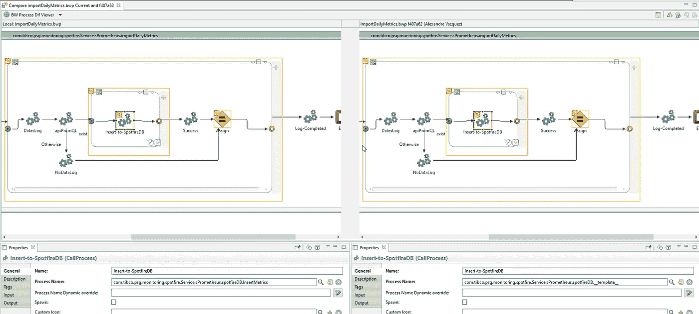
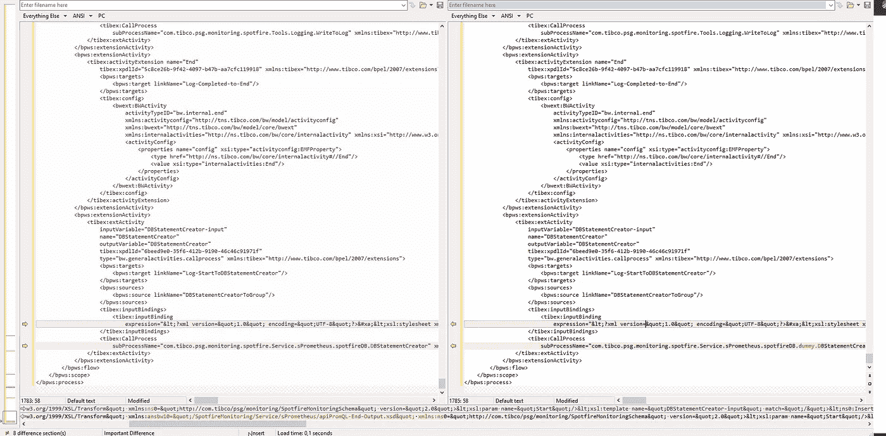

# Visual Diff 可能是您在低代码开发中需要的缺失部分

> 原文：<https://betterprogramming.pub/visual-diff-could-be-the-missing-piece-that-you-need-in-low-code-development-8241f927f743>

## 帮助您在分布式团队和并行编程中使用低级代码

托马斯·弗兰科斯基在 [Unsplash](https://unsplash.com?utm_source=medium&utm_medium=referral) 上的照片。

大多数企业都在探索低代码/无代码开发，现在最重要的事情是从不同的角度(开发、部署和操作)实现技术工件的敏捷性。

这种工作方式的好处使得这对于大多数公司来说几乎是一个显而易见的决定。我们已经在[之前的一篇文章](https://medium.com/the-innovation/four-reasons-that-low-code-applications-can-help-you-to-boost-your-productivity-f162e77fa108)中讨论过了。如果你还没有读过，就看看吧。

但我们知道，所有新事物都有自己的挑战，我们需要解决和掌握这些挑战，以释放这些新范式或新技术提供的全部好处。与云原生架构非常相似，我们需要能够适应。

有时候，我们需要改变的不是文化。有时，技术和工具也需要发展，以应对这些挑战，并在这一过程中帮助我们。这就是视觉差异的由来。

当您使用低代码方法进行开发时，所有的开发过程都更容易。您需要组合执行所需逻辑的不同块，一切都比一堆代码行简单。

使用 TIBCO BusinessWorks 的低代码开发方法。

但是我们还需要在一个存储库中管理所有这些工件，所有这些工件都集中在源代码开发上。这意味着当你最终使用这些工具时，你不是在使用“低代码方法”，而是使用源代码方法。像合并不同的分支和查看版本历史以了解变更这样的事情是复杂的。

它们之所以复杂，是因为它们是由存储库本身执行的，而存储库关注的是文件变更和变更的源代码。但是低代码开发的一个巨大好处是，开发人员不需要知道作为可视化的、更快的活动的一部分而生成的源代码。那么，我们如何解决这个问题呢？我们能用什么来解决这个问题呢？

低代码技术需要进步才能在这方面领先。例如，这就是 TIBCO BusinessWorks 在发布其 Visual Diff 功能时所做的事情。

因此，您仍然拥有与源代码库的集成。在这种并行分布式开发中，您可以完成通常需要完成的所有过程和活动。不过，您也可以从“低代码”的角度看到所有这些活动。

这意味着当我查看版本历史时，我可以看到被修改的可视化工件。添加或删除的活动以对低代码开发有意义的方式显示在那里。这就结束了关于低代码开发如何利用现代源代码库及其流程(GitFlow、GitHub Flow、One Flow 等)的所有优势的循环。)以及低代码透视图的优点。

假设有两个选项，您可以使用它们来查看应用程序是如何被更改的。一种是传统方法，另一种使用视觉差异:

选项 A:流程的视觉差异

选项 B:相同的过程，但使用文本比较方法

那么，基于这个证据，你认为什么更容易理解？即使你像我一样是一个真正的程序员，我们也不能否认低代码方法在企业世界中进行大规模标准开发的便利性和好处。

# 摘要

不管我们用所有的加速器和框架开发得有多快，一个定义良好的低代码应用程序将比我们任何人都要快。这与我们过去在图形界面或鼠标控制与键盘之间的斗争是一样的。

我们接受选择这个或那个有个人偏好，但当我们需要决定什么更有效，需要依靠事实时，我们不能对眼前的事情视而不见。

我希望你喜欢这篇文章。祝您愉快！