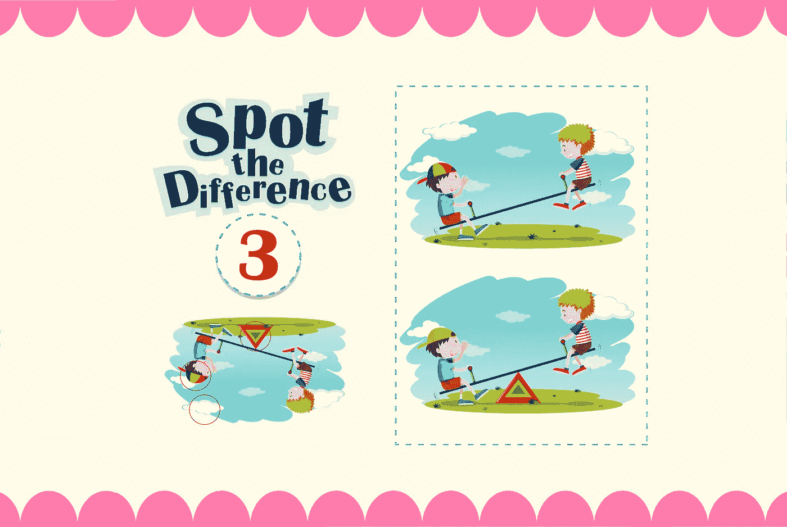
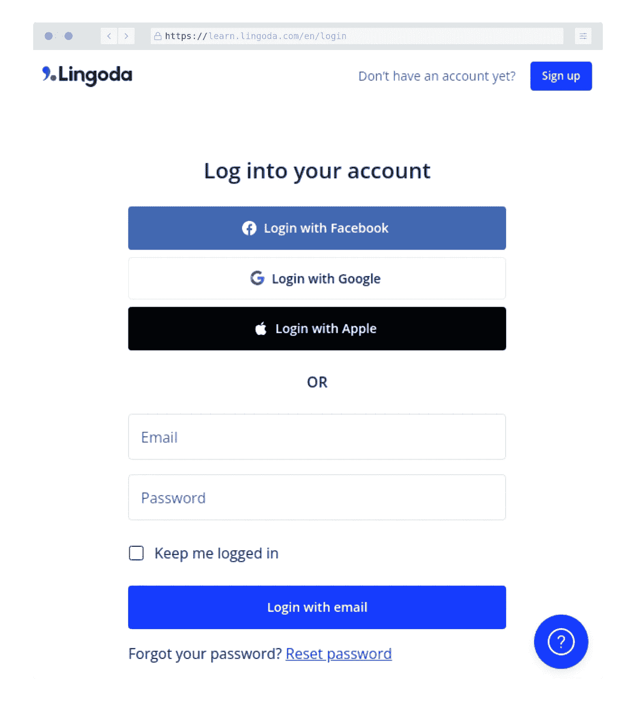
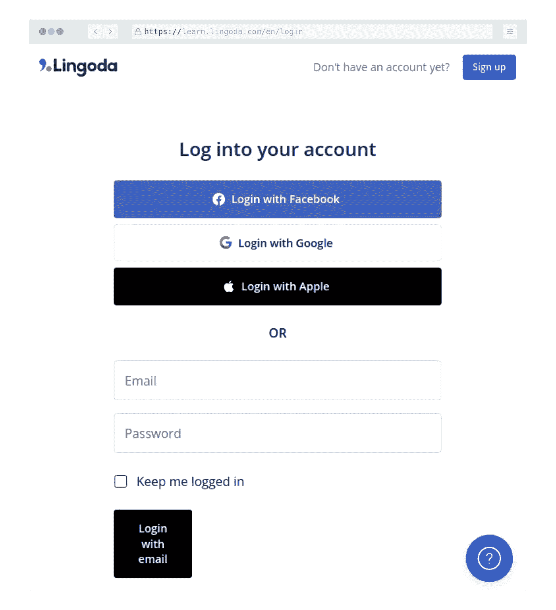
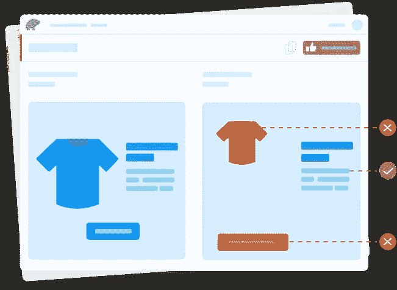
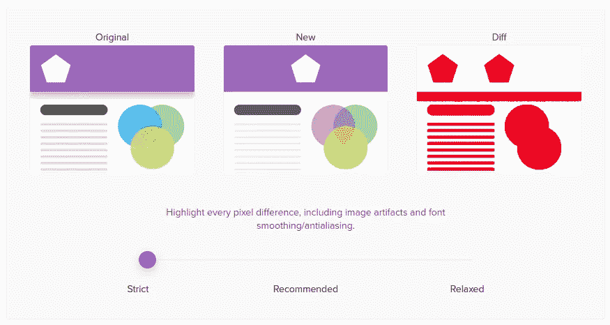
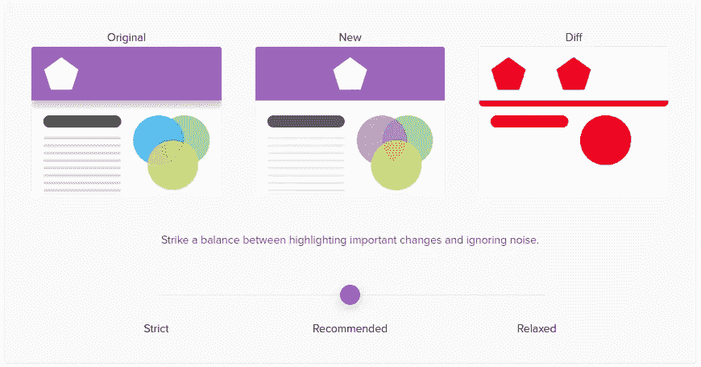
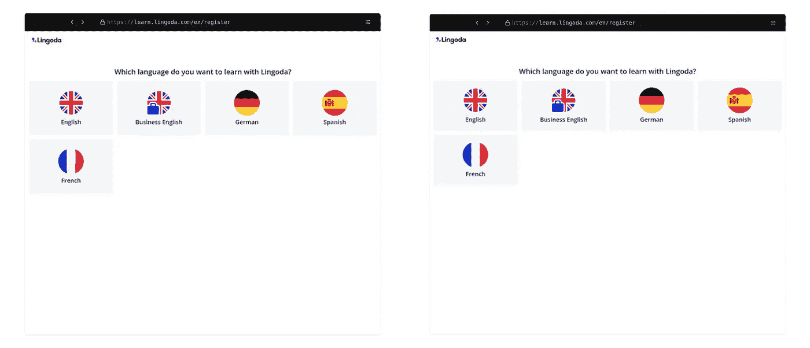
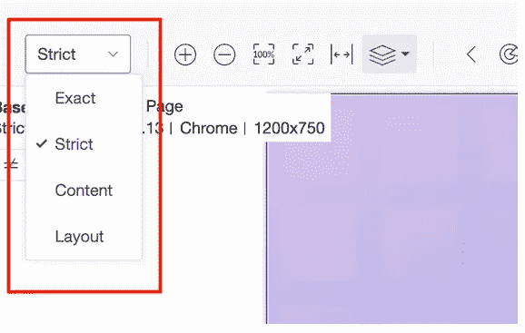

# 视觉回归测试棒极了

> 原文：<https://betterprogramming.pub/visual-regression-testing-is-awesome-a6ac081ce58f>

## 实现持续交付的里程碑



[由 Brgfx / Freepik 设计](http://www.freepik.com)

测试的重要性怎么强调都不为过。它帮助我们识别缺陷，减少瑕疵，增加代码的整体健壮性。我们可以理解我们的代码是如何处理极限情况的。我们可以将测试分为三类:

*   单元测试
*   集成测试
*   端到端测试

这些共同构成了测试金字塔。它是一个框架，帮助开发人员和 QAs 确保生产出高质量的软件。在这三个国家中，e2e 是最具挑战性的。

为什么？因为我们直接测试最终应用，这带来了许多挑战。这些年来，工具有了显著的改进。为了执行端到端的 web 测试，我们有一些很棒的工具，比如木偶师、剧作家、Selenium 和 Cypress。

然而，这些工具只是关注于从浏览器中断言元素、导航、交互性和其他特性的存在。他们缺少测试的一个重要方面:用户实际看到的东西。这就是所谓的视觉测试。

# 什么是视觉回归测试？

视觉测试是一个简单而强大的概念:断言用户看到的是否正是我们期望他看到的。这意味着元素的颜色、位置和形状等任何细节都和它们在 DOM 中的存在一样重要。

让我们通过一个例子来看看。假设我们的登录页面如下:



来自 lingoda.com 的说明

有一个重构 PR，它产生如下布局:



模拟破碎的用户界面布局

考虑到上述变化，我们的传统 e2e 测试不会失败。该按钮存在、可点击且功能正常。只有按钮的布局在视觉上被破坏了，但这并不影响它的交互性。

由于上述变化非常明显，QA 可能会在测试阶段发现它。但是如果变化更微妙呢？如果按钮只是窄了 10px 呢？这可能会被忽视。人类在重复性任务上效率低下。这就是为什么我们不断依赖计算机来做这种工作。

如果我们拒绝做可视化回归测试呢？如果我们在几周、几个月、几年内增加一些小的变化，我们最终会得到一个在我们眼前不断变形和发展的应用程序。

在生产中捕捉 UI 故障是很耗费资源的。我们有一系列问题要回答。布局是怎么被打破的？破了多少次了？它应该是什么样子的？

不对我们的应用程序进行可视化测试会带来一些大风险:

*   **开发成本:**识别+修复+手工回归+出货生产。
*   **公司品牌:**产品中不断引入的小故障会影响用户对我们应用程序质量的感知。
*   **对收入的影响:**误放 CTA、意外移除等都会影响我们的业务收入。

# 功能测试能涵盖视觉问题吗？

鉴于我们已经确定了风险，我们可能想要采取行动。因为我们已经有了很棒的 e2e 工具，我们能调整我们的 e2e 功能测试来捕捉所有这些视觉上的错误吗？可行吗？是的，在某种程度上。我们可以断言元素的位置、大小、颜色、形状……这些都可以从 DOM 中获得。

我们想走这条路吗？绝对不行！为什么？

*   断言 UI 元素会大大增加我们的测试套件。
*   测试不会有可读性，也不会充满神奇的数字。
*   当一个测试失败时，要知道它是否是一个有意的改变是非常耗时的。我们缺乏可视化的工具来显示差异。
*   一个微小的 UI 更改可能会破坏数百个需要手动修复的测试。
*   我们的测试套件不容易扩展。如果我们想要支持一个新的屏幕分辨率，我们将手动将其添加到所有现有的测试中。

即使我们决定继续使用这个解决方案，我们也不可能做到超级精确。为此，我们必须模拟浏览器的渲染过程。所以一开始就接受失败是值得的。

我们能雇佣更多的 QA 工程师来帮助解决这个问题吗？如前所述，人类往往会对重复的任务感到厌倦。他们不可能发现所有的问题。即使我们的 QA 团队非常擅长发现差异，他们也只能做到这一点。

让我们来计算一些数字:

*   我们想测试一个有 10 个屏幕的 web 应用程序。
*   每个屏幕有 2 个变体。
*   我们支持 4 种不同的语言。
*   我们想确保输出工作在 3 种不同的浏览器和 3 种不同的屏幕分辨率。

这意味着我们需要测试:

```
10 [screens] * 2 [variants] * 4 [lang] * 3 [browsers] * 3 [screen res] = **720 outputs**
```

我们无法管理和扩展手动测试过程。因为我们看到功能 e2e 测试不适合这个目的，所以我们只有一个选择:可视化回归测试。这是实现持续交付的唯一可行的解决方案。

# 如何进行可视化回归测试

幸运的是，有一些好的服务可以提供可视化测试。他们将为我们做所有的重活。他们将处理和识别 UI 上的变化。然后，由我们来决定这些 UI 更改是否是有意的，或者是否需要采取任何进一步的措施。

它们是如何工作的？它们提供了与我们喜爱的 e2e 测试工具的集成，并公开了一个开发人员友好的 API。所以我们可以使用我们最喜欢的 Cypress 或 Selenium 引擎，并在上面添加一个视觉测试。这将是我们测试的额外一层。

谁是这个领域的顶尖选手？我们可以按照开源和专有对它们进行分组:

*   **开源:**选择不少。排在前面的是`BackstopJS`和`Loki`。不幸的是，这些都缺乏在线审批流程。这是我们测试工作流程中的必备功能。选项是我们自己构建它，然后托管它。
*   **专有:**SaaS 顶级支付宝产品有`Percy`**`Applitools`。他们几乎可以提供我们需要的任何东西。**

**在我看来，花时间开发我们自己的批准工具流是不值得的。所以我们只能在**珀西**和**应用工具**之间做出选择。他们有什么不同？如何在它们之间做出选择？**

**让我们看看它们的主要区别和注意事项:**

## ****珀西****

**珀西工具最近被 Browserstack 收购，现在是他们生态系统的一部分。如果我们已经在使用他们的服务，这将是一个很大的好处。**

**它在内部是如何运作的？它确实将 HTML 流式传输到他们的服务器，并在那里进行渲染和截图。它会将这些与该页面的基线进行比较，并计算出差异。整个过程异步运行，并在我们的 CI 中发布。例如通过行动。**

****

**定义视觉差异的阈值是多少？它可以在他们的用户界面中根据我们的喜好进行调整。模式多样:`Strict`、`Recommended`、`Relaxed`。**

**让我们比较一下`strict`和`recommended`设置。**

****

**percy.io 的严格敏感度字幕**

****

**percy.io 推荐的灵敏度标题**

**在我看来，推荐的那个做得很好。**

**让我们看看下面珀西行动的例子。让我们在下面看看当前基线(左)与新快照(右)。他们看起来几乎一模一样。由于这种差异很微妙，很可能不会被人眼注意到。**

****

**基线与新截图**

**珀西引擎将处理这两幅图像并输出它们的差异。现在很清楚是什么改变了:按钮中的填充。这将由我们来决定是否有意改变。**

****

**处理差异的结果**

**它如何处理动态数据？简单地说。我们应用程序中的任何动态元素都需要通过媒体查询隐藏起来，或者采用任何策略，比如冻结日期。**

## **应用工具**

**这个工具比珀西复杂一点。它给视觉测试带来了人工智能能力。这是什么意思？这个系统将从一个全新的层面理解我们的系统。这将导致更好的视觉测试质量，因为它将远远超出像素水平的差异。**

**它如何了解我们的应用程序？实际上是我们需要向系统反馈我们的布局是如何构建的。默认情况下，在`Strict`模式下比较整页。当需要时，我们可以定制应用程序的区域，以不同的方式声明视觉内容。**

****

**applitools.com 描述**

*   ****Exact:** 会检测到连人眼都察觉不到的变化。不建议使用。**
*   ****严格(默认设置):**这几乎等同于珀西发现差异的方式**
*   ****内容**:类似于严格但忽略了颜色之类的东西。**
*   ****布局**:比较元素在页面上的位置和呈现方式。它是动态日期或动态内容变化元素的理想选择。**

**与 Percy 一样，Applitools 会将基线与当前快照进行比较，并显示其差异。这一过程类似，但由人工智能驱动，而不是基于像素。由于我们能够更好地微调我们的基线，我们可以期待更好的结果，而无需手动破解来避开动态数据。**

**尽管 Applitools 服务与我们的 e2e 提供商更紧密地结合在一起。即使 AI 处理仍然发生在他们的服务器上，e2e 进程也会阻止测试完成，直到 Applitools 处理完成。**

# **结论**

**我们需要接受并采用可视化回归测试作为我们测试工具的一部分。这是我们实现连续交货的唯一途径。否则，我们将需要继续让 QA 参与到无聊的任务中，这些任务只能让我们在产品质量方面达到某一点。**

**通过选择加入，我们可以让 QA 团队专注于他们真正擅长的事情。那就是确保我们的新功能符合我们的质量标准。他们将从任何手工工作中解放出来，甚至可以就如何使系统更加健壮提出自己的意见。**

**珀西 vs Applitools 呢？由你决定，如果你需要一个能正常工作的人，我会选珀西。测试动态元素需要更多的开发工作，但这是可以管理的。我可以看到他们在正片中赶上了 AI。如果你现在需要一个更强大的工具来覆盖你的各种场景，那么就使用 Applitools 吧。它已经具备了你可能想要的所有功能。它被宣传为对开源项目免费。**

**当你有疑问时，试试他们的免费试用期，然后再做决定。**

**干杯。**

**[](/react-enzyme-vs-react-testing-library-2cac3ad20c52) [## 反应酶与反应测试库

### 比较用于测试 React 组件的两个对比库

better 编程. pub](/react-enzyme-vs-react-testing-library-2cac3ad20c52)**