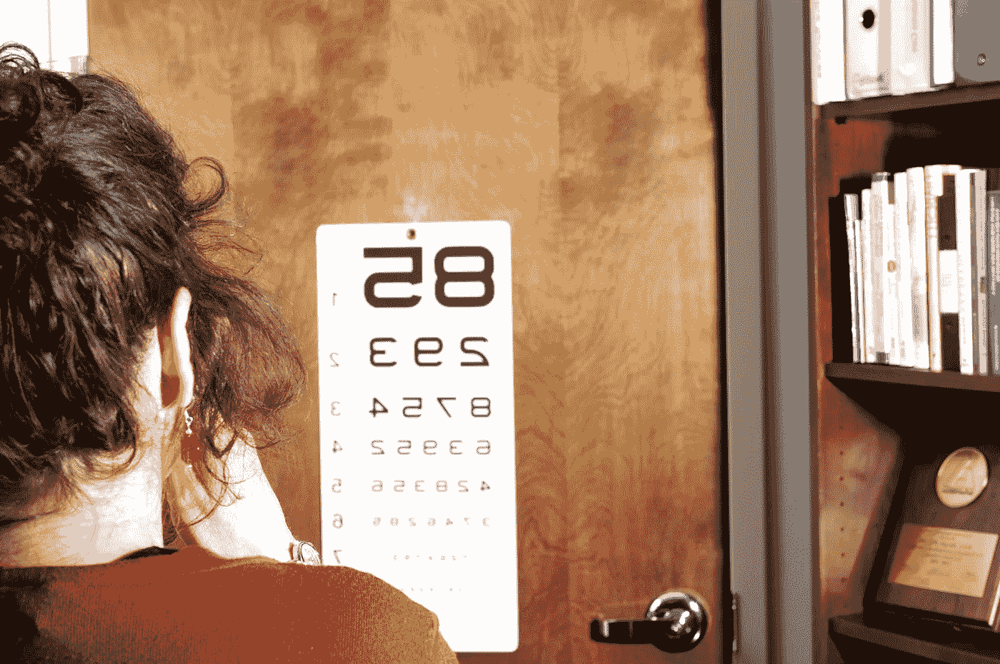
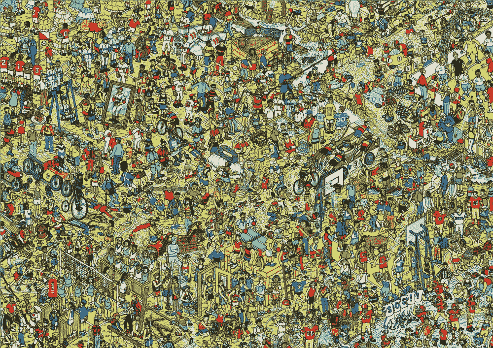

# 我的视觉测试工具箱

> 原文：<https://betterprogramming.pub/visual-testing-toolbox-f742d35d62bd>

## 将 OpenCV、Galen 和 Tesseract 与 Selenium 集成



照片来源:[阿曼达·米尔斯](https://pixnio.com/science/medical-science/testing-her-visual-acuity-by-covering-her-left-eye)

视觉测试最常见的用例是使用基线图像的回归测试。然而，视觉测试的不同方面也值得讨论。我们将涵盖模板匹配(使用 [OpenCV](https://opencv.org/) )、布局测试(使用 [Galen](http://galenframework.com/) )和 OCR(使用 [Tesseract](https://opensource.google/projects/tesseract) )，并展示如何将这些工具无缝集成到现有的 Appium 和 Selenium 测试中。我们使用 Java(以及 OpenCV 和 Tesseract 的 Java 包装器),但是类似的解决方案也可以用其他技术栈来实现。

*这是* [*的姊妹篇，2020 年 9 月在新加坡 Taqelah*](https://github.com/martinschneider/presentations/blob/master/2020-09-05%20Visual%20testing%20toolbox.pdf)*和 2020 年* *硒会议期间的一次闪电演讲。关于全功能演示和进一步的细节，请参考*[*www . just testlah . QA*](http://www.justtestlah.qa)*。*

*编辑:我在* [*第 26 版 vodQA*](https://twchennai.github.io/VODQA-Chennai/) *期间也提出了题目，并在此过程中对本文做了一些编辑。*

我希望这个总结能够帮助您选择对您的用例最有影响力的工具，并为您提供一些如何将它们集成到您自己的工具箱中的想法。

# 模板匹配

[*模板匹配*](https://en.wikipedia.org/wiki/Template_matching) 要完成的任务是在当前屏幕上找到给定的图像(模板)。


沃尔多在哪？



图片来源: [Appium docs](http://appium.io/docs/en/writing-running-appium/image-comparison/)

对于移动测试， [Appium](http://appium.io/) 在其 1.9 版本中以*-图像*定位器策略的形式添加了这一功能。(更多信息可以在[文档](http://appium.io/docs/en/writing-running-appium/image-comparison/)和[早期教程](https://appiumpro.com/editions/32-finding-elements-by-image-part-1)中找到。)的想法是将图像的 Base64 编码的字符串表示传递给 WebDriver。

使用`image`定位器，您可以像其他`WebElement`一样与结果元素交互。例如:

```
WebElement element = **driver.findElementByImage**(base64EncodedImageFile);
element.click();
```

或者

```
By image = **MobileBy.image**(base64EncodedImageFile);
new WebDriverWait(driver, 10).until(ExpectedConditions.presenceOfElementLocated(image)).click();
```

开发人员采用的方法是将该功能作为 Appium 服务器的一部分，并使用 [OpenCV](https://opencv.org/) (它成为运行 Appium 服务器的实例的依赖项)来支持实际的图像识别。

有趣的是，客户端和服务器之间有一个额外的往返行程，其流程如下所示:

1.  从 Appium 服务器请求截图。
2.  将**截图和**模板都发送到 Appium 服务器进行匹配。

这感觉起来并不是 100%优雅，尤其是如果我们想要在同一个屏幕上匹配多个模板。

当[我在 2018 年](https://www.youtube.com/watch?v=maJkvP_qk4A)第一次实现模板匹配时(当时并不知道，它已经由 Appium 团队开发)，我也选择了 OpenCV，但却在客户端运行它。使用 OpenCV Java 包装器，我的代码要点如下所示:

```
Mat result = new Mat(resultRows, resultCols, CvType.CV_32FC1);
Imgproc.matchTemplate(image, templ, result, Imgproc.TM_CCOEFF_NORMED);
MinMaxLocResult match = Core.minMaxLoc(result);
if (match.maxVal >= threshold) {
  // found
}
```

这种方法不需要对上面提到的 Appium 服务器提出额外的请求。事实上，除了截屏功能，它不需要 WebDriver 的任何功能。它也适用于硒和钋。也就是说，它还增加了对 OpenCV 的依赖，这次是对运行测试执行的实例的依赖。

我将上述两种方法([客户机](https://github.com/martinschneider/justtestlah/blob/master/justtestlah-visual/src/main/java/qa/justtestlah/visual/OpenCVTemplateMatcher.java) -和[服务器](https://github.com/martinschneider/justtestlah/blob/master/justtestlah-visual/src/main/java/qa/justtestlah/visual/AppiumTemplateMatcher.java)-端执行)包装到一个[模板匹配器](https://justtestlah.qa/apidocs/qa/justtestlah/stubs/TemplateMatcher.html)接口中，以展示其用法(就当它是一个 PoC)。

```
private GooglePage google;
WebElement logo = google.**findImage("google.png")**;
assertThat(logo.isDisplayed()).as("Google logo is visible").isTrue();
```

你可以在 [JustTestLah 中找到更多的细节和例子！JTL 测试框架](https://justtestlah.qa/#template-matching)。

# 布局测试

另一种类型的视觉测试包括验证页面或屏幕的布局。您可以通过图像比较来做到这一点，图像比较也隐含地检查布局。更简单的方法是使用专门的布局测试工具，如 [Galen](http://galenframework.com/) (在我看来，这是最被低估的 UI 测试框架之一)。

Galen 为每个屏幕使用规范，这些规范定义了屏幕上的所有(重要)元素及其大小以及彼此之间的绝对或相对位置。

让我们以谷歌搜索页面为例:


谷歌搜索页面

我们可以使用以下规范来表示它:

```
SEARCH_FIELD:
   below LOGO
   centered horizontally inside viewport
   visible

LOGO:
   above SEARCH_FIELD
   centered horizontally inside viewport
   width < 100% of SEARCH_FIELD/width
   visible

SEARCH_BUTTON:
   near LUCKY_BUTTON 20px left
   visible
```

注意，上面用的是 [JustTestLah！框架](http://www.justtestlah.qa)的语法(通过页面对象的 YAML 文件中定义的唯一键引用 UI 元素)。在 pure Galen 中，这些需要在规范文件的顶部定义:

```
@objects
    LOGO          id        hplogo
    SEARCH_FIELD  css       input[name=q]
    ...
```

有不同的方法来执行这些检查。我更喜欢将`verify`方法作为抽象`BasePage`类的一部分:

```
private T verify() {
  String baseName = this.getClass().getSimpleName();
  String baseFolder = this.getClass().getPackage().getName().replaceAll("\\.", File.separator);
  String specPath = baseFolder
              + File.separator
              + configuration.getPlatform()
              + File.separator
              + baseName
              + ".spec";
  **galen.checkLayout(specPath, locators);**
  return (T) this;
}
```

这样，每当我们第一次与屏幕交互时，我们可以很容易地从测试中调用验证(顺便说一句，我使用类似的方法来[集成 Applitools 进行可视化测试](https://justtestlah.qa/#applitools)):

```
public class GoogleSteps extends BaseSteps {
  private GooglePage google;

  @Given("I am on the homepage")
  public void homepage() {
    **google.verify()**.someAction().nextAction();
  }
}
```

# 光学字符识别

视觉断言的另一种形式是光学字符识别，更广为人知的缩写是 OCR。无论出于什么原因，当文本被呈现为图像并且不能用标准测试工具验证时，这都是有用的。

对于那些使用 Selenium 进行网页抓取而不是测试的人来说，这可能也很有趣，因为这是网站开发人员为了让这变得更难而采取的对策之一。

我们使用 [Tesseract](https://opensource.google/projects/tesseract) ，这是一款 OCR 工具，最初由惠普在 20 世纪 80 年代开发，目前由谷歌赞助。

我们的例子不是最真实的，但它旨在展示 Tesseract 在检测不同类型的字体方面的能力:我们将验证 Google 徽标实际上拼写为“Google”:

```
private GooglePage google;
WebElement logo = google.findImage("google.png");
assertThat(logo.**getText()**).as("Google logo spells Google").isEqualTo("Google");
```

这需要在运行测试的实例上安装 Tesseract。对于完整的源代码和演示，请查看 [JustTestLah！测试框架。](http://www.justtestlah.qa)