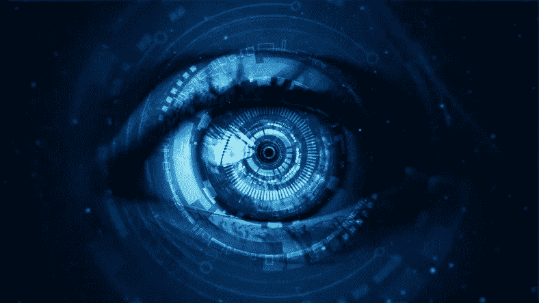
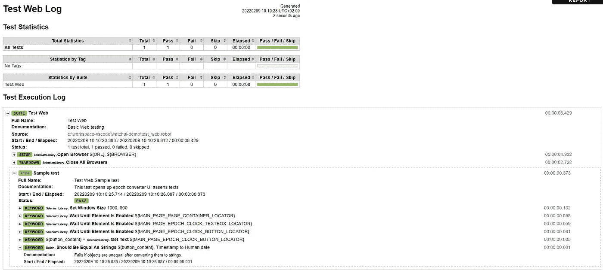
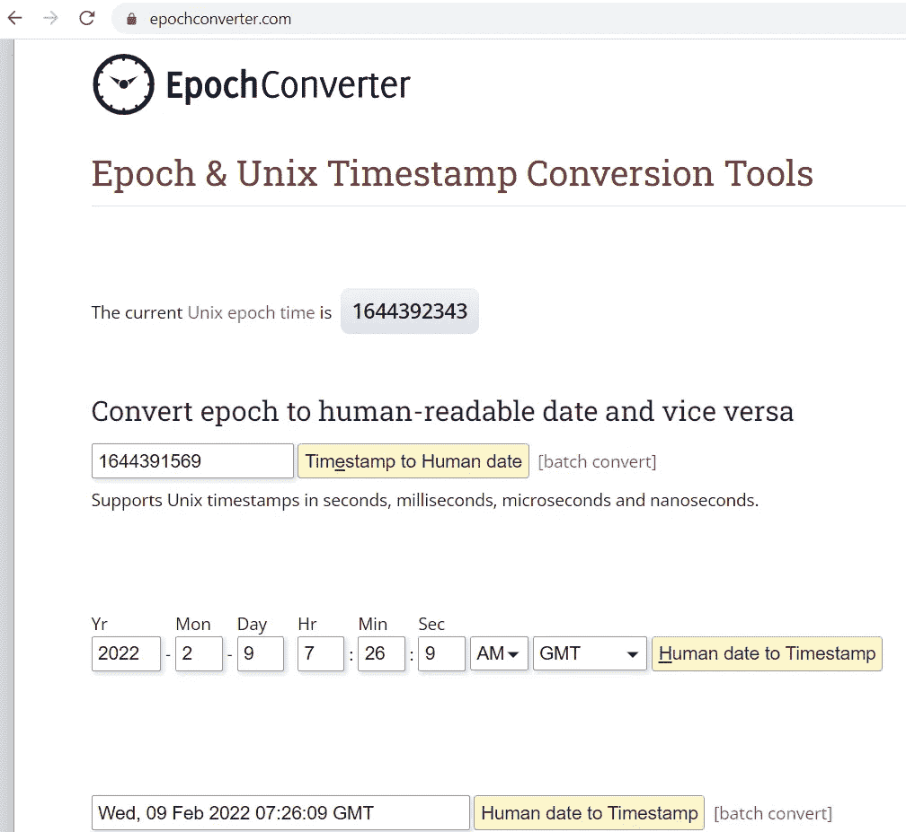
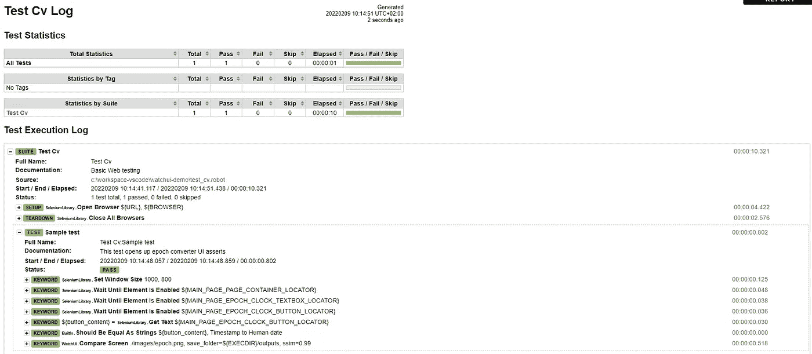
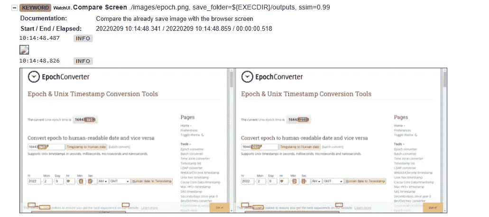
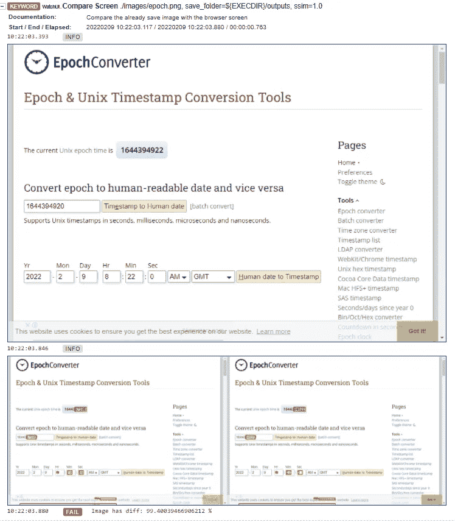

# 使用 Robot Framework、Selenium 和 WatchUI 进行可视化 Web 测试

> 原文：<https://betterprogramming.pub/visual-web-testing-with-robot-framework-selenium-and-watchui-417408a6784d>

## 可视化测试有助于节省大量验证 web 应用程序的时间和精力



*图片来源:盖蒂图片社*

在本文中，我将使用`robotframework`和 WatchUI 库解释可视化测试的理论和实践。

# 什么是视觉测试？

顾名思义，可视化测试就是用可视化工具测试我们的 GUI 应用程序。

在自动化领域，这意味着我们正在使用计算机视觉技术测试我们的 GUI 应用程序。

视觉测试的常见主题是在测试执行之前拍摄应用程序的快照，该快照将作为基准，然后在每次测试执行时，使用图像差异计算将 GUI 与该基准进行比较。

这通常涉及光学字符识别(OCR)和图像分割等技术。

# 为什么我应该执行视觉测试？

仅用文本比较测试 HTML 文档可能是乏味且耗时的。如果你的应用程序中的页面有许多文本元素，这意味着相应的测试用例应该有许多文本断言语句。这种维护可能会让人不知所措，测试代码的可读性也会受到影响。

文本断言并不总是足够的，例如，如果您的网站中的文本内容是正确的，但元素没有对齐，您的测试用例将成功运行，结果为“通过”，但“谁”页面是一团乱麻，对用户体验有非常不利的影响。

通过截图并与计算机视觉进行比较，您可以用一个断言匹配所有可能的变化。

这并不意味着基于文本的诽谤将被完全抛弃，但这些可以大大减少。

# 记得金字塔吗

永远记住 GUI 测试在测试金字塔的顶端，它应该排在单元测试、集成测试和 api 测试之后。


测试金字塔:信用，马丁·福勒

视觉测试是 GUI 测试的一部分，GUI 测试的目标是确保数据正确呈现给用户。
大多数验证将在 API 级别进行，而不是在 UI 上。

# 机器人框架简介

我在[之前的一篇文章](https://eldadu1985.medium.com/extend-robotframework-using-the-robotframework-python-lib-core-bf73e09160d3)里讲过`robotframework`。`Robotframework`是一个基于 python 的开源软件验收测试框架。

凭借其关键字驱动的方法和表格语法，它可以用于快速生成验收测试，并在测试代码和最终报告上提供了很好的可读性。

它提供了一个 reach 生态系统，其中包含许多可轻松用于多种测试目标的工具，从 web 测试到 API 测试，再到数据库、移动设备或物联网。

# WatchUI 简介

[WatchUI](https://pypi.org/project/WatchUI/) 是由 [Tesena](https://www.tesena.com/en) 开发的机器人框架视觉测试库。
由 [Tesseract-ocr](https://github.com/tesseract-ocr/tesseract) 提供支持，其关键字允许自动化开发人员截取应用程序的屏幕截图，然后根据图像对其进行区分，断言为可接受的差异设定了最低阈值。

它可以很容易地与您现有的运行 selenium 或剧作家的`robotframework`脚本集成，并且您可以仅用两行代码将这些测试升级为可视化测试:)

关于浏览器测试工具的更多信息，请阅读我的文章[这里](https://eldadu1985.medium.com/robotframework-browser-automation-tools-a-review-for-2021-29a0835f437d)。

# 亲自动手

**首先**，让我们从 pip 安装我们所有的依赖项:

```
pip install 
robotframework==4.1.3
selenium==4.1.0
robotframework-seleniumlibrary==6.0.0
WatchUI==1.0.12
```

安装完依赖项后，现在我们需要在操作系统上安装`install tesseract`。
你可以在这里阅读手表 ui 官方文档[关于安装宇宙魔方的内容。](https://tesena-smart-testing.github.io/WatchUI/start.html#install-tesseract)

让我们从用 selenium 编写一个基本的 web 测试用例开始，并将其存储为`test.robot`:

为了演示视觉测试如何帮助我们，我选择了 [epoch converter](https://www.epochconverter.com/) 网站(原因你会看到:)。

该测试使用 selenium 将浏览器导航到 epoch converter 主页，它一直等到 3 个元素就绪:

*   一个 div 容器。
*   纪元时间文本框
*   纪元到人类时间转换按钮。

启用这三个选项后，按钮的内部文本被收集，然后我们断言该文本等于“时间戳到人类日期”。

注意——所有的 xpaths 都是使用 [SelectorHub](https://selectorshub.com/) 从网站上轻松提取的，去看看吧！

让我们来运行一下:

```
robot -d results test.robot
```

且看`robotframework`报告



机器人框架的测试报告

很好，测试通过了。

# 通过是不够的

让我们来看看纪元转换器主页:



纪元转换器主页

正如你所看到的，有许多控制器和部件，大约 20 种不同的控制器，所有这些都可以测试。

为每个控制器编写显式断言将非常耗时，难以维护，并且会在测试代码中造成许多混乱。

所以我们已经到了可以使用`tesseract-ocr`和观察 UI 将测试升级为可视化测试的地步:)

# 视觉测试推广

正如所承诺的，我们可以通过增加 2 行代码将这个测试提升为可视化测试:)

首先，我们需要为我们的网站拍摄一张基线图像。
我拍摄了一张照片，并以`epoch.png`的名字存储在`images`文件夹中

**我们**需要在`***Settings***`部分导入`WatchUI`库，这需要一个`tesseract-ocr`可执行文件的完整路径。

```
*Library           WatchUI*    *tesseract_path*=C:/Program Files/Tesseract-OCR/tesseract.exe
```

现在让我们从 WatchUI 库中添加`Compare Screen`关键字来区分屏幕和基线图像。

```
Compare Screen   ./images/epoch.png    *save_folder*=${EXECDIR}/outputs   *ssim*=0.99
```

我们正在比较图像，允许差异不超过 1%(或者，我们希望至少 99%的相似性)。

这是最终的脚本:

现在让我们运行这个测试:

```
robot -d results test.robot
```

看看这份报告:



机器人框架的测试报告

测试通过，让我们看看`Compare Screen`关键字的输出:



比较 robotframework 报告中的屏幕关键字输出

如您所见，OCR 机制检测到了基线图像和当前屏幕之间的所有差异。

由于差异低于 1%(或相似度高于 99%)，此测试通过。

让我们再运行一次这个测试，但是这一次要断言 100%的相似性。
这很容易通过改变`Compare Screen`关键字中的`ssim`选项来实现:

```
Compare Screen   ./images/epoch.png    *save_folder*=${EXECDIR}/outputs   *ssim*=1.0
```

运行:

```
robot -d results tests.robot
```

看看这份报告



机器人框架报告中的视觉差异

因此，我们可以看到测试失败了，差异产生了大约 99.4%的相似性或大约 0.6 的差异。

# 视觉测试限制

第一个限制是计时，如果在页面加载时过早进行比较，测试可能会失败。

它可以通过隐式等待，有时甚至是固定延迟来克服，但固定延迟通常被视为[测试气味](https://testsmells.org/pages/testsmells.html#SleepyTest)。

另一个限制是图像必须在相同的尺寸下才能被比较。

阈值设置并不总是直观的，尤其是当像日期这样的字段发生变化时。阈值设置得太高可能会导致剥落，而太低则会导致伪测试用例。

可滚动的页面也会有问题，因为它会在基线和当前屏幕之间产生进一步的人为差异。

随着测试用例数量的激增，存储可能是另一个问题。
在 git 存储库中存储图像(和任何其他二进制文件)是一种不好的做法，因为 git 被优化来分析文本文件，并且所有 git 操作如 merge、rebase、cherrypick 等都是基于文本分析的。

# 结论

视觉测试对于增加 GUI 测试的健壮性是非常棒的。
请记住，GUI 测试应该被认为是优先级最低的，视觉测试也是其中的一部分。

由于视觉测试的一些限制，应该谨慎评估哪些测试适合视觉区分。