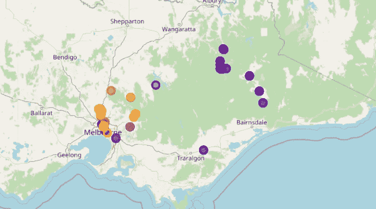
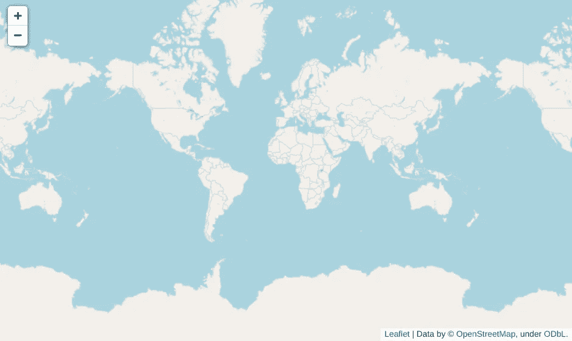

# 使用 Python 可视化照片地理定位数据

> 原文：<https://betterprogramming.pub/visualising-photo-geolocation-data-using-python-73ac47059112>

## 让我们利用`exif and folium` Python 包



大多数现代 GPS 相机和手机在拍照时会记录地理位置信息，这些信息会与所有其他元数据一起存储。

还有很多通常基于网络的应用程序，允许你使用这些元数据创建各种可视化。但是，如果你像我一样，不信任数据安全级别未知的第三方服务，你的照片怎么办？幸运的是，使用 Python 复制大多数可视化相对简单。在本指南中，我将展示如何使用照片 GPS 数据创建旅行地图。

对于这个项目，您需要在 Python 环境中安装一些包。我们将使用两个主要的包:`[exif](https://pypi.org/project/exif/)` 将允许我们从照片中提取元数据，我们将使用`[folium](https://python-visualization.github.io/folium/modules.html)`创建一个地图并添加位置标记。最后，我们还将使用来自`matplotlib` **、**和`pandas` 和`numpy`的彩色地图进行数据操作。要安装所有必需的软件包，只需在您的终端中执行以下命令:

```
pip install exif folium pandas numpy matplotlib
```

我们将从导入所有必需的包开始。除了上面列出的，我们还将从`pathlib` 库中导入`json`和`Path`类，它们都是标准库的一部分。

## 提取和准备用于打印的元数据

用`exif`读取元数据非常容易——我们只需打开一个二进制格式的文件，并从中创建一个`Image`对象。让我们为此定义一个便利函数:

根据不同的设备，一张照片可以包含几十种类型的元数据信息。为了查看那些与地理位置特别相关的内容，我们可以加载一张照片并打印出所有以“ *gps_* ”开头的元数据类别。

如果照片嵌入了地理位置信息，您应该会看到以下输出:

```
gps_latitude_ref 
gps_latitude 
gps_longitude_ref 
gps_longitude 
gps_altitude_ref 
gps_altitude 
gps_timestamp 
gps_processing_method 
gps_datestamp
```

其中有几类比较好理解: *gps_latitude* 、 *gps_longitude* 和 *gps_altitude* 分别存储纬度、经度和海拔信息。海拔高度存储为海拔高度，通常以米为单位。纬度和经度存储为弧度的度、分和秒的元组。

以***"****_ ref****"****结尾的类别包含有关如何解释数据的参考信息。在海拔高度的情况下，它简单地通知该值是海拔高度，但是对于纬度和经度，它们包含参考半球的信息，经度为" **E** 或" **W** ",纬度为" **N** 或" **S** "。当将原始数据转换为十进制格式时，这些非常重要，因为标准符号将格林威治以西和赤道以南的坐标作为负数。*

*由于*叶子*包*，*我们将用于绘图，不理解以度/分/秒为单位的坐标，我们需要将纬度和经度转换为十进制表示，由于我们也将多次这样做，我们可以通过定义一个函数来使生活更轻松，代码更简洁，该函数将接受一个坐标元组和一个参考值，并返回其二进制表示。为此，我们将分和秒分别除以 60 和 3600，转换为度的分数。然后根据参考数据确定符号:*

*这个函数将纬度和经度转换成十进制格式，我们不需要对高度做任何事情。这样，我们可以定义另一个 helper 函数，它将接受一个`exif.Image` 对象，并返回一个格式为(纬度、经度、高度)的十进制坐标元组。*

*最后，我们将添加另一个函数，该函数将递归遍历选定文件夹的所有子文件夹，从所有图像文件中读取空间信息，并返回文件名和坐标的字典。*

*至此，我们可以轻松地从图像文件夹中的所有文件读取位置数据:*

*打印生成的字典应该会产生类似于我的输出:*

```
*print(json.dumps(res, indent=4))**Out**:{     
    "/media/pav/Storage/Photo/Phone/IMAG0036.jpg": {
        "latitude": -37.79912566666666,         
        "longitude": 144.9850463611111,         
        "altitude": 0.0,         
        "timestamp": "2014:04:12 18:14:59"},  
    "/media/pav/Storage/Photo/Phone/IMAG0037.jpg": { 
        "latitude": -37.79912566666666,         
        "longitude": 144.9850463611111,         
        "altitude": 0.0,         
        "timestamp": "2014:04:12 18:15:36"}, ...
}*
```

## *绘制数据*

*为了简化未来的操作，我们可以将生成的字典转换成一个`pandas`数据帧。然后，我们还将时间戳列转换为`datetime`格式，并按日期升序对值进行排序。*

*为了对我们的数据点进行颜色编码，我们可以获得作为`matplotlib`包一部分的颜色图。除此之外，我们还需要创建一个`Normalize`对象。这个对象将在 0 和 1 之间的`colourmap`中给每个颜色分配数值，我们可以通过数值调用`colourspace`中的任何颜色。为此，我们将使用`numpy.linspace()`向我们的`dataframe`添加一列。*

*一个小问题是，我们的颜色将是 RGBA 格式，但它不能与`folium`一起工作，所以我们还需要将颜色转换为十六进制表示，这很容易做到:*

*现在我们终于到了可视化我们的数据的时候了！*

*`folium`包的主要部分是`Map`对象，简单地通过`folium.Map()`创建一个实例将会产生一张整个世界的地图。*

**

*默认树叶地图。*

*这很好，但我更喜欢让地图自动缩放到可以看到所有标记的水平。我们可以使用结果对象的`fit_bounds()`方法并提供地图范围的西南角和东北角的坐标来实现这一点。*

*我们可以通过从我们的数据中获取最大纬度和最小经度来计算西南角的坐标。同样，东北角坐标是最小纬度和最大经度。在下面的代码中，我还将边界框在每个方向上调整了 3 度，这样数据就可以整齐地放入窗口中。*

*因此，现在我们终于准备好创建一个地图，显示按拍摄日期进行颜色编码的照片的位置。*

*在我的例子中，结果显示了澳大利亚维多利亚周围的一系列地点，紫色点代表早期照片，亮红色和黄色点代表较新的照片:*

**

# *结论*

*在这里，我们只触及了照片元数据提供的所有机会的一小部分。有了这些数据，你就可以创建自己的照片数据库，方便你对它们进行分类和管理。你也可以扩展地理定位数据的使用，以便能够在你的图像文件夹中按位置搜索照片，还有许多其他可用的东西。*

*这个项目的完整代码可以从我的 GitHub 下载，位置如下:*

*[](https://github.com/pavelcherepan/photo_location) [## GitHub-pavelcherepan/photo _ location

### 此时您不能执行该操作。您已使用另一个标签页或窗口登录。您已在另一个选项卡中注销，或者…

github.com](https://github.com/pavelcherepan/photo_location)*