# 使用 Groupby 和聚合 Python 函数可视化图表

> 原文：<https://betterprogramming.pub/visualize-charts-using-groupby-and-aggregate-python-functions-56454820a25c>

## 图形可视化

## 让我们制作吸引人的图表


照片由[艾萨克·史密斯](https://unsplash.com/@isaacmsmith?utm_source=medium&utm_medium=referral)在 [Unsplash](https://unsplash.com?utm_source=medium&utm_medium=referral) 拍摄

可视化是向用户展示结果的关键部分。这些图表帮助我们更好地理解数据，了解数据的过去、现在和未来。

Python 提供了一些有用的函数，我们可以利用这些函数将数据转换成图形表示。本文将展示我们如何有效地将 Groupby & Aggregate 函数与 matplotlib 和 seaborn 函数结合使用，来制作数据的漂亮图形表示。

在真正开始使用部分之前，我们先简单讨论一下这两个功能是什么。

# Groupby 函数

Groupby 函数应用于数据集，并根据列值提供一组分组数据集。简单地说，如果任何列都有一组值，那么我们需要一个更小的数据集，其中每个更小的数据集都包含基于该列的每种类型的值。

假设我们有一个数据集，其中有一个名为“Region”的列，我们想要一组数据集，其中每个较小的数据集代表每个区域。

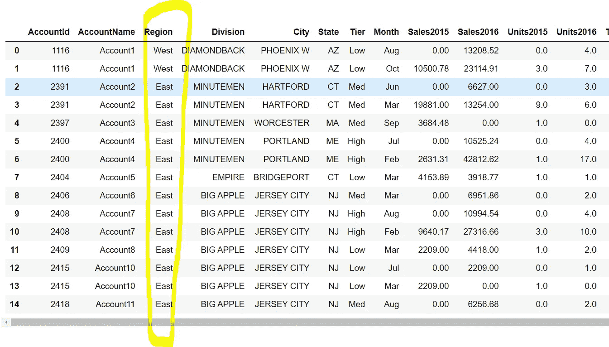

演示数据集

我们可以使用下面的代码:

```
**test=sales.groupby(by=["Region"])**
```

这里，主数据集名称是 sales，它有一个名为“Region”的列我们可以利用 get_group 函数来获取特定的组，如下所示:

```
**test.get_group("East")****test.get_group("West")**
```

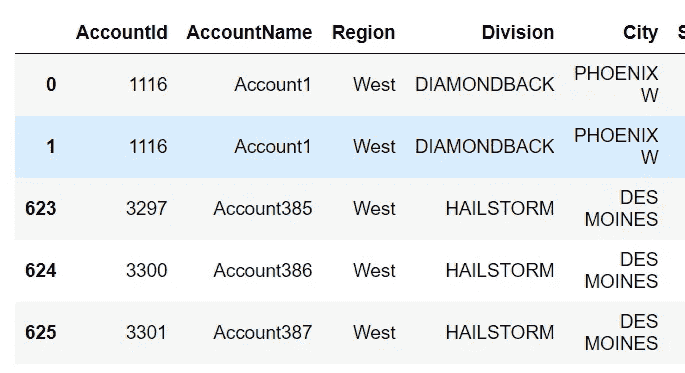

基于特定区域的较小数据集

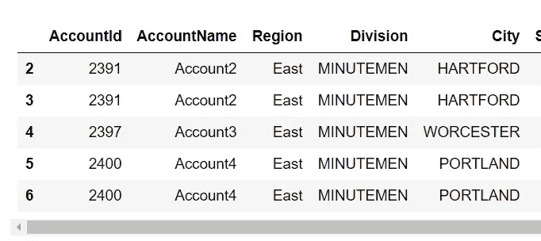

基于特定区域的较小数据集

# 聚合函数

aggregate 函数用于根据行聚合数据。它通常与 Groupby 函数一起用于分析每个组中的聚合数据。聚合函数有`sum`、`min`、`max`、`mean`、`median`以及其他许多数学函数，我们可以利用它们进行多种聚合。

假设在我们的销售数据中，我们希望获得每个地区的平均销售额。在这里，我们可以如下使用聚合函数:

```
**gb_sales_demo=sales.groupby(by=["Region"]).aggregate({"Sales2016":"sum"})**
```

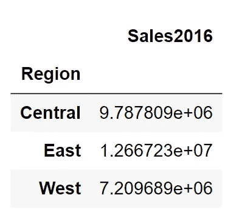

每个地区的平均销售额

现在，让我们使用这两个函数来制作有趣的图形。我们将使用 matplotlib 和 seaborn 根据我们创建的聚合数据来可视化图表。

让我们先来看看我们将用于可视化的数据集。后续文章的数据集可以在[这里](https://github.com/pranjalAI/Walmart-Store-Sales-Forecasting/blob/master/SalesData.csv)找到。它是一个 CSV 文件，可以使用 python 中的 pandas 模块加载。

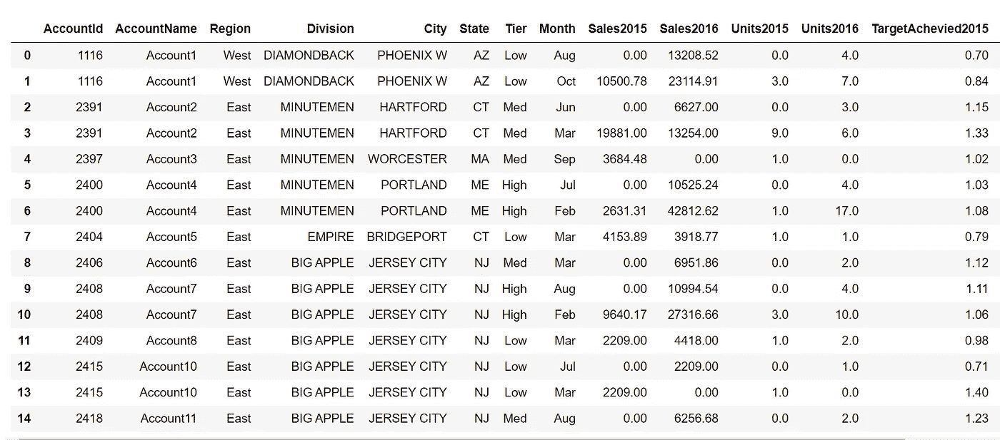

可视化演示数据集。

## **使用柱状图对比 2016 年和 2015 年各地区的销售额。**

为了创建这个图表，我们使用以下代码:

```
import matplotlib.pyplot as plt
import seaborn as sns**gb_sales=sales.groupby(by=["Region"]).aggregate({"Sales2015":"sum", "Sales2016":"sum"})
res=gb_sales_demo.reset_index()
res_wide=res.melt(id_vars="Region")****plt.figure(figsize=(10,8))
sns.barplot(x="Region", y="value",data=res_wide, hue="variable")
plt.show()**
```

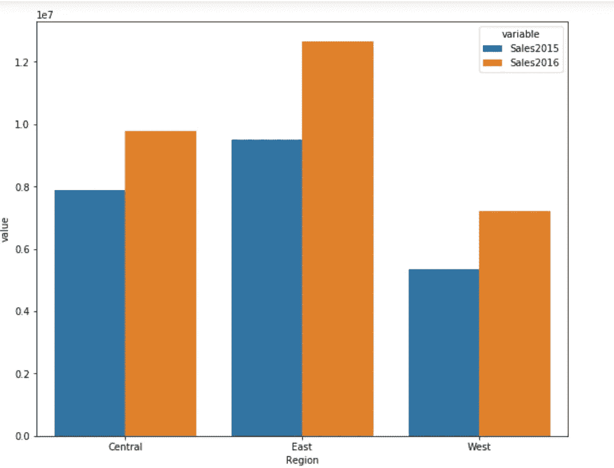

不同地区的图表(条形图)

## **哪个地区对 2016 年的销售额贡献最大？**

为了找到该区域，我们使用以下代码:

```
import matplotlib.pyplot as plt
import seaborn as snsgb_sales2=sales.groupby(by="Region")[["Sales2016"]].sum()
res_2=gb_sales2.reset_index()plt.pie(x="Sales2016",labels="Region", data=res_2, autopct="%.2f %%",colors=["r","g","b"])
plt.xlabel("Sales 2016")
plt.show()
```

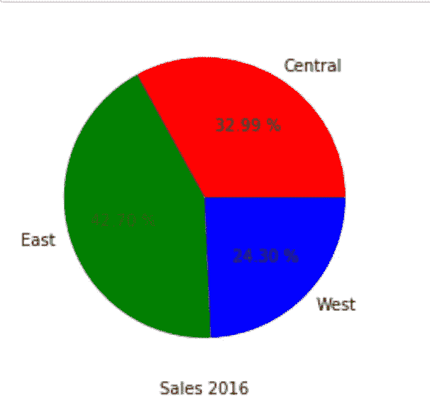

饼图直观显示每个地区的贡献

## 比较 2015 年和 2016 年在地区和层级方面的总销售额

为了找到这些层，我们使用以下代码:

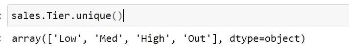

了解我们的数据层

```
gb_sales3=sales.groupby(by=["Region", "Tier"]).aggregate({"Sales2015":"sum", "Sales2016":"sum"})
```

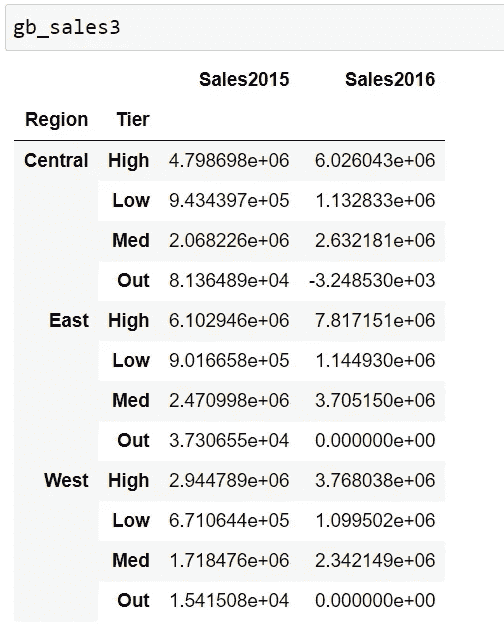

```
gb_res_3=gb_sales3.pivot_table(index="Region", columns="Tier", values=["Sales2015","Sales2016"])
```

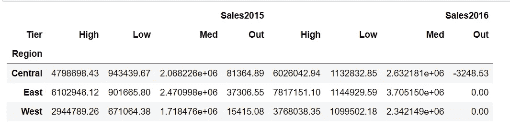

转换到数据透视表后

```
plt.figure(figsize=(10,8))
gb_res_3.plot.bar(figsize=(18,6))
plt.show()
```

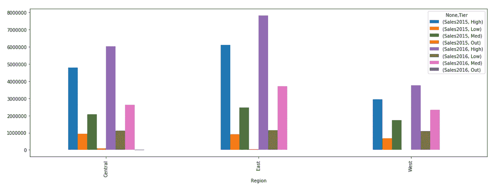

2015 年和 2016 年的区域和层级销售额

```
plt.figure(figsize=(10,8))
res_3.plot(kind="bar",stacked=True)
plt.show()
```

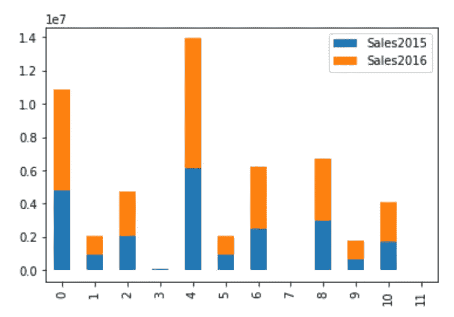

2015 年和 2016 年各地区和层级的销售额(堆积图)

## 根据 2015 年和 2016 年售出的产品数量，比较不同部门的高端产品

使用以下代码完成此任务:

```
sales_tier_high=sales[sales.Tier=="High"]
gb_div=sales_tier_high.groupby(by="Division").aggregate({"Units2015":"sum", "Units2016":"sum"})gb_div.plot.bar(figsize=(18,6))
```

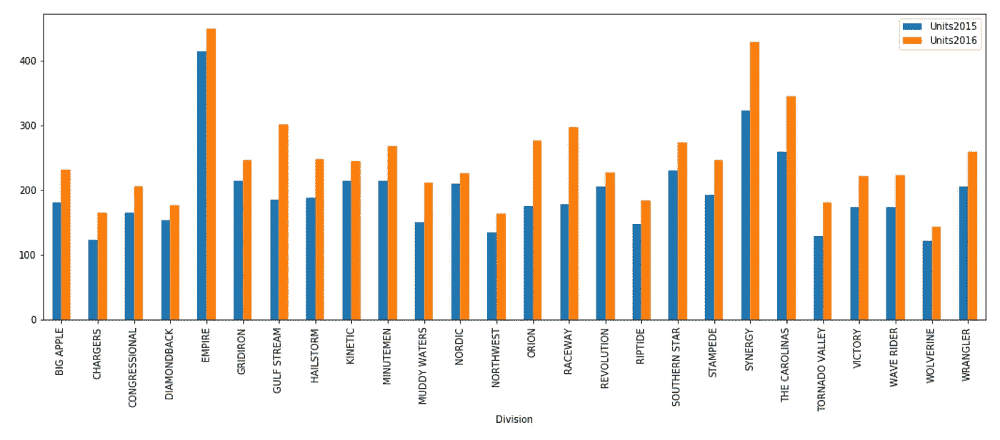

比较不同部门

文章到此为止。我希望您喜欢我们如何有效地利用 seaborn 和 matplotlib 的 Groupby 和 aggregate 函数来制作表示数据的有吸引力的图形。