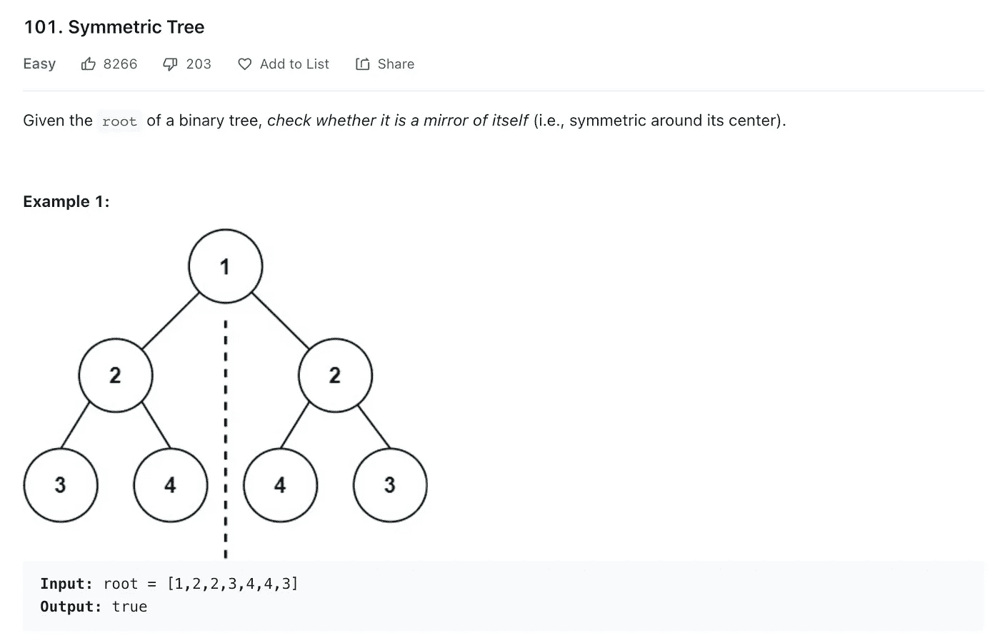
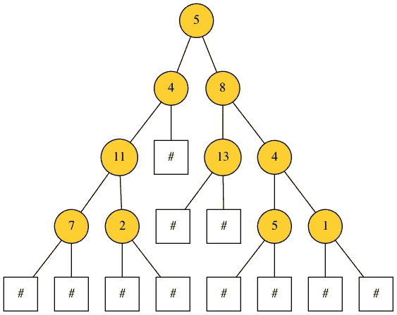
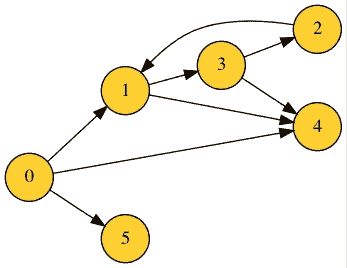
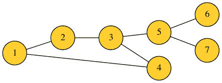
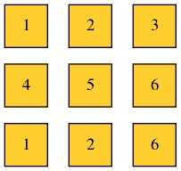

# 使用 DSPlot 在几秒钟内可视化树和图形

> 原文：<https://betterprogramming.pub/visualize-trees-and-graphs-in-seconds-with-dsplot-9112f465da8f>

## 一个 Python 包，用于绘制和渲染数据结构的图像


[来源](https://unsplash.com/photos/dmQqp5_DRm8)

**介绍** [**DSPlot**](https://github.com/billtrn/dsplot) **，一个为你绘制美丽图形的软件包。**

那是一个炎热的夏日早晨。我在为即将到来的软件工程实习面试做准备时，正在琢磨 LeetCode 的问题，这时我碰到了一个类似这样的问题:



资料来源:LeetCode

这个问题的输入是一棵树，在测试用例中以邻接表的形式给出:`[1,2,2,3,4,4,3]`。

查看这个列表并不能让我们对输入有一个清晰的理解，但是它的可视化形式肯定可以。

因此，我认为某种能够将树或图的列表表示转换成图像的引擎是很好的。

所以我决定编写 [DSPlot](https://pypi.org/project/dsplot/) ，它代表数据结构绘图，这是一个 Python 包，可以绘制和呈现以邻接表/图的形式给出的树、图和矩阵的 PNG 图像。

# DSPlot 的工作原理

在设计这个包时，我心中只有一件事:确保它的界面直观，并尽量减少从输入列表到呈现图像的用户步骤。

## 装置

作为一个 Python 包，DSPlot 几乎可以在 Python 的所有平台上工作。它使用 [Graphviz](https://graphviz.org/download/) 作为绘制图形的引擎，所以安装 Graphviz 是先决条件。

安装 Graphviz 后，要获得 DSPlot，您需要做的就是:

```
pip install dsplot
```

## 使用

DSPlot 支持绘制树、图(有向和无向)和矩阵。使用它的函数`plot`，输入数据结构的 PNG 图像将被呈现到您选择的目录中，默认为当前目录。

*   树



结果(PNG 格式)

*   图表



有向图



无向图

*   [数]矩阵



3x3 矩阵

# 结论

我希望你觉得这个包裹很有用。根据 DSPlot 的开源性质，任何贡献都受到高度赞赏:[https://github.com/billtrn/dsplot](https://github.com/billtrn/dsplot)

```
**Want to Connect With the Author?**Check out my personal [blog](https://billtrn.com).
```