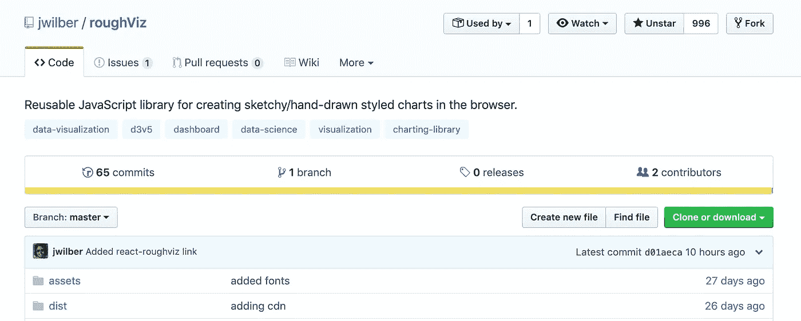
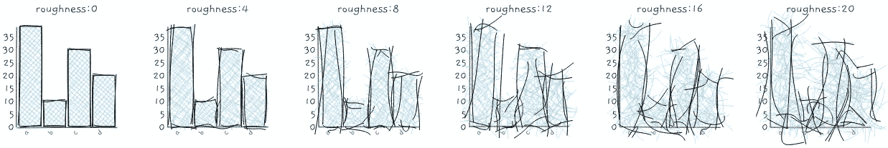
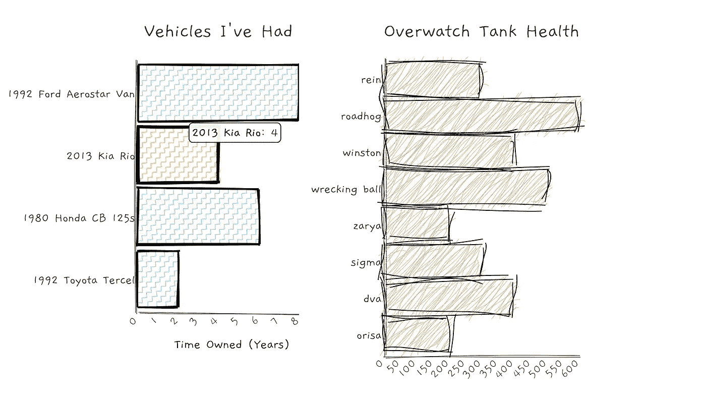
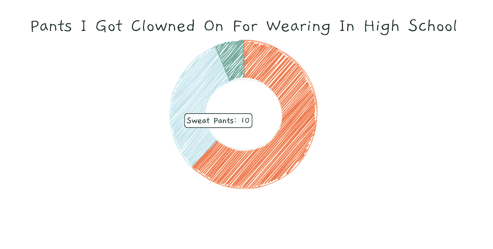
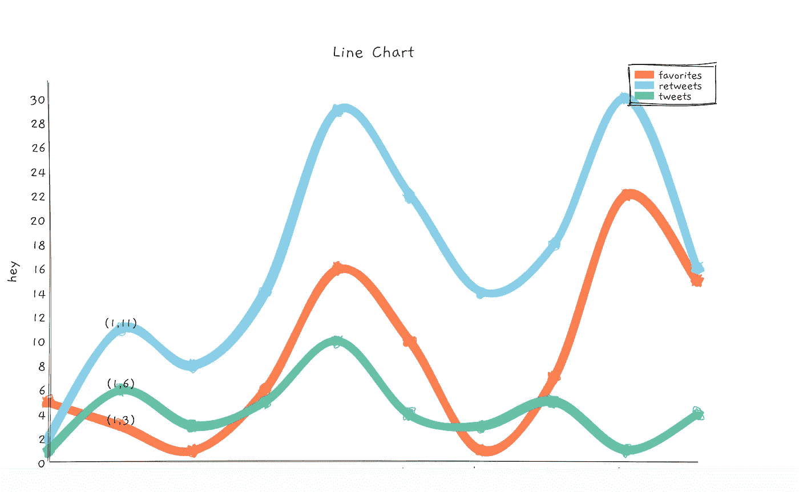
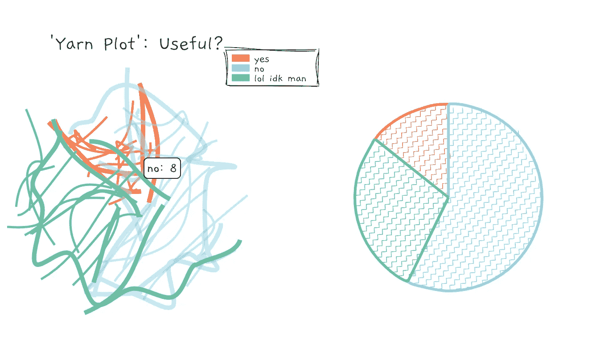
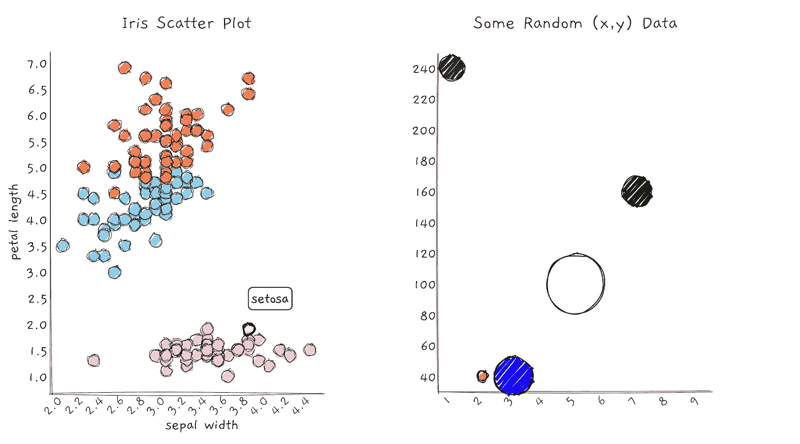
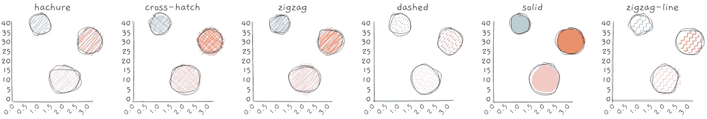
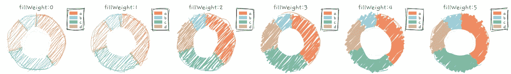

# 用手绘图表可视化您的数据

> 原文：<https://betterprogramming.pub/visualize-your-data-with-hand-drawn-charts-with-the-roughviz-charting-library-a3a9f3ee4f84>

## 使用 roughViz JavaScript 库在浏览器中创建酷酷的图表


roughViz 制图库—[https://github.com/jwilber/roughViz](https://github.com/jwilber/roughViz)

如果沟通的目标是展示意图或概括性，而不是绝对的精确性，请使用手绘图表。或者只是因为他们很有趣，看起来很酷。



Github 上的 roughViz 制图库源代码—[https://github.com/jwilber/roughViz](https://github.com/jwilber/roughViz)

# roughViz 库包括什么

以下是当前可用的图表类型(更多内容即将推出):

*   **栏** ( `roughViz.Bar` ) —完整的 [API](https://github.com/jwilber/roughViz#Bar) 文档在此处。



roughviz Bar 示例— [**来源**](https://blockbuilder.org/jwilber/4dc5235f7ea5e51ac1219b3605f5af6a)

*   **单杠**(`roughViz.BarH`)——在这里看看完整的 [API](https://github.com/jwilber/roughViz#BarH) 。



roughviz 单杠示例— [**来源**](https://blockbuilder.org/jwilber/419fa6d878fe6c0f79a28f9fc72d7ec6)

*   **甜甜圈**(`roughViz.Donut`)——[API](https://github.com/jwilber/roughViz#Donut)



圆环图示例— [来源](https://blockbuilder.org/jwilber/e713c03097950d53a8cfde4c23aa292f)

*   **线** ( `roughViz.Line` ) — [API](https://github.com/jwilber/roughViz#Line)



折线图示例— [来源](https://blockbuilder.org/jwilber/ec7cbc374c2dc61b255494511e7d7ac6)

*   **派**(`roughViz.Pie`)——[API](https://github.com/jwilber/roughViz#Pie)



饼状图演示— [来源](https://blockbuilder.org/jwilber/d117e0b0864a161bec2d914013ed69da)

*   **散布**(`roughViz.Scatter`)——[API](https://github.com/jwilber/roughViz#Scatter)



散点图示例— [来源](https://blockbuilder.org/jwilber/d02e4381d776fb9a7bcb126d3b32c85b)

# 入门指南

通过 CDN:

```
<script src="https://unpkg.com/rough-viz@1.0.2"></script>
```

通过`npm`:

```
npm install rough-viz
```

想和`React`一起用？对此有一个包装器。

```
npm install react-roughviz
```

# 如何使用

创建一些容器元素，每个图表一个:

```
<!--you can name each id whatever you want -->
<div id="viz0"></div>
<div id="viz1"></div>
```

要创建图表，请引用所需的容器并将数据传递给 roughViz 构造函数。

```
// create donut chart from csv file, using default options
 new roughViz.Bar({
    element: '#vis0', // container selection
    data: 'https://raw.githubusercontent.com/jwilber/random_data/master/flavors.csv',
    labels: 'flavor',
    values: 'price'
});// create Donut chart using defined data & customize plot options
new roughViz.Donut(
  {
    element: '#vis1',
    data: {
      labels: ['North', 'South', 'East', 'West'],
      values: [10, 5, 8, 3]
    },
    title: "Regions",
    width: window.innerWidth / 4,
    roughness: 8,
    colors: ['red', 'orange', 'blue', 'skyblue'],
    stroke: 'black',
    strokeWidth: 3,
    fillStyle: 'cross-hatch',
    fillWeight: 3.5,
  }
);
```

# 样式图表

图表样式主要有三种方式——`roughness`、`fillStyle`和`fillWeight`

## 粗糙


## 填充样式



## 填充重量



还包括更多特定于图表的选项— [参见 API](https://github.com/jwilber/roughViz#API) 了解更多信息。

感谢您的阅读，并保持敬畏！

[](https://medium.com/better-programming/modern-and-simple-charts-with-frappe-charts-c1b16244f8c) [## 带有 Frappe 图表的现代和简单图表

### 简单、响应迅速的现代 SVG 图表，零依赖性

medium.com](https://medium.com/better-programming/modern-and-simple-charts-with-frappe-charts-c1b16244f8c)