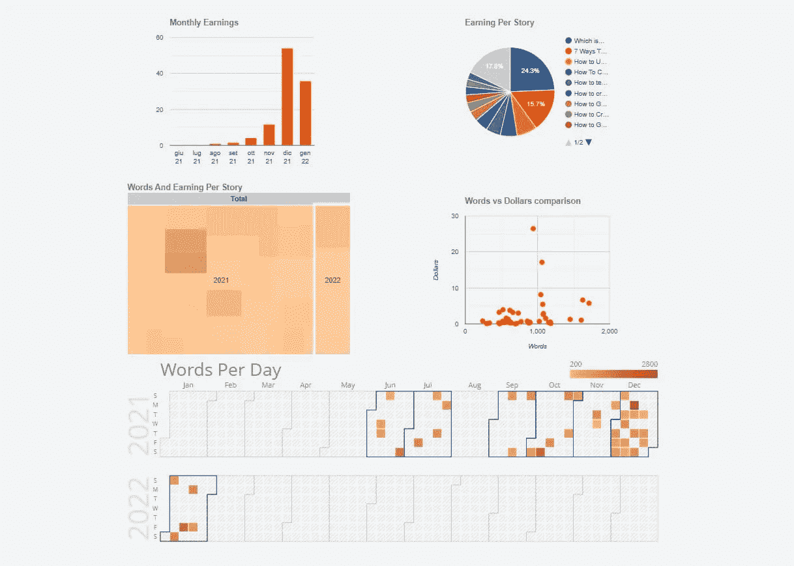
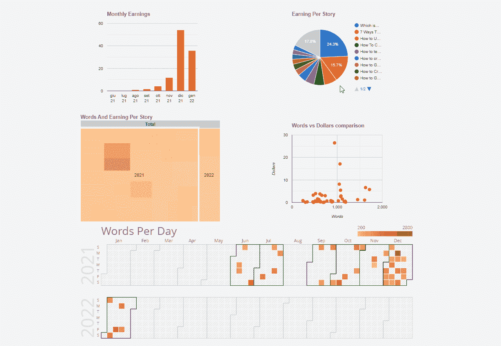
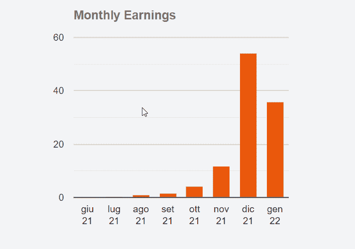
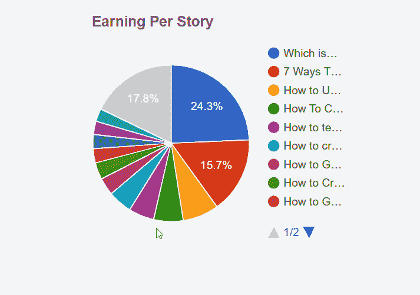
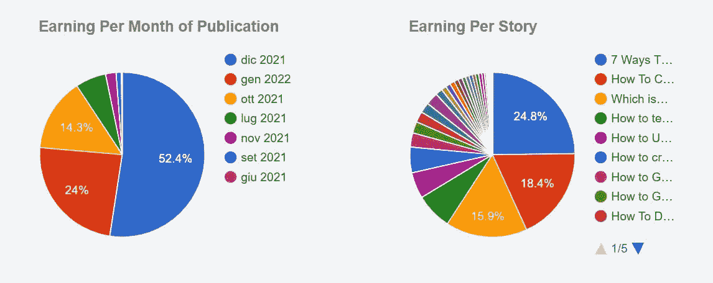
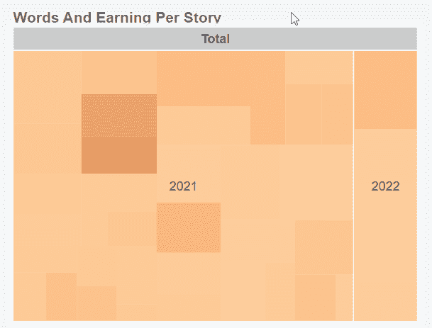
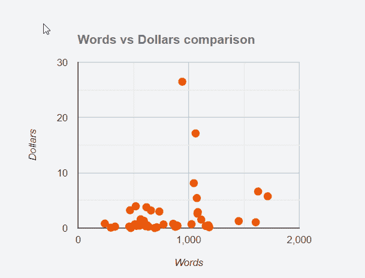
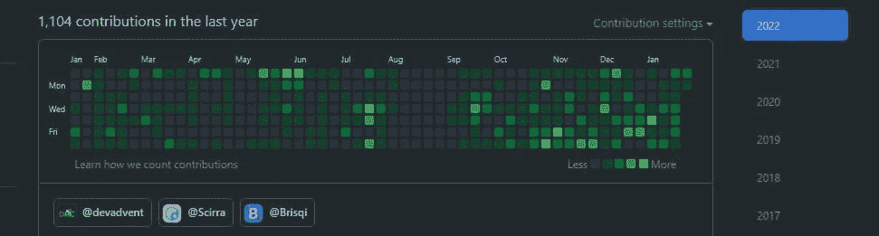

# 用苗条和 JavaScript 形象化你的中等统计

> 原文：<https://betterprogramming.pub/visualize-your-medium-stats-with-svelte-and-javascript-eb1ef7c71a63>

## 构建 5 个图表示例来分析你的媒体写作



作者图片

数字解释了现实，但有时并不清晰。系列和报告是强大的工具，但并不总是可以理解的。因此，在页面中添加图形通常很方便。但是怎么做呢？好吧，今天我试着解释我发现的在网页上添加图表的最简单的方法。

# 介绍

之前，这里是我想创建的:



有 5 种不同的图表，但程序非常相似:

*   柱形图
*   饼图
*   树形图
*   散点图
*   日历图表

在本教程中，我将使用来自中型合作伙伴计划的数据。几天前，当我谈到如何用 CSS 创建响应式表时，我已经使用过它们。

要了解如何下载和导入统计数据，请查看我的帖子:

[](https://javascript.plainenglish.io/how-to-get-medium-stats-with-javascript-and-svelte-part-1-a1d08b96799e) [## 如何用 JavaScript 和 Svelte 获得中等统计

### 第 1 部分:了解如何下载和分析媒体的统计数据。

javascript.plainenglish.io](https://javascript.plainenglish.io/how-to-get-medium-stats-with-javascript-and-svelte-part-1-a1d08b96799e) 

不过，总而言之，只要去 medium.com/me/stats?format=json[count = 100](https://medium.com/me/stats?format=json&count=100)下载页面就可以了。当然，我可以用任何数据创建图表，但是为了在将来提醒我这个过程，我需要一些样本数据。

# 工具箱

用 JavaScript、HTML 和 CSS 轻松创建图形需要什么？在网上，你可以找到各种各样的图书馆。在我看来，最简单的是[谷歌图表](https://developers.google.com/chart)。从名字上你很容易就能猜到，这是一个谷歌图书馆。谷歌是这样定义的:

```
Google Charts provides a perfect way to visualize data on your website
```

[快速入门页面](https://developers.google.com/chart/interactive/docs/quick_start)解释了如何创建饼图。这是一个很好的起点，但不是我打算走的路。有一个更简单的方法。

在网上搜索可以找到[谷歌图表 API web 组件](https://www.npmjs.com/package/@google-web-components/google-chart)。这允许您创建一个语法如下的图形:

我可以使用以下命令将 API 导入到项目中:

```
npm i @google-web-components/google-chart
```

我打算使用的第二个工具是 Svelte。[纤巧](https://svelte.dev/)让你轻松创建网络应用。最重要的是，它允许我以综合的方式编写一些示例代码。

当然，可以使用任何其他框架，甚至不使用任何框架。但是苗条简化了步骤。

# 如何创建柱形图

我从第一张图表开始:



我首先创建一个`GoogleChartColumn.svelte`组件。首先我导入`@google-web-components/google-chart`:

然后我定义道具。[谷歌文档](https://developers.google.com/chart/interactive/docs/gallery/columnchart)做得很好，让你明白什么可以用。目前，我将把自己限制在最基本的方面:

*   `data`:显示数据
*   `options`:配置图形的一些细节

我对许多选择都不感兴趣。我只需要能够自定义标题，并决定各种列的颜色。因此，道具变成了:

这些数据很奇怪。基本上，它们是一个矩阵，其中第一行表示列的名称和类型:

以下几行包含实际数据:

我为配置选项添加了一个变量:

因为我只使用了一个数据集，所以这个图例没有用，所以我把它设置为`none`。我还改变了背景颜色，这样它就不会与页面的其余部分分离(这是`transparent`)。最后，我使用 CSS 属性更改了图表标题的格式。

完整的组件代码是:

但是我如何在 HTML 页面中使用它呢？像这样:

为了获得要插入的数据，我创建了`earningPerMonth`函数:

显然这个函数必须根据你的数据进行修改。

# 如何创建饼图



从这个例子开始，可以创建其他类型的图形。显然，每一种都有自己的特点。接下来是一个饼状图。

我创建了`GoogleChartPie.svelte`文件

饼图将数据分成两个不同的支柱:`cols`和`rows`。

它还允许您传递一个数值(在 0 和 1 之间)来决定蛋糕切片的最小宽度。例如，如果我设置了`sliceVisibilityThreshold = 0.03`，我将只能看到至少占总数 3%的类别。较小的分组在`Other`下。

获取数据的 JavaScript 函数如下所示:

现在，我可以在页面上插入图形:

使用相同的代码，但是改变传递给 props 的值，我可以在同一个页面上创建不同的图形:



# 如何创建树形图



维基百科很好地解释了什么是树形图:

```
In information visualization and computing, treemapping is a method for displaying hierarchical data using nested figures, usually rectangles.
```

我想接下来的步骤已经很清楚了。我创建了`GoogleChartTreemap.svelte`文件:

具体的[道具](https://developers.google.com/chart/interactive/docs/gallery/treemap)有:

*   `maxDepth`:当前视图中显示的最大节点层数。
*   `maxPostDepth`:超过 maxDepth 多少级节点以“暗示”方式显示。
*   `minColor`、`midColor` e `maxColor`

提取和准备数据的函数如下所示:

HTML 代码是

# 如何创建散点图



散点图允许您查看两个数据之间是否有任何关联。在这个例子中，我试图将不同帖子的长度(用字数来衡量)和来自它们的收入联系起来。我还设置了一个自定义的工具提示，当我们将鼠标悬停在不同的点上。

`GoogleChartScatter.svelte`组件的代码与上面类似:

该图有 2 个特定的`props`:

*   `axisY`:显示在 Y 轴上的标题
*   `axisX`:显示在 X 轴上的标题

我还加上了`tooltip: {isHtml: true}`选项。这是为了什么？能够使用 HTML 和 CSS 自定义各个点的工具提示。

获取图表数据的函数与前面的函数略有不同:

我将包含一些 HTML 代码的字符串添加到数据中。然后，该代码由组件呈现，并显示为页面的 HTML 元素。

我可以使用以下方法将图形插入到 HTML 页面中

# 如何创建日历图表


第五张图是日历图。它用于查看日历上的数据。每一天的颜色强度表示每天的相对量。典型的例子是 GitHub 简介中显示的例子:



与之前的图表相比，这张图表需要一些 CSS 和小技巧。但是首先是代码库:

在这种情况下我只需要一个额外的道具，`colorAxis`。这是一组颜色。默认情况下，最小值用白色表示。然而，在将组件导入页面后，我注意到它已经融入了背景。所以我决定从更强烈的颜色开始:

准备数据的功能与前面的类似，但明显有一些小的不同:

不错，但还不够。还有一个与图形大小有关的问题。我不知道为什么，但该组件对于日历长度来说太短了。然后，我必须使用 CSS 属性强制调整大小:

图形的高度也不对。在这种情况下，我必须根据我想要显示的年数来计算。首先我必须算出要显示的年数

然后我使用 [style: property](https://svelte.dev/docs#template-syntax-element-directives-style-property) 指令:

通过组合整体，组件变成:

仅此而已。显然这种方法并不完美。然而，我发现它比我尝试过的其他实现更简单。

与往常一样，这些代码可以在 GitHub 的存储库中找到:

[](https://github.com/el3um4s/medium-stats) [## GitHub - el3um4s/medium-stats:如何用 JavaScript 和 Svelte 获得中等统计

### 现场直播:el3um4s.github.io/medium-stats/，我关于如何获得更好的中等统计数据的实验。我写博客是关于…

github.com](https://github.com/el3um4s/medium-stats) 

显然，这是一项正在进行的工作，所以仍然有一些细节需要完善，我可能会随着时间的推移再次改变一些东西。

感谢阅读！敬请关注更多内容。

***不要错过我的下一篇文章—报名我的*** [***中邮箱列表***](https://medium.com/subscribe/@el3um4s)

[](https://el3um4s.medium.com/membership) [## 通过我的推荐链接加入 Medium—Samuele

### 阅读萨缪尔的每一个故事(以及媒体上成千上万的其他作家)。不是中等会员？在这里加入一块…

el3um4s.medium.com](https://el3um4s.medium.com/membership) 

*最初发表于*[*https://blog.stranianelli.com*](https://blog.stranianelli.com/5-charts-example-to-get-you-started/)