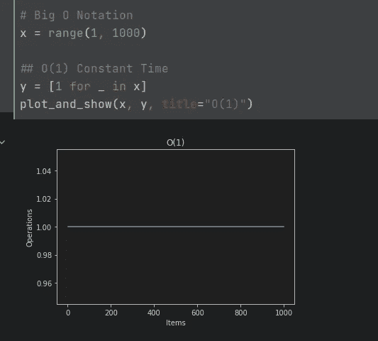
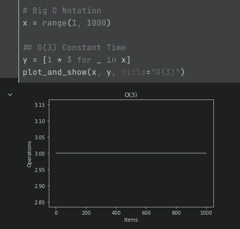
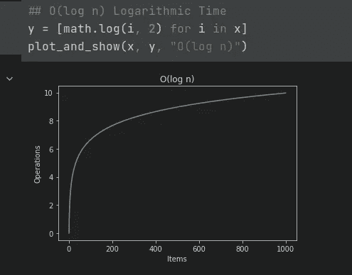
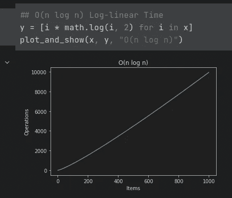
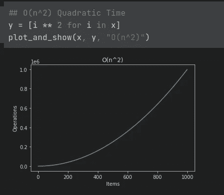
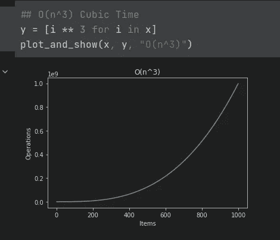
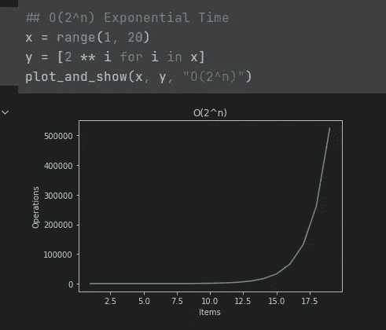
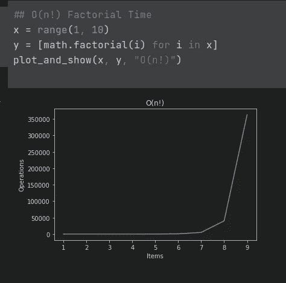
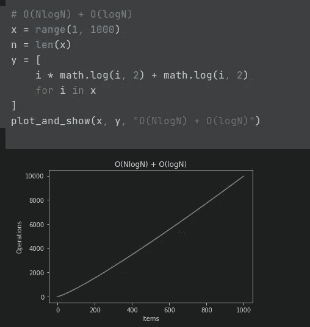
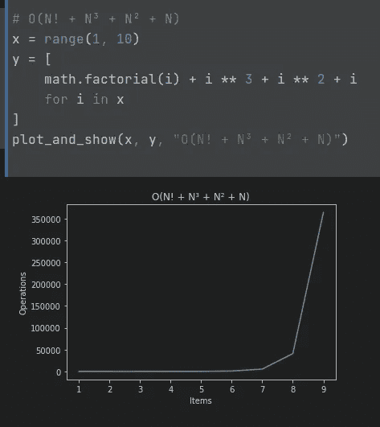

# 在 12 分钟内可视化大 O 符号

> 原文：<https://betterprogramming.pub/visualizing-big-o-notation-in-12-minutes-e221fc4cd2e3>

## 让我们从不同的角度来看一下 BigO 符号


照片由[亚历山大·巴甫洛夫·赫罗夫卡](https://unsplash.com/@julienk53?utm_source=medium&utm_medium=referral)在 [Unsplash](https://unsplash.com?utm_source=medium&utm_medium=referral) 上拍摄

我真的相信，如果你从最基本的开始，没有什么是你学不到的。

如果你把正确的资源和学习的意愿结合起来，没有什么能阻挡你和你的梦想。

在本文中，我想通过解释 BigO 符号这样一个非常重要的概念来为社区做出一点小小的贡献，使用一些可视化的功能和我的数学背景来帮助大家更好地理解这个主题。

让我们从定义开始:

> 大 O 符号是一种**数学符号**，它描述了当自变量趋向某个特定值或无穷大时函数的极限行为。

我们如何理解呢？

在计算机科学中，解决一个问题几乎总是有几种方法。作为软件工程师，我们的工作是找到最有效的解决方案并实现它。但是它到底是什么意思呢？这是最快的方法吗？是那个比其他的占空间小的吗？其实看情况。这纯粹与你的特殊问题有关。如果您在内存有限的嵌入式系统中工作，例如，如果问题是计算在微波炉中解冻 200 克肉所需的功率(瓦特),您可以将一种内存效率更高、需要 1 秒来进行计算的算法转换为另一种以毫秒为单位进行计算但需要更多内存的算法。毕竟，即使启动需要几毫秒，除霜过程本身也需要 10 到 15 分钟。

如果我们讨论将导弹锁定在目标飞机上的算法，很明显我们在这里处理的是毫秒级的，可以牺牲内存消耗。这架飞机足够大，可以为更多的内存插槽留出空间。

> 一般来说，软件工程是关于权衡的。一个好的软件工程师必须意识到需求并提出解决方案来满足它们。

说了这么多，现在可以理解的是，我们需要以某种方式量化和测量任何算法的性能和内存含义。一种方法是看看一个算法需要多少秒来完成。这可以提供一些价值，但问题是，如果我的搜索算法在有 1000 个项目的笔记本电脑上需要 2 到 3 秒，那么在另一台更强大的笔记本电脑上可能需要更少的时间，对吗？即使我们同意以我的笔记本电脑的性能为基础，我们也不知道当阵列的规模翻倍时会发生什么？当数组的大小趋于无穷大时会发生什么？

为了回答这些问题，我们需要一个独立于机器的测量，它可以告诉我们当输入的大小越来越大时，我们的算法会发生什么。这里是 BigO 符号。

BigO 旨在找出在给定任意大小输入的最坏情况下需要执行多少操作。它旨在发现当规模越来越大时，算法的运算次数的极限是多少。BigO 分为时间和空间复杂度分析。对于每一个算法，你可以通过简单地计算你在给定的数据结构上执行的辅助操作的数量来计算它的时间复杂度。

如果你将一个包含 10 个元素的数组复制到另一个数组中，那么你需要遍历整个数组，这意味着 10 次操作。在 BigO 符号中表示为 O(N ),其中 N 是输入数组的大小。这个例子的空间复杂度也是 O(N ),因为您将为复制的数组分配更多的内存。

BigO 所做的是给你一个数学函数，当输入变大时，它纯粹专注于寻找你需要执行的操作数量的极限。例如，如果您使用线性搜索在给定列表中搜索数字 5。然后在最坏的情况下，这个数字将在列表的末尾，但是因为你将从头开始迭代，你将需要执行和输入数字一样多的查找操作。

```
[1, 2, 3, 4, ***5***]  # you will perform 5 operations here to find it
```

这里我想在术语 ***最坏情况*** 上停留片刻。如果你想一想，所需的数字有可能在列表的开头，在这种情况下，你将只执行 1 次操作。

```
[***5***, 1, 2, 3, 4]  # you will perform only one operation in this case
```

问题是，我们不能考虑最好的情况，并希望它在大多数情况下都会发生，因为这样我们就无法比较不同的算法。在 BigO 符号的上下文中，我们总是对最坏的情况感兴趣(有一些例外，比如哈希映射，稍后会详细介绍)。

我之前说过，BigO 给了你一个数学函数，重点是求运算次数的极限。当我们谈论数学中的极限时，我们不能只谈论它们而没有任何形象化。这非常有助于理解函数在输入大小趋于无穷大时的趋势。让我们通过一个例子来逐一分析一些非常常见的 BigO 符号。

# O(1)常数时间



O(1)

可以理解，这是一个算法可以拥有的最好的 BigO 符号。当您想要执行某个操作，并且只需一次操作即可完成时。让我们看一个使用 python 的例子:

```
country_phone_code_map = {
    'Albania': '+355',
    'Algeria': '+213',
    'American Samoa': '+684',
}
country = 'Albania'
**print(country_phone_code_map[country])  # 1 operation**
>>> '+355'
```

在 python 中，如果你想在字典中查找一个条目，那么这个操作的时间复杂度是 O(1)。python 中的 Dict 类似于其他语言中的 HashMap。

确切地说，最坏的情况是 O(N ),这与数据结构实现的好坏有关。哈希函数在这里起着关键作用，但是一般来说，字典查找的 BigO 是 O(1)。如果你在一次编码面试中，你可以假设它是 O(1)。

在计算 BigO 时，我想在另一个非常重要的话题上停下来。**常数**。您可能熟悉也可能不熟悉在计算 BigO 时忽略常数。我不希望你只是把这当成一个规律去接受，而不去思考背后的原因。

这正是我将 BigO 符号可视化的原因。因此，让我们假设在上面的例子中，我们还需要通过获得国家名称来获得 3 个和 2 个字母的国家代码。这意味着我们有一些其他的 2 和 3 个字母的国家代码的映射，我们只需要在同一个函数中再执行 2 次操作。

```
country_phone_code_map = {
    'Albania': '+355',
    'Algeria': '+213',
}
country_2_letter_code_map = {
    'Albania': 'AL',
    'Algeria': 'DZ',
}
country_3_letter_code_map = {
    'Albania': 'ALB',
    'Algeria': 'DZA',
}
country = 'Albania'

**phone_code = country_phone_code_map[country]  # 1 operation
two_letter_code = country_2_letter_code_map[country]  # 1 operation
three_letter_code = country_3_letter_code_map[country]  # 1 operation**
```

如果我们继续像之前说好的那样计算手术次数。在这里，我们将有 3 个运算使 BigO = O(3)正确？

让我们想象一下:



如您所见，操作数量增加了 3。这意味着我们实际上执行了不止一个操作来完成这个任务。但是，BigO 说，如果有常量，就忽略它们。所以 O(3)或 O(2n)或 O(2n + 1)将分别为 O(1)，O(n)，O(n)。

这是因为我们感兴趣的是当 N 趋于无穷大时函数的极限，而不是它将执行多少次运算。我们并不计算运算的次数，相反，我们感兴趣的是，当 N 趋于无穷大时，运算的次数将如何增长。你可能会想，是的，但是使用`O(1000n)`的算法比使用 O(n)的算法要慢，所以我们需要考虑 1000，我们不能忽略它。这是真的，但这个数字 1000 是一个常数，它不会随着 N 的增大而增大。即使 N 是 10，它仍然是 1000，即使 N 是 1B，它仍然是 1000。所以它没有给我们提供任何关于函数极限的有价值的信息。唯一重要的部分是 O(n ),它告诉我们，你增加的越多，你就要执行越多的操作来完成任务。

# O(logn)对数时间



这种符号通常与分而治之的搜索算法结合在一起。如果我们在一个有序的数组中寻找一个数字，我们可以使用最基本的算法，二分搜索法。该算法将在每次运算时将数组一分为二，并且需要 log(n)次运算才能找到该数。[这里的](https://www.cs.usfca.edu/~galles/visualization/Search.html)是一个很好的可视化这个算法的工具。

> 这里很重要的一点是，当我们在计算机科学中谈论对数而不指定底数时，我们总是谈论底数为 2 的 T2 对数。在数学中，我们习惯于以 10 为底的对数，但在计算机科学中却不同。在处理复杂性分析时，请记住这一点。

从上图可以看出，这其实是一个非常好的时间复杂度。用简单的英语来说，复杂度为 O(logn)意味着每次输入的大小加倍时，我们只需要再进行一次迭代就可以完成任务。当 N 大约为 100 万时，我们只需要执行 20 次运算，而当它达到 10 亿左右时，我们只需要执行 30 次运算。可以看到时间复杂度为 O(logn)的算法的强大之处。对于 N 的如此巨大的增加，我们只需要再进行 10 次运算。

# O(N)线性时间


在这种情况下，当 N 趋于无穷大时，运算次数也趋于无穷大，速率与 N 相同。一个例子是我们之前讨论过的线性搜索。

```
array = [1, 2, 3, 4, 5]
number = 5
for index, item in enumerate(array):  **# loop n times**
    if item == number:  **# check for equality**
        print(f'Found item at {index=}')
        break

>>> Found item at index=4
```

# O(NlogN)对数线性时间



这种符号通常与排序算法结合在一起。看看这个用于合并排序的[可视化](https://www.hackerearth.com/practice/algorithms/sorting/merge-sort/visualize/)。Merge sort 将数组分成 O(logn)的两半，用 O(n)的线性时间来合并分开的数组。

# O(N)次时间



注意 1e6 在操作轴的数量

通常是带有嵌套循环的算法。例如一个强力排序算法，在两个嵌套的**for 循环中遍历整个数组。冒泡排序就是一个例子:**

```
def **bubble_sort**(data):
    for _ in range(len(data)):  **# O(n)**
        for i in range(len(data) - 1):  **# nested O(n)**

            if data[i] > data[i + 1]:
                data[i], data[i + 1] = data[i + 1], data[i]
    return data
```

由于第二个循环是嵌套的，我们将把它的复杂性乘以第一个循环的复杂性。即 O(n) * O(n) = O(n)

> 如果第二个循环在第一个循环之外，我们将对它们求和而不是相乘，因为在这种情况下，第二个循环不会像第一个循环那样重复很多次。

# 立方时间



最简单的例子是一个有 3 个嵌套 for 循环的算法。

```
for i in range(len(array)):  **# O(n)**
    for j in range(len(array)):  **# O(n)**
        for p in range(len(array)):  **# O(n)**
            print(i, j, p)
```

如果你直接应用矩阵乘法的数学定义，那么你将得到一个时间为立方的算法。这个任务有一些改进的算法，看看[这里](https://en.wikipedia.org/wiki/Matrix_multiplication_algorithm)。

# O(2^N)指数时间



这种表示法最著名的例子是用递归方法找到第 n 个斐波那契数。

```
def nth_fibonacci(n: int) -> int:
    if n in [1, 2]:
        return 1

    return nth_fibonacci(n - 1) + nth_fibonacci(n - 2)
```

# O(N！)阶乘时间



这方面的一个例子是生成一个列表的所有排列。看一看[旅行推销员问题。](https://en.wikipedia.org/wiki/Travelling_salesman_problem)

# 取最重要的因素

我们已经讨论过在计算一个算法的复杂度时去掉常数，因为它们不能给我们提供任何值。关于这条规则还有更多东西。当执行复杂性分析时，我们可以得到一个对给定的输入执行不止一种操作的算法。例如，我们可能需要一些函数来对一个数组进行初始排序，然后对其进行搜索。让我们假设这将是一个复杂度为 O(NlogN)的排序操作加上另一个复杂度为 O(logN)的搜索操作。

这种函数的时间复杂度将是 O(NlogN) + O(logN)。让我们想象一下:



如果你看一下这个图，你会注意到 O(NlogN)的影响大于 O(logN)的影响，因为这个图更类似于 O(NlogN)而不是 O(logN)。我们甚至可以用数学方法证明这一点。

```
O(NlogN) + O(logN) = O((N+1)logN)  # factorize
O((N+1)logN) = O(NlogN)  # drop constant 1
```

在这种情况下，它们彼此相对接近，差异不明显但如果我们再举一个像 O(N！+ N + N + N)我们会注意到 N 以外的符号的影响！和 N 比起来实在是太小了！当 N 变得过大时！

我们可以很容易地计算出 1 000 000 的^ 3，但尝试同样的 1 000 000 阶乘。



> 10 的阶乘是 3 628 800，而 10 只是 1000。如你所见，与 N 相比，N 的影响是如此之小！我们可以忽略它。这就是为什么当我们有多个符号时，我们选择最重要的因素。

在选择最重要的因素时，有一点非常重要，那就是我们根据输入对因素进行分组。这意味着，如果我们有一个算法在两个不同的数组上操作，一个大小为 N，一个大小为 M，算法的复杂度是 O(N + N + M + M ),那么我们不能说最高因子是 M，所以复杂度是 O(M)。这是不正确的，因为它们在我们的函数中是完全独立的变量。我们的算法依赖于这两个变量，所以正确的做法是取出这两个变量的最高因子。我们消去 N 是因为 N 更高，消去 M 是因为 M 更高，结果是 O(N + M)。

# 结论

如果你想深入学习算法和数据结构，那么你需要质疑一切。不要认为任何规则都是理所当然的。向他们提问，并试图找到答案。可视化对于理解复杂算法有着巨大的影响。不要忘记，你学习这些主题不是为了通过一些编码面试，而是为了让自己成为一名更好的工程师。

# 参考

*   我的 Jupyter 笔记本用于可视化
*   [我的 Github repo on 算法](https://github.com/klement97/algorithms)
*   [二分搜索法可视化](https://www.cs.usfca.edu/~galles/visualization/Search.html)
*   [合并排序可视化](https://www.hackerearth.com/practice/algorithms/sorting/merge-sort/visualize/)
*   [矩阵乘法](https://en.wikipedia.org/wiki/Matrix_multiplication_algorithm)
*   [旅行推销员问题](https://en.wikipedia.org/wiki/Travelling_salesman_problem)