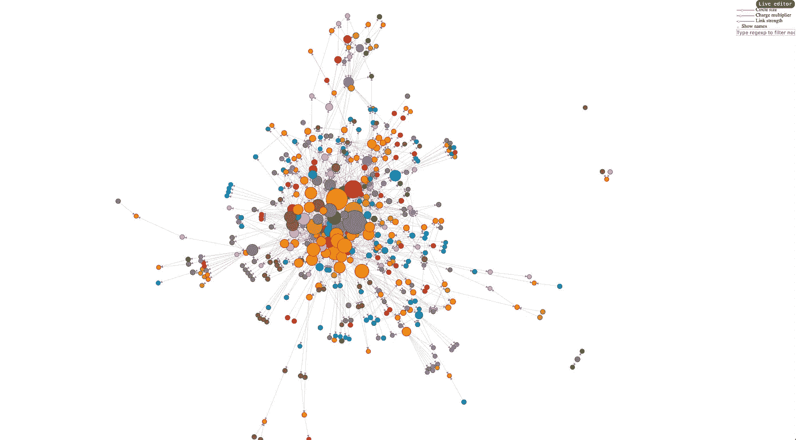
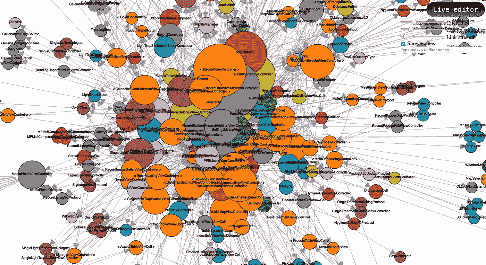
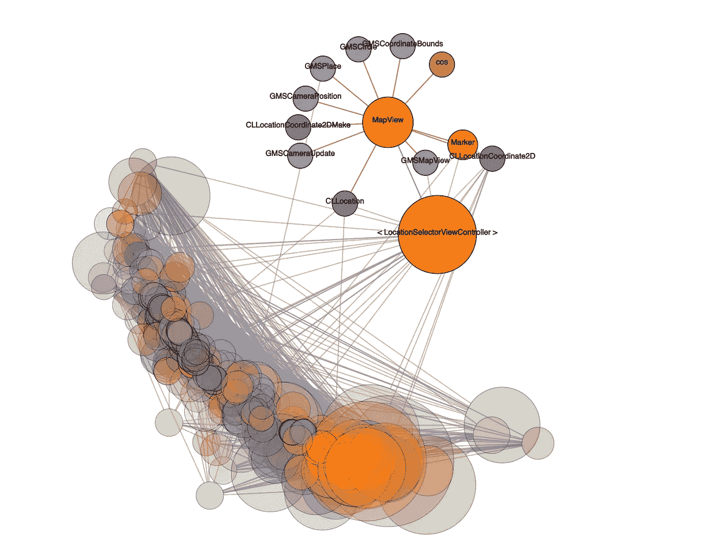
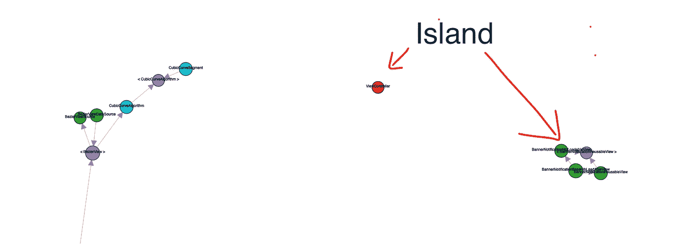

# 可视化您的 iOS 应用程序的依赖关系图

> 原文：<https://betterprogramming.pub/visualizing-dependency-graph-in-project-71210a5de269>

## 了解你的代码库的形状



在我之前的[文章](https://medium.com/@ashwinshres/cleaning-up-the-resources-in-ios-project-1dad7e50bec1)中，我写了我们如何使用不同的工具来删除未使用的`resources`、`classes`、`functions`和`localized strings`。希望你们喜欢。

在本文中，我将讨论另一个我通常用来深入分析我的代码库的工具。这里，我们正在讨论我们项目中的*依赖图*。那么什么是依赖图呢？

> 用数学术语来说，依赖图是一个[有向图，](https://en.wikipedia.org/wiki/Directed_graph)其中有向边连接节点并表示一个方向依赖——[埃里克·迪特里希](https://blog.ndepend.com/without-dependency-graph-flying-blind/)

我想更多地谈论依赖图，但也许下次在一篇单独的文章中。我要解释的工具是我已经使用了一段时间的一个工具，用来了解我的项目中的类和结构的概况——它们有多大，它们如何相互链接，以及哪些类依赖于哪些类。让我们先深入实际用法，然后再来解释。

该工具是 [Objective-C 和 Swift 依赖可视化工具](https://github.com/PaulTaykalo/objc-dependency-visualizer)，使用`.o(object)`文件生成依赖图。

要使用此工具，请首先在终端中输入以下命令:

```
git clone [https://github.com/PaulTaykalo/objc-dependency-visualizer.git](https://github.com/PaulTaykalo/objc-dependency-visualizer.git) ;
cd objc-dependency-visualizer ;
```

现在，在 Xcode 中构建您的 iOS 项目，然后输入命令:

```
./generate-objc-dependencies-to-json.rb -w -s "" > origin.js ;
```

上面这个命令的作用是，在输入上面的命令之前，它从您刚刚构建的派生数据中取出您的项目，然后准备您的类的有向图。现在输入:

```
open index.html
```

上面的命令打开您的默认浏览器并显示图表。

**注意:**这可能无法在 Safari 中运行，所以请使用 Chrome 或 Firefox 打开那个`index.html`文件。

出于演示的目的，我用我现有的项目准备了下面的图表:


我知道它看起来模糊，但我不得不缩小显示所有的类。仔细看看下面的图表:



所有这些橙色的圆圈是视图控制器，棕色的是常量和结构，等等。



点击一个圆圈，它与它所依赖的所有其他类或者与它有依赖关系的类一起高亮显示，如上图所示。



如果你仔细观察依赖图，你会注意到有一些圆圈远离主集群——这些被称为*岛*。它们是独立的代码片段，不依赖于主代码库，可能会也可能不会服务于项目的目的。

岛不一定是坏的，但是从依赖图视图中，我们可以看到我们肯定可以删除整个岛，因为它没有任何用途。

所以这一切的要点是使用依赖图查看器，我们可以看到我们项目中代码库的分布。它给出了代码库的动态分析。这也有助于我们看到类之间的*循环依赖*。当两个或多个抽象相互之间有直接或间接的依赖关系时，就形成了循环依赖关系。

# 结论

感谢阅读。编码快乐！