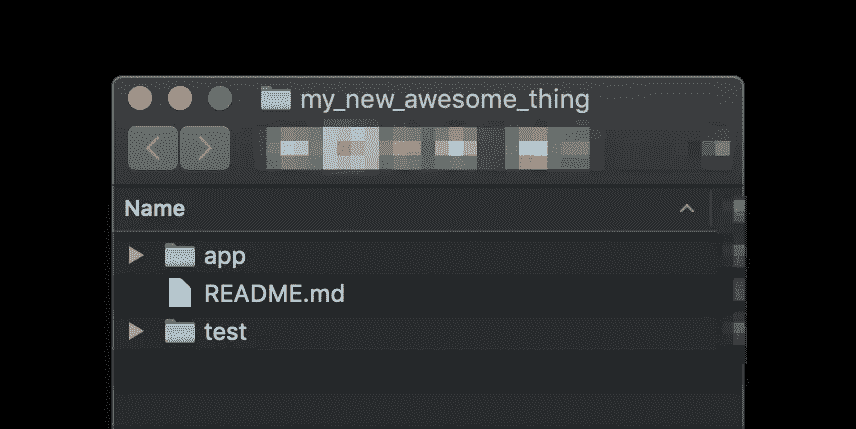

# 用 git-log 可视化代码库随时间的变化率(1)

> 原文：<https://betterprogramming.pub/visualizing-rates-of-change-in-testbase-vs-codebase-over-time-with-git-log-1-118e0c37d455>

## 查看您的代码和测试覆盖率在您的代码库的生命周期中是如何变化的


照片:[杰里米·毕晓普](https://unsplash.com/@jeremybishop?utm_source=unsplash&utm_medium=referral&utm_content=creditCopyText)

对于我最近提出的关于哪些度量在软件质量保证中有用的建议的反应，我感到很惊讶:

我认为更多的人知道如何查看他们的测试代码相对于他们的应用程序代码的变化率

我很惊讶，这么多人看到上面的推文，马上问怎么在第一时间进行测量。

我知道[测量 Git](https://medium.com/better-programming/measuring-the-cadence-of-commits-in-git-history-ed58590a3b0e) 中的变化率不是通才软件工程师通常执行的活动。但是我已经假设在专业软件测试社区中有比表面上存在的更高的熟悉程度。这尤其有趣，因为许多人对这一指标感兴趣，并直觉地被它所吸引——他们只是不知道如何得到它。

# 用`git-log(1)`比较两个目录的变化率

通常，软件应用程序的源代码是这样布局的，单个顶级目录包含所有应用程序代码(*代码库*)，另一个顶级目录包含所有自动化测试代码和脚手架(*测试库*)。(如果你的项目不是这样设计的，请继续读下去，我会告诉你如何解决这个问题。如果你不耐烦的话，也可以直接滚动到文章的底部。)

例如，想象一个 Git 存储库，其中所有的代码库都在目录`app/`中，测试库在目录`test/`中。

例如，Git 回购看起来像这样:



Git repo 的布局使得代码库和测试库位于不同的顶级目录中

# 将 git-log(1)输出转换为时间序列

这里首先要知道的是`git-log(1)`可以将文件系统路径作为参数。因此，您将从命令`git log app`和命令`git log test`获得不同的输出(如果是在 Git repo 根中发出的，如上图截图所示)。

然而，`git-log(1)`的默认输出不是[时间序列](https://www.investopedia.com/terms/t/timeseries.asp)。

下面是一个将`git-log(1)`的输出转换成时间序列的脚本。该脚本将为`app`目录生成一个时间序列，并为`test`目录生成另一个时间序列:

因此，输出如下所示:

```
app/
      1 2020-02-27
      1 2020-03-03
      2 2020-03-06
      3 2020-03-11
test/
      1 2020-01-13
      1 2020-02-12
      1 2020-02-25
      1 2020-03-05
```

类似于`3 2020–03–11`的一行表示在 2020 年 3 月 3 日，一整天有三个提交到这个存储库。

您可以向下阅读列表的左侧，查看在初始提交之后的每一天进行了多少次提交，一直到 Git 存储库的[默认分支](https://web.archive.org/web/20200429004214/https://help.github.com/en/github/administering-a-repository/setting-the-default-branch)的[当前](https://stackoverflow.com/questions/2304087/what-is-head-in-git) `[HEAD](https://stackoverflow.com/questions/2304087/what-is-head-in-git)`的提交日期。

# 从时间序列中进行推断

从上面的数据可以立即推断出的一件事是代码库和测试库在不同的日子提交。源代码中存在这种模式在实际项目中是一种*高信号观察* ，因为理想情况下，应用程序代码及其支持测试代码应该随着功能的增加和修改而一起改变。

上面的 shell 脚本被配置为只查看最近三周的数据。在[十年的持续集成实践中，](https://codeascraft.com/2011/04/20/divide-and-concur/)我发现 3 周/21 天是一个足够宽的时间窗口，在这个时间窗口中可以观察到 Git 历史中的趋势，而不会引入大量来自旧的和不相关的源代码更改的噪音。

您可以通过编辑上面的 shell 脚本的第 8 行来将时间窗口从三周更改为您想要的任何时间。

# 比较两个任意文件集的更改率

在本文的开头，我承认并不是每个人的项目都被安排在 codebase 和 testbase 顶级目录结构中。

幸运的是，无论代码库和测试库是如何布局的，您都可以通过使用`[find(1)](https://en.wikipedia.org/wiki/Find_(Unix))`过滤您的源代码树来可视化两个不同文件集的 Git 历史——都是*文件集*。这是因为`git-log(1)`可以接受多个路径作为参数。

所以只需要使用`find(1)`来创建两个路径集合:一个用于代码库，一个用于测试库。

例如，如果您的测试文件与代码文件并排存储，那么您可以使用`find(1)`提取测试文件的路径，如下面的 shell 脚本所示。在这个例子中，我假设所有的测试文件名都以`Test.php`结尾，所以所有的测试文件都以类似`exampleTest.php`的名字命名。

以下是如何找到所有以`Test.php`结尾的文件，而不管该文件在 Git 存储库的文件系统中的位置:

这将产生类似于上面显示的输出，除了在这种情况下只显示测试库的历史:

```
 1 2020-01-13
      3 2020-02-12
      1 2020-02-25
      1 2020-03-05
```

和以前一样，这个时间序列表示在过去三周内提交给所有`Test.php`文件的的总数。通过将[行 4](https://gist.github.com/textarcana/02e4b689ba7a1774a135ba13674d847e#file-find_files_for_git_log-sh-L4) 上的`--since`参数更改为三周前以外的某个日期，您可以将时间窗口更改为您想要的任意值[。](https://git-scm.com/docs/git-log#Documentation/git-log.txt---sinceltdategt)

现在，让我们把代码库的历史打印出来，这样就可以和测试库的历史进行比较。

假设您的所有应用程序文件都有一个通用的扩展名，比如说`.php`，那么您可以使用`find(1)`收集所有代码库文件(所有可能被测试的文件)的路径，如下所示:

```
find . -name "*.php" -not -name "*Test.php"
```

这将打印出以`.php`结尾的所有文件的列表，除了以`Test.php`结尾的文件，这些文件将从列表中省略。

与我们用来查看 testbase 文件的脚本一样，该脚本将生成一个时间序列，显示对代码库文件进行提交的日期，如下所示:

```
 1 2020-01-13
      1 2020-02-12
      1 2020-02-25
      1 2020-03-05
```

无论您的代码库是如何布局的，您都可以使用`find(1)`来收集您的代码库和测试库文件的路径，这样您就可以将这些路径传递到`git-log(1)`中并比较这两个历史！