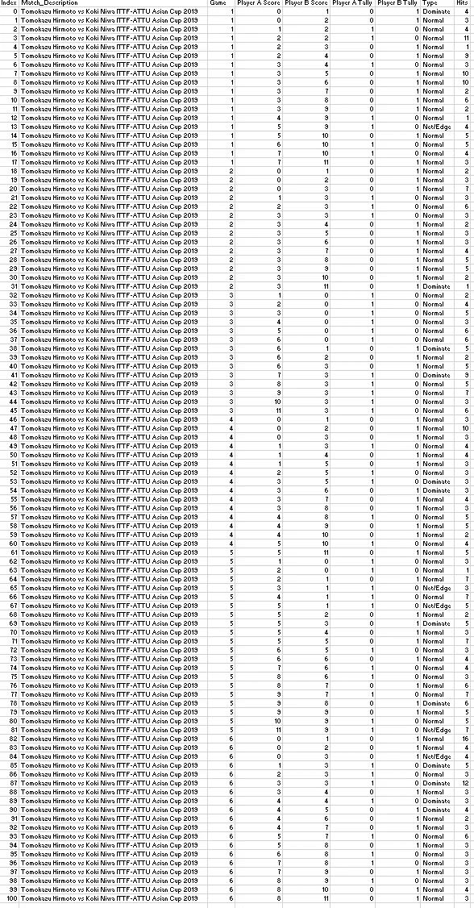
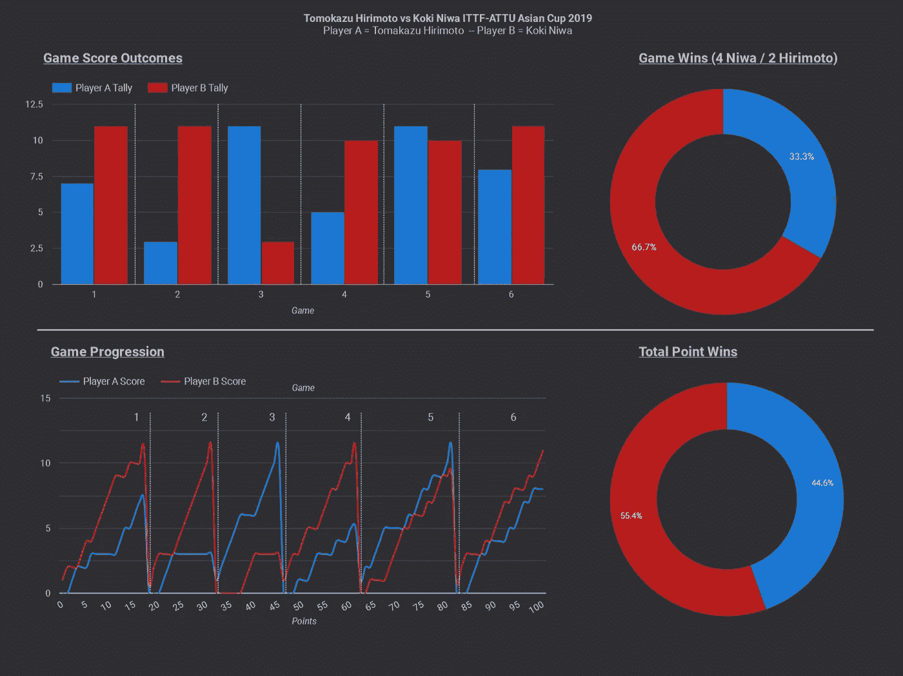
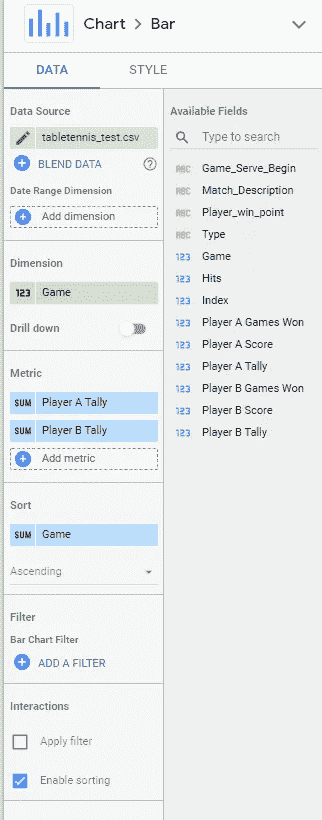
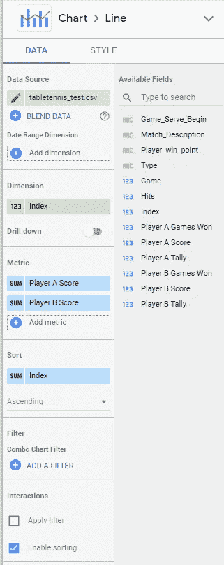
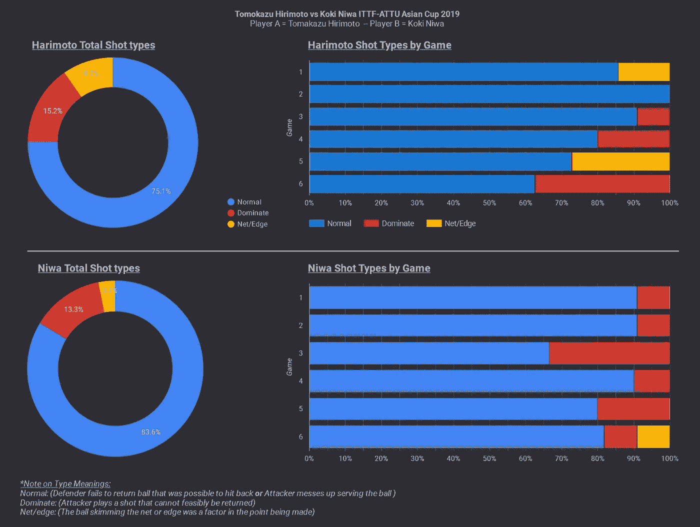
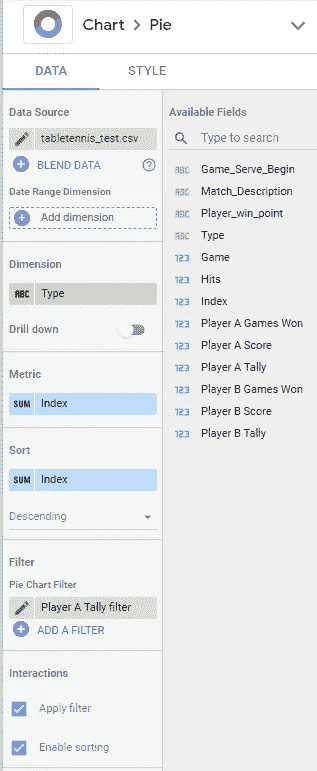
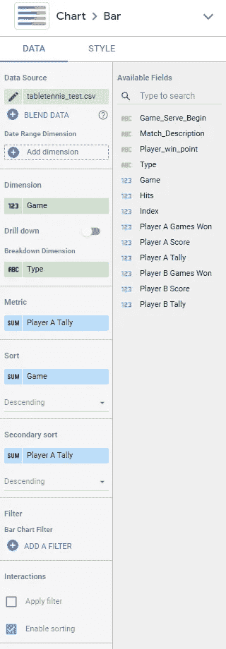
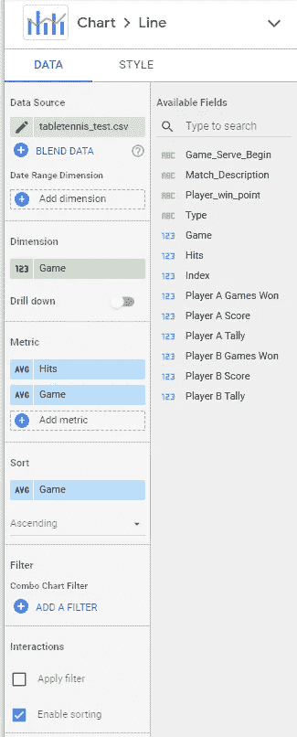
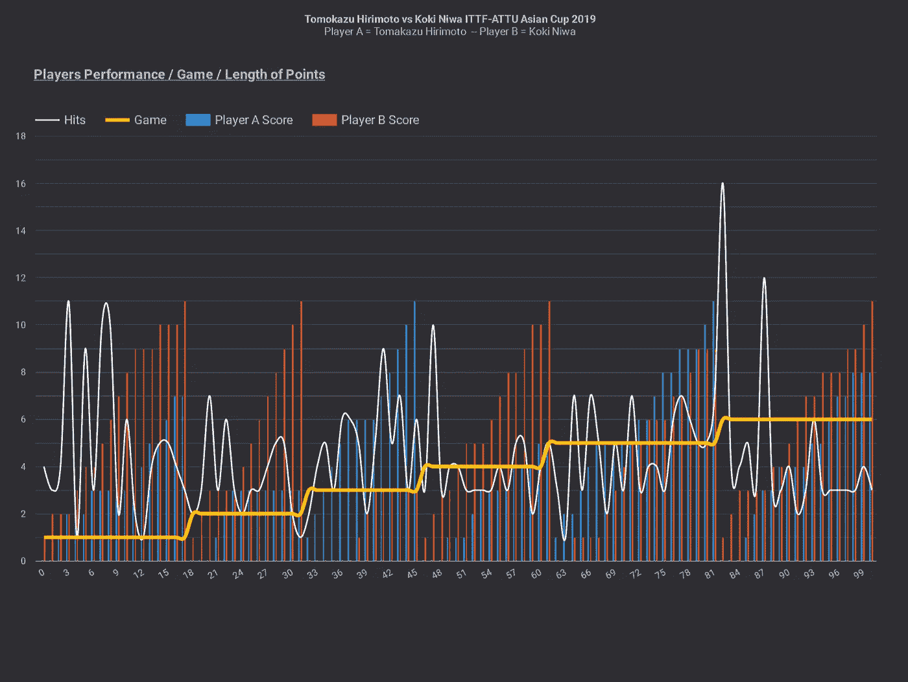
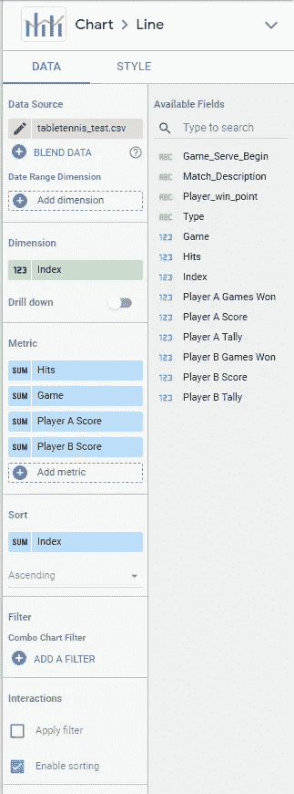

# 在 Google Data Studio 中可视化乒乓球 KPI

> 原文：<https://betterprogramming.pub/visualizing-table-tennis-kpis-in-google-data-studio-d02f79084dd4>

## Tomokazu Harimoto 主场迎战 Koki Niwa ITTF ATTU 亚洲杯 2019

[来源](https://unsplash.com/photos/vPKGcFEbmjc)

我是一个乒乓球爱好者。我在这个领域已经有几年了，我关注所有主要的玩家和比赛。

我认为在[谷歌数据工作室](https://datastudio.google.com/)练习制作仪表盘的一个有趣的方法是想象我最近看的一场比赛，我最喜欢的球员 Koki Niwa。

比赛可以在[这里](https://www.youtube.com/watch?v=DPiwg1gY2WQ)找到，以供参考。

# 记录比赛

接下来，我将信息上传到 Google Data Studio，然后开始工作。

# 得分分析:

游戏得分结果图表:

游戏进度图表:

# 镜头类型分析

总镜头类型:

按游戏划分的镜头类型:

# 反弹长度分析

详细信息:

# 累积分析

详细信息:

# 结论

谷歌数据工作室易于使用和直观。我强烈推荐它。

还有其他格式和主题细节我没有包括在这篇文章中，但这些都是相当直接的。

谢谢，

安德鲁