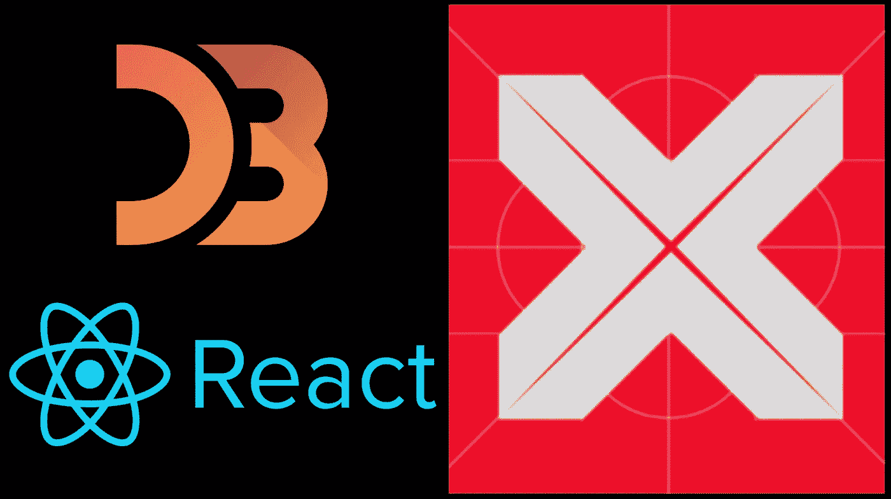
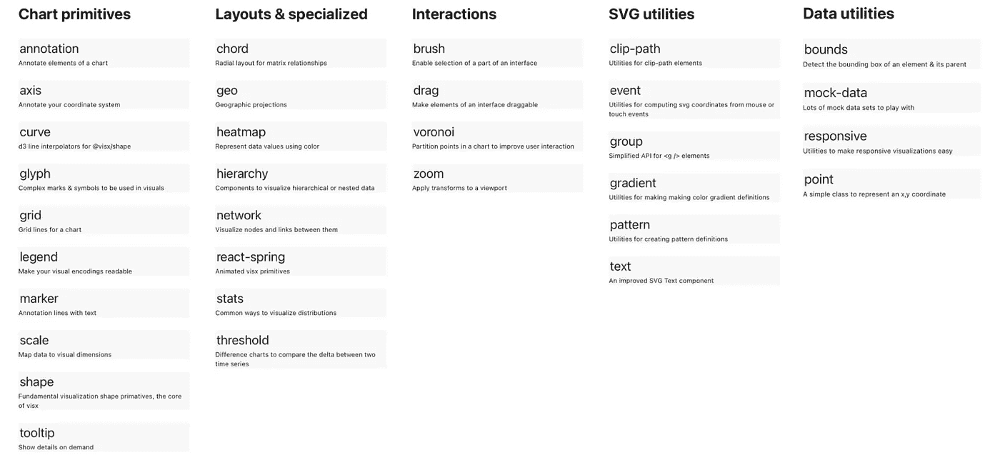
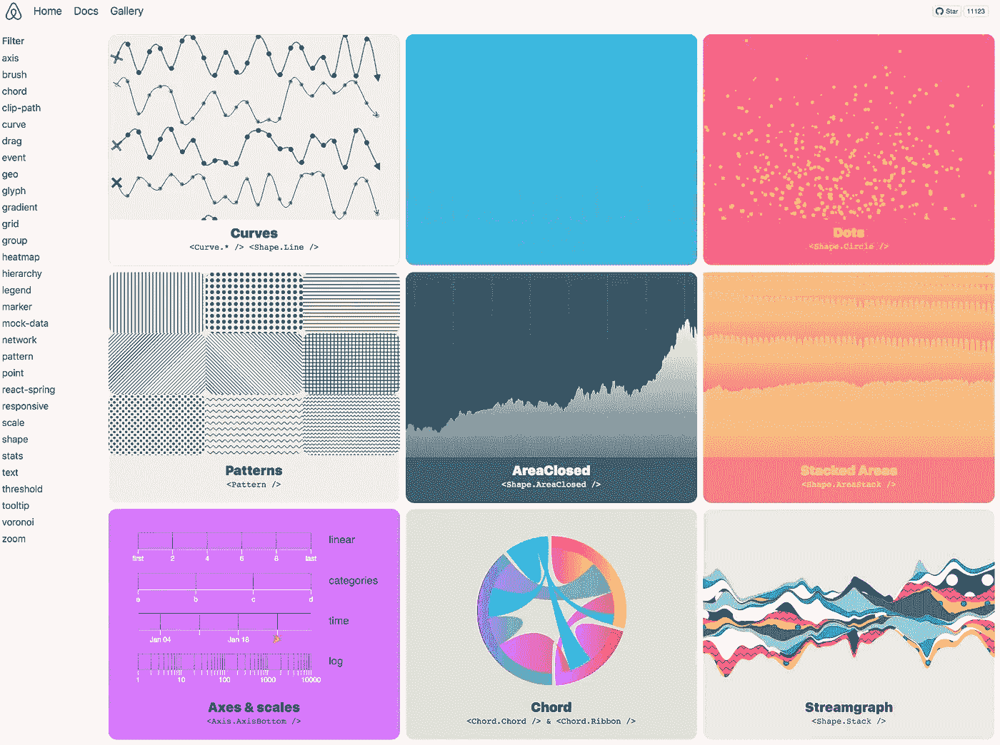
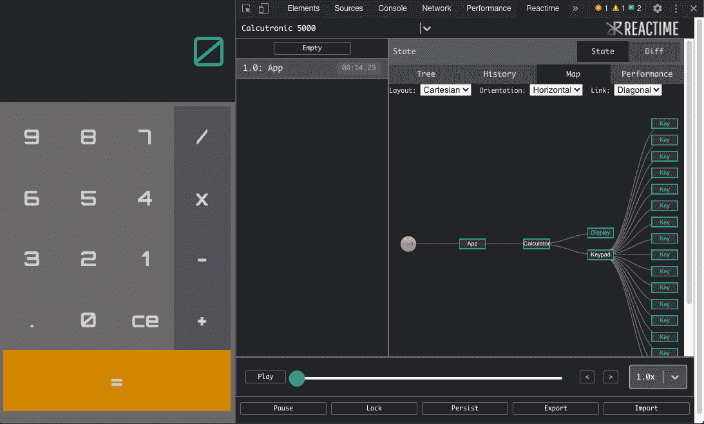
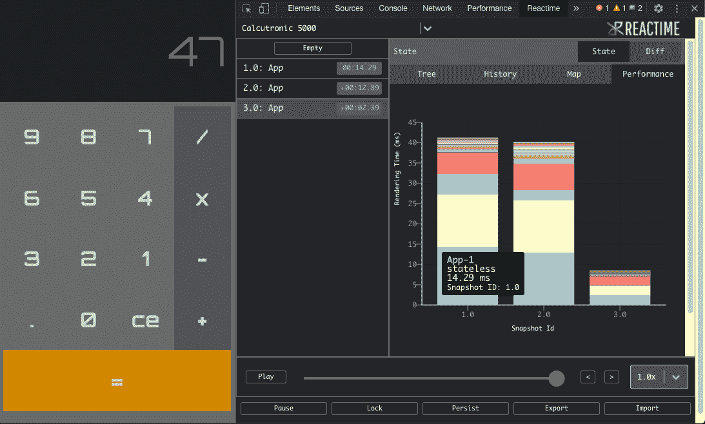
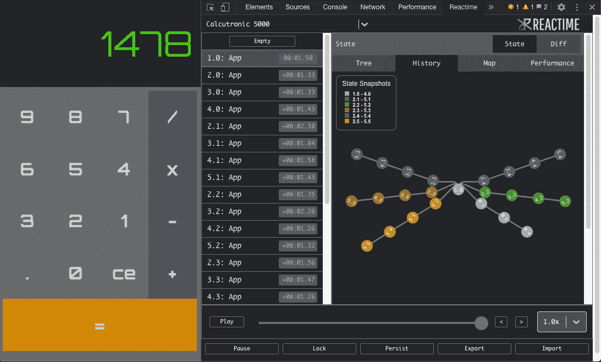

# visx:React 中可视化数据的简单解决方案

> 原文：<https://betterprogramming.pub/visx-an-easy-solution-to-visualizing-data-in-react-e94c67b7025b>

## Airbnb 的一个新的开源项目

作者照片。

# **问题**

创建优秀的应用程序绝非易事。有许多关键问题驱动和支撑着开发，比如应用程序如何最好地向用户传递有意义的信息。

在开发 [Reactime](https://github.com/open-source-labs/reactime) ，一个开源的 React 状态调试工具时，我们的工程团队面临着同样的问题。该应用程序最初构建于 D3.js 之上，这是一个流行的可视化库。然而，我们看到了增强用户体验和更好地将数据融入环境的机会。

# **输入 visx**

可视化组件的简称， [visx](https://airbnb.io/visx/docs) 由 Airbnb 开发，2020 年 9 月 22 日发布。Visx 是 Airbnb 的解决方案，由几个低级别的独立包组成，用于使用 React 构建灵活的视觉界面。这些包可以混合在一起使用，以适应您能想到的任何用例，并呈现漂亮的可视化数据。

就好像 D3 和 React 生了个宝宝，嘣，visx 就出生了。

可在 visx 上使用[的封装。](https://airbnb.io/visx/docs)

## **我们为什么选择 visx**

鉴于我们的部署时间表和 Chris William 令人信服的 visx 案例，D3.js 的替代方案是一个简单的选择，原因如下:

1.  学习曲线——与其他可视化库不同，visx 构建时考虑了 React。它使用所有相同的标准 API 和熟悉的模式，如 JSX 组件和道具钻探。这使得任何前端开发人员(无论是入门级还是中级)都更容易学习和实现。
2.  文档——作为开发人员，我们都经历过梳理文档的恐惧，以及将枯燥的文本提取为您需要的准确答案的挑战。visx 的[文档](https://airbnb.io/visx/docs)却不是这样，它们平易近人，并有高质量的沙盒示例支持。
3.  沙盒示例—每个可视化都需要一个定义的数据形状，以便按预期显示，此后开发人员必须将传入的数据结构化为该形状。这本身就是一个艰苦的过程。然而，沙盒示例用模拟数据和样板文件简化了这个过程。然后，人们可以根据这一点对他们的确切需求进行建模，并减少开发时间。
4.  动态调整大小——我们的项目是一个显示在浏览器窗口中的 Chrome 扩展，它有多种大小。因此，visx 通过包装可视化组件的*父级大小的*容器简化了动态渲染和响应。它将最大尺寸传递到可视化工具中以进行适当的缩放。
5.  TypeScript——因为 visx 是用 TypeScript 重写的，所以这个集合很容易与我们的代码库集成，同时确保我们的应用程序中的类型安全。

[visx 画廊](https://airbnb.io/visx/gallery)

## **我们如何实施 visx**

*   链接类型**—map 选项卡创建目标应用程序的完整分层可视化，显示所有组件关系。该组件有一个内置特性，允许用户更改定制显示的方向、布局和节点链接。**

****

*   **堆叠条形图—以前，性能选项卡使用圆形包装来显示组件关系和相关渲染时间。然而，洞察仅限于单个快照，无法显示任何渲染趋势。通过使用 visx 堆栈条形图，每个快照都会随其组件的呈现时间动态呈现，因此会随着状态的变化显示一段时间内的性能。**

****

*   **图例—当用户“时间旅行”到以前的快照时，“历史”选项卡会创建新的分支。visx legend 无缝地动态渲染新的分支，并用各种颜色将快照置于上下文中。**

****

# ****最终要点****

*   **文档易于理解，并通过清晰的包描述进行组织。Airbnb 团队提供的例子使得解析和实现的任务不那么令人生畏。**
*   **整个代码库都是用 TypeScript 编写的，以显著提高类型安全性和我们作为开发人员的体验。**
*   **我们只导入了渲染可视化组件所需的包。通过这样做，我们消除了技术债务，使我们的应用程序保持轻量级。**
*   **通过沙盒环境可以很容易地得到所有的例子。**

**如果你想了解 visx 是如何在开源项目中实现的，请查看 [Reactime](https://reactime.io/) 。**

***特别感谢 Reactime 团队:Chris Guizzetti、Sanjay Lavingia、Vincent Nguyen、Jason Victor 和 Alexander Landeros。***