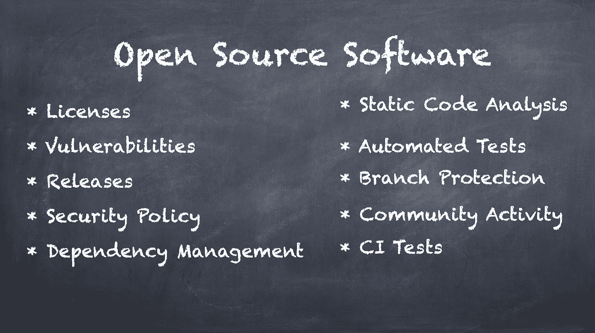
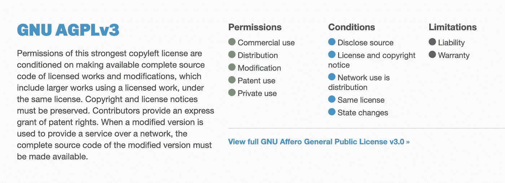
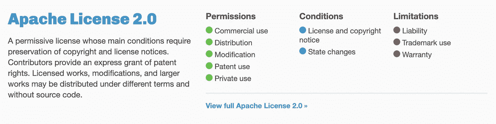
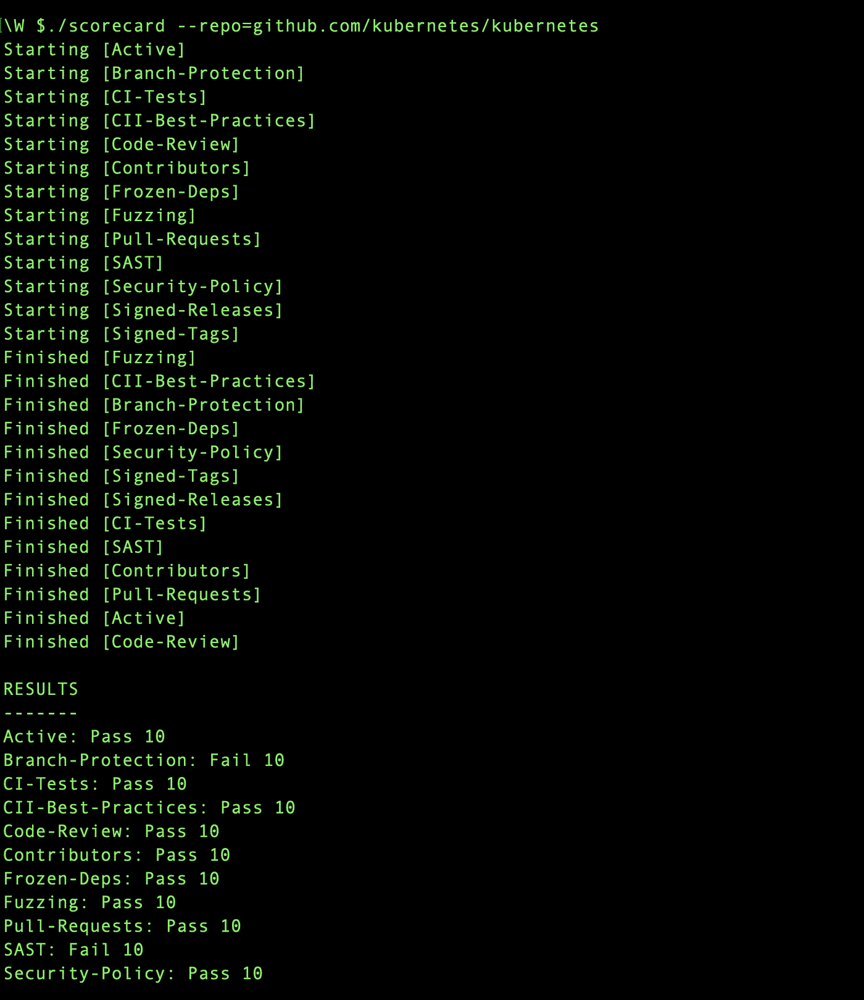
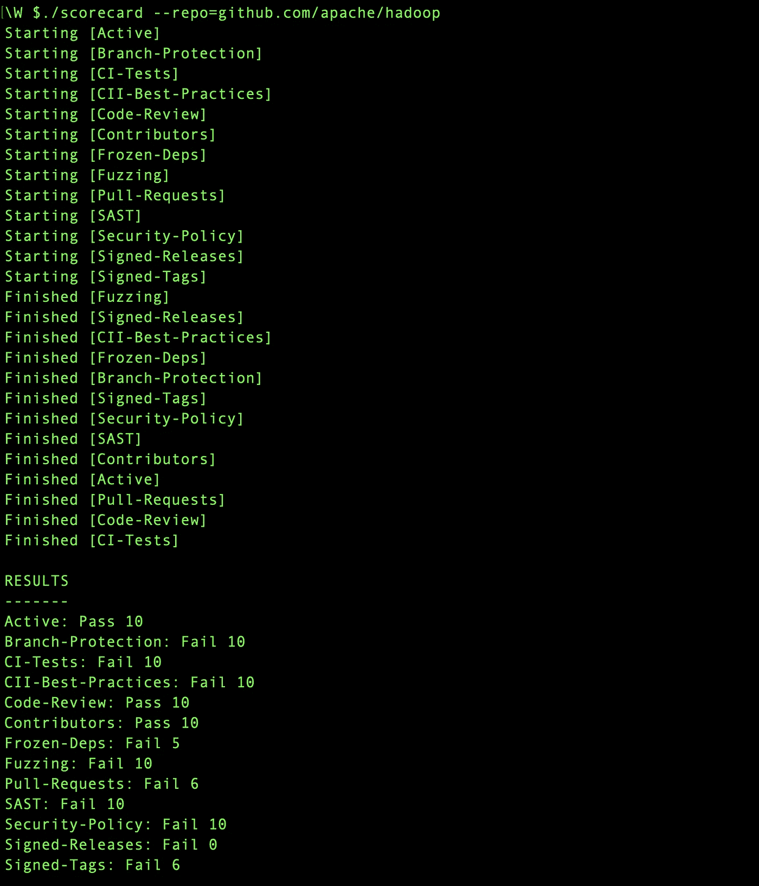

# 使用开源项目前需要检查的重要事项

> 原文：<https://betterprogramming.pub/vital-things-to-check-before-using-an-open-source-project-35b7d099f6d5>

## 尤其是对企业而言



图片来源—作者

开源已经席卷了软件世界很久了。许多公司不仅使用开源项目，还回馈社区。开放技术世界每天都在发展。我们无法想象没有一些项目的软件世界，比如 Linux、Postgres SQL、Hadoop、Kubernetes、Cassandra、Python、Tensorflow 等等——这个列表是无止境的。

在企业世界中，了解开源项目是如何被使用的是至关重要的。这些原因包括:

*   一些开源项目可能有一个不允许你商业发布你的软件的许可证
*   一些开源项目许可证可能只允许你在商业上使用它，当你开放所有的源代码时
*   一些开源项目可能只由一个组织的开发人员维护
*   一些开源项目可能会使用一些存在安全漏洞的依赖项
*   一些开源项目可能没有遵循 DevOps 最佳实践
*   还有更多

在这篇文章中，我将讨论在使用一个开源项目之前你应该检查的所有事情，以及一些可以帮助你识别这些问题的工具。

# 许可证合规性

如今，人们在他们的开源项目中使用了许多许可证。例如:

*   [Apache 许可证 2.0](https://choosealicense.com/licenses/apache-2.0/)
*   [Mozilla 公共许可证 2.0](https://choosealicense.com/licenses/mpl-2.0/)
*   [麻省理工学院执照](https://choosealicense.com/licenses/mit/)
*   [GNU AGPLv3](https://choosealicense.com/licenses/agpl-3.0/)
*   [GNU LGPLv3](https://choosealicense.com/licenses/lgpl-3.0/)
*   [Boost 软件许可证 1.0](https://choosealicense.com/licenses/bsl-1.0/)

即使在企业环境中，一些许可证的使用也更加开放——如 Apache License 2.0——而其他许可证如 AGPLv3、LGPLv3 等。，可能会要求你透露消息来源。



agpl v3—[https://choosealicense.com/licenses/](https://choosealicense.com/licenses/)



Apache 许可证 2.0—[https://choosealicense.com/licenses/](https://choosealicense.com/licenses/)

当您是企业的一部分时，手动检查每个项目中使用的每个库的许可是不可行的。

在这种情况下，使用像商业服务 [WhiteSource](https://www.whitesourcesoftware.com/) 或开源工具 [LicenseFinder](https://github.com/pivotal/LicenseFinder) 这样的工具来检测许可证并根据用户定义的许可证列表进行验证是很重要的。

通过这种方式，您可以检查并标记由于许可合规性问题而不应使用的库。

# 安全漏洞

除了许可证，了解正在使用的库是否有已知的漏洞也很重要。您可以使用以下各种服务来自动检测漏洞:

*   [商业服务白源](https://www.whitesourcesoftware.com/)
*   [GitHub 咨询](https://github.com/advisories)
*   [dependent bot](https://dependabot.com/)，自动为易受攻击的依赖项创建拉请求
*   等等。

# OSSF 安全记分卡

谷歌在开源安全基金会(OpenSSF)下开源了一个项目——[记分卡](https://github.com/ossf/scorecard)，该项目扫描各种项目的代码库，并标记各种主题上的不符合性。

该项目询问开源项目的 GitHub 位置，运行扫描，并创建报告。

它检查各种重要的东西:

*   项目有安全策略吗？
*   项目是否有来自至少两个不同组织的参与者？
*   项目是否声明并冻结依赖项？
*   该项目是否提供签名版本？
*   项目有好的 CI 测试吗？
*   项目在合并前有代码审查过程吗？
*   项目使用模糊工具吗？
*   项目使用代码质量扫描工具吗？

该工具易于下载、安装，并且您已经准备好使用扫描。我扫描了一些流行的开源项目，如 Kubernetes、Hadoop 等。，结果如下:



Kubernetes 记分卡



Apache Hadoop —记分卡

# 集装箱图像扫描

如果您已经通过 Docker images 使用了一个开源项目，那么进行图像扫描来识别漏洞也是很重要的。

我之前写过一篇关于使用 Trivy 做这件事的文章。下面是详细的文章:

[](https://medium.com/better-programming/integrating-docker-container-scans-in-ci-builds-991a94b9132b) [## 在 CI 构建中集成 Docker 容器扫描

### 我们将使用 Trivy——一个简单而全面的容器漏洞扫描器，适用于 CI

medium.com](https://medium.com/better-programming/integrating-docker-container-scans-in-ci-builds-991a94b9132b) 

如果你知道关于这个主题的任何其他最佳实践，请随时在评论中告诉我。

感谢您的阅读！

```
Hey, if you enjoyed this story, check out [Medium Membership](https://deshpandetanmay.medium.com/membership)! Just $5/month!*Your membership fee directly supports me and other writers you read. You’ll also get full access to every story on Medium.*
```