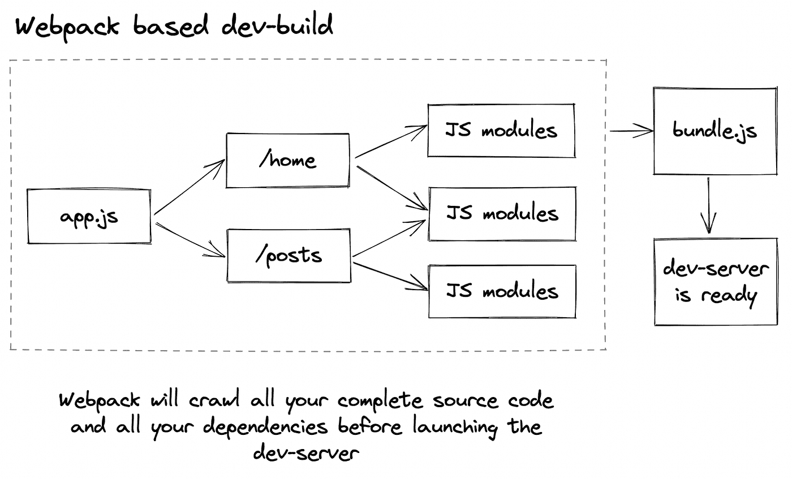
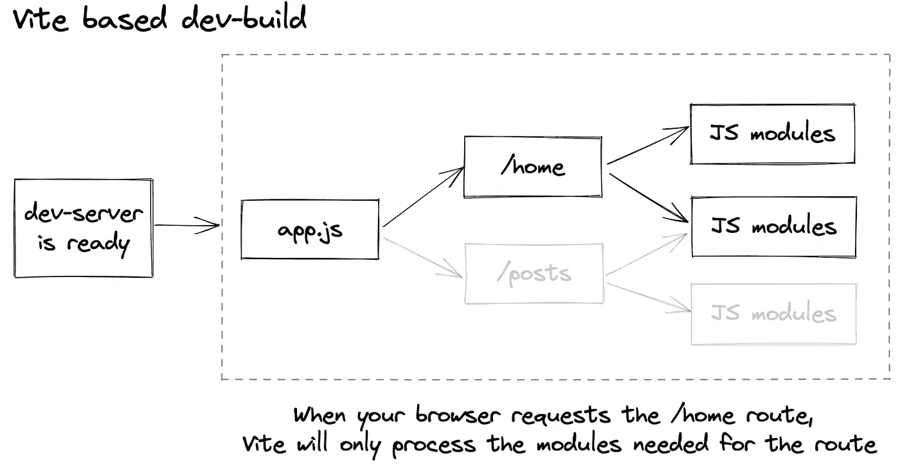

# Vite 与 web pack——在引擎盖下

> 原文：<https://betterprogramming.pub/vite-vs-webpack-3286e188aaae>

## 帮助您降低编译时间的深入指南


照片由[阿诺德·弗朗西斯卡](https://unsplash.com/@clark_fransa?utm_source=medium&utm_medium=referral)在 [Unsplash](https://unsplash.com?utm_source=medium&utm_medium=referral) 拍摄

你的编译时间有多长？你能狂饮《星球大战》三部曲直到它结束吗——我正看着你呢，网络包？还是毫秒内完成？遇见: [Vite](https://vitejs.dev/) 。

# 我们为什么要编译？

网站可以很简单。HTML、CSS 和 Javascript 是您启动和运行所需的全部工具，但是一旦您开始构建真正的应用程序和企业应用程序，还需要其他工具。

后端的 React、Vue 或 Angular 之类的工具，作为 CSS 处理器的 SASS，可能是 TypeScript 而不是普通的 JavaScript。这些是现代开发团队最常用的工具。

问题是…浏览器不知道 React、SASS 或 Typescript 是什么。它不关心任何不是 HTML、CSS 和 JavaScript 的东西。

> 编译器翻译你的 React，SASS，Typescript 等等。JS、CSS 和 Html，这样你的浏览器就可以使用这些代码。

# 我们如何编译？

编译器使用捆绑器将多个 JavaScript 文件合并成一个可以在浏览器中运行的文件。这个包将包含运行应用程序所需的全部源代码和所有导入的依赖项。

为了使用你的花哨 SASS，我们需要加载器将其直接翻译成 CSS。

Webpack、Rollup 和 Vite 等工具使这些事情成为可能。

# Vite 是什么？

[Vite](https://vitejs.dev/guide/) (这是法语，意思是“快”)，是由 [Vue](https://vuejs.org/) 的创建者和维护者尤雨溪创建的，它提供了一个完整的框架不可知捆绑器，编译速度提高了 10 到 100 倍，内置了近乎实时的热重新加载功能，给开发者带来了惊人的体验。

这是通过利用浏览器本地 ESM 支持实现的，类似于 [snowpack](https://www.snowpack.dev/) 和`[preact/wmr](https://github.com/preactjs/wmr)`。您的应用程序模块将被分为依赖项和源代码。

*   依赖关系不经常变化，所以和[https://github.com/evanw/esbuild](https://github.com/evanw/esbuild)(一个用 Go 写的 JavaScript bundler)预捆绑；除非依赖关系发生变化，否则这种情况只会发生一次
*   在您使用源代码时，源代码会发生多次变化，它将被转换为浏览器本机 ESM (Ecma-Script-Modules ),其中浏览器只加载当前页面所需的文件

# 引擎盖下的网络包



因为 Webpack 是一个基于 bundler 的构建工具，它必须抓取、处理和连接整个 JavaScript 文件来交付您的应用程序。这适用于您的应用程序代码和您的依赖项。

当您保存文件时，整个 JavaScript 包将由 Webpack 重新构建，这就是为什么即使打开了 HMR，更改也可能需要 10 秒钟才能显示在浏览器中。由于 Webpack 的延迟反馈循环，处理大量 JavaScript 应用程序将导致糟糕的开发人员体验。

# 请到车下



像 Webpack 这样的基于 bundler 的工作流必须在单个浏览器请求之前处理整个 JavaScript 模块，而 Vite 只在单个浏览器请求之前处理依赖模块。

# Vite 的捆绑产品版本

虽然现在所有主流浏览器都支持原生 ES 模块，但是提供实现性能优化技术(如树抖动、延迟加载和公共块分割)的捆绑应用仍然比非捆绑应用具有更好的整体性能。

出于这个原因，Vite 附带了一个预配置的`build`命令，该命令使用 [Rollup](http://rollupjs.org/) 捆绑您的应用程序。Vite 还为您提供了一个合理的默认汇总配置[，您可以在需要时定制](https://vitejs.dev/guide/build.html#customizing-the-build)。

# 如何使用它

> 像大多数前端开发人员一样，我们使用 Webpack 和 Rollup 来构建基于 JavaScript 的 web 应用程序。一旦我们达到一定的项目规模(超过 500 个模块)，在浏览器中检查变更就成了一件痛苦的事情。使用 Create React 应用程序，我们的启动时间明显超过了 20 秒。我们切换到 Vite 作为我们的开发服务器，现在享受 20 倍的加载速度。了解更多有关我们迈向更好的开发人员体验之旅的信息。

Sipgate | [来源](https://www.sipgate.de/blog/how-we-set-up-vite-dev-server)

replit | [来源](https://twitter.com/amasad/status/1355379680275128321?ref_src=twsrc%5Etfw%7Ctwcamp%5Etweetembed%7Ctwterm%5E1355379680275128321%7Ctwgr%5E%7Ctwcon%5Es1_c10&ref_url=https%3A%2F%2Fwww.sipgate.de%2F%3Fp%3D30276)

# 意识到

没有什么是完美的，即使是 Vite 也有你需要注意的地方。

## Vite dev 服务器没有内置的类型检查

问题:

Vite 使用 [esbuild](https://esbuild.github.io/) 将 Typescript 编译成 Javascript。遗憾的是，Eslint 并不关心类型，在编译时也不会做任何类型检查。

解决方案:

*   利用 EsLint(甚至可以添加预推送/预提交 git 挂钩)
*   添加 [ViteTypeCheck](https://github.com/fi3ework/vite-plugin-checker) 插件

## 您必须更新您的 TypeScript 接口导入

如果您像其他人一样使用了 TypeScript 接口的通用默认导入:

```
import SomeInterface from '@/types/SomeInterface'
```

您需要在 import 语句后显式设置`type`:

```
import type SomeInterface from '@/types/SomeInterface'
```

# “快:呃”编译时间的其他选择

Vite 并不意味着适合每一个用例。正如尤雨溪自己所说:

> “完全取代 webpack 并不是 Vite 的目标。可能有一些现有 webpack 项目所依赖的少量特性/功能在 Vite 中不存在，但这些特性在长尾中，只有少数编写定制 webpack 配置的高级用户需要。这里的一些评论者可能属于这个群体。
> 
> 如果您这样做了(例如，您试图迁移并发现了障碍，或者评估并得出结论 Vite 不适合您的需求)，请务必使用 webpack！你并不是 Vite 设计的目标受众——你绝对应该为这项工作选择合适的工具。 *—* [*来源*](https://news.ycombinator.com/item?id=26972400)

所以，万一你有一个不太适合 Vite 的项目；以下是其他解决方案的列表:

*   更新您的 webpack 或 CRA(创建-反应-应用程序)配置
*   考虑用 esbuild 替换 Babel/TS；您甚至可以用`[esbuild-loader](<https://github.com/privatenumber/esbuild-loader>)`将 eslint 添加到 webpack 中，并在编译`[fork-ts-checker-webpack-plugin](<https://github.com/TypeStrong/fork-ts-checker-webpack-plugin#readme>)`时进行类型检查，这很方便； [Marcin Wosinek](https://hashnode.com/@marcin-wosinek) 甚至写了一篇[如何使用 esbuild-loder 加速 webpack 的指南](https://how-to.dev/how-to-speed-up-webpack-with-esbuild-loader)。

# 结论

[与传统捆绑器相比，Vite](https://vitejs.dev/) 将开发人员的体验和编译时间提高了 10-100 倍。这不是靠魔法完成的。这是通过使用现代语言的现代标准实现的。

你应该为遗留项目使用 Vite 吗？如果可能，为什么不呢？检查需求，如果不是很合适，检查上面的其他解决方案。

你应该为一个新项目使用 Vite 吗？当你想学习 react 时，可以坚持使用 create-react-app，这样你就可以先学习 React，然后再学习 Bundlers😉。

# 来源

*   📄[了解比较:Webpack vs ViteJS](https://radixweb.com/blog/webpack-vs-vitejs-comparison)
*   📄[Vite 比 Webpack 好吗？](https://blog.bitsrc.io/vite-is-better-than-webpack-d5dd59610d56)
*   📄[移过 Webpack！我们如何设置 Vite(一个更快的开发服务器)](https://www.sipgate.de/blog/how-we-set-up-vite-dev-server)
*   📄[Vite 是 Webpack 的黑仔吗？](/is-vite-the-killer-of-webpack-a515d9e77a4)
*   📄[为什么我们从 Webpack 转向 Vite](https://blog.replit.com/vite)
*   📄[我们的 Vite 之旅以及我们为何回归 Webpack](/our-journey-with-vite-and-why-we-turned-back-to-webpack-b9a84ba7a223)
*   📄[【AskJS】Vite 比用 Create React App 好吗？](https://www.reddit.com/r/javascript/comments/u8m6c8/askjs_is_vite_better_than_using_create_react_app/)
*   📄 [ELI5:为什么 Vite 比 Webpack 快那么多？](https://www.reddit.com/r/vuejs/comments/r0fbfw/eli5_why_is_vite_so_much_faster_than_webpack/)