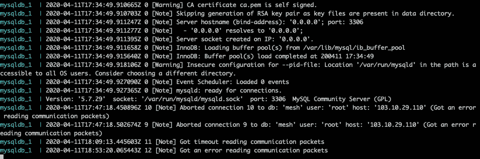

# MySQL Docker 中的卷和日志

> 原文：<https://betterprogramming.pub/volumes-and-logs-in-mysql-docker-61122f8c1d84>

## *学习设置数据和配置卷以及检查 MySQL Docker 容器的日志*


图片由 [PickPik](https://www.pickpik.com/closeup-photography-brown-wooden-yearly-paper-88087) 拍摄

如果你在一个 Docker 容器中运行 MySQL，那么两件事非常重要:卷和日志。在本文中，我们将详细讨论它们。

# **卷**

卷是保存 Docker 容器生成和使用的数据的首选机制。

对于 MySQL Docker 容器，有两个重要因素:数据和配置文件。为数据和配置准备好容量是非常重要的，这样无论 MySQL 容器发生任何变化或灾难，您的数据和配置文件都是安全的。让我们看看如何设置它。

首先，创建一个目录`docker`，我们将在其中保存我们的`docker-compose.yml`文件。然后，在这个目录中创建两个目录，`data`和`config`。在这里，我们将分别保存数据和配置文件。

```
mkdir docker
cd docker
mkdir data config
```

让我们回到`docker`目录，并创建一个`docker-compose.yml`文件。写下以下内容:

如果您注意到这个文件的卷部分，我们有一个我们系统的映射本地目录，它是我们刚才用容器中的数据目录和配置文件创建的。为了更清楚地说明这一点，首先看一下 volumes 部分的第一行。

```
- "./config/my.conf:/etc/mysql/conf.d/config-file.cnf"
```

分号的右边是配置文件的默认位置，MySWL 容器的`config-file.cnf`、*、*——我们用分号左边指定的本地文件对其进行映射。因此文件`./config/my.conf` 现在将成为激活的配置文件。我们可以根据您的意愿更改 MySWL 容器的配置。现在，我将在位于`./config`目录的`my.conf`文件中包含以下内容:

```
[mysqld]
bind-address            = 0.0.0.0
max_connections         = 505
max_user_connections    = 500
```

现在，让我们看看卷部分的第二行:

```
- "./data:/var/lib/mysql:rw"
```

所以 MySQL 表和其他表的所有数据都驻留在容器内的`/var/lib/mysql`处。我们将它与本地目录`./data`进行映射，因此我们可以控制数据。`:rw`也被指定为提供对容器的这个目录的读写访问。

拥有数据卷为我们提供了更改 MySQL 版本的数据安全性和灵活性，并且它还可以在灾难发生时保护数据。这一点非常重要。

现在，如果我们用下面的命令运行这个容器，我们将得到一个功能齐全的 MySQL 容器，其中映射了卷。

```
docker-compose up -d
```

# **日志**

在 Docker 容器上运行 MySQL 时，另一个需要注意的重要事情是日志。

日志为我们提供了 MySQL 容器内部正在发生的事情的详细概述，并且它们是调试可能出现的问题的很好的工具。访问 Docker 容器的日志非常容易。检查日志的一般语法是:

```
docker-compose logs [options] [SERVICE...]Options:
    --no-color          Produce monochrome output.
    -f, --follow        Follow log output.
    -t, --timestamps    Show timestamps.
    --tail="all"        Number of lines to show from the end of the    logs each container.
```

在我们的例子中，我们可以使用下面的命令来查看我们刚刚创建的 MySQL 容器的日志:

```
docker-compose logs -f mysqldb
```

为了理解这一点，MySQL 服务的名称是`mysqldb`，我使用的是选项`-f`，所以当我查看它时，日志会跟随最近的变化。你也可以尝试探索其他的选择。这个命令应该会给出如下内容:



嗯，这会给你任何和所有的信息，警告，错误等。相信我，它们会证明非常有用。我想我们已经到了尽头。希望这有用。感谢阅读。