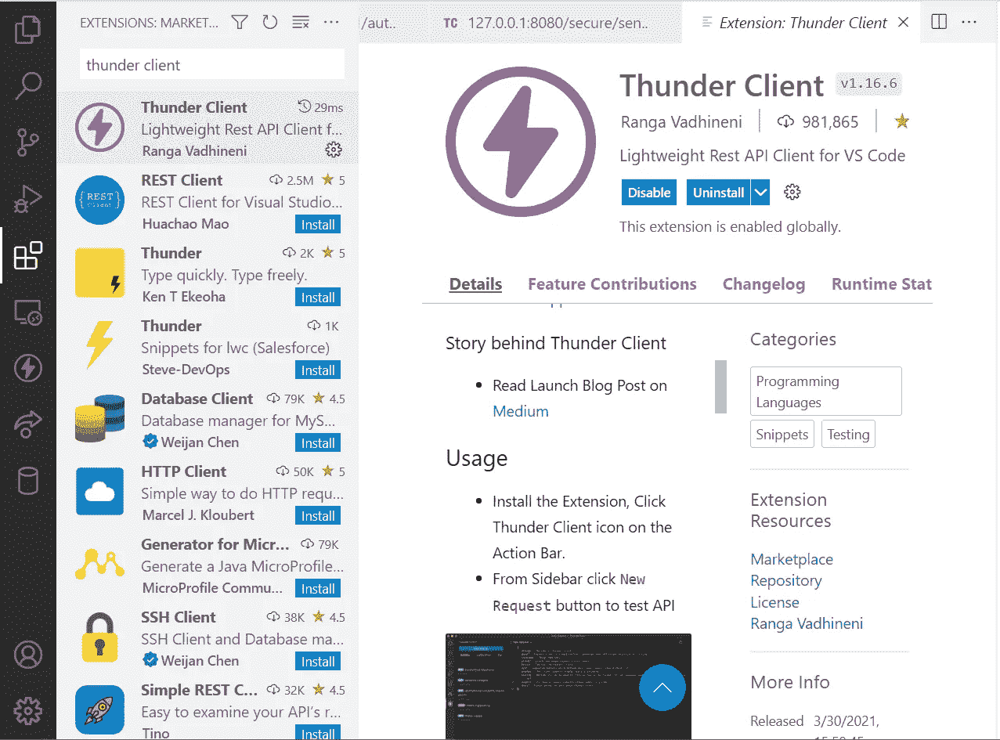
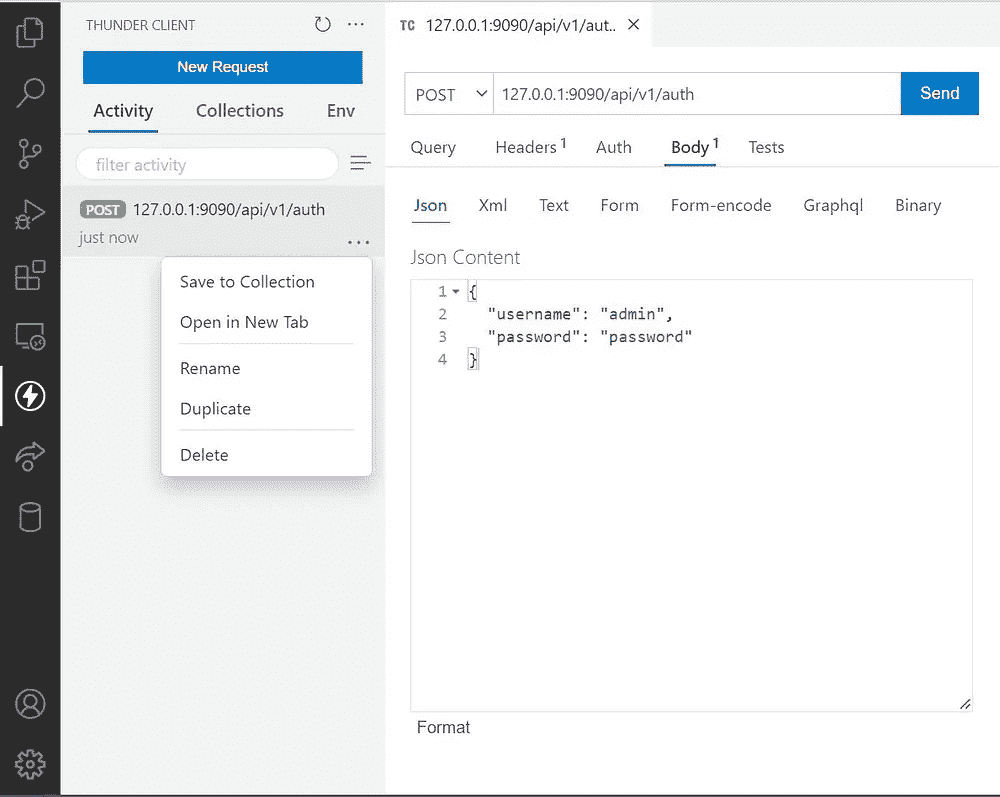
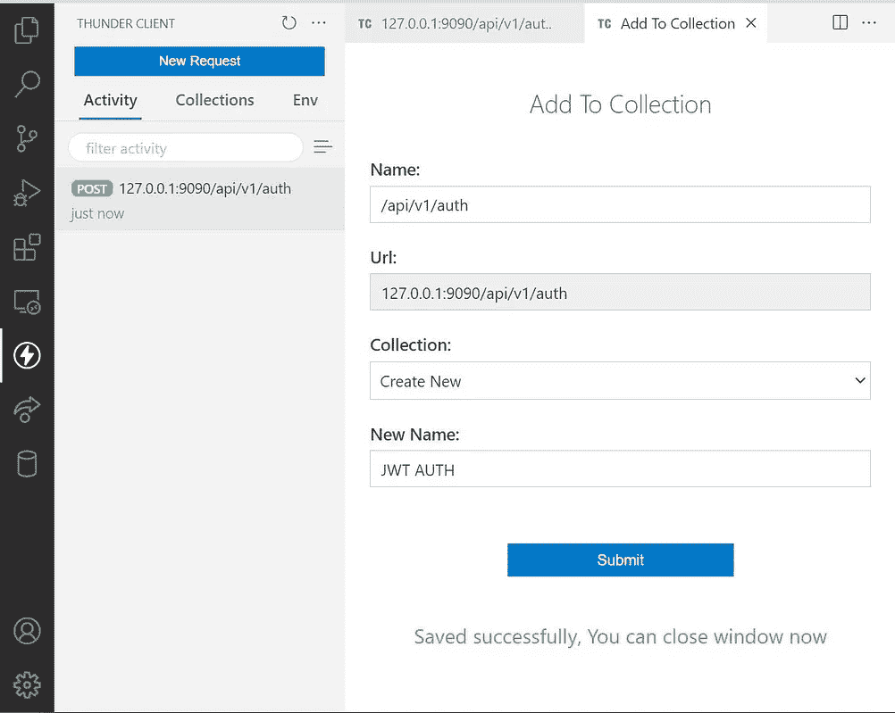
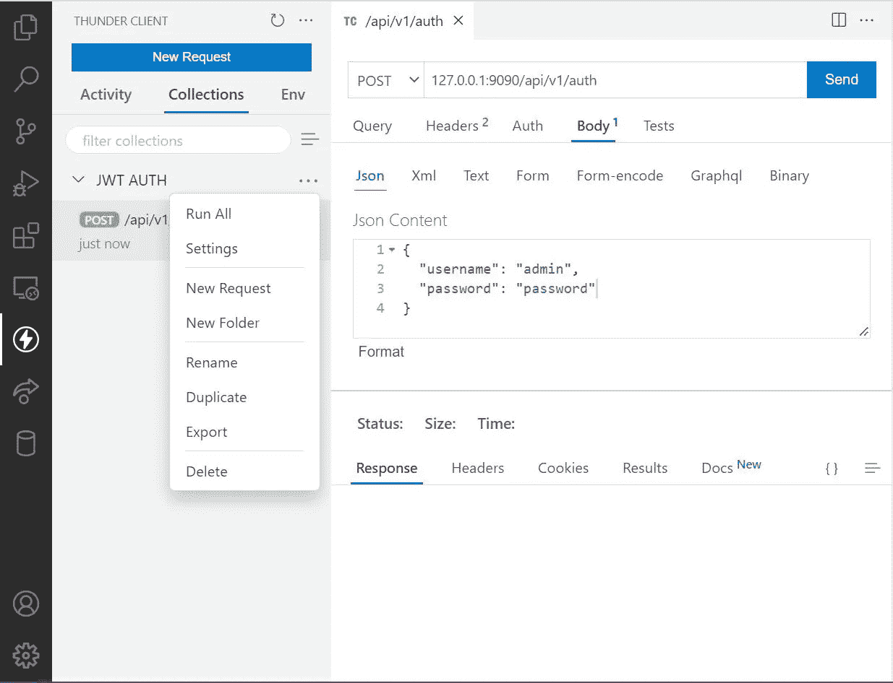

# 为你的 API 使用迅雷客户端 VS 代码扩展

> 原文：<https://betterprogramming.pub/vs-code-awesome-tools-thunder-client-extension-for-you-apis-f2e6a3671c3b>

## 用 *VS 代码*吗？你是否生产或消费*原料药*？我想答案是肯定的



迅雷客户端安装。

使用 Thunder Client，您可以在不离开代码编辑器的情况下测试 API。您可以保存您的请求的集合，并在您想要执行测试的任何时候返回，比如一天或一个月之后，此外，您可以将集合导出到您的项目中作为 json 文件，以便与其他人或您将来共享。

Thunder Client 是一款针对 Visual Studio 代码的轻量级 Rest API 客户端扩展，由 Ranga Vadhineni 手工打造，设计简洁明了。

## 新请求

要使用该扩展，请单击操作栏上的 Thunder Client 图标。在侧边栏中，单击新请求按钮来测试 API。

将您的 API 信息提供给 Thunder 客户端请求表单。在这种情况下，我们有以下信息:

```
url: 127.0.0.1:9090/api/v1/auth
method: POST
content: {
  "username": "admin",
  "password": "password"
}
```


API 请求已创建并启动。

## 生成代码片段

您可以生成 Curl 命令、JavaScript Axios 和您选择的任何其他可用选项。

由迅雷客户端生成的 JWT 授权请求的 Curl 命令代码:

```
curl -X POST \
  '127.0.0.1:9090/api/v1/auth' \
  --header 'Accept: */*' \
  --header 'Content-Type: application/json' \
  --data '{
  "username": "admin",
  "password": "password"
}'
```

由迅雷客户端生成的 JWT 授权请求的 JavaScript Axios 代码:

```
import axios from "axios";let headersList = {
 "Accept": "*/*",
 "Content-Type": "application/json" 
}let bodyContent = JSON.stringify({
  "username": "admin",
  "password": "password"
});let reqOptions = {
  url: "127.0.0.1:9090/api/v1/auth",
  method: "POST",
  headers: headersList,
  data: bodyContent,
}axios.request(reqOptions).then(function (response) {
  console.log(response.data);
})
```

## 迅雷客户端中的收藏

通过收藏，您可以组织和保存您的工作，您可以为您正在处理的每个项目创建一个收藏。

我们之前看到的请求在活动下，在您使用该工具一段时间后，您会发现这个地方很杂乱。此外，找到您需要发射的请求也非常具有挑战性，因此我们有集合。

让我们将请求保存到集合中；



单击 Save to Collection，填写表单，您就有了一个新的收藏。

在“收藏”下，您会发现新创建的收藏。您可以导出收藏，如下所示；



以下是导出收藏的内容；

```
{
  "client": "Thunder Client",
  "collectionName": "JWT AUTH",
  "dateExported": "2022-07-07T08:42:22.385Z",
  "version": "1.1",
  "folders": [],
  "requests": [
    {
      "_id": "bb64bbab-2718-44a2-b705-7a81e550e93e",
      "colId": "a3248937-608b-4496-ac4c-aaf53e9e3722",
      "containerId": "",
      "name": "/api/v1/auth",
      "url": "127.0.0.1:9090/api/v1/auth",
      "method": "POST",
      "sortNum": 10000,
      "created": "2022-07-07T08:36:11.145Z",
      "modified": "2022-07-07T08:36:11.145Z",
      "headers": [],
      "params": [],
      "body": {
        "type": "json",
        "raw": "{\n  \"username\": \"admin\",\n  \"password\": \"password\"\n}",
        "form": []
      },
      "tests": []
    }
  ]
}
```

## 导入卷曲

Curl import 将在 Thunder Client 中漂亮地创建一个请求，您可以使用 format 按钮格式化 JSON 或 XML 内容(如果有的话)来完成它。

从 Jasmin SMS 网关导入的示例

```
curl -X POST \
  '[http://127.0.0.1:8080/secure/send'](http://127.0.0.1:8080/secure/send') \
  --header 'Accept: */*' \
  --header 'Authorization: Basic Zm9vOmJhcg==' \
  --header 'Content-Type: application/json' \
  --data '{
  "to": 19012233451,
  "from": "Jookies",
  "content": "Hello",
  "dlr": "yes",
  "dlr-url": "[http://192.168.202.54/dlr_receiver.php](http://192.168.202.54/dlr_receiver.php)",
  "dlr-level": 3
}'
```

> *注意:我使用了来自* [*原始源*](https://docs.jasminsms.com/en/latest/apis/rest/index.html#send-a-single-message) *的 curl 请求，并且 json 主体被放置在文本下，我必须剪切粘贴它到 json 下并在那里格式化它。我将深入研究的内容…*

最后，既然你使用 VS 代码，让我再问一次这个永无止境的问题；你更喜欢黑暗模式主题吗？还是更喜欢灯光模式主题？我猜答案是肯定的！