# VS Web 开发效率的代码扩展

> 原文：<https://betterprogramming.pub/vs-code-extension-for-web-dev-productivity-fa541654161f>

## 让您在编辑器中的体验丰富多彩、流畅而强大

照片由[扬西·敏](https://unsplash.com/@yancymin?utm_source=medium&utm_medium=referral)在 [Unsplash](https://unsplash.com?utm_source=medium&utm_medium=referral) 上拍摄

在开始之前，先看看你能不能回答这个问题: [Visual Studio 代码](https://code.visualstudio.com/)和 [Visual Studio](https://visualstudio.microsoft.com/) 有什么区别？

对于那些还不知道的人来说，Visual Studio 是一个功能齐全且方便的开发环境。

VS Code 是一个开源的、跨平台的源代码编辑器，它已经很出名了，尤其是在 web 开发社区。它速度快，可扩展，可定制，并有大量的功能。

我用 VS 代码已经很久了。作为一个全栈开发者，我尝试过很多扩展。这篇文章将涵盖那些对我帮助很大的，我希望也能帮助你。

# 使代码易于阅读和维护

[**括号对上色器 2**](https://marketplace.visualstudio.com/items?itemName=CoenraadS.bracket-pair-colorizer-2) **:** 允许用颜色识别匹配的括号。

括号对

[**缩进彩虹**](https://marketplace.visualstudio.com/items?itemName=oderwat.indent-rainbow) **:** 为文本前的缩进着色，每一步交替四种不同的颜色。

缩进彩虹

前两个扩展将为您的编辑器增添色彩，并使代码块易于理解和赏心悦目。一旦你习惯了它们，没有它们，VS 代码会感觉索然无味。

[**AutoClose 标签**](https://marketplace.visualstudio.com/items?itemName=formulahendry.auto-close-tag) **和** [**自动重命名标签**](https://marketplace.visualstudio.com/items?itemName=formulahendry.auto-rename-tag) **:** 任何一个 web 开发者都感受到了键入标签的痛苦。我们需要一个工具，可以快速方便地生成标签及其子标签。

当您键入标签的开始部分时，AutoClose 会生成标签的结束部分。使用自动重命名，当您更改一个标签时，相应的结束标签会自动更改。

自动关闭标签

自动重命名标签

[**缩进器**](https://marketplace.visualstudio.com/items?itemName=SirTori.indenticator) **:** 直观突出显示当前缩进深度。当代码很长时很有帮助。

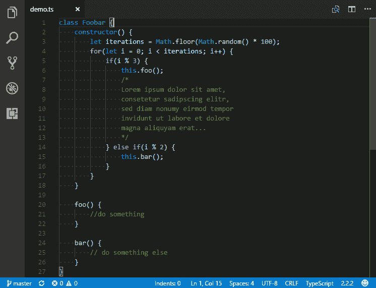

[**VS 代码图标**](https://marketplace.visualstudio.com/items?itemName=vscode-icons-team.vscode-icons) **:** 图标让你的编辑器更有吸引力。

[**德古拉**](https://marketplace.visualstudio.com/items?itemName=dracula-theme.theme-dracula) **:** 这是一个我用了很久还很爱用的题材。

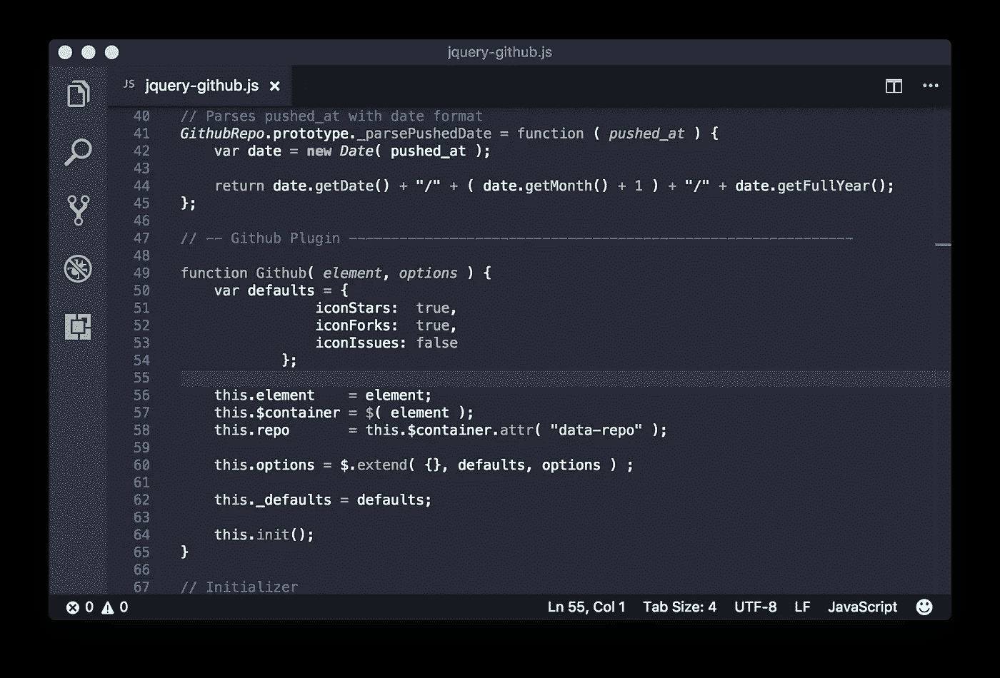

[**更漂亮**](https://marketplace.visualstudio.com/items?itemName=esbenp.prettier-vscode) **:** 通过解析你的代码并按照它自己的规则重新打印它来强制执行一致的风格。更漂亮地考虑了最大行长度，并在必要时换行。安装它，亲眼看看它的神奇之处。

[**路径智能感知**](https://marketplace.visualstudio.com/items?itemName=christian-kohler.path-intellisense) **:** 这个扩展最擅长自动补全文件名。

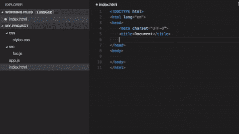

[**ESLint**](https://marketplace.visualstudio.com/items?itemName=dbaeumer.vscode-eslint) 或[**ts lint**](https://marketplace.visualstudio.com/items?itemName=ms-vscode.vscode-typescript-tslint-plugin)**:**这些代码检查工具是让代码更加一致，避免 bug 的必备工具。

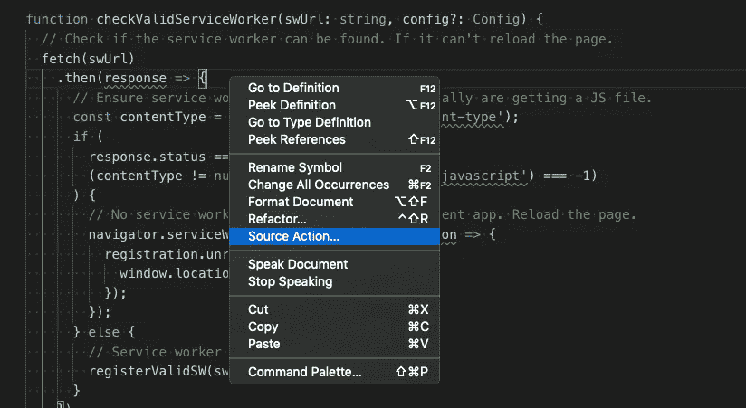

# 常规操作

[**代码拼写检查器**](https://marketplace.visualstudio.com/items?itemName=streetsidesoftware.code-spell-checker) **:** 一个基本的拼写检查器，适用于驼峰式代码。强烈推荐。

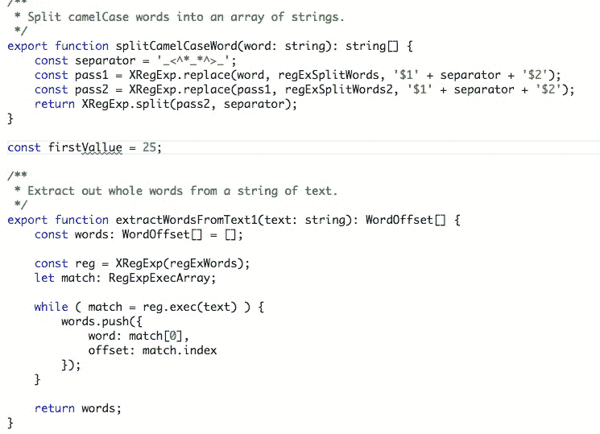

[**改变大小写**](https://marketplace.visualstudio.com/items?itemName=wmaurer.change-case) **:** 改变当前选择或当前单词的大小写。

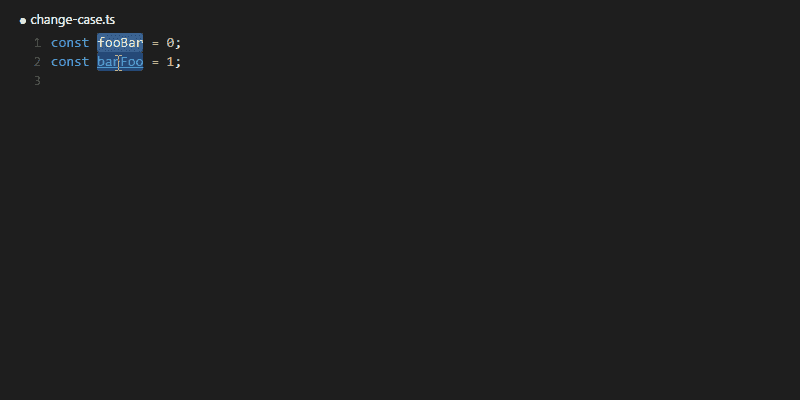

[**正则表达式预览器**](https://marketplace.visualstudio.com/items?itemName=chrmarti.regex) **:** 在并列文档中显示当前正则表达式匹配，通常是在添加验证检查时。

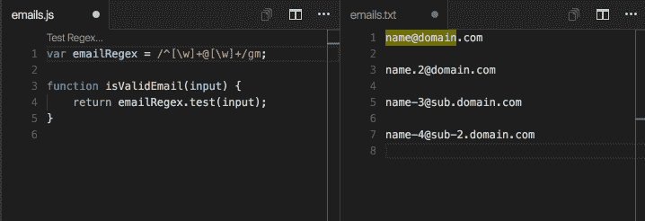

[**部分差异**](https://marketplace.visualstudio.com/items?itemName=ryu1kn.partial-diff) **:** 允许您比较一个文件内、不同文件间或剪贴板上的`diff`文本选择。

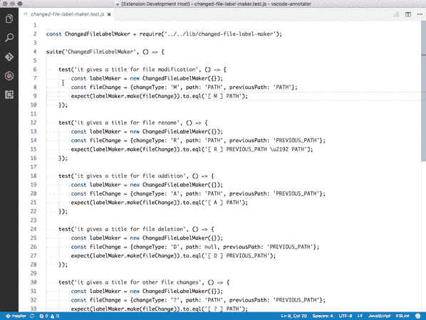

[**带行号复制**](https://marketplace.visualstudio.com/items?itemName=yassh.copy-with-line-numbers) **:** 带行号和文件路径复制选中的行。这对于结对编程或者任何时候你需要你的队友帮助的时候都很有用，让他们直接找到代码很容易。它在编写文档时也很有用。

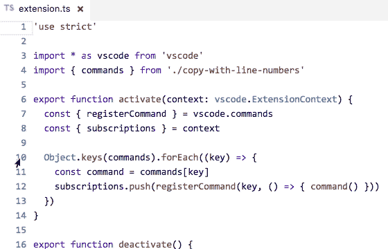

[**粘贴图像**](https://marketplace.visualstudio.com/items?itemName=mushan.vscode-paste-image) **:** 将剪贴板中的图像直接粘贴到 [Markdown](https://daringfireball.net/projects/markdown/) 、 [AsciiDoc](http://asciidoc.org/) 或其他文件中。我在 Git `README`文件中使用它，或者在 Markdown 中编写任何文档。

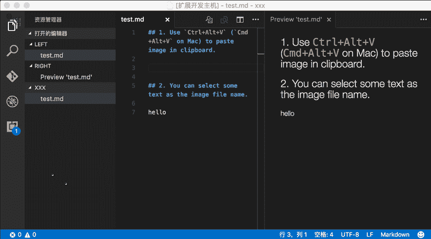

[**TinyPNG**](https://marketplace.visualstudio.com/items?itemName=andi1984.tinypng)**:**一个非常有用的通过无损压缩来压缩 jpg 和 PNG 图像的扩展。

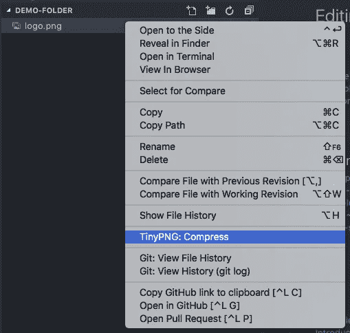

[**Polacode**](https://marketplace.visualstudio.com/items?itemName=pnp.polacode)**:**有助于为您的代码片段创建精美的截图。这就像安装扩展、旋转它并将代码复制粘贴到 Polacode 中一样简单。然后就可以下载成图片了。我喜欢这个扩展。

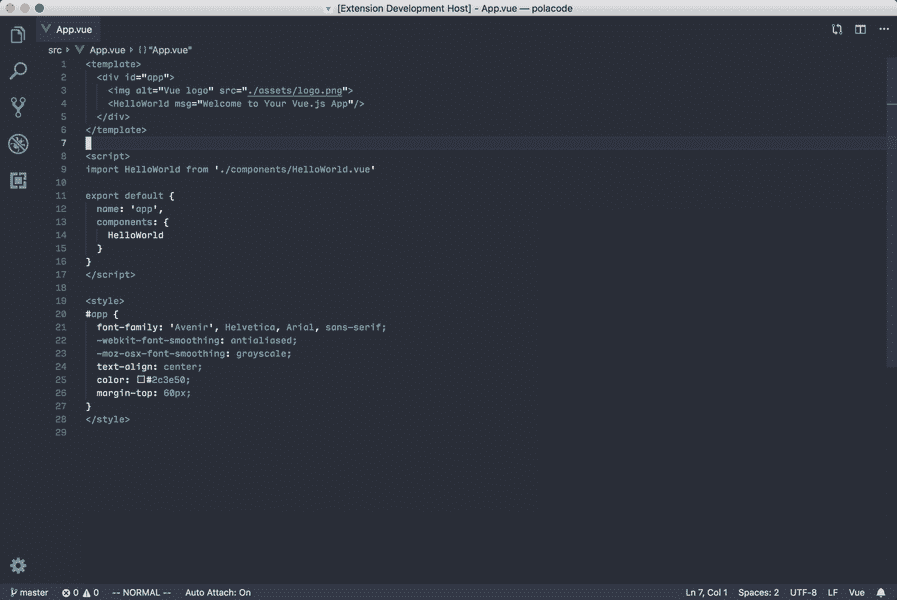

# **调试**

[**Turbo console . log**](https://marketplace.visualstudio.com/items?itemName=ChakrounAnas.turbo-console-log)**:**这个扩展通过自动化编写有意义的日志消息的操作，使调试变得更加容易。

[**Chrome 调试器**](https://marketplace.visualstudio.com/items?itemName=msjsdiag.debugger-for-chrome) **:** 在谷歌 Chrome 浏览器中调试你的 JavaScript。

# **版本控制**

[**Git Lens**](https://marketplace.visualstudio.com/items?itemName=eamodio.gitlens)**:**Git Lens 增强了 Visual Studio 代码中内置的 Git 功能。它包含了数量惊人的功能，例如通过 code lens 显示的作者身份、提交搜索、历史和 GitLens explorer。如果你用 Git 做任何工作，你应该安装这个插件。

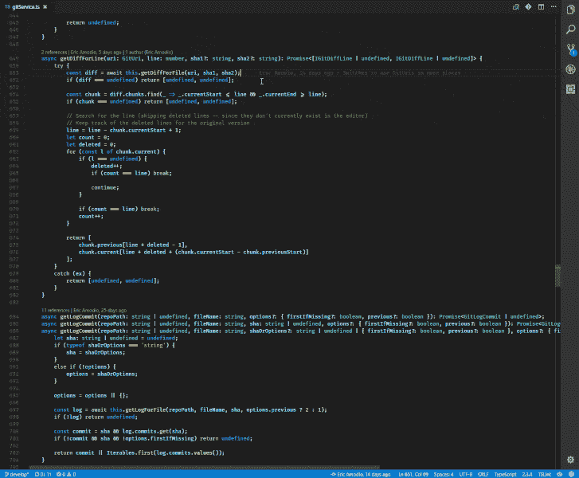

GitLens 的类似扩展:

*   [Git History](https://marketplace.visualstudio.com/items?itemName=donjayamanne.githistory) :显示提交历史的漂亮图形以及更多内容。
*   [检查点](https://marketplace.visualstudio.com/items?itemName=micnil.vscode-checkpoints):在提交之间保存一个本地的短期工作历史。
*   [Git 责备](https://marketplace.visualstudio.com/items?itemName=waderyan.gitblame):让您在状态栏中看到当前选中行的 Git 责备信息。GitLens 也提供了类似的功能。
*   Git 指示器:让你看到受影响的文件以及在状态栏中增加或删除了多少行。
*   [在 GitHub/bit bucket/git lab/visual studio . com 中打开](https://marketplace.visualstudio.com/items?itemName=ziyasal.vscode-open-in-github):使您能够用一个命令在浏览器中打开 repo。

[**版本镜头**](https://marketplace.visualstudio.com/items?itemName=pflannery.vscode-versionlens) **:** 显示 [Visual Studio 代码](https://github.com/microsoft/vscode)编辑器中 [npm](https://www.npmjs.com/) 、 [jspm](https://www.npmjs.com/package/jspm) 、 [DUB](https://code.dlang.org/) 和 [Dotnet Core](https://dotnet.microsoft.com/download/dotnet-core) 的包版本信息。

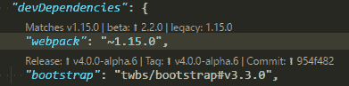

# 降价销售

[**Markdown 快捷键**](https://marketplace.visualstudio.com/items?itemName=mdickin.markdown-shortcuts) **:** 编辑 Markdown 的快捷键。我用它来放`README`文件。

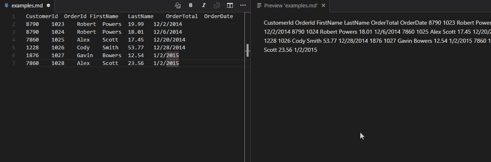

[**Markdown 预览增强**](https://marketplace.visualstudio.com/items?itemName=shd101wyy.markdown-preview-enhanced) **:** 这个实时预览扩展允许您在编辑时查看 Markdown 文件。

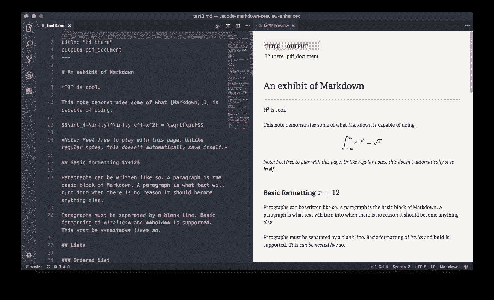

# **测量生产率**

[**WakaTime**](https://marketplace.visualstudio.com/items?itemName=WakaTime.vscode-wakatime) 或[**Code Time**](https://marketplace.visualstudio.com/items?itemName=softwaredotcom.swdc-vscode)**:**从您的编程活动中自动生成的度量、洞察和时间跟踪。

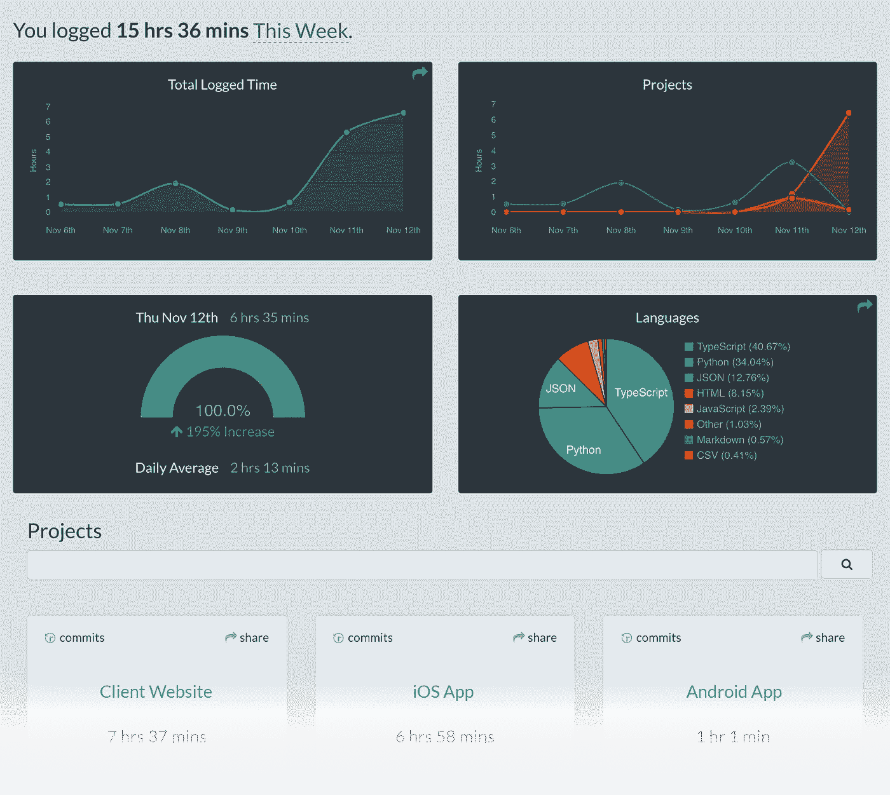

瓦卡提时间

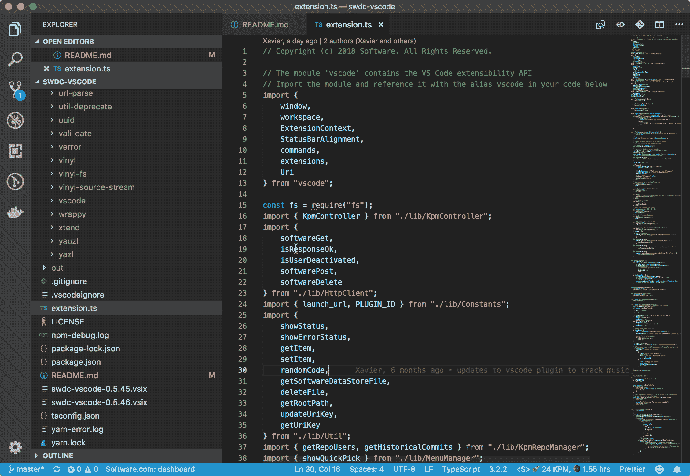

代码时间扩展

# **其他**

[**设置同步**](https://marketplace.visualstudio.com/items?itemName=Shan.code-settings-sync) **:** 允许你将你在 VS 代码上定制的几乎所有东西同步到 Github，从设置，到键盘快捷键，到其他 VS Code 扩展。您可以从任何想要编程的设备上访问您喜欢的 IDE，而不必在新设备上从普通的 VS 代码环境中编程，也不必再次手动设置一切。

[**项目管理器**](https://marketplace.visualstudio.com/items?itemName=alefragnani.project-manager) **:** 允许你直接从 VS 代码窗口打开一个新的目标为 Git 库的窗口。基本上，您现在可以打开另一个存储库，而不必离开 VS 代码。

[**quokka . js**](https://marketplace.visualstudio.com/items?itemName=WallabyJs.quokka-vscode)**:**在您键入代码时立即运行您的代码，并在您的代码编辑器中显示各种执行结果。你自己试试。

[**待办事项荧光笔**](https://marketplace.visualstudio.com/items?itemName=wayou.vscode-todo-highlight) **:** 有时你会忘记在将代码发布到生产环境之前检查你在编码时添加的待办事项。很长一段时间以来，我一直想要一个扩展来突出它们，并提醒我还有笔记或事情没有完成。

[**导入成本**](https://marketplace.visualstudio.com/items?itemName=wix.vscode-import-cost) **:** 该扩展将内嵌显示导入包的大小。它利用`[webpack](https://webpack.js.org/)`和`[babili-webpack-plugin](https://www.npmjs.com/package/babili-webpack-plugin)`来检测尺寸。

[**REST 客户端**](https://marketplace.visualstudio.com/items?itemName=humao.rest-client) **:** REST 客户端允许你发送 HTTP 请求，直接在 Visual Studio 代码中查看响应。

[**Live Server**](https://marketplace.visualstudio.com/items?itemName=ritwickdey.LiveServer)**:**启动一个本地开发服务器，从编辑器内部为静态和动态页面进行实时重新加载。

[**代码运行器**](https://marketplace.visualstudio.com/items?itemName=formulahendry.code-runner) **:** 在 VS 代码内部运行你的代码；支持大多数编程语言。

[**实时共享**](https://marketplace.visualstudio.com/items?itemName=MS-vsliveshare.vsliveshare) **:** 允许您实时共享您的工作区:实时编辑、锁定并跟随用户光标、组调试等等。如果您远程工作，或者当您需要与不在身边的人协作时，这真的很有帮助。

[**JSON to code**](https://marketplace.visualstudio.com/items?itemName=quicktype.quicktype)**:**用一个命令把你的 JSON 转换成一个在强类型语言中可用的接口。

[**远程 SSH**](https://marketplace.visualstudio.com/items?itemName=ms-vscode-remote.remote-ssh) **:** 让您使用任何带有 SSH 服务器的远程机器作为您的开发环境。这可以在各种情况下极大地简化开发和故障排除。

[**React Native/React/Redux 片段用于 es6/es7**](https://marketplace.visualstudio.com/items?itemName=EQuimper.react-native-react-redux) **:** 如果您使用 [React](https://reactjs.org/) 或 [React Native](https://facebook.github.io/react-native/) 或简单的 JavaScript，这就是您所需要的一切。

我使用哪个扩展取决于我正在做的工作；为了节省内存，我一直在启用和禁用它们。

注意:无论你需要做什么工作，都有更多的扩展可用:HTML、CSS、React、React Native、 [Node](https://nodejs.org/en/) 、Python 等。，每个都有自己的扩展集。你可以直接在[Visual Studio market place](https://marketplace.visualstudio.com/vscode)上搜索它们。

请考虑 [**在这里输入您的电子邮件**](https://goo.gl/forms/MOPINWoY7q1f1APu2) 如果您想被添加到我的电子邮件列表中，请**关注我的**[**medium**](https://medium.com/@ideepak.jsd)**阅读更多关于 javascript 的文章，并关注**[**github**](https://github.com/dg92)**查看我的疯狂代码**。如果有什么不清楚或者你想指出什么，请在下面评论。

你可能也会喜欢我的其他文章

1.  [用 Tensorflow-js 进行图像目标检测🤔](https://levelup.gitconnected.com/image-object-detection-with-tensorflow-js-b8861119ed46)
2.  [Nodejs app 结构——构建高度可扩展的架构。](https://codeburst.io/fractal-a-nodejs-app-structure-for-infinite-scale-d74dda57ee11)
3.  [Node.js 10.0.0，作为后端开发人员/安全爱好者有什么期待？](https://codeburst.io/node-js-10-0-0-what-to-expect-as-a-backend-developer-security-enthusiast-f8680f132320)
4.  [图像处理——在 React.js 中制作自定义图像滤镜](https://levelup.gitconnected.com/image-processing-making-custom-image-filters-react-js-part-2-ee2787f56b0d)
5.  [谷歌印度面试问题](https://medium.com/@ideepak.jsd/google-india-phone-call-interview-question-software-developer-5a164e97ddeb)

# 如果你喜欢这篇文章，请随意分享，以帮助他人找到它！

# **谢谢你！**