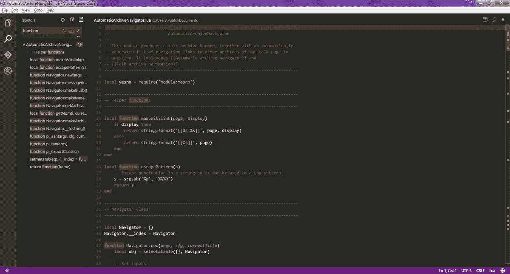
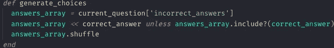
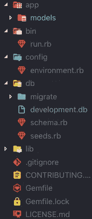
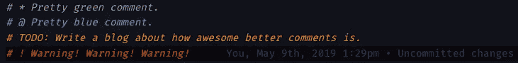
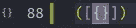
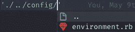
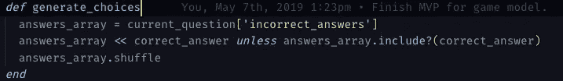

# 7 VS 代码扩展，让您的生活变得更加轻松。

> 原文：<https://betterprogramming.pub/vs-code-extensions-1da56837dd10>

## 你每天花大量的时间在代码编辑器上，投资你自己。

[来源](https://en.wikipedia.org/wiki/Visual_Studio_Code#/media/File:VS_Code_(Insiders).png)

说到 web 开发，微软的 Visual Studio 代码无处不在。根据 [StackOverflow 的 2019 年开发者调查](https://insights.stackoverflow.com/survey/2019)，超过 55%的 web 开发者使用 Visual Studio 代码。使用 [Electron.js](https://en.wikipedia.org/wiki/Electron_(software_framework)) (以前称为 Atom Shell，因为它是驱动 Atom 文本编辑器的技术)开发的 VS Code 是一个功能丰富的源代码编辑器，能够做很多事情。它的流行很大程度上可以归功于通过扩展提供的大量可定制性。下面我介绍一些我最喜欢的扩展，它们增强了 VS 代码的体验。

## 语言/框架扩展

VS 代码主要是使用 Typescript 构建的，它的编辑器支持开箱即用的 Javascript。但是，有几个语言扩展增强了这个编辑器的多功能性。一些流行的语言扩展包括 Ruby、Python、C/C++和 Java。如果你的编码语言相当流行，那么很有可能会有一个扩展。

语言扩展很棒。不仅添加了基本的特性，比如基本的代码完成和语法突出显示，还让您可以利用 VS 代码的内置调试器。这意味着您将能够设置断点，并通过查看变量值和方法调用来单步执行您的代码。

类似地，还有几个框架/库的扩展，如 React、jQuery 等。这些扩展的有用性因扩展而异，但是您可以期望找到有用的片段来帮助加速您的编码。

## 主题/图标包

《仙女座菌株》作者:埃利弗·拉拉

你将会花大量的时间来查看你的文本编辑器，最好让它看起来尽可能的漂亮。VS Code 在它的 extensions 选项卡中提供了许多主题和图标包。在搜索栏中输入`@category:themes`可以让你浏览所有的内容。很长一段时间，我一直在使用艾利弗·拉拉的[仙女座菌株。我也喜欢马蒂亚·阿斯托里诺](https://github.com/EliverLara/Andromeda)的[材质海洋高对比度主题。这两个主题都比较黑暗，Mattia Astorino 也有一个图标包](https://github.com/equinusocio/vsc-material-theme)来配合他们的主题。

材料图标主题

我最喜欢的图标包是 Philipp Kief 的[材质图标主题](https://github.com/PKief/vscode-material-icon-theme)。它支持多种文件和文件夹扩展名。我承认，多亏了 Philipp，我很少再费心去查看文件扩展名或阅读文件夹名称了。文件夹/文件图标是独一无二的，我很快就能知道我在做什么

## 炎亚纶·邦德更好的评论

用更好的评论做出更好的评论

 [## 亚伦-邦德/贝特-评论

### 在 GitHub 上创建一个帐户，为 aaron-bond/better-comments 的发展做出贡献。

github.com](https://github.com/aaron-bond/better-comments) 

如果你认为每个人都应该评论他们的代码，那么这个扩展就是为你准备的。无论是为自己还是为他人，注释都有助于使下面的代码更容易。[更好的注释](https://github.com/aaron-bond/better-comments)通过允许你用颜色编码来改进注释。这可以让您对评论进行分类，并通过颜色吸引人们的注意。就个人而言，我用绿色表示基本的注释，蓝色表示返回值，橙色表示待办事项，红色表示警告。该扩展在 settings.json 文件中是高度可配置的。Better Comments 是一个如此简单的扩展，但我每天都在使用它。

## 科恩拉德公司的括号对着色机

 [## 科恩拉德/布雷克特帕尔

### VSCode 的括号着色扩展。通过在…上创建帐户，为 CoenraadS/BracketPair 的发展做出贡献

github.com](https://github.com/CoenraadS/BracketPair) 

彩色托架和支架

另一个简单但方便的扩展。默认情况下，[括号对上色器](https://github.com/CoenraadS/BracketPair)颜色通过三种不同的颜色循环匹配用户`{}`、`[]`和`()`。这就更容易发现丢失的右括号，并查看您在方法中嵌套了多深。这个扩展也是高度可配置的，允许您添加额外的颜色，在行计数上显示括号，并突出显示匹配的括号。这是另一个容易安装和忘记的扩展。

## 德克·鲍默的《皮棉》

 [## microsoft/vscode-eslint

### VSCode 扩展，用于将 eslint 集成到 VSCode 中。为 microsoft/vscode-eslint 开发做出贡献，创建一个…

github.com](https://github.com/Microsoft/vscode-eslint) 

拥有一个 linter 可以帮助你写出干净漂亮的代码，同时也更容易被其他人阅读。快速搜索 linter，你会发现几种不同语言的 linter。这是我一直用于 Javascript 的一个，但还有其他的。

这个有用的扩展允许您将 [ESLint](https://github.com/Microsoft/vscode-eslint) 集成到 VSCode 中。你仍然需要使用`npm install eslint`或`npm install -g eslint`在本地或全球安装 ESLint。在那里，您需要创建一个配置文件。然后，您可以在 settings.json 文件中配置几个选项。

## 克里斯蒂安·科勒的路径智能感知

 [## Christian Kohler/path intellisense

### 自动完成文件名的 Visual Studio 代码插件

github.com](https://github.com/ChristianKohler/PathIntellisense) 

Tab 键完成到该文件的过程

顾名思义，当您需要链接到另一个文件或文件夹时，智能感知会添加智能自动完成功能。我使用 [Path Intellisense](https://github.com/ChristianKohler/PathIntellisense) 是因为它更快，这样我可以避免打字错误造成的错误。

## 埃里克·阿莫迪奥的 Git Lense

 [## eamodio/vscode-gitlens

### 增强内置于 Visual Studio 代码中的 Git 功能——通过 Git blame 使代码作者身份一目了然

github.com](https://github.com/eamodio/vscode-gitlens) 

Git Lense 拥有超过 1700 万的下载量，是 VS 代码中最受欢迎的扩展之一。这个扩展增强了 VS 代码的 git 集成。它允许您查看每一行代码提交的时间以及提交消息和时间。这个特性对于查看谁是最后一个编辑或编写该行代码的人非常有用。

Git Lense 还允许您直接从 VS 代码中查看您的 Git 存储库。你可以看到所有的分支机构，贡献者，你做的任何隐藏。您可以比较不同的分支，也可以比较当前分支和 VS 代码之间的差异。

## 由教师在浏览器中打开

 [## SudoKillMe/vs code-扩展-在浏览器中打开

### 在 GitHub 上创建一个帐户，为 sudo kilme/vs code-extensions-open-in-browser 开发做贡献。

github.com](https://github.com/SudoKillMe/vscode-extensions-open-in-browser) 

这是另一个简单的扩展，旨在为您节省一些时间。顾名思义，在浏览器中打开允许你在浏览器中打开一个文件。您可以点击“在浏览器中打开”或使用键盘快捷键`alt + b`在默认的网络浏览器中自动打开文件，而不是将 HTML 文件的路径复制到您的网络浏览器中。您也可以选择在非默认浏览器中打开文件。

## 键盘映射

键盘快捷键可以节省时间。能够快速执行多种功能而不需要使用鼠标是天赐之物。不幸的是，从头开始学习这些需要时间。如果您已经学习了不同文本编辑器的快捷键，您可能不想再学习这些相同功能的新快捷键。

VS 代码使得导入你的设置和键映射变得容易。微软的 [Sublime Text Keymap 和设置导入器](https://github.com/Microsoft/vscode-sublime-keybindings)、 [Atom Keymap](https://github.com/Microsoft/vscode-atom-keybindings) 和 [Notepad++ keymap](https://github.com/Microsoft/vscode-notepadplusplus-keybindings) 将允许你使用你知道和喜欢的大多数键盘快捷键。如果您使用任何其他东西，可能有一个第三方扩展已经覆盖了您。还有几个基于其他编辑器的主题，因此您可以配置代码的语法，使其看起来也一样。

— — — — — — — — — — — — — — — — — — — — — — — — — — — — — — —

编辑(2019 年 5 月 5 日):正如下面其他人评论的那样，括号对着色程序有一个新的更新版本，称为括号对着色程序 2。建议你切换到这个版本。