# 面向 Ruby on Rails 开发人员的 VS 代码扩展

> 原文：<https://betterprogramming.pub/vs-code-extensions-for-ruby-on-rails-developers-917474e03e04>

## Rails 开发人员的强大扩展


[@sejadisruptivo](https://unsplash.com/@sejadisruptivo) 在 [Unsplash](https://unsplash.com/) 上的照片。

Ruby 的构建考虑到了开发人员的快乐。然而，如果你的编辑器设置不正确，你将会经历一段痛苦的旅程。在 VS 代码中找到正确的扩展会让你走上一条漫长的试错之路。

这里列出了 Ruby on Rails 开发人员可以使用的强大扩展。

# TL；速度三角形定位法(dead reckoning)

## **红宝石**

1.  红宝石
2.  红宝石太阳图
3.  纵向
4.  ERB 助手标签
5.  Rails 数据库模式
6.  Rubocop
7.  ERB 格式化程序
8.  埃米特在 ERB

## **通用**

1.  原子黑暗主题
2.  虚拟代码-图标
3.  DotENV
4.  输出着色程序
5.  自动重命名标签
6.  突出显示匹配的标签
7.  括号对着色程序 2

# 红宝石

## 1.[红宝石](https://marketplace.visualstudio.com/items?itemName=rebornix.Ruby)

这是不言自明的。Ruby 语法突出显示。

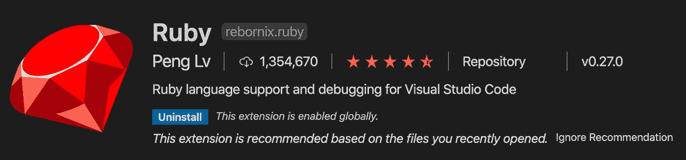

## 2.[红宝石太阳能图](https://marketplace.visualstudio.com/items?itemName=castwide.solargraph)

编写代码时的智能代码完成和文档。

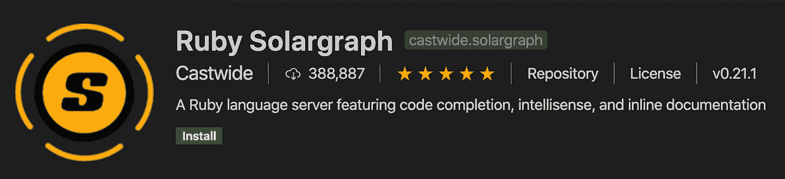

## 3.[纵向](https://marketplace.visualstudio.com/items?itemName=kaiwood.endwise)

要明智，永远不要忘记立即关闭结束。

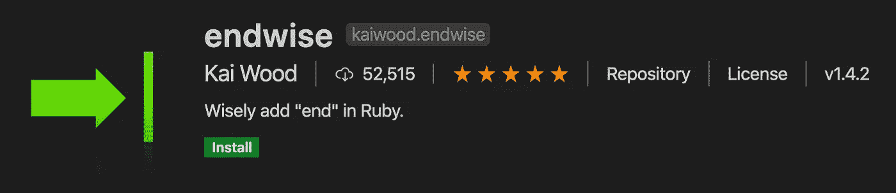

## 4. [ERB 助手标签](https://marketplace.visualstudio.com/items?itemName=rayhanw.erb-helpers)

节省您时间的有用捷径。

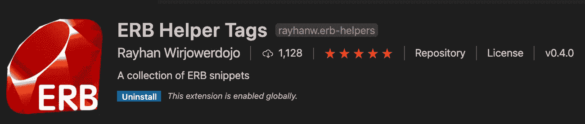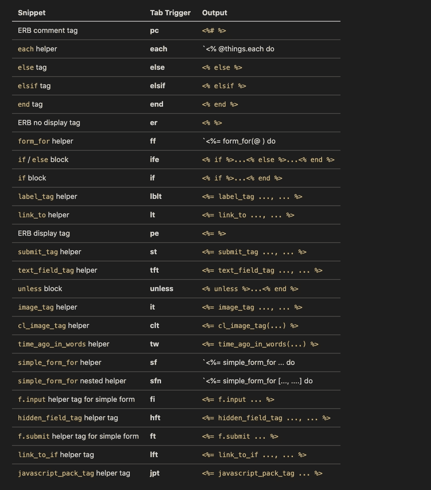

## 5. [Rails 数据库模式](https://marketplace.visualstudio.com/items?itemName=aki77.rails-db-schema)

当您键入时，快速了解已定义的数据库模式。

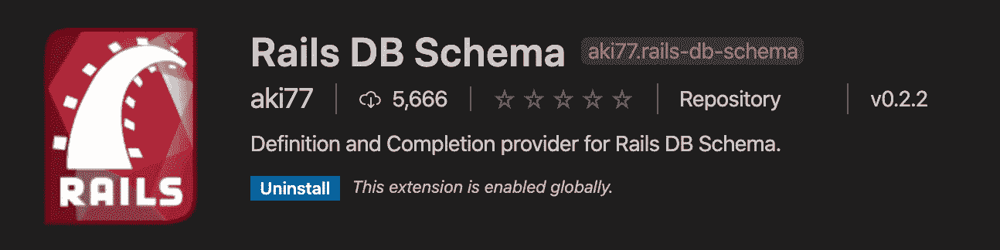

## 6.Rubocop

用于编写 Ruby 的代码格式化程序。

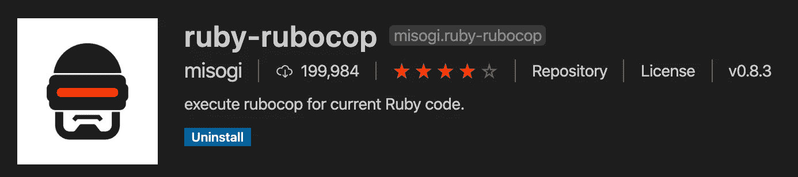

如果您遇到以下错误，请按照本指南链接正确的执行路径:

```
rubocop is not excutable 
execute path is empty!
```

## 7. [ERB 格式器/美化器](https://marketplace.visualstudio.com/items?itemName=aliariff.vscode-erb-beautify)

不能在 VS 代码中缩进你的`html.erb`文件是一件非常痛苦的事情。ERB 格式化程序依赖于`htmlbeautifier` gem，所以我们也需要安装这个依赖项。

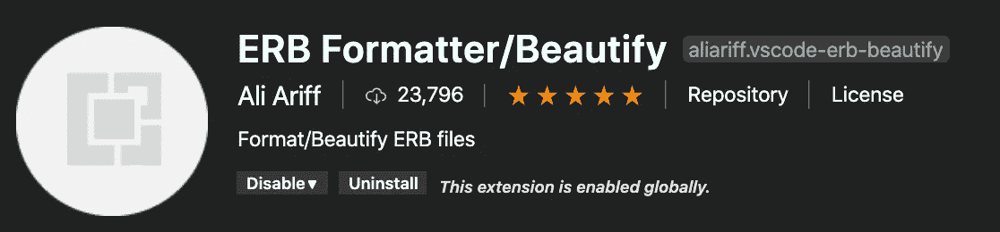

```
gem install htmlbeautifier
```

## 8.埃米特在 ERB

它不是扩展，但却是你真正想要的东西。如果你正在写`html.erb`文件，你想访问 HTML 格式的 emmet。它需要这样的设置:

# 一般

## 1.[原子一号黑暗主题](https://marketplace.visualstudio.com/items?itemName=akamud.vscode-theme-onedark)

你编辑的主题是个人选择。选择你觉得好看的，并提供有用的语法高亮。或者，检查材料主题。

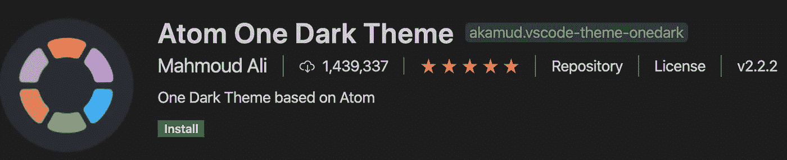

## 2. [VS 代码—图标](https://marketplace.visualstudio.com/items?itemName=vscode-icons-team.vscode-icons)

漂亮的图标使得区分文件夹和文件类型变得容易。

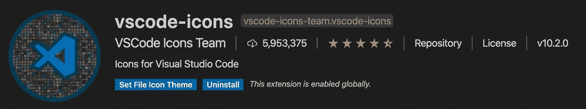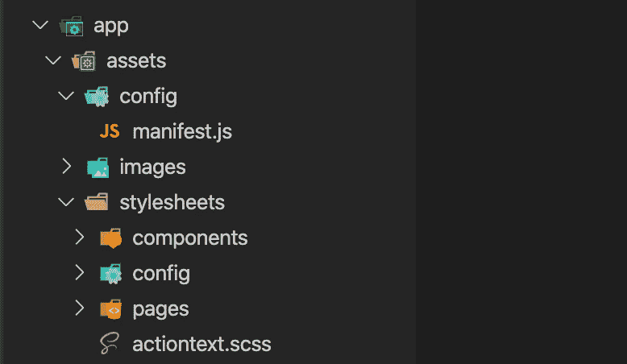

## 3. [DotENV](https://marketplace.visualstudio.com/items?itemName=mikestead.dotenv)

您的`.env`文件的语法高亮显示。

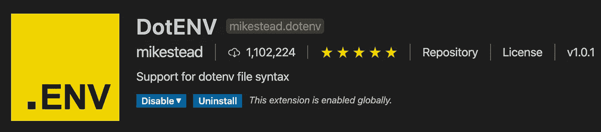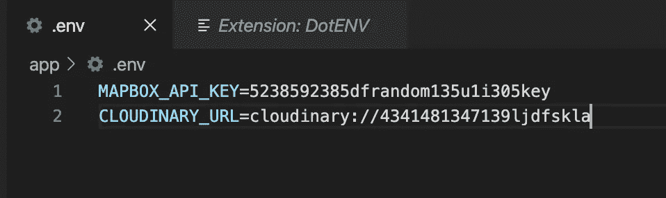

## 4.[输出上色器](https://marketplace.visualstudio.com/items?itemName=IBM.output-colorizer)

用彩色日志文件使阅读日志变得容易。

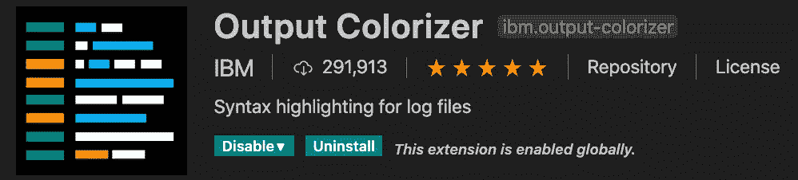

## 5.[自动重命名标签](https://marketplace.visualstudio.com/items?itemName=formulahendry.auto-rename-tag)

为自己节省 50%选择结束标签的时间。

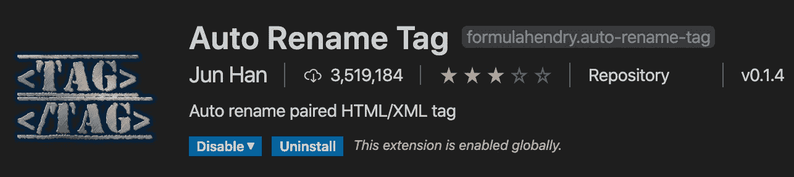

## 6.[高亮匹配标签](https://marketplace.visualstudio.com/items?itemName=vincaslt.highlight-matching-tag)

立即找出开始和结束标记。我还添加了一些可选的自定义配置，以便在选择标签时突出显示左边和右边的人字形(`< …. >`)。

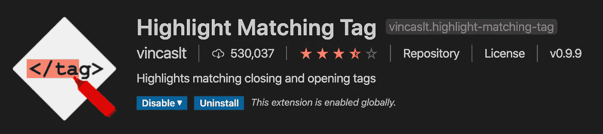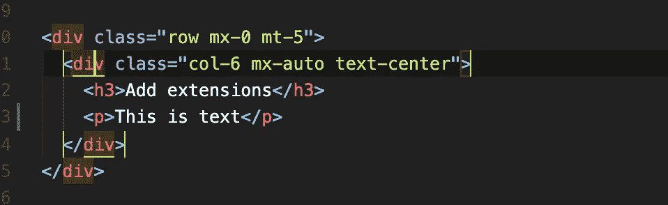

## 7.[支架对着色机 2](https://marketplace.visualstudio.com/items?itemName=CoenraadS.bracket-pair-colorizer-2)

VS 代码中详细介绍了 JavaScript 语法突出显示和格式化。根据您使用的框架，您可能还想添加其他扩展。

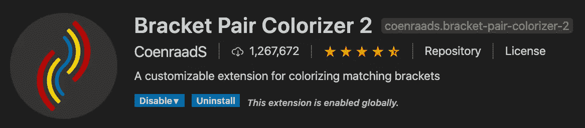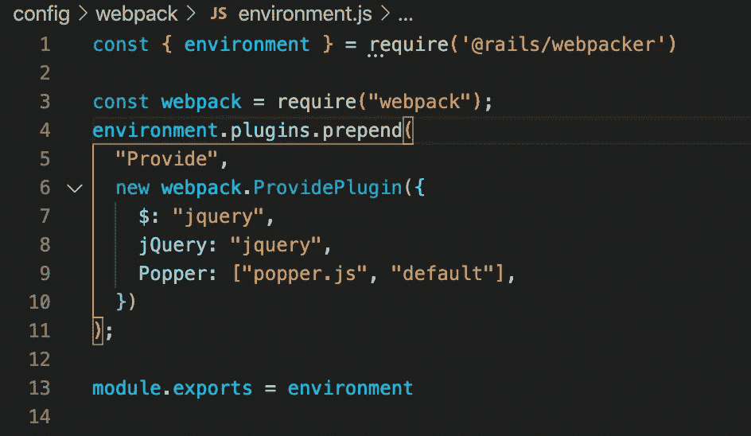

感谢阅读！