# VS 代码快捷方式编码就像你在弹钢琴

> 原文：<https://betterprogramming.pub/vs-code-shortcuts-to-code-like-youre-playing-a-piano-e5db7b272d1>

## 因为来回切换鼠标可能是你手腕的尽头

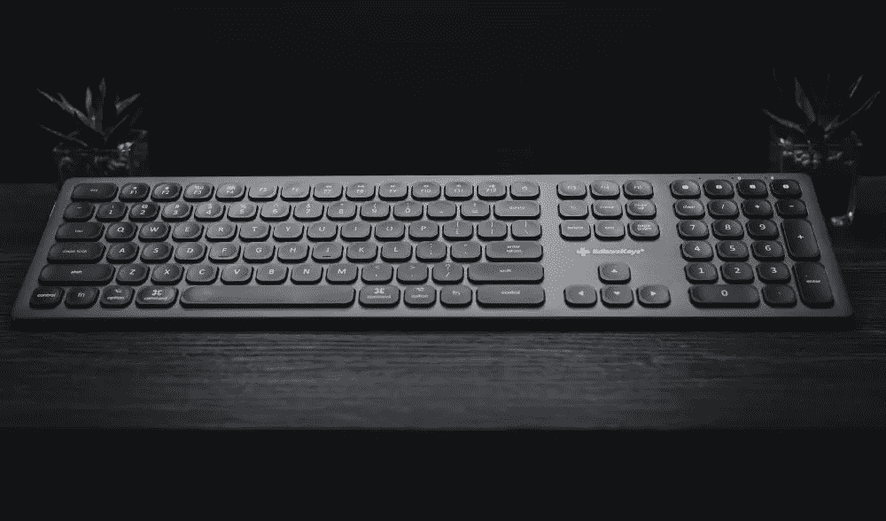

照片由[编辑在](https://unsplash.com/@editorskeys?utm_source=medium&utm_medium=referral) [Unsplash](https://unsplash.com?utm_source=medium&utm_medium=referral) 上按键

老实说，编程速度快是我继续编码的一半原因(Jk。除非...).不管怎样，我发现让我变得更快的事情是把手从鼠标上拿开。想想看，每次你不得不移动鼠标的时候，你都要做这些事情:

1.  把你的手从键盘移到鼠标上(哎哟，我的肩膀)
2.  找到那个该死的光标去了哪里
3.  将光标移动到您需要的位置，然后单击
4.  将你的手移回键盘(再次，哎哟，我的肩膀)

以下是我的顶级快捷键，它们会让你在编码时感觉像在弹钢琴:

# 多个光标

> 快速创建多个光标来更改多个代码段

增加代码输出的最快方法是什么？简单！添加更多光标！！现在，您可以在相同的时间内编写无限多的代码！代码越多=越好！

*   Linux: `Ctrl + Shift + Arrow Up / Arrow Down`
*   视窗:`Ctrl + Alt + Arrow Up / Arrow Down`
*   麦克:`Cmd + Opt + Arrow Up / Arrow Down`

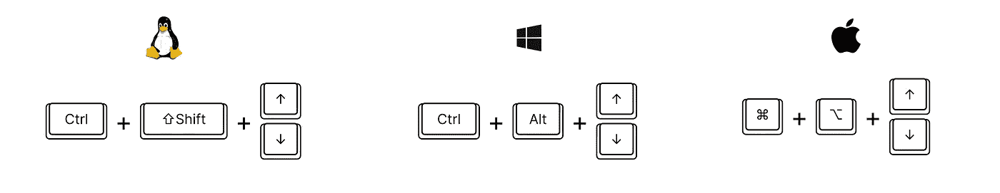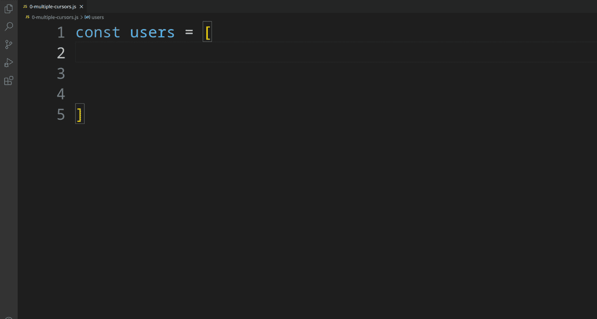

创建多个光标

# 选择下一步

> 选择您当前所选内容的下一个事件

你想在多个地方改变一个字符串，你知道你应该在某个地方把它设置成一个变量，然后重用它，但是我们还是在这里。你会使用过度查找和替换的方法，或者将你的手放在被禁止的设备鼠标上吗？亵渎！

*   Linux / Windows: `Ctrl + D`
*   麦克:`Cmd + D`

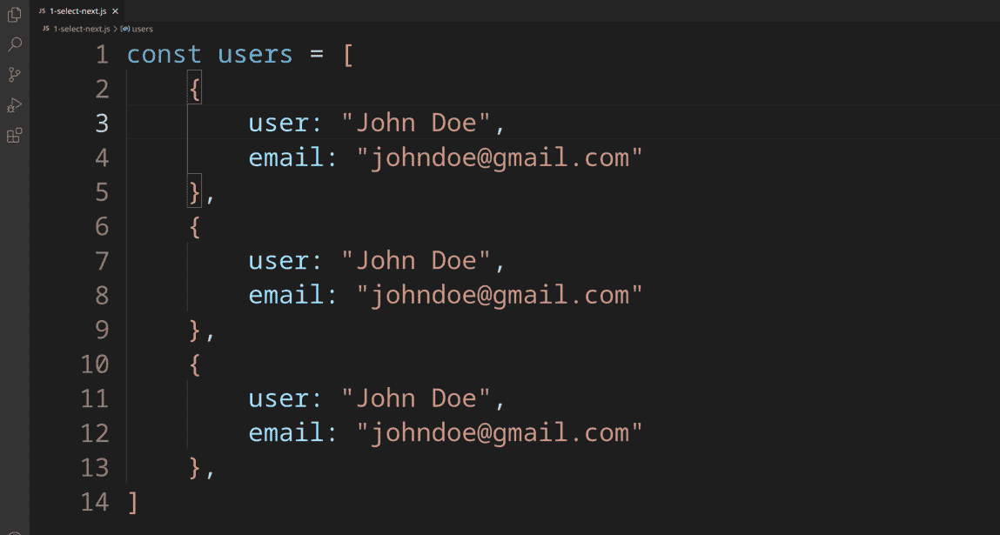

使用 select-next 选择多个出现项-字段名示例

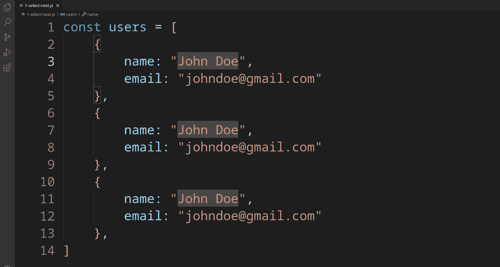

使用 select-next 选择多个出现的字符串示例

# 撤消选择下一个

> 将上一次选择-下一步回滚一步

你已经发现了`select next`的力量，但也许为时过早。如果你看到自己被权力逼疯了，下一步选择你不应该有的东西，这是给你的！

*   Linux / Windows: `Ctrl + U`
*   Mac: `Cmd + U`

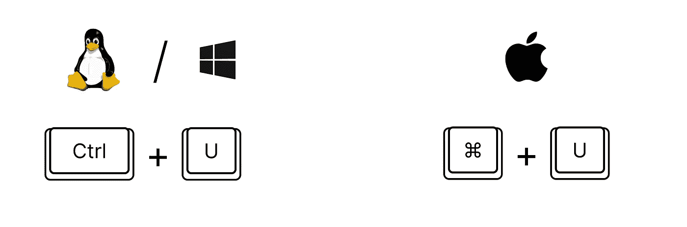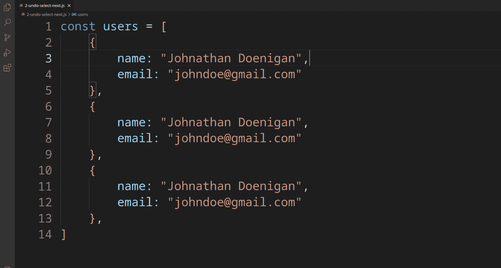

使用撤消选择-下一个回滚一个选择

# 不移动光标滚动屏幕

> 在代码中上下滚动时，保持光标不动

有时候你想隐藏上面写的蹩脚代码，这样你就可以专注于更光明的未来。“我以后会重构它，”你说。一个谎言。但是你已经知道了。所以，当你可以滚动，滚动，滚动你的耻辱时，为什么要面对事实呢？

*   Linux / Windows: `Ctrl + Up Arrow / Down Arrow`
*   Mac: `Ctrl + Fn + Up Arrow / Down Arrow`

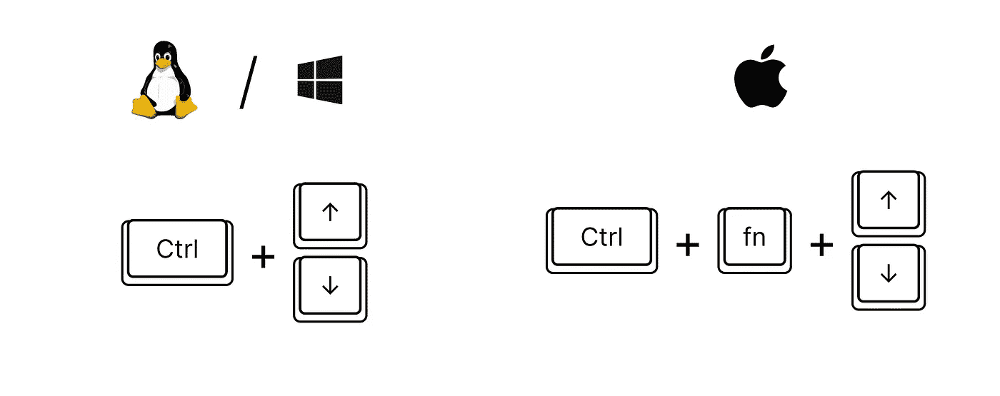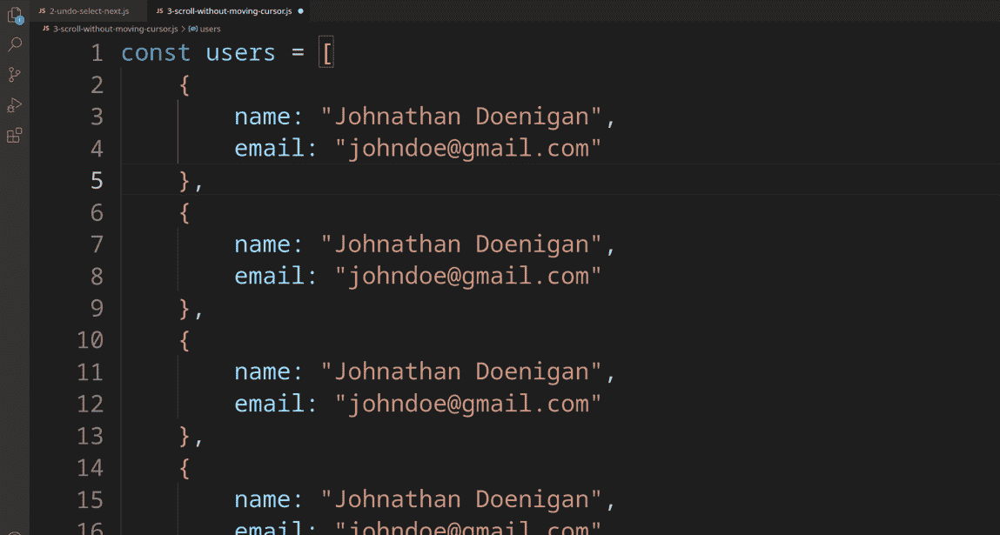

不移动光标滚动屏幕

# 跳转词

> 一次移动一个单词，而不是一个字符

你拿着左右箭感觉像是永恒的日子已经结束了。一个点击，一个单词。优雅。

*   Linux / Windows: `Ctrl + Left Arrow / Right Arrow`
*   Mac: `Opt + Left Arrow / Right Arrow`

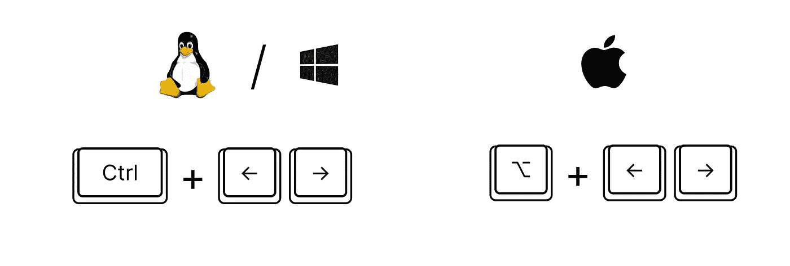

一次移动光标一个单词

# 选择单词

> 跳过一个单词，同时选择它

也许这个词让你做错了什么。谁知道呢。不管怎样，你可以通过一次选中它，然后把它消灭掉(或者不管你的策划者有什么计划)，让它知道谁是老大。

*   Linux / Windows: `Ctrl + Shift + Left Arrow / Right Arrow`
*   Mac: `Opt + Shift + Left Arrow / Right Arrow`

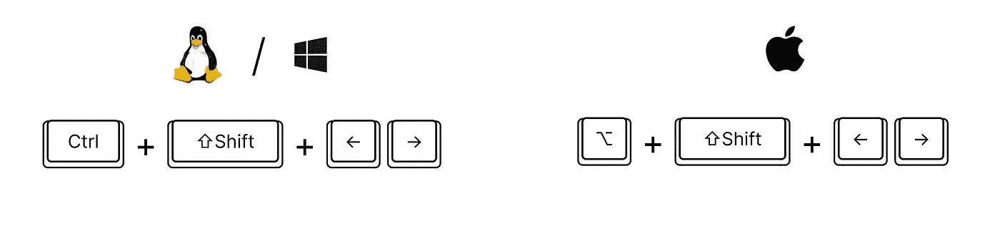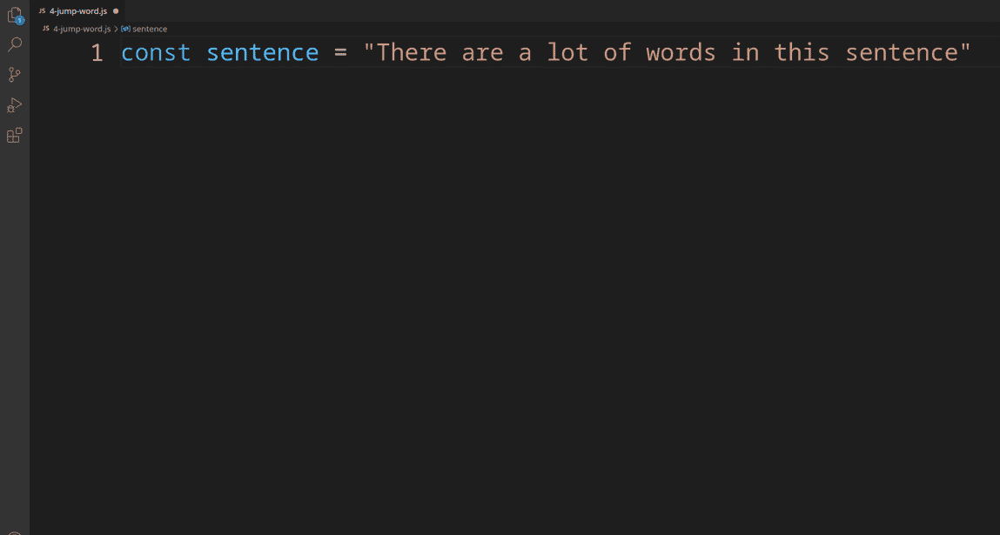

一次选择整个单词

# 跳到结尾或开头

> 立即转到当前行代码的开头或结尾

早上醒来，打开工作站，打开代码编辑器。你在一行的末尾找到了你的光标，但是你在开始的时候需要它。*叹气，*你对自己说，“猜猜我会在那发生的时候完成一些事情。”

你把一块石头放在你的左箭头上，继续你的一天。你冲个澡，喝杯咖啡，花两个小时决定当天要听什么音乐，参加十次毫无意义的公司会议，然后回到你的代码编辑器。

你移开左箭头上的石头，让你欣喜的是，你终于到达了这条线的起点。使用这种快捷方式可以让你永远节省时间。

*   Linux / Windows: `End / Home`
*   Mac: `Cmd + Left Arrow / Right Arrow`

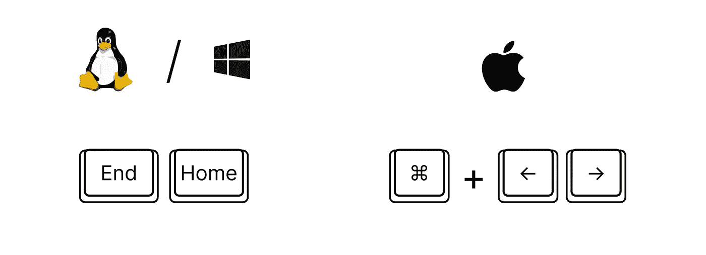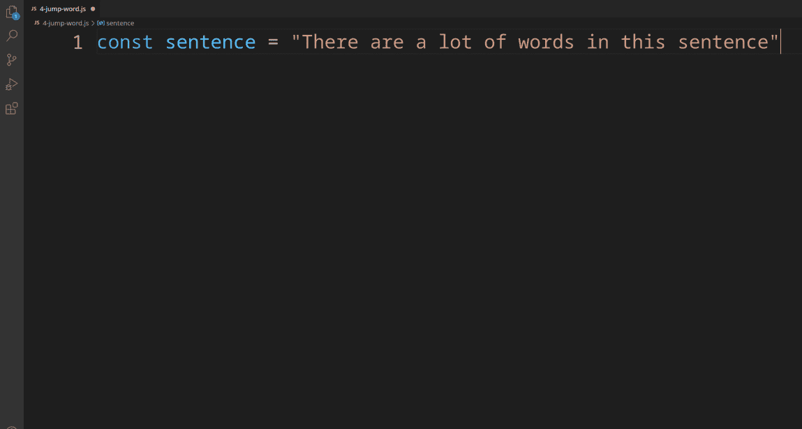

移动到行首或行尾

# 选择直到结束或开始

> 立即选择所有代码，直到当前行的开头或结尾

纵观历史，人们用他们一生积累的力量做了很多事情。成吉思汗，匈奴大帝阿提拉，蜘蛛侠等等。这些人以各种破坏性的方式使用他们的力量。这些都比不上这个快捷方式让你做的事情。明智地使用它。

*   Linux / Windows: `Shift + End / Home`
*   Mac: `Cmd + Shift + Left Arrow / Right Arrow`

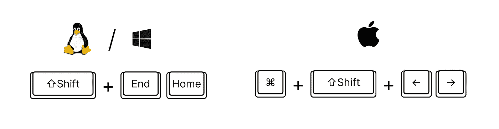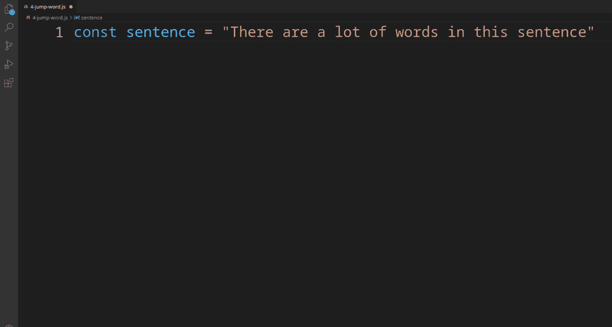

选择整行代码

# 扩展/缩小选择

> 扩大你的选择范围，包括更多/更少的范围(如字符串、函数等)。)

只有酷小孩才会用这个。

*   Linux / Windows: `Alt + Shift + Left Arrow / Right Arrow`
*   Mac: `Ctrl + Shift + Left Arrow / Right Arrow`

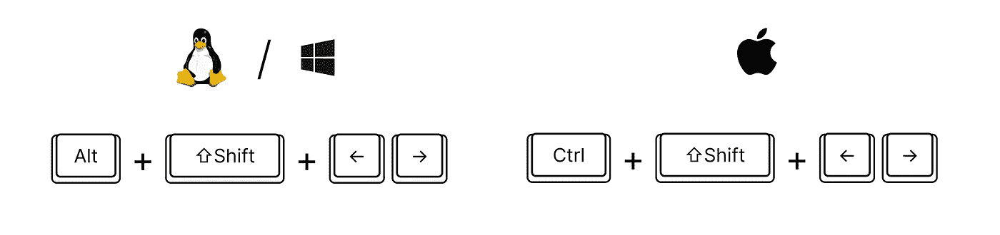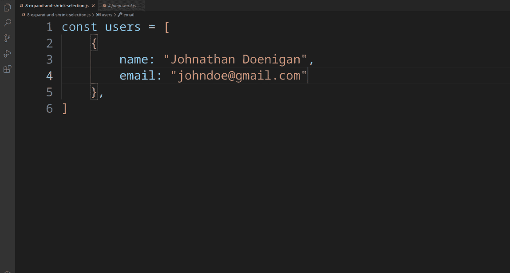

扩展选择以包括整个对象

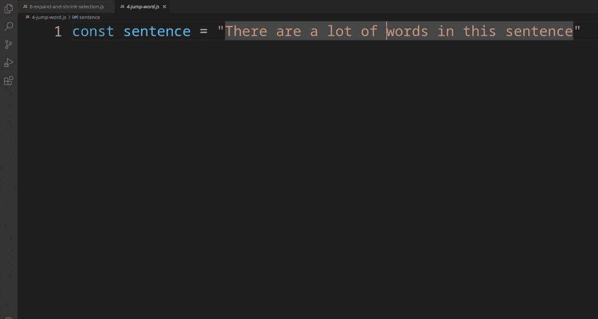

使用快捷方式选择整个字符串

# 显示/隐藏终端/返回代码

> 切换终端焦点/可见性，并将焦点移回代码

偶尔偷偷看一眼你失败的构建。是啊，还是不及格。让我们很快地关上它。

*   Linux / Windows: `Ctrl + J`用于终端，`Ctrl + 1`用于代码
*   Mac: `Cmd + J`为终端，`Cmd + 1`为代码

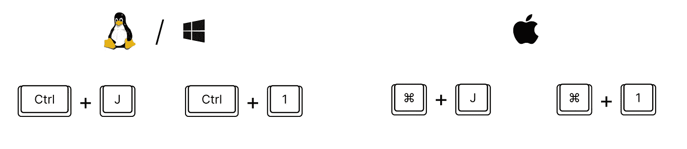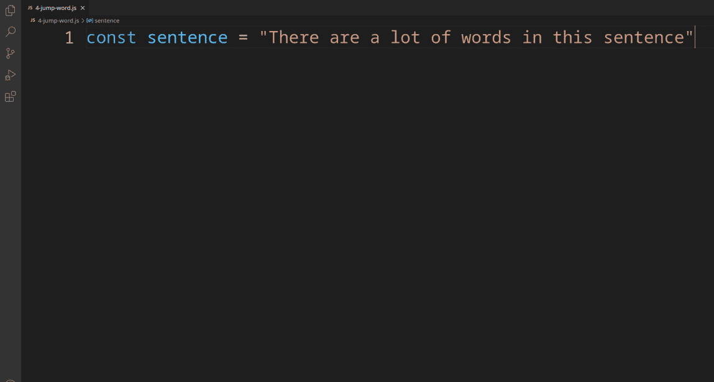

显示/隐藏终端并切换回代码

# 分裂终端

> 将终端拆分成两个或更多同时可见的窗格

研究表明，在特定时间使用更多终端的人是更好的黑客。这只是事实。接受吧。拥抱它。

*   Linux / Windows: `Ctrl + Shift + 5`
*   Mac: `Ctrl + Cmd + Opt + * (star)`

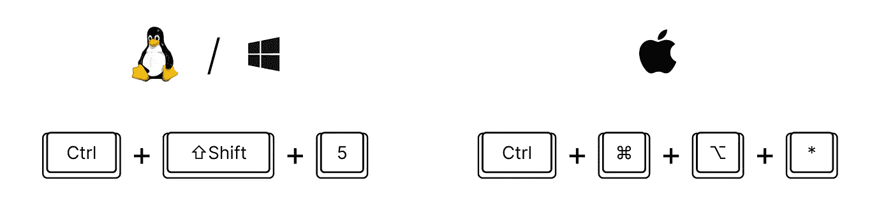

将单个端子拆分为多个端子

# 结论

我庄严宣誓，在制作这些演示的过程中，我没有碰过我的鼠标。

当你看到灰尘在你的鼠标上堆积时，你就会知道你开始变得更好了。还有，别忘了买你能找到的最大声的机械 RGB 键盘。那会吓跑鼠标使用者的！

你最喜欢/最常用的快捷方式是什么？