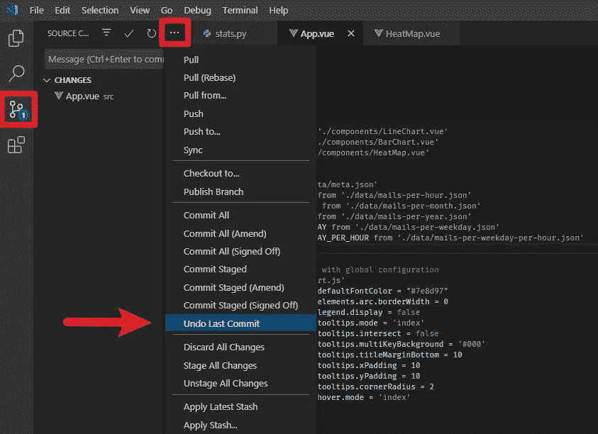
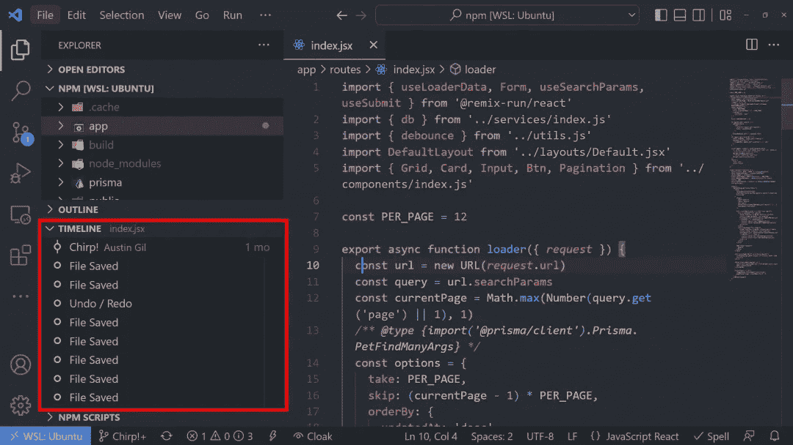

# VS 代码时间线恢复 Git 无法恢复的丢失工作

> 原文：<https://betterprogramming.pub/vs-code-timeline-restores-lost-work-that-git-cant-4197fa644aca>


作者图片

## VS 代码时间线可以拍摄文件不同保存点的快照。这可以帮助您保存 Git 可能无法保存的丢失的工作。

如果您从事 web 开发已经有一段时间了，您可能会遇到这样的情况:您做了一些更改或删除了一些文件，结果不知何故丢失了工作和大量时间。

今天我想向你展示一些在 VS 代码中防止这种情况发生的技巧。

当你需要修改一个文件时，你要做的第一件事就是复制并粘贴它，然后将新文件重命名为“V2”如果你需要更多的版本，你可以一直复制/粘贴，直到你得到“V3”、“V4”、“V_final”，然后是“V_finalfinal”，然后是“_-this-time-for-real-final _ version _ V7”

开个玩笑:)

如果你已经在这个领域工作了一段时间，并带来了一些根深蒂固的创伤，我知道一个伟大的治疗师。

但是技术已经足够先进，我们不需要依赖那种格式。我们有像 [Git](https://git-scm.com/) 这样的工具，它已经存在一段时间了，希望你听说过它。

VS Code 有一些非常好的 Git 集成，他们已经很好地记录了这些集成。它允许您:

*   拍摄项目当前状态的快照
*   向您展示并排比较以查看每个变化
*   查看文件内的更改
*   批量或一次一个地比较和恢复更改

所有这些真的很好，但这不是我想给你看的。

在我参与的几乎每一个项目中，我都遇到过这样的情况:我提交了一些代码，然后实际上想回去修改一些关于提交的东西。

也许我包含了不应该在那里的文件，或者我忘记了包含一些应该在那里的更改。

我总是要查看你是如何撤销最近一次提交的:

```
git reset --hard HEAD~1
```

我永远也不会记得，但好消息是我不必记得。

VS 代码内置了这一点。你可以转到源代码控制标签，然后在小烤肉串菜单中，转到“提交”部分，有一个“撤销上次提交”的选项。



这很方便，但是对于喜欢键盘快捷键的人来说，你可以用`ctrl+shift+P` (Windows)打开命令托盘，搜索“撤销上次提交”我通常只需输入“撤销”，然后按“回车”一旦你习惯了，这真的很快。

这也很方便，但即使这样也不是最酷的技巧，因为有些情况下 Git 实际上不会帮助你。

比方说，我们实际上向我们的项目添加了一个`[.gitignore](https://git-scm.com/docs/gitignore)`文件，并且我们包含了一个我们想要处理的文件。这会将文件排除在版本控制之外。这意味着我们不能进行更改，然后再恢复。这对于像 ENV 变量这样的东西来说是很常见的。

现在，如果你不小心删除了这个文件，你最好希望你有备份。

你也许能在垃圾桶里找到它，但是在我的情况下，它实际上直接从光盘上被删除了。所以它不存在于垃圾桶里。所以，我要怎么把它拿回来？

幸运的是，VS 代码有这个[时间轴视图](https://code.visualstudio.com/updates/v1_44#_timeline-view)，这真的真的很酷，因为它会向你展示在提交之间对文件所做的更改。你可以把它想象成原子版本控制。



它会在我每次点击保存时显示文件的状态。这使得在不同版本之间来回切换变得非常容易。

这里最酷的功能之一是，如果我删除一个文件，我可以创建一个同名的新文件，它会恢复时间线。

这个功能救了我很多次(如果你看我的[直播](https://www.twitch.tv/heyaustingil)，你知道我在说什么)。

我就知道这么多。现在，您可以随心所欲地编写代码了。

```
**Want to Connect?**You can also [sign up for my newsletter](https://austingil.com/newsletter/) or [follow me on Twitter](https://twitter.com/heyAustinGil) if you want to know when new articles are published. Originally published on [austingil.com](https://austingil.com/vs-code-timeline-restores-work-git-cant/).
```