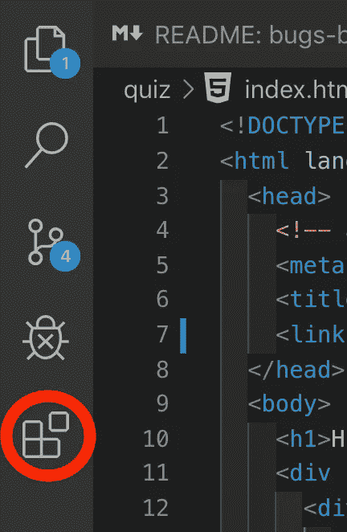
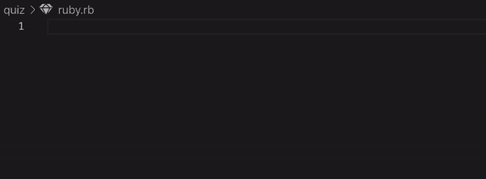
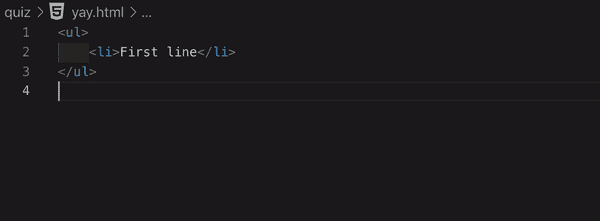
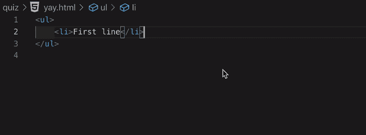
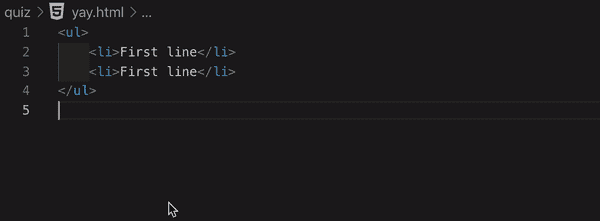
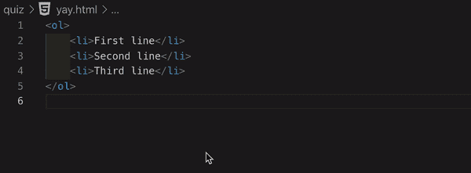
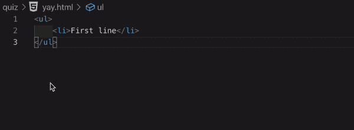
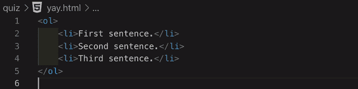
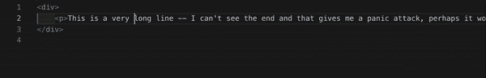
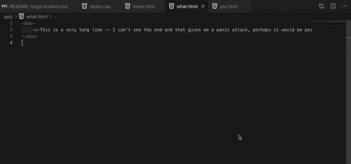

# 适用于初学者的 VSCode 技巧

> 原文：<https://betterprogramming.pub/vs-code-tricks-for-beginners-9e88b30eeec9>

## VSCode 爱好者的最佳扩展、快捷方式和选项

# 有用的扩展

要向 VS 代码中添加扩展，单击左侧面板中的最后一个图标，就像这样:

…并搜索扩展名。以下是我个人对 VS 代码扩展的“空前喜爱”列表:

*   **窗口改变时自动保存** —再也不用担心记得保存文件了！
*   **括号对上色器** —通过颜色编码确保你的括号都是闭合的！
*   **Indent-Rainbow** —以清晰可见的方式为您标记缩进，这样您就知道您是否缺少了 Ruby 的结尾或 JS 的右括号。
*   **自动关闭标签** —安装这个来确保你的 HTML 标签自动关闭。
*   **自动重命名标签**——想象想要将一个< div >更改为一个；这个扩展将自动更新结束标签的名称！
*   **vscode-icons** —让文件类型更加清晰可见，看看这些降价。css，还有。html 文件在此标记:

*   **高亮匹配标签**——这在处理 CSS 和 HTML 时非常有用。
*   **颜色选择器** —这在处理 CSS 和 HTML 时非常有用。
*   红宝石——哦，对了，所有的快捷方式！比如创建一个。rb 文件，写 ini 并点击 tab:

点击此处查看其他快捷方式:

*   Rails 代码片段 —同样适用于 Rails。
*   JavaScript 代码片段包——与 JS 相同。
*   **ES7 React/Redux/graph QL/React-Native snippets**—相同，但用于 React、Redux 等。

# 有用的快捷方式

以下是我个人对 VS 代码快捷方式的“空前喜爱”列表:

1.  **注释掉一行:** `cmd + /`

**2。缩进一行:** `cmd + { or }`

**3。查找同一项目的另一个实例:** `cmd + d`

**4。选择同一项目的所有事件:** `cmd + shift + l`

**5。上下复制整行:** `Shift + Opt + Up` / `Shift + Opt + Down`

**6。上下移动一行:** `Opt + Up` / `Opt + Down`

# 奖励:有用的选项

1.  **软换行** ( `Opt + Z` )在窗口宽度内换行。

**2。分屏**(拖动文件)允许你同时打开几个文件。

**3。终端:**在导航条上，选择“终端”和“新建终端”，在你的 VS 代码中出现一个终端窗口。