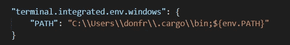
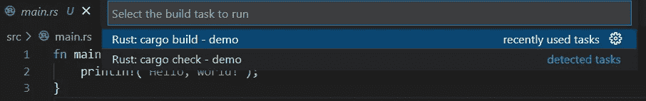
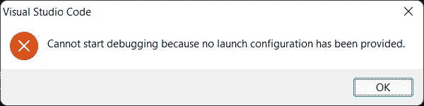
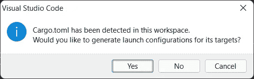
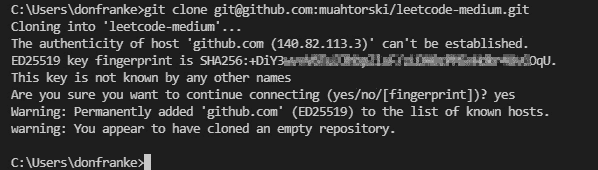

# VSCode、GitHub 和 Rust

> 原文：<https://betterprogramming.pub/vscode-github-and-rust-8b8a06b7442c>

## 如何为 Rust 项目建立开发环境

我最近一直在解决 [Leetcode](https://leetcode.com/) 上的问题来学习 Rust，在这个过程中，我学到了一些东西，帮助我建立了一个更有效的开发环境。

下面将介绍如何设置一个支持调试、单元测试和 GitHub 集成的 IDE，所有这些对于编码练习都很有用。

# 设置

以下是设置 Microsoft Visual Studio 代码(VSCode)以使用 Rust 开发和调试编码项目的步骤。在这篇文章中，我使用了一个托管在 Azure 中的微软 Windows 11 虚拟机。

## **步骤 1 —安装防锈漆**

通过[使用此链接](https://www.rust-lang.org/tools/install)下载并安装 Rust。安装后，通过运行命令`rustc` 并确认返回使用信息，验证路径设置是否正确。如果该命令不起作用，请确保 Rust 可执行文件的路径(例如，C:\Users\[username]\。cargo\bin)包含在您的主机路径主机环境变量中。

## **步骤 2 —安装 Visual Studio 代码**

1.  使用此链接下载并安装 Microsoft VSCode [。安装时使用默认设置，我选择安装 64 位系统安装程序。](https://code.visualstudio.com/Download)
2.  在 VSCode 中启动 Terminal (Ctrl+Shift+)，尝试命令`rustc` 验证是否运行无误。

如果`rustc`命令不起作用，您可能还需要在 VSCode 工作区中设置路径信息，以便 Rust 在终端中工作。可以通过编辑 VSCode settings.json 文件来添加路径:

1.  选择*文件|首选项|设置*
2.  点击右上角的开放设置(JSON)图标
3.  添加一个包含 Rust 二进制文件路径的条目(更多信息请点击[这里](https://fabianlee.org/2021/12/23/vscode-add-a-directory-to-the-terminal-path/))。)

图 settings.json 文件的路径条目示例

## **步骤 3——安装 Visual Studio 构建工具**

VSCode 需要 Visual Studio 生成工具来使用 Rust 运行时进行调试。

这些构建工具有多个版本，尽管我使用的是较新版本的 VSCode 和 Rust，但 2019 版的构建工具为我工作。

如果不执行这一步，当您试图运行或调试代码时，可能会出现类似“link.exe not found”的错误(更多信息请点击[这里](https://stackoverflow.com/questions/63390924/rust-link-exe-not-found/70703624))。)

以下是安装 VSCode 生成工具的步骤:

1.  退出 VSCode
2.  去 [Visual Studio 下载网站](https://my.visualstudio.com/Downloads?q=visual%20studio%202019&wt.mc_id=o%7Emsft%7Evscom%7Eolder-downloads)
3.  向下滚动到较早的下载
4.  拓展 2019
5.  点击下载。*您需要登录您的 Microsoft 帐户才能继续*
6.  单击 Visual Studio 2019(16.9 版)构建工具旁边的下载
7.  运行下载的安装程序
8.  选择使用 C++开发桌面，然后单击安装。*根据您的系统，这大约需要 10 分钟。*
9.  启动 VSCode

## **步骤 4 —安装 Rust for Visual Studio 代码扩展**

1.  单击右侧的扩展图标，搜索 Rust 并安装 Rust for Visual Studio 代码扩展。

## **步骤 5 —安装 CodeLLDB 扩展**

1.  单击右侧的扩展图标，安装“CodeLLDB”扩展。
2.  重启 VSCode

## **步骤 6 —创建一个新的 Rust 项目**

1.  在左侧窗格中，单击“打开文件夹”为项目选择主文件夹
2.  选择*端子|新端子* (Ctrl+Shift+`)
3.  使用命令行导航到新创建的文件夹
4.  运行命令`cargo new demo`

一个名为*演示*的新 Rust 项目将被创建，新文件将显示在 ide 左侧的文件浏览器窗格中。

## 步骤 7 —构建项目

通过选择*`Terminal | Run Build Task`*……(*`Ctrl+Shift+B`*)*首次构建项目。*

*在顶部出现的选项中，选择 Rust: `cargo build — demo`*

**

*图 2:选择货物构建—选择运行构建任务后的演示…*

*将会创建一些新的项目文件，但是此时您只能*构建*项目(您仍然需要终端来运行它)。*

## *步骤 8 —运行项目*

*如果你现在尝试`Run | Run Without Debugging (Ctrl+F5)`，你会得到一个错误，接着是另一个错误。对第一个选项单击确定，对第二个选项单击是。*

**

*错误 1:首次尝试运行新的 Rust 项目时收到的消息*

**

*错误 2:错误 1 之后的消息，如果单击“是”,将自动创建启动配置*

**

*图 3:自动创建启动配置后的项目文件*

*对第二个错误模式单击“是”后，将自动创建一个启动配置。现在，如果您再次尝试运行该项目，您应该会看到“Hello，World！”在 VSCode 的终端窗口中。*

## ***步骤 9—安装并设置 Git(可选)***

*GitHub 是备份和共享代码的好方法。虽然让 VSCode 与 git 一起工作可能是一个挑战，但下面的方法对我很有效。*

1.  *使用此链接安装 Git for Windows*
2.  *在 VSCode 中安装 [GitHub Pull Requests and Issues 扩展](https://marketplace.visualstudio.com/items?itemName=GitHub.vscode-pull-request-github)，然后重启 VSCode*
3.  *使用 VSCode 终端，使用以下命令生成一个新的 SSH 密钥:`ssh-keygen -t rsa -b 4096 -C "<your email address>"`*
4.  *使用文本编辑器，打开最近更新的。您的%USERPROFILE%\中的 pub 文件(例如 id_rsa.pub)。ssh 目录。复制以`ssh-rsa`开头的字符串(key)。*
5.  *使用网页浏览器，登录 GitHub 网站，并前往右上角选择您的帐户>设置> SSH 和 GPG 键。点击*新建 SSH 密钥*，添加标题，将新创建的 SSH 密钥粘贴到密钥字段，然后点击添加 SSH 密钥。GitHub 现在信任您的 Windows 主机，只要它使用相同的 SSH 密钥，默认情况下应该是这样。*
6.  *使用 web 浏览器，创建一个新的存储库(repo)，然后复制它的 git URL*
7.  *使用 VSCode 终端，运行命令`git clone <repo URL>`，以便将 github.com 添加到已知主机的 Windows 列表中。这也将确认 git 在一般情况下是有效的，并且不会再次提示您这样做(参见图 1。)*
8.  *使用 VSCode，通过选择视图>命令调色板…再次克隆 repo，在搜索栏中键入`clone` ，然后选择`Git:Clone`。将 git URL 粘贴到随后的文本字段中，选择本地目标文件夹，然后单击*在新窗口中打开*以在 ide 左侧的文件资源管理器中查看您的 repo 的内容。*

**

*图 1:首次运行时将 github.com 添加到已知主机列表的示例*

# *结论*

*VSCode 的调试特性提供了对运行时值的可见性，以及在不使用 print 语句的情况下测试逻辑分支的能力。*

*一旦您的项目完成，GitHub 扩展可以用于暂存、提交和推送新文件和更改到远程存储库。结果是一个可用于执行以下操作的开发环境:*

1.  *在 Rust 中创建项目*
2.  *逐句通过并调试代码*
3.  *将文件备份到 GitHub(可选)*

*编码快乐！*

# *资源*

* [## 立即创建您的 Azure 免费帐户| Microsoft Azure

### 观看各种 Azure 服务的运行，了解如何部署资源，并设想您的云计划。观看…

azure.microsoft.com](https://azure.microsoft.com/en-us/free/virtual-desktop) 

[安装 Rust — Rust 编程语言(rust-lang.org)](https://www.rust-lang.org/tools/install)

[下载 Visual Studio 代码——Mac、Linux、Windows](https://code.visualstudio.com/Download)

[下载— Visual Studio 订阅门户](https://my.visualstudio.com/Downloads?q=visual%20studio%202019&wt.mc_id=o%7Emsft%7Evscom%7Eolder-downloads)*