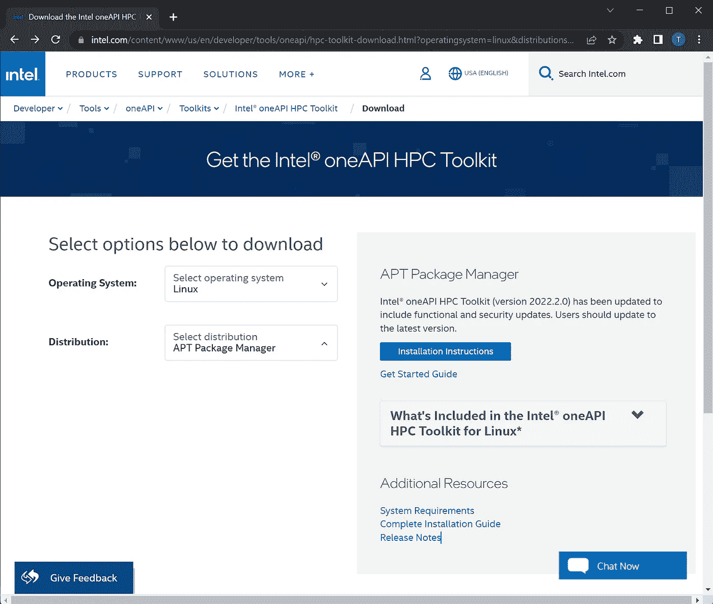
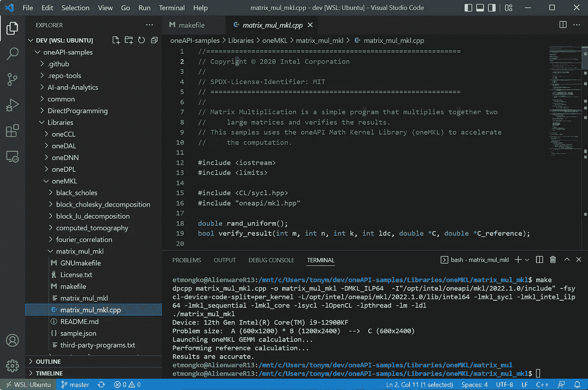
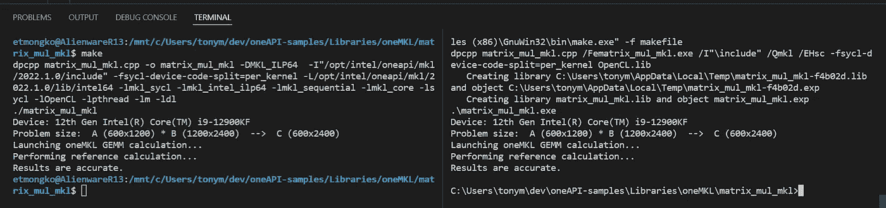

# VS 代码、WSL2 和 OneAPI——利用工具进行跨平台软件开发

> 原文：<https://betterprogramming.pub/vscode-wsl2-and-oneapi-leveraging-tools-for-cross-platform-software-development-dbb8deaf10c9>

## 如何使用 WSL2 和 VSCode 为 Linux 和 Windows 构建 oneAPI


照片由[维达尔·诺德里-马西森](https://unsplash.com/@vidarnm?utm_source=medium&utm_medium=referral)在 [Unsplash](https://unsplash.com?utm_source=medium&utm_medium=referral) 拍摄

你好，世界！作为一名在英特尔从事性能/并行化工具和人工智能系统平台工作 19 年的软件工程师和软件架构师，我非常幸运和激动地与您分享我的一些经验，并获得您对软件、技术和英特尔的看法。我的第一个重点是试图解决现代软件开发人员的困境。

# 为什么要先解决这个问题？

从我记事起，我就一直热爱编程和解决问题。1985 年，当我上一年级时，我开始用 BASIC 编程，当时它还不太普遍。

我已经足够幸运(或者足够不幸？)学习了几十种编程语言，用几种 ide 编程，在 Windows 和 Linux 环境下开发软件。我还必须在快速发展的领域进行开发，如 Web/UI 框架、云开发、深度学习等。

这段时间以来，一个不变的事实是，工程师总是在与他们的工具斗争，以提高生产率。作为一名开发人员，我希望尽可能高效地完成更多的工作，或者腾出时间做生活中的其他事情……所以这对我个人来说意义重大。=)

# 缩小范围

对我们来说不幸的是，没有一个现代软件开发者。当我为微服务或 Kubernetes 编写 Go 代码时，我使用的工具链与我编写 React/Angular/Vue/Javascript 代码时完全不同。还有很多时候我需要 Windows/Linux/Mac 之间的跨平台支持。

幸运的是，在跨平台 ide 和支持方面已经有了很多进步。我是一个长期的 Vi 用户(无意冒犯 emacs 用户，我知道 emacs 更强大)，但我喜欢现代的 ide，作为一名工程师，我喜欢跨平台标准化我的工作流，因为这使我更有效率。

对我来说幸运的是，我通常使用的语言(C/C++/Python/Javascript/Go)在微软的 Visual Studio 代码(VSCode)中都能很好地工作，最近对微软 Linux 窗口子系统(WSL)的更新也能很好地用于跨平台开发。

在这种背景下，我想我应该尝试看看在我的英特尔 Alder Lake Core i9 外星人 R13 系统上运行一些跨平台 oneAPI 样本的效果如何(不，英特尔没有购买)。

# 设置 WSL 和 VSCode

设置 WSL 没有痛苦，我只是打开一个 Windows 命令提示符并运行

```
> wsl --install
```

它安装了用于 WSL 的 Ubuntu 20.04 发行版，并且需要快速重启。

对我来说，这个过程是没有痛苦的，但是我的一些同事提到，如果你遇到问题，微软已经提供了一个方便的[故障排除指南](https://docs.microsoft.com/en-us/windows/wsl/troubleshooting)，它将指导你完成使你的系统 WSL 准备就绪的先决步骤。

下一步是设置我的 VSCode。我最初试图使用 Linux 安装工作流在 WSL 中设置我的 VSCode，但结果证明这不是正确的方法。按照微软的说明，我只需按照下面的说明在 VSCode 中启用远程 WSL 扩展:

【https://code.visualstudio.com/docs/remote/wsl 

启用扩展后，要求一个新的 WSL 窗口就像弹出一个 VSCode WSL 连接窗口一样简单。


# 安装 oneAPI 工具包

因为我想知道我是否可以在我的系统上运行基于 Linux 和 Windows oneAPI 的代码，所以我访问了 oneAPI 发布页面:

[https://www . Intel . com/content/www/us/en/developer/tools/oneapi/toolkits . html](https://www.intel.com/content/www/us/en/developer/tools/oneapi/toolkits.html)


选择我想要的工具包，并按照说明将它们安装到我的系统上。我在 WSL 终端和 Windows 的在线安装程序中使用了 apt 安装。



# 运行一些代码

既然理论上我已经有了一个工作开发环境，我就去了 Github 的`oneAPI` samples:

[](https://github.com/oneapi-src/oneAPI-samples) [## GitHub-oneapi-src/oneAPI-Samples:英特尔 oneAPI 工具包示例

### oneAPI 样本库为英特尔 oneAPI 工具包提供代码样本。我们建议查看特定的…

github.com](https://github.com/oneapi-src/oneAPI-samples) 

把代码放到我的本地机器上。这段代码被设计为兼容 Windows 和 Linux，所以我在我的 WSL VSCode 窗口中加载了 Libraries-> oneMKL-> matrix _ mul _ mkl 目录，并启动了一个 bash 终端。我必须找到`oneAPI`变量来启用适当的环境，然后运行 make 来构建并运行示例代码:

```
> source /opt/intel/oneapi/setvars.sh
> make
```

这成功构建并运行了 dpc++/英特尔数学内核库(MKL)矩阵乘法示例。



使用 Windows 二进制文件创建和运行示例最终要多做一些工作，因为这是一个新系统，所以我必须安装 Microsoft Visual Studio 2022 Community Edition 和 GNUMake。在那之后，它又像加载 VSCode 并运行一样简单:

```
> C:\Program Files (x86)\Intel\oneAPI\setvars.bat
> make
```

# 但是等等，还有呢！

我相信你们很多人都知道这一点，但接下来的事情对我来说是一个惊人的发现。我正在玩 VSCode (Windows，不是基于 WSL 的),看到我可以为我的分割终端选择 WSL 提示符！

这样做允许我在同一个 VSCode 实例中为 Windows 和 Linux 构建和运行示例。

在单个 IDE 中的单个系统上进行跨平台开发！在经历了多年处理跨平台开发的痛苦之后，我无法从这种魔力中释放出兴奋的内啡肽。



# 结束(暂时)

所有这一切的好处是，我能够在几个小时内在后台将所有这一切设置在一个新系统上。

在未来，我将撰写更多关于这种流程如何适用于基于英特尔 Arc 的 GPU 的文章，讨论 Jupyter 笔记本电脑等其他开发人员工作流程，深入探讨云和人工智能系统平台开发等软件主题，并分享我作为技术行业软件工程师的经验。感谢阅读！

```
**Want to Connect?**If you want to see what random tech news I’m reading, you can [follow me](https://twitter.com/tonymongkolsmai) on Twitter.
```

*英特尔、英特尔标志和其他英特尔标志是英特尔公司或其子公司的商标。*