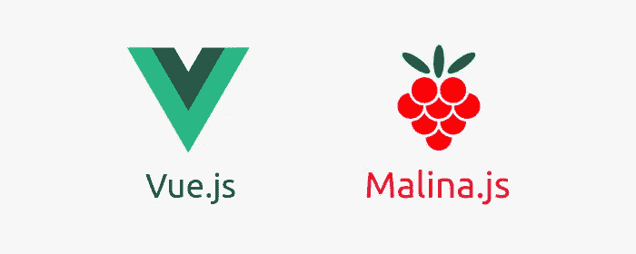
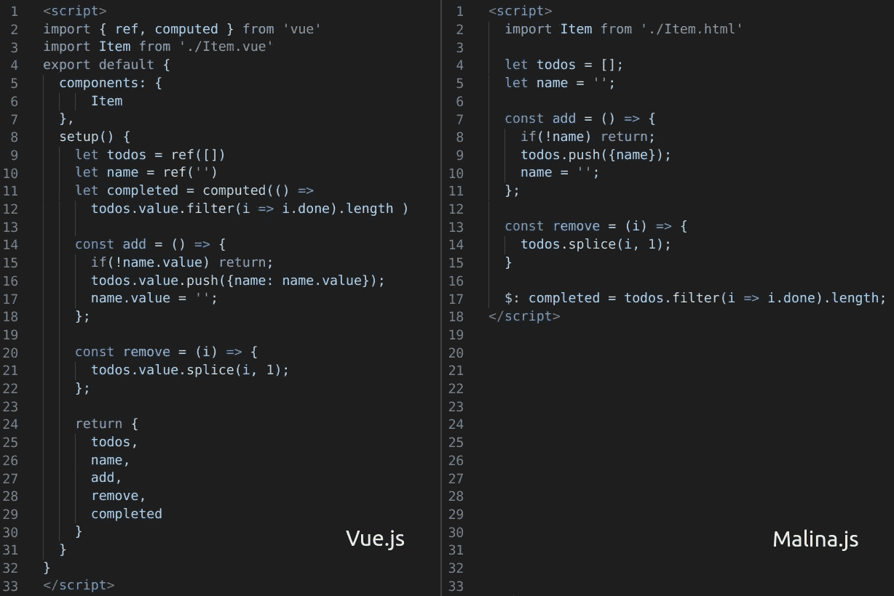
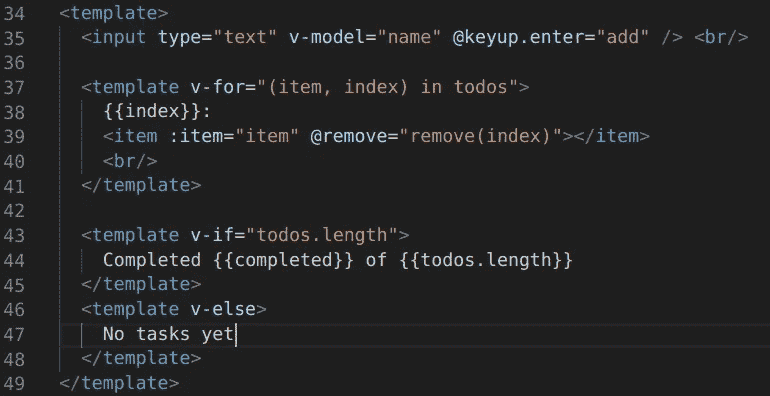
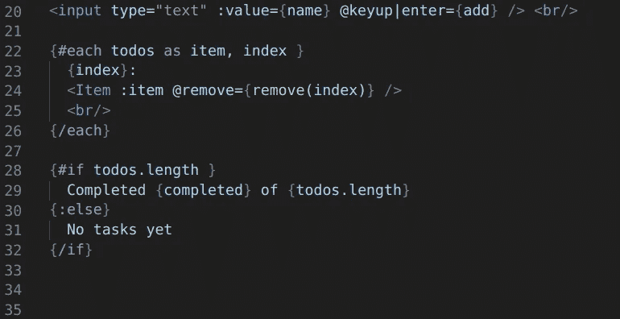
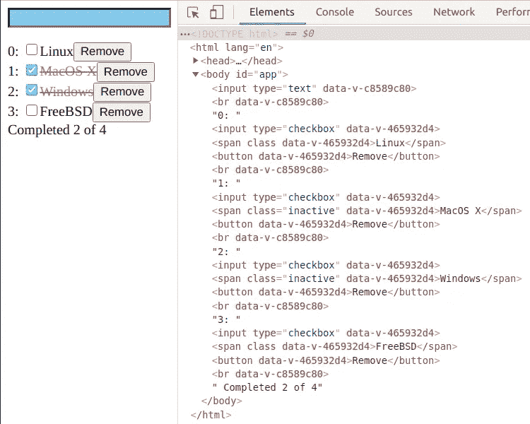
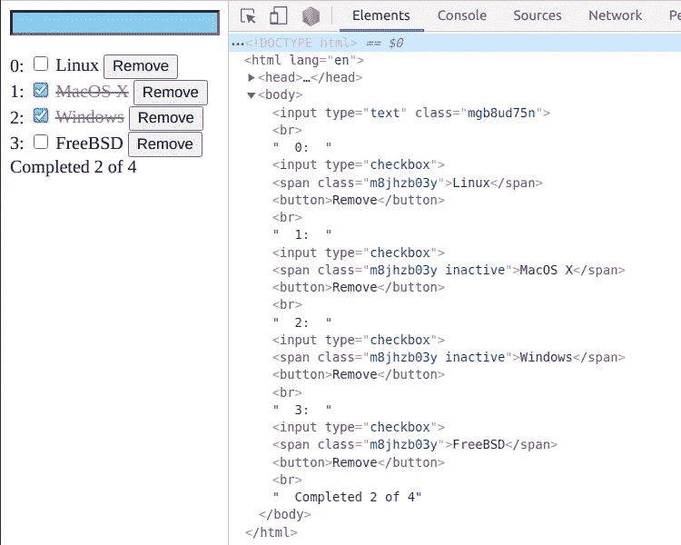

# Vue.js 和 Malina.js 比较

> 原文：<https://betterprogramming.pub/vue-3-vs-malina-js-abd97025ba81>

## 开发时编译是 web 开发的下一步，以 Malina.js 为例

图片来源:作者

[Vue.js](https://vuejs.org/) 是一个非常受欢迎的框架，一个新版本即将推出:Vue 3。我想看看它的外观，并与 Malina.js 进行比较。 [Malina.js](https://github.com/malinajs/malinajs) 是一个新的框架编译器(是的，再来一个，每天一个新的框架)。它在开发时将组件编译成 JavaScript，因此 web 应用程序可以在没有框架的浏览器中工作。本文展示了开发时编译如何改进您的 web 开发。

我创建了两个同样非常简单的应用程序。对于 Vue app，我用的是 Vue 3-rc + Vite 和 [Composition API](https://composition-api.vuejs.org/#summary) ，这是 Vue 3 的主要特色之一。(源代码和其他链接你可以在最后找到。)

# 组件的 JavaScript 块

让我们从 JavaScript 组件块开始:

左边是 Vue.js。右边是 Malina.js。

使用 Vue.js，需要注册组件并返回使用过的对象和函数(大概在以后的版本中可以优化，因为可以自动完成)。此外，反应性对象需要某种方式来使用它，所以要使用其他类型的库，您可能需要一些适应来从/到可观察对象的转换。比如上面的代码，我要给可观察的对象加上`.value`。

Malina.js 不使用反应对象。它使用常见的 JavaScript 变量和普通 JavaScript 进行操作，因此使用其他类型的库更容易，代码本身看起来也更整洁。

还有，我注意到新的 Composition API 看起来很像 2011 年流行的 [Knockout.js](https://knockoutjs.com/) 。可能语法是受 Knockout.js 的启发，被时间证明了，有些开发者真的很喜欢:

但是我个人更喜欢更干净的语法，接近普通的 JavaScript。

# 模板

让我们看看组件模板:

左边是 Vue.js，右边是 Malina.js。

在 Vue.js 中，你可以在 HTML 元素中放置像`v-if/v-for`这样的控制指令。这是一种非常流行的方式，与 Angular.js 和其他框架一样，但有时它会让您创建额外的 HTML 元素，从而使模板变得庞大。

Malina.js 使用另一种方式在 HTML 元素之外放置控制指令，这也很流行，例如在 Handlebars.js、Mustache.js、Svelte.js、Jinja2 和许多其他模板引擎中使用。因为控制指令没有与 HTML 元素混合在一起，并能立即吸引眼球，所以可读性更好。

也有其他的方法，比如 JSX，用在不同的框架中，所以更多的是你喜欢什么。

# 作用域 CSS

作用域 CSS 是构建现代 web 应用程序的一个非常重要的特性。它在 Vue.js 和 Malina.js 中的工作方式是一个很好的例子，说明了为什么在开发时编译是有帮助的。

Vue.js 可以在运行时在浏览器中构建作用域 CSS。Vue.js 负担不起为 CSS 和选择器使用合适的库，因为它们可能非常重。如果要使用它们的话，Vue.js 会重得多，所以 Vue.js 使用一种简单的方法来制作限定了作用域的 CSS:它只是用一个特殊的属性来标记所有的 DOM 元素。

Malina.js 在开发时编译组件，因此它可以使用任何库，不管它们有多重，因为它们没有加载到浏览器中。js 为 CSS 选择了一个合适的库来对模板进行更精确的修改。它基于组件的 CSS 选择器向元素添加了一个特殊的类，因此，它构建了一个更加紧凑和高效的 DOM。

在下面的代码片段中，你可以看到 Malina.js 只标记了 5 个 DOM 元素，而 Vue.js 标记了所有，甚至` `。

左边是 Vue.js，右边是 Malina.js

# 捆绑大小

*   vue . js:20 kb gzip
*   malina . js:2.9 kb gzip

包的大小是开发时编译的另一个优势，因为包的大小变得很小，只包含所需的特性。当你不想附加一个完整的框架来保持你的小部件很薄的时候，它特别适合于小部件和嵌入式应用。

# 表演

填充 5000 个项目:

*   vue:478 毫秒
*   马利纳:322 毫秒(快了 48%)

删除 5000 行中的一行:

*   vue:185 毫秒
*   malina:97 毫秒(大约快两倍)

在 Firefox 78 中测试，[基准源](https://gist.github.com/lega911/4372e9eabb3bba29057be0f7766264a9)。

# 结论

Malina.js 是一个例子，它展示了开发时编译的优势。它具有更小的包大小，更准确地处理模板和 CSS(由于使用了更合适的库)，并提供了更多处理 JavaScript 的机会(由于使用了成熟的 JavaScript 解析器，该解析器太重而无法加载到浏览器中)。app 的源代码可以更紧凑，比如上面的 app，一个有 Malina.js 的 app 稍微紧凑一点(52 行代码，而 Vue.js app 是 79 行代码)。

加载到浏览器中的框架必须很小，这意味着你只能使用功能性的、较小的库来提供较小的特性(例如作用域 CSS)。

开发时编译让你自由呼吸，使用成熟的库，这给你更多的机会。2020 年后，开发时间的编译可能是前端框架的下一个级别。

此外，我会推荐看看 [Svelte.js](https://github.com/sveltejs/svelte) ，它采取了类似的方法。

非常感谢帮助开发 Malina.js 的 Alexey Schebelev。

感谢阅读。

# 链接

*   [应用来源](https://github.com/lega911/vuejs_malina_example)
*   [Malina.js](https://github.com/malinajs/malinajs) 和[在线编辑 REPL](https://malinajs.github.io/repl/)
*   [基准源](https://gist.github.com/lega911/4372e9eabb3bba29057be0f7766264a9)