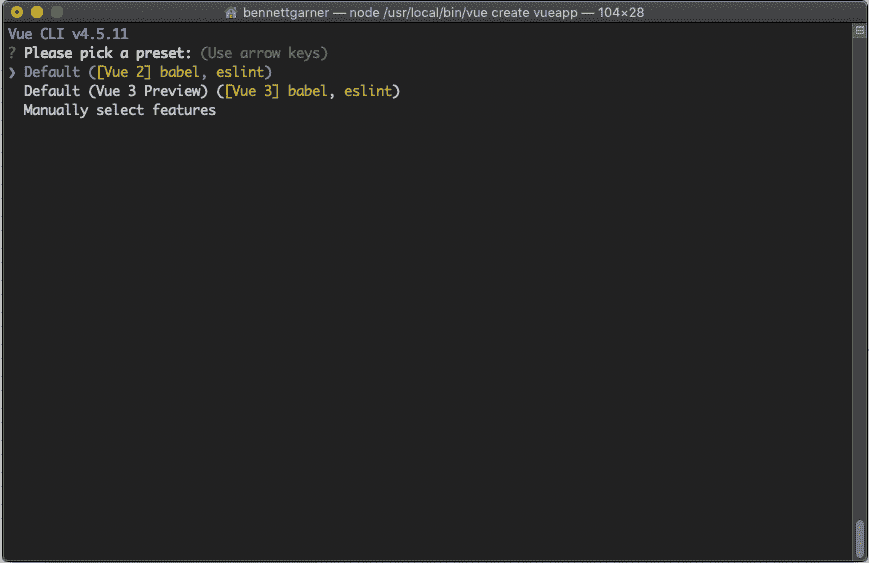
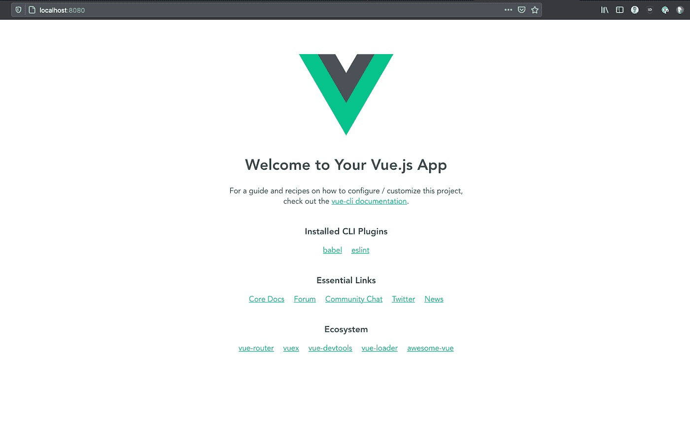
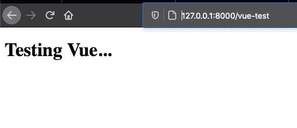
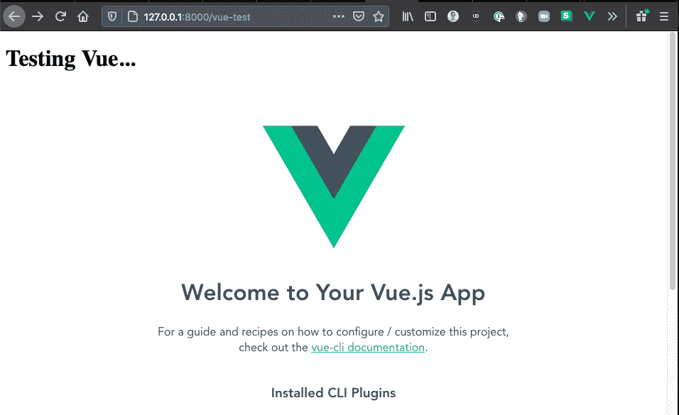

# Vue + Django:使用中。vue 文件和 Vue CLI

> 原文：<https://betterprogramming.pub/vue-django-using-vue-files-and-the-vue-cli-d6dd8c9145eb>

## 构建一个运行在 Django 上的全栈网站


由[安德鲁·庞斯](https://unsplash.com/@imandrewpons?utm_source=medium&utm_medium=referral)在 [Unsplash](https://unsplash.com?utm_source=medium&utm_medium=referral) 上拍摄。

在 Django 项目中开始使用 Vue.js 非常简单。

如果你只想构建几个简单的 Vue 组件，并把它们放到你的 Django 应用程序中，你可以用简单的方法——内联。我写了一整篇 Vue + Django 教程来演示这种方法:

[](https://levelup.gitconnected.com/vue-django-getting-started-88d3f4c2ba62) [## Vue + Django:入门

### 将 Vue 添加到 Django 应用程序非常简单！

levelup.gitconnected.com](https://levelup.gitconnected.com/vue-django-getting-started-88d3f4c2ba62) 

但是内联 JavaScript/CSS 是有限的，这种方法只能让你到此为止。我通过用 Vue 和 Django 开发应用程序亲身体会到了这一点。

# Django 可以很好地使用 Vue CLI 和 Webpack

为了充分利用 Vue，你可能需要使用 Vue 命令行界面和`.vue`文件。这些工具使您能够创建易于重用的组件，并使用 webpack 将 JavaScript 依赖项构建到您的项目中。但是它们也要求您编译和提供动态 JavaScript 资产，使部署变得复杂。

幸运的是，Django 有很好的工具来使用和部署静态文件，我们可以将它们与 Vue CLI 配对来非常容易地部署全功能的 Vue 应用程序。这需要一点点的配置，但下面是我如何让我的应用程序工作。

# 有经验的开发者:想跳过阅读看代码？

乐意帮忙:

[](https://github.com/bennett39/vue-cli-tutorial) [## Bennett 39/vue-CLI-教程

### 在 GitHub 上创建一个帐户，为 bennett39/vue-cli 教程开发做出贡献。

github.com](https://github.com/bennett39/vue-cli-tutorial) 

# 您需要知道的:Vue CLI 如何工作

[Vue CLI](https://cli.vuejs.org) 是启动全功能 Vue 项目的绝佳工具。它帮助您引导复杂 Vue 应用程序所需的所有配置。

CLI 在幕后使用 [webpack](https://webpack.js.org/) 将 JavaScript 资产编译成一个完整构建的应用程序，其中包含所有可用的依赖项。

*   当您使用 yarn(或 npm)运行`yarn serve`时，您是在告诉 webpack 编译必要的资产，然后启动一个 web 服务器来监听这些文件中的更改并重新编译结果。
*   当你使用 yarn(或 npm)运行`yarn build`时，webpack 会编译所有资产的优化版本，并将生产代码写入一个输出目录(通常是类似`dist/`的东西)。

Webpack 编译您的依赖项并为您构建它们，这样您就可以拥有多文件、复杂的 JavaScript 应用程序。这里要意识到的关键事情是，webpack 实际上可以在我们告诉它的任何地方编写应用程序的编译版本。

# 喜欢你在这里读到的吗？

我免费与我的电子邮件列表分享我最好的内容。

加入我的电子邮件系列中的 500 名其他开发人员。

# 让 Vue CLI 与 Django 一起工作

为了让 Vue CLI(和`.vue`文件)在 Django 内部工作，我们只需要告诉 webpack 把它的输出写到 Django 知道的某个地方。

如果我们将 JavaScript 资产写入 Django 可以通过其`[STATICFILES_DIRS](https://docs.djangoproject.com/en/3.1/ref/settings/#staticfiles-dirs)` [设置](https://docs.djangoproject.com/en/3.1/ref/settings/#staticfiles-dirs)检测到的目录，那么 Django 将像其他文件一样提供这些文件。

由于 Django 本身可以检测静态文件中的变化，我们可以在使用`yarn serve`的同时使用`python manage.py runserver`来动态获取开发过程中 web 应用程序中的任何变化。

到了部署的时候，我们只需要`yarn build`Vue 应用程序，然后运行`python manage.py collectstatic`来确保所有的生产文件对 Django 都可用。

# 装上电线

如果它看起来太容易是真的，那是因为它实际上相对简单。通过 Django 使用 Vue CLI 有六个步骤:

1.  在 Django 内部启动一个 Vue CLI 项目。
2.  在 Django 模板中使用 Vue 应用程序/组件。
3.  设置 Django 静态文件。
4.  配置 Vue 来构建 Django 静态文件的资产。
5.  在开发中，用`manage.py`运行 Django，用`yarn serve`运行 Vue。
6.  对于部署，构建 Vue，然后使用 Django 的`collectstatic`。

听起来够简单吗？让我们开始吧。

# 1.在 Django 项目中启动一个 Vue CLI 项目

我假设您已经有了一个 Django 项目，它看起来像这样:

```
.
|-myproject
| |-asgi.py
| |-__init__.py
| |-settings.py
| |-urls.py
| |-wsgi.py
|-myapp
| |-migrations
| | |-__init__.py
| |-models.py
| |-__init__.py
| |-apps.py
| |-admin.py
| |-tests.py
| |-views.py
|-manage.py
```

如果你还没有 Django 项目，这里有一个我制作的关于如何开始一个项目的视频(只是用了不同的项目名称):

如何开始使用 Django

要添加 Vue，您需要[安装 Vue CLI](https://cli.vuejs.org/guide/installation.html) 并[在您的项目的基本目录中创建一个新的 Vue 项目](https://cli.vuejs.org/guide/creating-a-project.html#vue-create)(其中`manage.py`是):

```
vue create vueapp
```

然后选择您的配置设置:



我们现在将使用 Vue 2，因为 Vue 3 还没有完全发布和支持。

接下来:

```
cd vueapp/
yarn serve
```

要检查您的安装，请转到 [http://localhost:8080/](http://localhost:8080/) :



## 它是如何工作的？

好吧，让我们弄清楚它是如何工作的。看一看`vueapp/src/main.js`:

注意，Vue 在任何找到 ID 为`#app`的元素的地方创建/挂载一个 Vue 实例。这意味着如果我们可以让 Vue 加载 Django 模板，我们应该只需要`<div id=”app”>`就可以让 Vue 在页面上初始化。

然后我们可以在 Django 模板中使用 Vue 组件！

# 2.创建一个测试 Django 模板

您可能已经有了一个 Django 模板，希望 Vue 加载到这个模板中。如果是这样，那太好了。你可以用这个。

为了简单明了，我将在一开始创建的 Django 应用程序`myapp/`中创建一个新模板(和视图/URL)。

这是模板。现在让我们再做一些更新，这样它就有了一个 URL 和视图:

应该可以了。现在导航到[http://127 . 0 . 0 . 1:8000/vue-test](http://127.0.0.1:8000/vue-test)，您将看到我们的测试模板正在加载，但还没有加载 Vue 部分！



让我们将 Vue 安装到页面上的`#app`元素上！

# 3.建立姜戈的静态文件

我们需要的第一件事是 Vue 文件在构建后有一个存放的地方。我们需要姜戈知道那个地方。

如果你的应用程序中根本没有设置静态文件，你可以[遵循 Django 文档](https://docs.djangoproject.com/en/3.1/howto/static-files/)来确保你的设置是正确的。如果你是从零开始学习本教程，它们应该是正确的。

在我们的例子中，Vue 文件不一定绑定到特定的 Django 应用程序，所以我们希望在项目根目录下为静态文件创建一个通用位置。

1.  在项目根目录(`manage.py`所在的位置)，创建一个名为`static/`的新文件夹，它将保存我们从 Vue 构建的所有文件。
2.  在`myproject/settings.py`中，我们需要更新`staticfiles`设置，以便 Django 知道这个新目录。这些设置通常在文件的最底部。

注意，我们让`STATIC_ROOT`指向我们项目中一个新的不存在的文件夹:`var/static_root/`。Django 会为我们创建并管理这个文件夹。到了部署的时候，这个文件夹会很重要。

当您完成更改后，请进行测试！

```
$ python manage.py collectstatic131 static files copied to ‘/Users/bennettgarner/Repos/vue-cli-tutorial/myproject/var/static_root’.
```

# 4.在配置中指向 Vue 项目的构建目录

好了，Django 现在正在收集和服务我们的静态文件，一旦 Vue 文件被编译好，我们就有地方放它们了。我们只需要告诉 Vue 把它们放在哪里。

我们可以通过创建一个文件来覆盖 Vue 的默认配置:`vueapp/vue.config.js`

*注意(2022–04–20):如果您使用的是较新版本的 Vue/webpack，上述配置可能无法按预期工作！我收到读者反馈，上面的* `*devServer*` *部分需要更改…*

```
devServer: {
  devMiddleware: {
    // see [https://github.com/webpack/webpack-dev-server/issues/2958](https://github.com/webpack/webpack-dev-server/issues/2958)
    writeToDisk: true, 
  }
},
```

我没有测试过这种变化，但听起来很合理，似乎应该行得通！

这是怎么回事？

*   告诉 Vue 一旦它在互联网上，在哪里寻找它的其他文件。基本上，我的其他文件将生活在什么网址。Django 把它们都放在`STATIC_URL`和输出目录的路径后面。
*   `outputDir`告诉 Vue 在文件系统中的什么地方写它的文件。这是一个大文件，在这里我将它指向`static/`(我们刚刚添加到`STATICFILES_DIRS`)加上一个命名空间路径，以确保 Vue 文件不会与其他文件混淆。
*   默认情况下，Vue 会对文件名进行哈希处理，这样我们就可以确保拥有最新的版本(而不是文件的缓存旧版本)。然而，这破坏了 Django 预测和跟踪文件名变化的能力。相反，我们可以在 Django 中使用`[ManifestStaticfilesStorage](https://docs.djangoproject.com/en/3.1/ref/contrib/staticfiles/#django.contrib.staticfiles.storage.ManifestStaticFilesStorage)`来完成同样的任务。
*   运行时编译器是打开的，因为我们正在用 webpack 做棘手的事情，我想要完整的构建。如果您的项目不需要此设置也可以删除它。它将使您的部署重量减轻 30%。[阅读 Vue 文档中的运行时编译器](https://vuejs.org/v2/guide/installation.html#Runtime-Compiler-vs-Runtime-only)。
*   我们在开发模式下写入磁盘，这样 Django 就可以获取这些文件，而不是在 Vue 中动态编译。

试试吧！

1.  `cd vueapp/`
2.  `yarn serve`
3.  用`ctl+c`取消服务器。
4.  `ls ../static/src/vue/dist/`

您将看到我们所有的 Vue 文件都构建到了 Django 应用程序的静态目录中！

# 5.用 manage.py 在开发中运行 Django

现在我们只需要将静态 Vue 文件添加到我们之前制作的模板中。编辑`myapp/templates/myapp/vue-test.html`:

我们希望 Vue 文件在页面的其余部分已经加载之后再加载，所以它们在底部。

测试一下！

1.  在项目根:`python manage.py runserver`
2.  打开一个新的终端选项卡，并转到`vueapp/`运行`yarn serve`。
3.  转到[http://127 . 0 . 0 . 1:8000/vue-test](http://127.0.0.1:8000/vue-test)。



我们做到了！这就是 Django 模板中正确呈现的`.vue`文件组件！

# 6.为部署构建 Vue + collectstatic

部署时，您会希望:

1.  启用`[ManifestStaticfilesStorage](https://docs.djangoproject.com/en/3.1/ref/contrib/staticfiles/#django.contrib.staticfiles.storage.ManifestStaticFilesStorage)`来帮助版本控制和缓存破坏。
2.  把你的代码按原样推上 GitHub/GitLab 或者你用的任何东西。
3.  作为部署命令的一部分，`yarn build`和`python manage.py collectstatic`。

# Vue CLI 和。Django 的 vue 文件

稍微配置一下，Vue 和 Django 就能很好的配合了！

现在，您可以使用示例应用程序并对组件进行编辑，就像对任何其他 Vue 项目一样。Django 会注意 Vue 正在写的文件，然后将它们作为静态资产。

## 最后提醒

不要忘记:Vue 在页面上寻找一个`#app`元素，所以你在任何想要使用 Vue 的地方都需要它。

此外，在任何想要使用 Vue 的页面上，您都需要脚本标签。这里的最佳实践是用所有这些信息在 Django 中创建一个部分[基础模板，然后您可以为自己的页面扩展这些信息。](https://docs.djangoproject.com/en/3.1/ref/templates/language/#template-inheritance)

就是这样！恭喜你，你在 Django 上运行了一个全栈网站！

# 关于班尼特

我是一名用 Python 和 JavaScript 构建东西的 web 开发人员。

想要我关于 web 开发和成为更好的程序员的最佳内容吗？

我在邮件列表中分享我最喜欢的建议——没有垃圾邮件，没有推销内容，只有有用的内容。

[加入我的电子邮件系列中的其他 500 名开发人员。](https://sunny-architect-5371.ck.page/0a60026a5d)