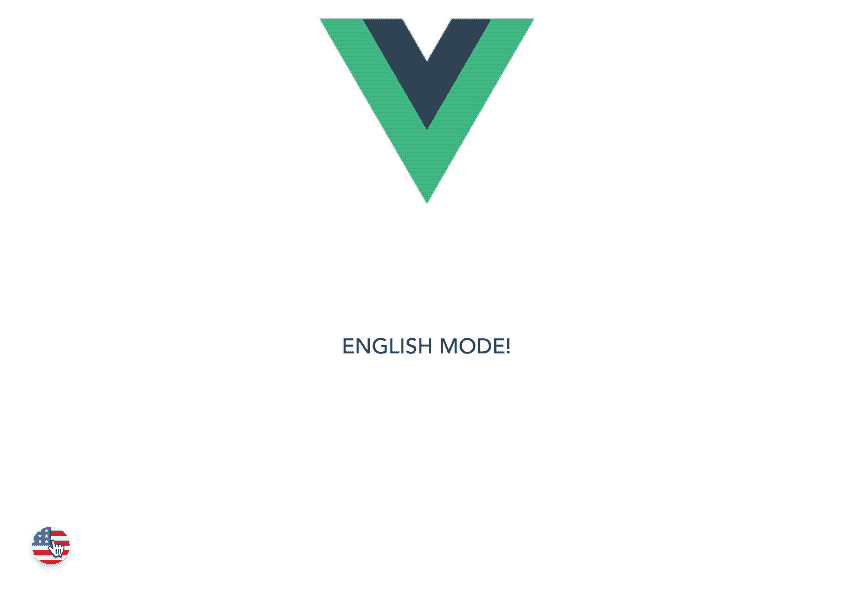
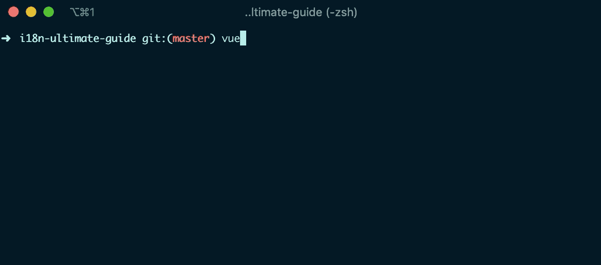
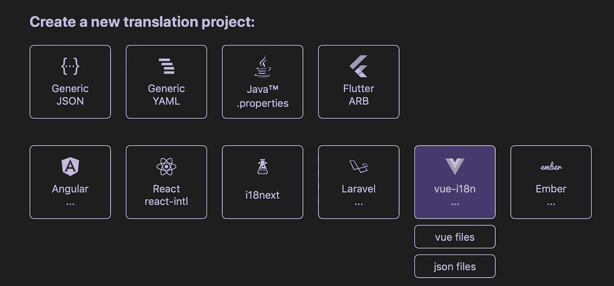
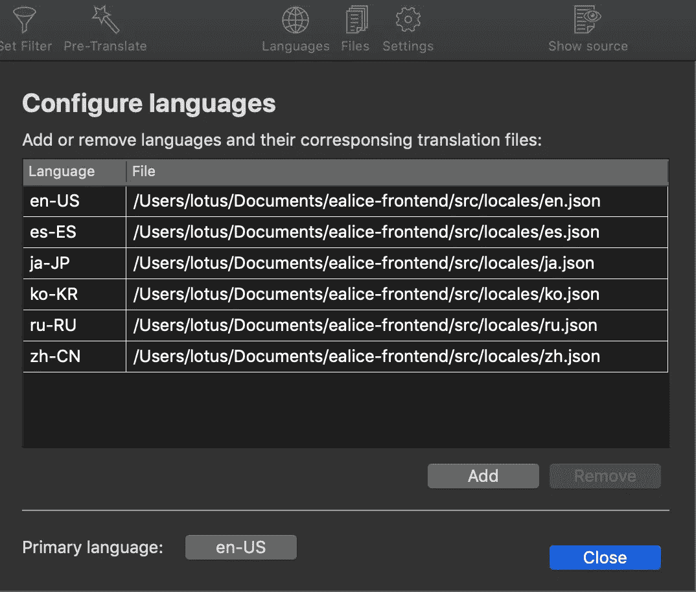
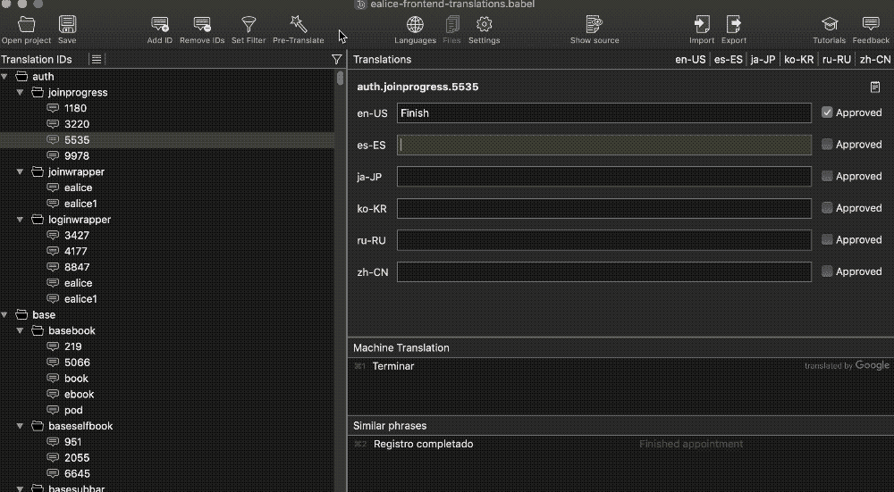
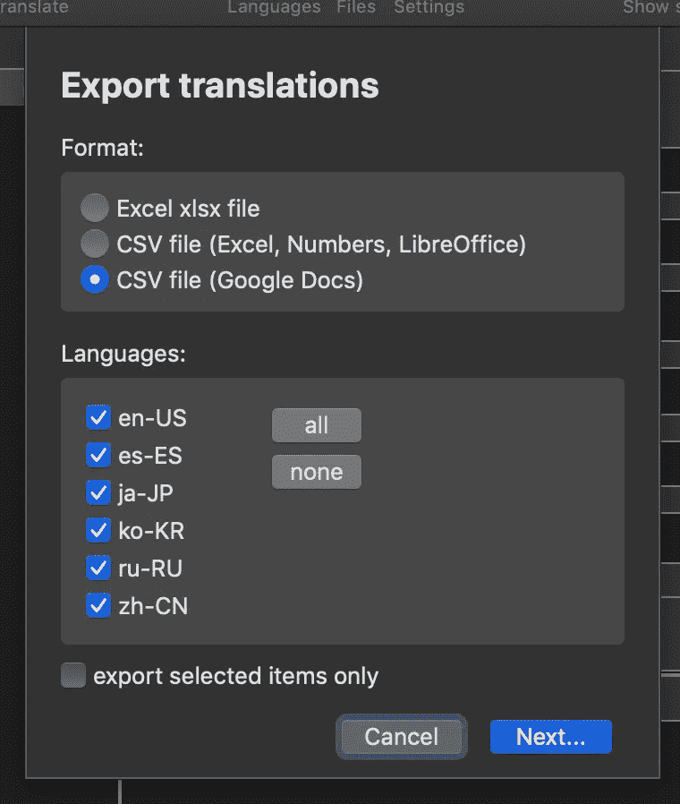
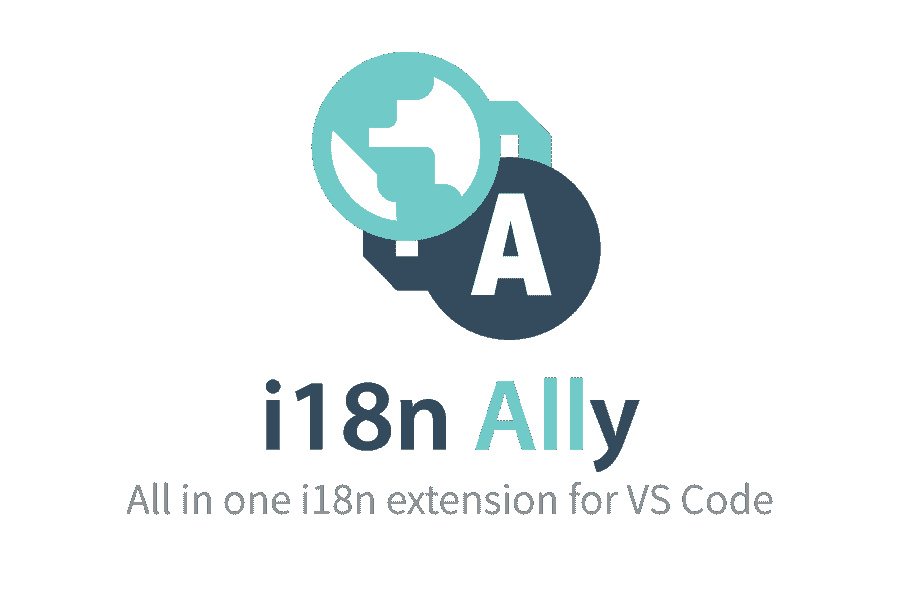
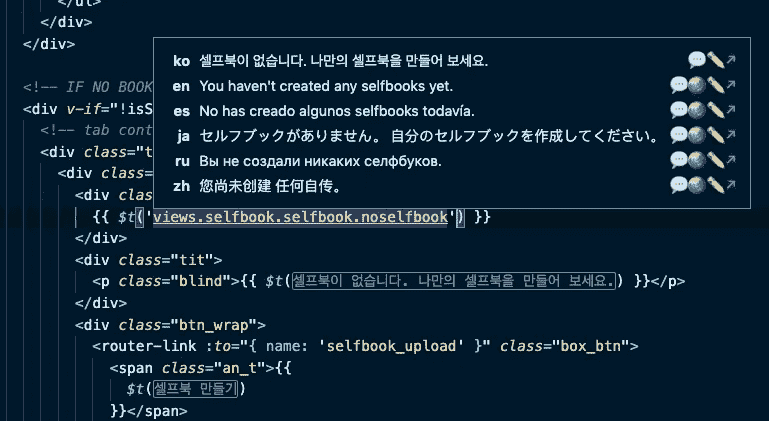
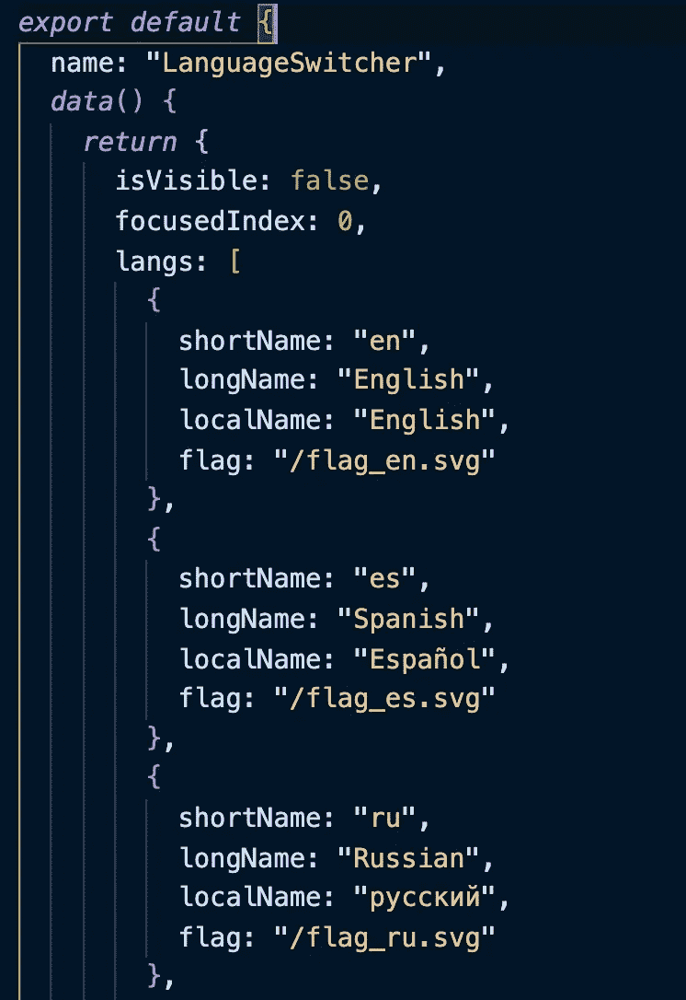

# 仅用 1 小时翻译任何 Vue.js 应用程序

> 原文：<https://betterprogramming.pub/vue-i18n-ultimate-guide-fb3d9db48c94>

## 本地化任何规模应用程序的终极自动化工作流程


照片由[纳里塔·马丁](https://unsplash.com/@splashabout?utm_source=unsplash&utm_medium=referral&utm_content=creditCopyText)在 [Unsplash](https://unsplash.com/s/photos/flags?utm_source=unsplash&utm_medium=referral&utm_content=creditCopyText) 拍摄，编辑为泰特斯·卡塔利

# ***更新:***

> 这篇文章是 Vue 播客上的观点，在那里我广泛地谈论了我的编程之旅，以及我如何使用下面的方法来更好地本地化项目。

## **听这里:** [**对 Vue 的看法:第 153 集**](https://devchat.tv/views-on-vue/localize-any-vue-app-in-less-than-an-hour-with-titus-decali-vue-153/)

## **这是*而不是*典型的 vue-i18n 指南**

这不仅仅是一个安装方法，它是一个通过许多应用程序本地化项目精心制作的定制工作流，将使您的应用程序翻译困难成为过去。

***【TLDR:****对于那些想要快速入门，或者想简单地将我的* `*LanguageSwitcher*` *组件和 i18n 脚本复制到你自己的项目中的人来说，我已经建立了一个 Github repo，它已经准备好了一切。下载吧* [*这里*](https://github.com/titusdecali/vue-i18n-ultimate-guide) *。*

*然而，如果你不读这篇文章，你会错过所有真正的***自动化秘密！**

*在更多地区推出意味着让更多的观众以更自然、更吸引人的方式接触你的产品。*

*这听起来很棒，但事实是翻译 web 应用程序是一个非常耗时的过程。*也就是直到现在。**

**“但是，我的 app 大，”*你说。“它有，好像，一万根弦！我该如何将它们添加到八个不同的语言环境文件中呢？”*

*就像一个纽约黑帮卖给你的东西好得令人难以置信一样，我反驳道:“胡说八道！”自动化是来为我们做重活的！因此，请系好安全带，准备好立即拥有一个完全翻译的 web 应用程序。*

# *这个过程给了你什么*

*   *为每个文本字符串自动生成唯一的翻译关键字。*
*   *通过谷歌翻译(BabelEdit)获得所有语言的翻译。*
*   *允许翻译人员通过编辑谷歌表单来改进您的翻译。*
*   *轻松管理您的所有翻译，并在几秒钟内更新它们。*
*   *在任何项目中使用我的`LanguageSwitcher`组件可以更快地开始。*

**

*从我的 [**github repo 这里**](https://github.com/titusdecali/vue-i18n-ultimate-guide) 获取这个组件*

## *我们将使用什么*

## ***Vue.js***

*我们将使用一个为 Vue 构建的包，名为 vue-translation-manager。(对于任何使用 React 的人来说，[这个](https://www.npmjs.com/package/react-intl-translations-manager)看起来是个不错的选择——尽管我还没有测试过)*

## ***BabelEdit***

*每当我们在应用程序中添加新的语言时，这款适用于 Mac、Windows 和 Linux 的神奇应用程序将帮助我们管理、编辑和获得来自谷歌(和其他公司)的即时翻译。有一个免费的试用版，如果你需要更多的预翻译单词，授权版本的价格非常合理。*

## ***VSCode***

*为了获得最好的功能，我们将使用一个方便的 VScode 扩展，所以我推荐使用 VScode。这不是必需的，但是如果您还没有将 VScode 与 Vue 一起使用，那么您就错过了！*

## ***谷歌工作表***

*我们会将我们的翻译导出到 Google Sheets，这样翻译人员就可以轻松地仔细检查和编辑我们将从 Google Translate(通过 BabelEdit)获得的预翻译文本。他们将能够在 Google 文档中编辑文本，而不是直接在代码或难看的 Strings.json 文件中编辑！*

# *步骤 1:安装 i18n*

*首先，我们将添加`vue-i18n`:*

```
*npm install vue-i18n*
```

*或者经由`Yarn` **:***

```
*yarn add vue-i18n*
```

*然后我们将`i18n`导入到我们的`main.js`文件中:*

```
**import* i18n *from* "./i18n";*
```

*(别忘了还包括在`main.js`的底部！)*

```
*new ***Vue***({
  i18n,
  *render*: h => *h*(App)
})*.$mount*('#app')*
```

*查看 [**full vue-i18n 文档**](http://kazupon.github.io/vue-i18n/installation.html#compatibility-note) 了解更多安装选项。*

## ***更新:Main.js 中的**Vue 3**i18n**安装，请看下面这个要点:*

*除了 main.js 设置之外，一切都与 Vue 2 相同*

# *步骤 2:准备 i18n*

*现在我们准备添加一些额外的配置，按照我们想要的方式设置。*

*只需复制下面的要点并粘贴到您的`i18n.js`文件中，该文件是在您安装 i18n 时在`/src`文件夹中生成的。*

*这包括 i18n 提供的基本脚本，以及我添加的另外两个脚本，它们允许我们:*

*   *当我们改变语言时，切换到正确的`language.json`文件。*
*   *检测用户的默认浏览器语言，并在第一次加载时设置(不错！)*

***i18n.js** ( /src 文件夹)*

## *添加环境变量*

*为了使上述脚本在根据用户的浏览器语言设置语言时正确工作，以及在返回默认语言时(当浏览器语言不可用时)，我们需要在我们的`.env`文件中添加上述环境变量。*

*在你的项目文件夹的根目录下，在`.env.local`和`.env.prod`文件中(如果你还没有的话创建它们)，添加下面两个变量并根据需要设置它们的值。*

```
*VUE_APP_I18N_LOCALE=en
VUE_APP_I18N_FALLBACK_LOCALE=en*
```

*如果您没有将上述内容添加到`.env`文件中，您的用户可能会遇到默认标志图标加载不正确的问题，因此如果他们使用的浏览器使用不支持的语言
*(即:没有默认选项可退)。**

# *步骤 3: **添加 vue 翻译管理器***

*是时候添加一个精彩又鲜为人知的包了。它将为我们项目中的每个文本字符串自动搜索和生成翻译键。*

*我曾经为一个大项目手工做过一次，花了一个多星期。有了这个软件包，您将在几分钟内完成。*

```
*npm install vue-translation-manager --save*
```

*下面是 vue-translation-manager 提供的基本配置文件。
关于这一点以及他们如何使用 JSON 适配器的更多细节，请查看这里的文档。*

*现在，只需将下面的要点粘贴到一个新文件中，该文件将在项目的根目录下创建，名为`.vue-translation.js`*

*在您将此文件添加到项目之前，vue-translation-manager 不会运行。*

***。vue-translation.js** (在项目的根文件夹中)*

# *第四步:自动化这些键！*

*这是这个工作流程中最节省时间的部分。既然 vue-translation-manager 已经完全设置好了，我们只需要告诉它开始工作。*

*在您的终端中，转到项目文件夹并键入以下内容:*

```
*vue-translation-manager translate*
```

*只需按照 CLI 的指示进行操作，但此时最好从一种语言开始——您的基础语言。如果我们只有一种语言开始，软件包会更快地完成它的工作*

*如果我们有不止一种语言，这个过程既会添加翻译关键字，也会输入我们添加的翻译文本。它还会根据字符串在文件夹结构中的位置来命名每个键。这意味着我们所有的`translation.json`文件开箱后都将是完美的结构！厉害！*

**然而，由于我们稍后会自动翻译，我建议你只要按住回车键，让所有文本都是同一种语言。别担心，下一步我们会添加更多语言并为所有文本生成翻译。**

**

*这里有一个你可能会看到的快速 gif*

*vue-translation-manager 包仍然很新，除了按住 ENTER 键直到它通过我们的整个应用程序，我不知道有什么更快的方法来完成这个过程。我已经发布了关于这个问题的 github 问题，正在等待反馈。*

*不管怎样，这一步比手动操作要快得多，我相信我们很快会得到一个改进的方法。我已经从软件包的创建者那里听说他们正在开发 2.0 版本。*

# *第五步:让谷歌翻译所有的东西*

*对于这一步，我们将使用一个名为 [**BabelEdit**](https://www.codeandweb.com/babeledit) 的神奇桌面应用。它适用于 Mac、Windows 和 Linux，使管理我们的翻译变得容易。从现在开始，我们将使用 BabelEdit 来编辑和保存翻译更改，而不是直接在`~.json`语言文件中编辑它们。这样，我们将有一个字符串的真实来源，这也将让我们与翻译人员合作，通过 Google Sheets 将我们的应用程序更新为本地级别的翻译。*

*首先，让我们[安装 BabelEdit](https://www.codeandweb.com/babeledit) 。*

*这是我们管理和添加项目翻译的新家。*

*BabelEdit 为各种框架提供了相当多的选项和支持:*

**

*根据我们的需要，我们将使用`Vue.js ➤ .json files`。*

**但是，如果您的项目设置与我不同，并且希望在每个单独的组件/视图文件中使用翻译，那么在这一步您可以选择* `*vue files*` *。您还可以根据需要将文件拖放到 BabelEdit 上！**

*在这一点上，我们现在可以添加任何额外的语言(除了我们的基本语言)，我们希望在我们的应用程序中提供。打开您的项目文件夹后，只需使用`Languages`按钮并根据需要添加它们。您也可以在这里设置您的基础语言，所有其他语言都将从这里翻译过来。*

**

*添加完所有语言后，点击`Pre-Translate`。这将使用谷歌翻译 API 获得我们整个应用程序的初始翻译。BabelEdit 的创建者还表示，DeepL 和 Microsoft Translate 的翻译将很快在更新中提供。*

*没错—点击一个按钮，您就可以获得所有语言的即时翻译！虽然预翻译并不完美，但他们会给译者一个基础，这将使他们的工作比过去编辑文件容易得多。*

**

*BabelEdit 的自动翻译用户界面*

*BabelEdit 有很多很酷的功能，用户界面非常直观。如果您发现您的项目大到足以达到 BabelEdit 试用帐户的翻译限制，您可能会考虑升级到许可版本。对于较小的项目，试用版可能会覆盖您。一份许可证副本将为你提供 250，000 个字符的预翻译机器翻译，而且价格惊人地合理。*

**注:我和 BabelEdit 绝对没有任何隶属关系。这只是一个很好的工具，我很乐意与他人分享，我知道你会喜欢的。**

# *第六步:*

*好了，我们已经接近终点线了！*

*为了让我们的翻译人员能够在一个更高效、更易用的界面中润色我们应用程序的翻译文本，我们将把我们的语言文件发送到 Google Sheets。*

## ***过程很简单***

*点击`export`按钮，选择您想要发送到 Google Sheets 的所有翻译，然后选择`🔘 CSV file (Google Docs)`*

**

*然后，我们只需将`.csv`文件导入到新的谷歌表单
(谷歌表单中的`File ➤ import`)中，并与我们的翻译人员共享，他们可以根据需要进行更改。*

*翻译人员完成所有工作后:*

1.  *将文件从 Google Sheets 导出为`.csv`*
2.  *在 BabelEdit 中再次打开该项目*
3.  *导入更新的文件*
4.  *`Save`变化*

*我们所有的翻译现在都在我们的网络应用程序中。轻松点。*

*请记住—我们总是从左到右工作:*

*`Google Sheets ➤ Import into BabelEdit ➤ Save to app`*

*如果我们开始在我们的应用程序中编辑东西，它们会在我们下次导入并保存 Google Sheet 时被覆盖。我们不要那样做。*

***记住，现在所有的东西都只能朝一个方向流动！***

# *步骤 7:让我们的模板再次变得伟大*

*既然我们已经翻译了所有的模板，那么在编辑我们的代码时，要看清楚什么是什么就有点困难了。 [**i18n-ally**](https://marketplace.visualstudio.com/items?itemName=antfu.i18n-ally) 是来救我们的。*

**

## *i18n-盟友*

*[拿过来](https://marketplace.visualstudio.com/items?itemName=antfu.i18n-ally)。在我们将所有内容转换为翻译关键字后，这将在模板中显示我们所有的翻译文本。*

*它将从这里获取我们的模板:*

**

*如果没有 i18n-ally，则只显示转换键*

*对此:*

**

*有了 i18n-ally，精美的翻译预览！*

*现在，当我们将鼠标悬停在一个翻译键上时，我们将能够看到所有其他可用的翻译。相当酷！*

*`i18n-ally`在 VScode 里面也提供了自己的编辑器。然而，由于我们将为此使用 BabelEdit，我们将不需要这个特性。如果你想检查一下，看看他们的文件。通过 VScode settings.json 文件很容易启用。*

*你可能也知道，安装 i18n 后，如果你在终端中输入`vue ui`,也会出现一个翻译编辑界面。不过，还是那句话，我们不需要这些。多亏了 BabelEdit，我们正在走的路已经铺上了黄金！*

**

*预览所有翻译*

*您可能想要更改模板中显示的默认语言。在上面，我把它设置为`ko`(韩语)。*

*例如，如果您想将其更改为英语，只需编辑 VSCode 的`settings.json`文件，如下所示:*

*   *在菜单栏中，转到`*Code menu ➤ Preferences ➤ Settings*`，然后单击 VScode 右上角的图标，该图标看起来像一个带有弯曲箭头的文档。*
*   *然后在底部右括号前粘贴以下内容:*

```
*“i18n-ally.displayLanguage”: “en”,*
```

# *步骤 8:设置你的显示语言*

*现在一切都已设置好，我们的翻译过程也尽可能自动化，我们已经做好了准备，可以开始本地化我们可能构建的任何大小的应用程序。*

*最后，我们想给我们的用户一种轻松改变语言的方法。我已经构建了一个非自以为是的组件，您可以根据自己的需要轻松地对其进行定制，该组件就是做这件事的(这是本文顶部的 gif 预览)。它将与任何 Vue 应用程序一起开箱即用，您可以根据需要更改样式。*

*要将其添加到您的项目中，只需转到 [my GitHub repo](https://github.com/titusdecali/vue-i18n-ultimate-guide) ，将其复制到您的 components 文件夹中，然后导入并在您的`app.vue`文件中使用它，以允许用户在您的应用程序中的任何位置访问它。*

*这个组件是为适应你添加的任何语言而设计的，它不需要任何额外的大小调整。*

*如果您想添加另一种语言，只需将其添加到`LanguageSwitcher`组件的`langs`数组中，确保添加我尚未提供的任何缺失的语言标志。*

**

*在此向语言切换器添加新语言*

*好了，就这样吧，伙计们！我希望这个指南是有用的，并且你和我一样发现这些工具是必不可少的。*

*祝你好运！*