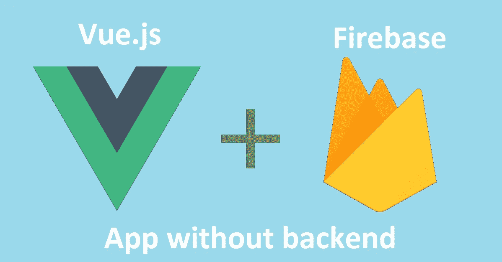
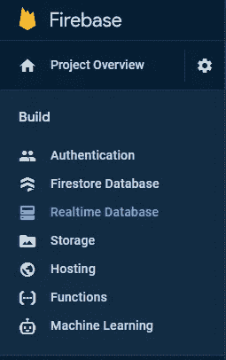
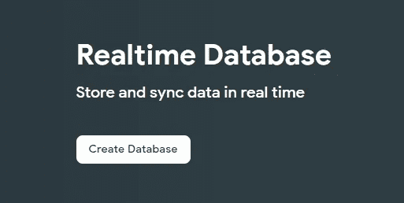
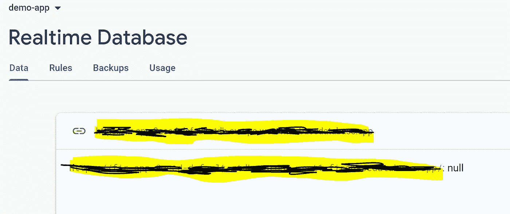
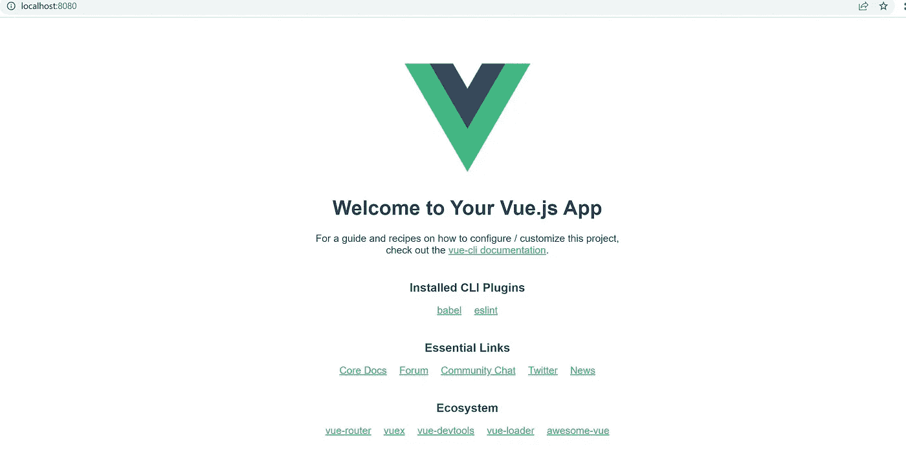
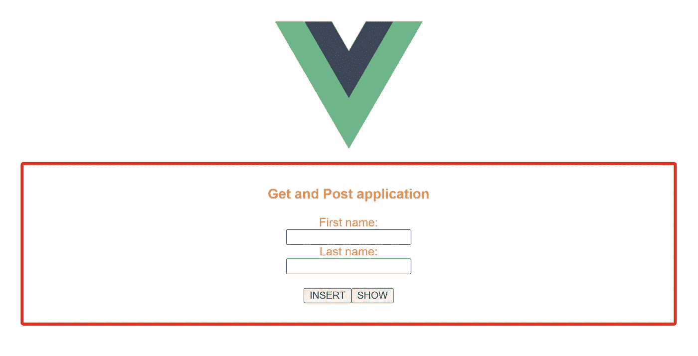
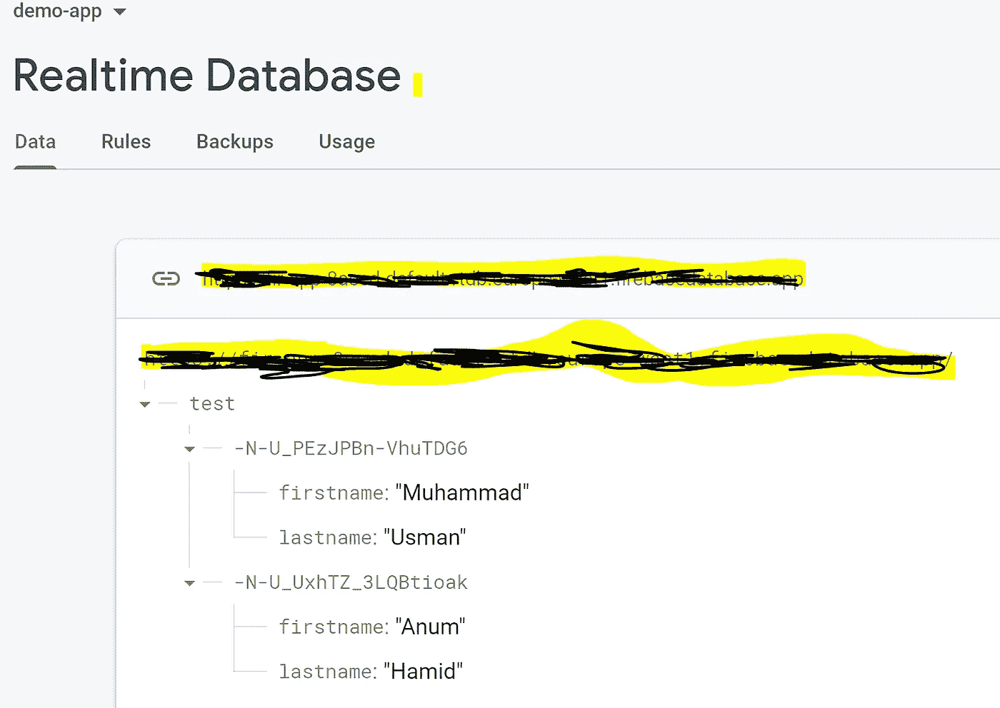
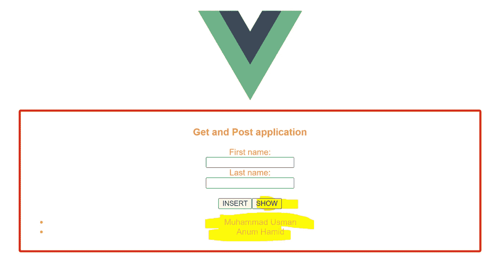

# Vue.js 遇上 Firebase:不写后端如何开发一个应用？

> 原文：<https://betterprogramming.pub/vue-js-firebase-how-to-develop-a-app-without-writing-backend-11f9de6f76bc>

## 想在不编写任何后端逻辑和不配置任何数据库的情况下开发一个应用程序吗？是的，你能做到。



谷歌开发了一个名为 Firebase 的平台，用于创建移动和网络应用程序。Firebase 提供了跟踪分析、报告和修复应用程序崩溃以及创建营销和产品实验的工具。您甚至可以通过 Firebase 实时部署应用程序，而无需设置服务器或云实例。

## 什么是 Firebase？

```
Firebase Real-time Database is a NoSQL cloud database that is used to store and sync the data. The data from the database can be synced at a time across all the clients such as android, web as well as IOS. The data in the database is stored in the JSON format**,** and it updates in real-time with every connected client.
Reference: [https://firebase.google.com/](https://firebase.google.com/)
```

> 本文的目的是展示如何用 Firebase 连接任何技术的前端应用程序，而无需编写一行后端代码，也无需配置任何数据库。这并不意味着它可以在没有任何后端代码的情况下工作和存储数据。Firebase 为你做任何事。感谢 Firebase 提供了这样的平台，它会自动管理你所有的后端问题。当您创建数据库时，它会自动为客户端创建 HTTP API 端点，并为开发人员提供一个引用 URL。通过它我们可以获得并插入我们的数据到 Firebase 数据库。

让我们开始开发应用程序。

# 设置 Firebase 帐户

1.  前往火力基地:[https://firebase.google.com/](https://firebase.google.com/)
2.  点击*开始*或*进入控制台*。
3.  点击*添加项目*，输入项目名称。
    我用的是`demo-app`项目名。
4.  然后点击 *next/continue* ，新项目创建完成。
5.  成功创建项目后，如图-1 所示，从仪表板左侧选择“*实时数据库*”。



图 1:仪表板的左侧面板

6.如图-2 所示，点击仪表盘中的 ***创建数据库*** 。



图 2:创建实时数据库

7.它将打开一个向导，要求选择您想要存储数据的'*数据库位置*'。在我的例子中，我选择了比利时 T21，你可以选择任何你想要的。接下来，它将询问'*安全规则*'。请在单选选项中选择“*在测试模式下启动*”。

8.点击*启用*按钮，将为您创建一个如图-3 所示的实时数据库。我把我的网址藏在这里。“null”表示您有空数据库。



图 3:数据库中数据的概述

9.复制数据库的'*引用 URL* ，稍后我们将在应用程序中使用它来获取数据并将其发送到数据库中。

# 设置前端应用程序

你可以选择前端的任何技术，无论你想要什么。要么 React，Vue，Angular，要么 Vanilla JavaScript。它适用于所有人。为了方便起见，我选择 Vue.js，因为我有 Vue.js 的专业知识。

## 先决条件

您的系统必须安装 node.js。否则，根据您的操作系统从官方网站下载安装程序。
[NodeJS](https://nodejs.org/en/download/)

## 创建一个 Vue 项目

1.  打开终端并运行命令:

```
$  npm install -g [@vue/cli](http://twitter.com/vue/cli)
```

2.通过运行以下命令创建 Vue 应用程序:

```
$  vue create demo-app
```

3.上面的命令创建了一个名为`demo-app`的项目文件夹。通过更改目录命令导航到`demo-app`目录:

```
$  cd demo-app
```

4.现在运行应用程序:

```
npm run serve
```

5.打开浏览器，进入` [http://localhost:8080/](http://localhost:8080/) `页面

它将显示 vue.js 欢迎页面，如图 4 所示。这意味着您的 Vue 应用程序工作正常。



图 4: Vue 应用程序欢迎页面

现在打开 VS 代码的项目文件夹，用下面的代码修改`src/components`目录下的`HelloWorld.vue`文件的内容。

示例代码:src/components/HelloWorld.vue

## 代码解释

让我们一段一段地解释这段代码:

1.  在模板标签中，div 标签用于用户界面上的 HTML 元素(input、label、list ),以显示用户输入和输出。
2.  script 标记中的 data 属性表示处理用户数据所需的数据属性。`fname` —将用户的名字表示为字符串，并使用 v-model 与`fname`输入字段绑定。
    `lname`将用户的姓氏表示为字符串，并使用 v-model 与`lname`输入字段绑定。`users`用于表示从 UI 存储的数据库中呈现的用户的列表/数组。
3.  method 属性保存了在`HelloWorld.vue`页面中使用的所有方法。上面的代码有两个方法，分别是:`click_post()`和`click_get()`，用于在 Firebase 中从实时数据库中插入/发送和获取用户数据。
    `click_post()` 方法使用 v-on 指令与 post submit 按钮绑定，用于将用户数据(`firstname`和`lastname`)插入到数据库中。函数定义使用内置的 fetch 函数来调用 API。方法和头字段是标准的，主体包含由用户的名字和姓氏组成的 JSON 内容。
    `click_get()`方法也使用 v-on 指令与 get to `submit`按钮绑定，用于从 Firebase 实时数据库中获取用户列表。这个函数还使用内置的 fetch 函数来调用 API 的端点。响应包含 JSON 对象，该对象可以被解析并存储在`users`数据属性中。
4.  模板中的无序列表`<ul>`标签迭代‘users’数据属性，并将所有用户显示为列表项`<li>`。

5.在方法`click_post()`和`click_get()`中，用 Firebase 实时数据库的`reference URL`替换 fetch 函数中的 URL。请注意，在网址后面，有`/test.json`。‘`test`’是数据库表名，用户的记录以 JSON 格式存储在这里。

现在在浏览器“”上打开应用程序，它将打开如下用户界面:



示例用户界面

## 运行应用程序

输入用户的名字和姓氏，点击`INSERT`按钮，将记录以 JSON 的形式插入 Firebase 数据库。



在 Firebase 实时数据库中以 JSON 格式存储的记录

现在点击`SHOW`按钮，它将显示存储在 Firebase 数据库中的所有用户。



显示存储在 Firebase 数据库中的用户列表

仅此而已。感谢阅读。

如果您想实时部署/托管您的应用程序。关注我的下一篇文章“***D***[***Vue app 的部署/托管使用 Firebase***](https://engrmuhammadusman108.medium.com/deployment-hosting-of-vue-app-using-firebase-20d2f6a6819b) ”。