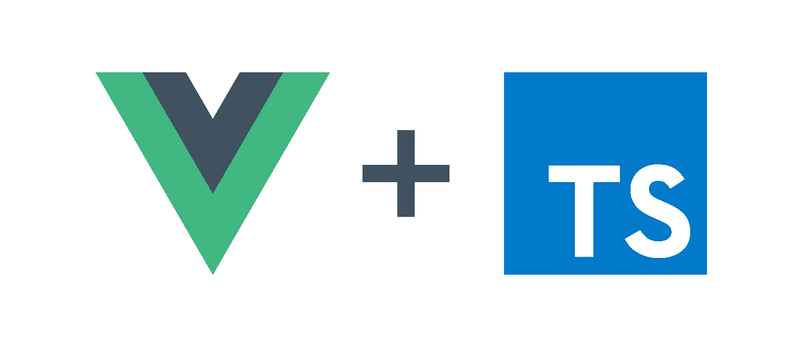

# 现代 JavaScript 生产设置

> 原文：<https://betterprogramming.pub/vue2-typescript3-production-set-up-92622933c690>

## 如何让 Vue.js2、TypeScript、webpack、ESLint、VSC 协同工作



# 介绍

普通 JavaScript 开发人员在一个新项目的设置上投入了多少时间？大约，永远。这就是为什么我认为让您了解我们的工具带实际上是如何工作的非常重要。在本文中，我将介绍一个用 [Vue.js2](https://vuejs.org/) 和 [TypeScript](https://www.typescriptlang.org/) 构建的客户端应用程序的典型设置。采用的工具将是:

*   ESLint+beauty+林挺样式 Lint +格式
*   我们构建过程的 webpack +依赖项
*   摩卡+ [柴](https://www.chaijs.com/) + [西农](https://sinonjs.org/)进行测试

如果你不同意我的一些选择，我很高兴听到你的想法，并可能更新这篇文章。

## 先决条件

本指南假设您具备以下条件:

*   Node.js 已安装([节点安装说明](https://www.digitalocean.com/community/tutorials/how-to-install-node-js-on-ubuntu-18-04))
*   Visual Studio 代码已安装([此处下载](https://code.visualstudio.com/download))
*   Git 已安装( [Git 安装说明](https://www.linode.com/docs/development/version-control/how-to-install-git-on-linux-mac-and-windows/))

# 初始化项目

我将描述我在创建一个新项目时所经历的各个步骤。如果你正在寻找关于某个特定主题的输入，直接跳到前面。

**TL；DR:** 你也可以克隆这个 [GitHub repo](https://github.com/MarcRoemmelt/Vue2-TypeScript3-Production-Set-Up) 。

## Visual Studio 代码

让我们从设置 VS 代码开始。创建一个项目文件夹，并在 VS 代码中打开它。然后，将其作为工作空间保存在该文件夹中(文件>工作空间另存为>…)。这将产生一个`xx.code-workspace`文件，允许我们为这个工作区指定配置。打开这个文件也将在 VS 代码中打开您的工作区。

我们最终的工作区配置将如下所示:

接下来，我们将安装一些(我几乎可以说是*基本*)扩展:

*   [**ESLint**](https://marketplace.visualstudio.com/items?itemName=dbaeumer.vscode-eslint) 会将我们的林挺集成到我们的代码编辑器中，当你违反代码的风格规则或犯下更严重的暴行时，它会通知你
*   [**stylelint**](https://marketplace.visualstudio.com/items?itemName=stylelint.vscode-stylelint)**将样式文件的林挺集成到编辑器中，并支持自动修复**
*   **[**Git lens**](https://marketplace.visualstudio.com/items?itemName=eamodio.gitlens)**集成 Git 版本控制。它允许您做 Git 能做的大多数令人惊奇的事情——但是直接在您的代码编辑器中。****
*   ****[**Vetur**](https://marketplace.visualstudio.com/items?itemName=octref.vetur)**带来了很多 Vue 特有的工具，从语法高亮到代码片段******
*   ******[**Chrome 调试器**](https://marketplace.visualstudio.com/items?itemName=msjsdiag.debugger-for-chrome) 允许我们在 Chrome 中运行应用时，在 VS 代码中调试应用源代码******

## ****。编辑器配置****

****这个简短的配置文件用于在不同的编辑器之间交流基本的编辑器样式选择，例如`tab-size`。你可以在这里阅读更多关于它的[。](http://editorconfig.org)****

****我通常对每种文件类型都使用相同的设置:****

## ****。nvmrc****

****这几乎是微不足道的，但是如果您碰巧在您的项目中使用不同版本的 Node.js，这就非常方便了。根目录中有一个`.nvmrc`文件允许您锁定正在使用的 Node.js 版本。它包含一行版本号，例如`12.14.1`。这里的[见](https://github.com/nvm-sh/nvm#nvmrc)。****

## ******package.json******

****接下来，我们将创建项目的`[package.json](https://docs.npmjs.com/files/package.json)`文件。该文件属于节点包管理器(npm)生态系统。它包含一些关于您的项目的配置，用于管理您的应用程序使用的第三方代码(依赖项)，并允许您定义简单的脚本，这些脚本通常用于触发带有正确选项的命令行工具。****

****它通常由`npm init`命令创建——但是您也可以手动创建 client/ `package.json`文件。如果您使用了`npm init`并接受了所有默认设置，您的文件将如下所示:****

****我们将逐步更新这个文件——现在我们可以保持不变。我鼓励你在这里了解更多关于它的信息[。](https://docs.npmjs.com/files/package.json)****

## ******Git******

****如果您从未听说过它，那么 [Git](https://git-scm.com/) 是使用最广泛的版本控制系统(而且是遥遥领先)。简单地说，Git 允许您复制、粘贴、恢复和合并代码。它帮助开发人员在相同的代码基础上工作，而不会干扰彼此的工作(大多数情况下)，同时提供整个项目的详细变更历史。只能说相当牛逼。****

****我们用命令`git init`创建一个新的 Git 存储库。****

****如果你想共享你的代码，在你的项目中添加一个远程存储库是很有帮助的(例如，在 [GitHub](https://github.com/) 上)。它允许你把你的代码`push`到一个公共可访问的服务器上。您可以使用以下命令添加远程存储库:****

```
**git remote add <remoteName> <remoteURL>**
```

****不要忘记，您可以通过将文件添加到一个`.gitignore`文件中来排除文件被 Git 跟踪。此文件包含也将被忽略的文件模式。应该跟踪`.gitignore`文件本身。点击阅读更多[。](https://git-scm.com/docs/gitignore)****

## ****打字稿****

****TypeScript 是 JavaScript 的一个超集(它包含 JavaScript 的所有功能，但在其上添加了一些功能— [如静态类型化](https://hackernoon.com/i-finally-understand-static-vs-dynamic-typing-and-you-will-too-ad0c2bd0acc7))。它在用 JavaScript 构建生产应用程序时变得非常流行，并且很快会成为编写 JavaScript 的默认方式。如果你想了解打字稿的优势(劣势)，我推荐这篇文章。****

****要运行 TypeScript，我们只需安装一个全局 npm 包:****

```
**npm install -g typescript**
```

****这个包使我们能够用`tsc`命令将`.ts`文件编译成`.js`——例如，`tsc index.ts`这个命令将在与原始`.ts`文件相同的文件夹中创建一个同名的`.js`文件。(我们不会使用这个命令，因为我们使用 webpack。)****

****下一次运行根文件夹(`Client`)中的`tsc --init`。这将创建一个`tsconfig.json`文件，其中充满了可用编译器选项的简洁摘要(这对于像我这样记忆力不好的人来说非常好)。****

****我们；我将向它添加更多的配置—请看一看:****

****你可以在[官方打字稿网站](https://www.typescriptlang.org/docs/handbook/tsconfig-json.html)上阅读所有选项的更全面的解释。****

## ******林挺/格式化******

****干净的代码看起来像是由一个人写的。Linters 允许我们执行特定的规则，使我们的代码整体上更具可读性。通常，linters 由两种类型的规则组成，以确保一致的编码风格:格式规则(例如，行不能超过 100 个字符)和代码质量规则(例如，避免使用`let`而使用`const`)。****

****JavaScript 中最常用的 linter 是 [ESLint](https://eslint.org/) 。我们将使用它，它令人惊叹的社区已经创建了几个有用的插件——例如，一个为单个文件组件应用 Vue 特定样式的插件。****

******注:**在`typescript-eslint`发布之前，你还得依靠 TSLint 来 Lint 打字脚本代码。然而，不可能在 ESLint 生态系统中使用 TSLint 的附加工具。这就是为什么我推荐大家使用`typescript-eslint`，尽管它的配置稍微复杂一些。****

****让我们安装所有必需的依赖项:****

*   ****`eslint`:基础 ESLint 包****
*   ****`vue-eslint-parser`:自定义解析器，允许 ESLint 解析`.vue`文件。这个解析器的输出将是一个`.js`文件，它具有代表文件块的导入依赖关系(例如`<template>`或`<style>`)。****
*   ****`@typescript-eslint/parser:`我们将告诉`vue-eslint-parser`使用这个解析器来解释写在`.vue`文件中的`<script>`块****
*   ****`@typescript-eslint/eslint-plugin`:ESLint 插件，应用特定于类型脚本的规则****
*   ****`eslint-plugin-vue`:将特定于 Vue 的林挺规则应用于单个文件组件，例如组件选项或元素属性的排序****
*   ****这些软件包可以让你和 ESLint 一起使用 beautiful。漂亮的是一个强大的代码格式化程序，具有强大的自动修复能力。****

```
**npm i -D eslint vue-eslint-parser @typescript-eslint/parser @typescript-eslint/eslint-plugin eslint-plugin-vue prettier eslint-config-pretter eslint-plugin-prettier**
```

****为了将所有这些位放在一起，我们必须定义包含 ESLint 配置的`.eslintrc`文件。****

****当然，你可以根据自己的喜好改变规则——唯一重要的是坚持一套规则。你可以在这里阅读更多关于 ESLint [的内容。](https://eslint.org/docs/user-guide/getting-started)****

******注意**:我们还在一个`.prettierrc`文件中添加了更漂亮的配置。****

```
**{
  "arrowParens": "always",
  "trailingComma": "all",
  "singleQuote": true,
  "printWidth": 120,
  "tabWidth": 2
}**
```

******棉线******

****您可能已经猜到了— [stylelint](https://stylelint.io/) 允许您对各种样式文件实施规则。它远没有 JavaScript 林挺重要；然而，我喜欢我的文件整洁。****

```
**npm i -D stylelint stylelint-webpack-plugin stylelint-config-sass-guidelines stylelint-config-standard**
```

****将一个`.stylelintrc`文件添加到您的根文件夹，并添加您的配置:****

******注意:**使用`no-empty-source`规则——否则 stylelint 会对没有样式块的`.vue`文件抛出错误。****

******自动修复******

****ESLint、Prettier 和 stylelint 的一个重要特性是通过运行带有`--fix`标志的命令来自动修复常见问题。更好的是:我们之前安装的 VS 代码扩展为我们的代码编辑器提供了自动修复功能。负责的配置在我们上面创建的工作区配置(`<projectname>.code-workspace)`)中。****

****注意:记住禁用编辑器拥有的代码格式化程序以避免冲突。****

******饭桶挂钩******

****此时，我还想向您介绍一些工具。 [Husky](https://www.npmjs.com/package/husky) 库为我们提供了一种设置 Git 挂钩的简单方法，允许您在每次调度 Git 动作时运行一些代码(例如`commit`)。****

****负责任的代码位于我们的`package.json`文件的根级别。我们使用`pre-commit`钩子来检查我们的项目的林挺错误，并运行我们的单元测试。如果 ESLint 报告错误，提交将中止。****

```
**“husky”: {
  “hooks”: {
    “pre-commit”: “npm run lint && npm run test”
  }
},**
```

****[阅读更多关于哈士奇的内容](https://www.npmjs.com/package/husky)。****

## ****网络包 4****

****Webpack 是一个开源的 JavaScript 模块捆绑器，同样适用于 TypeScript。webpack 允许我们做的基本上是遍历我们项目的所有文件，并将它们组合成一个输出文件(或多个输出文件)，并在我们处理这些文件时处理所有的文件。因此，webpack 是整个工具世界的入口点。您可以:****

*   ****使用最新的 ES2020 特性编写代码，并自动将其传输到每个烤面包机都能理解的 ES5****
*   ****自动最小化您的代码以节省文件大小****
*   ****轻松集成 CSS 预处理程序，如 SASS****
*   ****在必要的地方自动应用 CSS 前缀和 PostCSS****
*   ****使用大量的工具来分析你的代码****
*   ****轻松应用代码分割****

****不幸的是，丰富的特性和插件使得 webpack 对于新开发人员来说很难安装。但是坦白地说，一旦你阅读了文档，它实际上是非常合理的。****

****在我们深入配置文件之前，让我们安装所有的依赖项:****

*   ****`webpack`:基础包****
*   ****`webpack-cli`:命令行界面(我们将它与 npm 脚本一起使用)****
*   ****`webpack-dev-server`:一个开发服务器，允许热重载文件的变化，并在开发模式下为我们的应用服务****
*   ****`clean-webpack-plugin`:用于清理/移除我们的输出文件夹****
*   ****`html-webpack-plugin`:创建一个 HTML 文件来服务我们的应用捆绑包。它动态地插入带有相应哈希值的链接标签，并与其他插件一起支持合理的预加载策略。****
*   ****`copy-webpack-plugin`:将单个文件或整个目录复制到构建文件夹中****
*   ****`optimize-css-assets-webpack-plugin`:优化/最小化 CSS 资产****
*   ****`mini-css-extract-plugin`:将单个文件组件的 CSS 加载到单独的文件中****
*   ****`terser-webpack-plugin`:用于缩小 JavaScript****
*   ****`critters-webpack-plugin`:用于内联关键 CSS，惰性加载其余的(文档[此处](https://github.com/GoogleChromeLabs/critters))****
*   ****`stylelint-webpack-plugin`:允许我们将风格林挺集成到我们的构建过程中****
*   ****`webpack-node-externals`:允许我们很容易地告诉 webpack 它不应该在我们的包中包含`node_modules`。我们将在单元测试中使用它——不需要在那里包含它们。****

```
**npm install -D webpack webpack-cli webpack-dev-server clean-webpack-plugin html-webpack-plugin copy-webpack-plugin optimize-css-assets-webpack-plugin mini-css-extract-plugin terser-webpack-plugin critters-webpack-plugin stylelint-webpack-plugin webpack-node-externals**
```

****webpack 在所谓的*加载器*的帮助下转换所有文件。****

****简单来说，这些是 webpack 为每个符合定义条件的文件调用的函数。然后，加载程序解析/解释/转换文件，并将其传递给下一个加载程序或返回给 webpack。然后，webpack 将文件写入其输出文件夹。****

****我们将使用一整套加载器(和一些依赖项)。让我们安装它们:****

```
**npm install -D vue-loader vue-template-compiler url-loader ts-loader style-loader sass-loader node-sass raw-loader file-loader css-loader postcss-loader autoprefixer babel-loader @babel/core @babel/preset-env core-js thread-loader cache-loader eslint-loader**
```

*   ****言行一致****
*   ****`ts-loader`:web pack 的类型脚本加载器****
*   ****`style-loader`:用`<style>`标签将 CSS 注入 DOM/HTML****
*   ****`vue-loader && vue-template-compiler`:加载`.vue`文件，允许我们对所有模块(包括自定义模块)使用单独的加载器。预编译 HTML 模板需要模板编译器。****
*   ****`sass-loader && node-sass`:加载 Sass/SCSS 并编译成 CSS。**注意:**如果你在你的项目中使用 Sass，你还需要安装`node-sass`，它可以让 node 理解 Sass ( [阅读更多](https://github.com/sass/node-sass))。****
*   ****`raw-loader`:允许我们以字符串形式导入文件****
*   ****`file-loader`:将导入的文件解析为 URL(用于图像等文件)****
*   ****`css-loader`:解释并解析 CSS 的导入****
*   ****`postcss-loader && autoprefixer`:用 [PostCSS](https://postcss.org/) 处理你的 CSS 的加载器。`autoprefixer`是 PostCSS 使用的一个模块，它给你的 CSS 加前缀，以确保跨浏览器的兼容性。您可以在您的 webpack 配置或一个单独的`postcss.config.js`文件中配置 PostCSS(以使用`autoprefixer`)。****

```
**module.exports = {
  plugins: [
    require(‘autoprefixer’),
  ],
}**
```

*   ****`babel-loader && @babel/core && @babel/preset-env && core-js`:允许我们将 [Babel](https://babeljs.io/) 与 webpack 一起使用。Babel 将`ts-loader`的 JavaScript 输出转换为早期版本的 JavaScript，并添加了`core-js`polyfill 以确保浏览器兼容性。****

****巴别塔需要一些基本的配置才能运行。在项目根目录下创建一个包含以下内容的`.babelrc`文件:****

```
**{
  “presets”: [
    [
      “[@babel/preset-env](http://twitter.com/babel/preset-env)”,
      {
        “targets”: {
          “ie”: “11”
        },
        “useBuiltIns”: “usage”,
        “corejs”: “3”
      }
    ]
  ]
}**
```

****我们简单地告诉 Babel 使用`preset-env`配置，将我们的 JavaScript 传输到目标 Internet Explorer 11，并使用 core-js@3 传输 polyfil。****

*   ****`thread-loader`:允许该加载器链中的以下加载器使用多线程。这将加速像`babel-loader`这样的重型装载机。****
*   ****`cache-loader`:缓存加载器的输出，这加快了连续构建的速度****
*   ****`eslint-loader`:允许我们在处理所有文件之前对其进行 Lint 处理****

****最后，让我们加入另一个插件来分析我们的应用程序的包大小:****

```
**npm install -D webpack-bundle-analyzer**
```

****将所有内容组合在一起的配置如下所示:****

****这个配置也将作为我们对`webpack-dev-server`的配置，这是一个在开发过程中为我们的应用服务并提供热模块重载的便捷工具。为了运行和构建我们的应用程序，我们使用上面定义的`npm scripts`:****

```
**// Client/package.json{
  ...
  "scripts": {
    "start": "webpack-dev-server --host 0.0.0.0 --hot",
    "build": "webpack -p --progress",
    ...
  },
  ...
}**
```

****`--hot`标志启用热重装，`-p`将`env.mode`设置为`production`，并且`--progress`告诉 webpack 以百分比显示构建进度。****

## ****测试(摩卡、兴农、柴)****

****我不知道你是怎么想的，但是每次我通过为一个新特性编写测试来开始它的时候，它就工作了。此外，测试驱动开发(TDD)是每份简历上的热门词汇。所以我们开始吧。****

****我们在 Mocha 周围使用一个包装器库来运行我们对 Mochapack 的测试。它允许我们首先用 webpack 构建我们的项目，然后用我们构建的项目运行我们的单元测试。****

****让我们安装所有的依赖项:****

```
**npm install -D mocha mochapack jsdom jsdom-global @types/mocha chai @types/chai sinon @types/sinon @vue/test-utils**
```

*   ****`mocha && @types/mocha:`我们的测试运行者(我们的测试运行的过程)****
*   ****`moochapack`:Mocha 的包装器，这样我们可以在运行测试之前用 webpack 构建我们的项目****
*   ****`chai && @types/chai`:断言库。它为我们提供了帮助函数，以一种很好的语法方式来比较值。****
*   ****`sinon && @types/sinon:`一个 stubbing 库。它使我们能够轻松地替换对象的属性/方法，并附带了许多有用的帮助函数来测试它们的行为。****
*   ****`@vue/test-utils`:测试 Vue 组件的实用功能****
*   ****`jsdom && jsdom-global`:许多 web 标准(html 5/Web API)的 JavaScript 实现，通常用于模仿浏览器行为。`jsdom-global`将这个 DOM 实现注入到节点运行时。****

****通常，您将在您的`client/tests`文件夹中创建一个`setup.ts`文件，您可以在其中初始化运行您的测试可能需要的环境。在基本设置中，这可能只是`jsdom`:****

```
**// client/tests/setup.ts
require('jsdom-global')();**
```

****现在，我们可以简单地创建我们的单元测试——如何测试 Vue 被他们的团队很好地[记录了下来](https://vue-test-utils.vuejs.org/)。****

****最后，让我们设置一个`npm script`来运行它们:****

```
**"scripts": {
  ...
  “test”: “mochapack”,
  “test:watch”: “mochapack --watch”
}**
```

****`--watch`标志告诉 Mocha 不要退出过程，而是观察文件的变化，并在变化的文件中重新运行测试(方便开发)。****

****执行时，`mochapack`会自动在您的`package.json`文件夹中寻找一个`mochapack.opts`文件。我们使用这个文件来定义一些命令行选项:****

```
**// mochapack.opts--colors
--webpack-config webpack.config.js
--webpack-env test
--require test/unit/setup.ts
--recursive
'test/**/*.spec.{js,ts}'**
```

*   ****`--colors`:强制 Mocha 在其终端输出中使用颜色****
*   ****`--webpack-config`:指定我们想要使用的 webpack 配置****
*   ****`--webpack-env`:指定 webpack 环境。如果您查看我们的 webpack 配置，您会注意到我们的测试模式有稍微不同的行为****
*   ****`--require`:告诉 Mocha 在运行测试之前运行并执行一个文件****
*   ****`--recursive`:在子目录中查找测试****
*   ****`’test/**/*.spec.{js,ts}'`:匹配应该包含的文件的 glob，由 webpack 捆绑，由 Mocha 运行。在这种情况下，我们所有的单元测试都位于一个`test`目录中，并以`.spec.ts`或`.spec.js`结束。****

****提示:我通常不太担心完整的测试覆盖，因为我只测试那些看起来可能会在未来引起问题的代码。然而，如果你这样做了，我建议你看看测试覆盖工具[伊斯坦布尔](https://istanbul.js.org/)——更准确地说，他们的 CLI 工具`nyc` ( [链接](https://github.com/istanbuljs/nyc))。****

## ****排除故障****

****幸运的是，在 VS 代码中调试非常简单。只需添加一个`Client/.vscode`文件夹，并在其中创建一个`launch.json`文件。****

****我们将为我们的应用程序配置三种启动配置:****

****我们的第一个配置允许我们调试我们的单元测试。只需设置断点，选择此配置，并启动调试器(F5)。****

****第二个配置使用了一个名为 Chrome 的[调试器的 VS 代码扩展。它允许我们在 Chrome 中运行应用程序，同时在源代码中使用断点。简单地设置断点(例如，在一个`mounted()`钩子中)，运行您的应用程序(`npm run start`，然后通过选择配置并按 F5 启动调试器。](https://marketplace.visualstudio.com/items?itemName=msjsdiag.debugger-for-chrome)****

## ****设置 Vue****

****最后，现在是时候开始你的实际项目了！我假设每个人都已经熟悉了 Vue 本身(他们也有很棒的[文档](https://vuejs.org/))。因此，我将只提及使用 TypeScript 时的一些常见问题，并列举一些我用于特定用例的优秀模块。****

****`[**vue-property-decorator**](https://github.com/kaorun343/vue-property-decorator)`****

****用 TypeScript 编写 Vue 组件最简单的方法是基于类的语法。这个语法需要几个[类型脚本修饰器](https://www.typescriptlang.org/docs/handbook/decorators.html)才能工作。在这种情况下，你可能听说过`vue-class-component`。然而，这个库旨在支持 TypeScript 用户旁边的 Babel 用户——Babel 与`vue-property-decorator`中包含的一些装饰器冲突。****

****因为我们用 TypeScript 编译了所有的 decorators，所以我们可以毫无问题地使用这个库。更多关于这个 [GitHub 问题](https://github.com/vuejs/vue-class-component/issues/50)。****

******声明*。vue 模块******

****为了让 TypeScript 能够导入`*.vue`文件，我们必须将它们声明为模块。CLI 在一个包含以下内容的`shims.vue.d.ts`文件中执行此操作:****

```
**declare module ‘*.vue’ {
  import Vue from ‘vue’;
  export default Vue;
}**
```

****如果你想增加 Vue 的接口，我建议你在项目的根层创建一个`types`文件夹。在该文件夹中，您可以创建包含`index.d.ts`文件的子文件夹。在这些文件中，您可以导入想要扩充的模块。例如:****

```
**// client/types/vue/index.d.tsimport Vue from ‘vue’;declare module ‘vue/types/vue’ {
  interface Vue {
    $myProp: string; // allows this.$myProp or vm.$myProp
  }
}**
```

****你可以在这里找到更多关于如何增加 Vue 类型[的信息。](https://vuejs.org/v2/guide/typescript.html#Augmenting-Types-for-Use-with-Plugins)****

****为了告诉 TypeScript 它应该包含我们在`types/*`中的类型定义，我们已经在`tsconfig.json`中包含了下面一行。****

```
**“typeRoots”: [“./types”, “./node_modules/@types”]**
```

******注意:**务必将`"./types"`放在`"./node_module/@types"`之前。****

# ****最后的想法****

****以下是我强烈推荐的一些模块和插件:****

*   ******状态管理** : `vuex`为 vue 提供状态管理，灵感来自 Redux。提示:对于类型化的商店使用`vuex-smart-module`。更多信息[点击这里](https://github.com/ktsn/vuex-smart-module)。****
*   ****URL 操作 : `vue-router`是一个允许我们管理 Vue 应用程序 URL 的模块。堪比 React 路由器。****
*   ****页面元数据信息: `[vue-meta](https://github.com/nuxt/vue-meta)`是一个小的库，允许我们用组件选项(标题、元标签等)设置页面元数据。)****
*   ******翻译** : `vue-i18n`让您轻松地将所有文本翻译成不同的语言****
*   ****WebWorker 是一个很棒的小型库(1.1Kb)，它包装了你的 web worker，并允许你像普通的导入模块一样访问它们****
*   ******IndexedDB** : `Dexie`是围绕 IndexedDB 的恐怖 API 的一个小包装器(18Kb gzipped)。它的性能很好，并且有一个简单明了的 API。****
*   ******AJAX** :老实说，我更喜欢用原生的`fetch`。但是`[axios](https://github.com/axios/axios)`和`[vue-apollo](https://github.com/vuejs/vue-apollo)`分别是很好的 REST/GraphQL 获取库。****
*   ****SSR :使用 SSR 和 VueJS 最简单的方法无疑是 NuxtJS。然而，它对你应该如何构建你的项目非常固执己见。****

****好了，感谢阅读！希望这篇文章对某人有所帮助。****