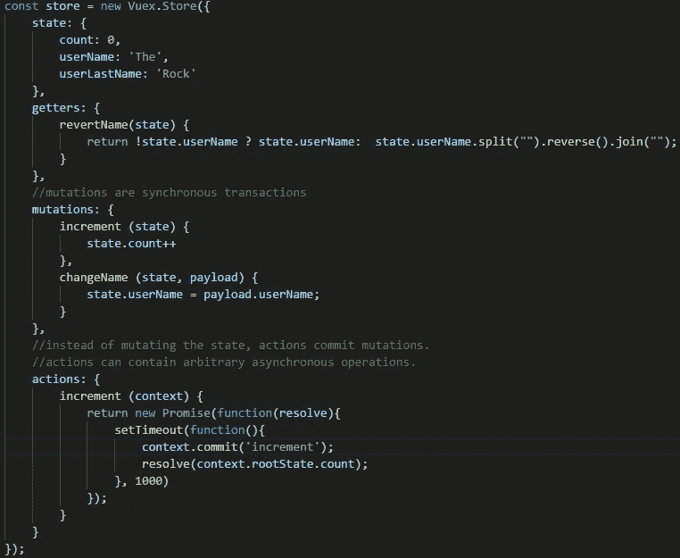
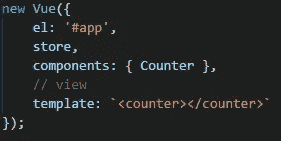
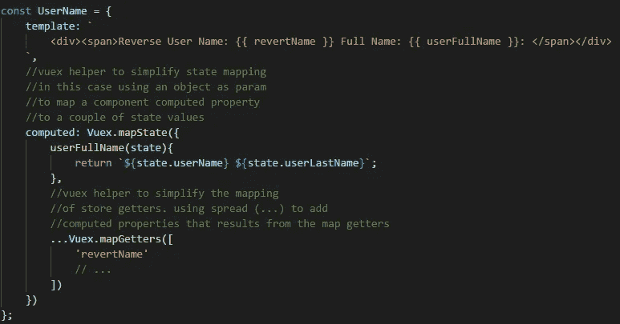
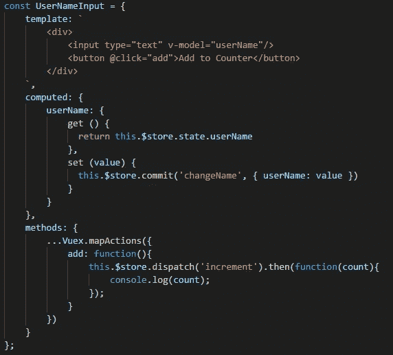

# Vue.js 中的 Vuex 介绍

> 原文：<https://betterprogramming.pub/vuejs-introduction-to-vuex-82bf35be5130>

## Vue 中的状态管理

vue . j

当您使用 Vue 时，在组件中上下传递状态是很正常的。如果您正在开发一个小的应用程序，这可能不会给您带来任何问题。

但是一旦你的应用程序开始有很多组件——有时嵌套两三层——维护状态就开始变得复杂和混乱。如果你觉得你处于这种情况，你应该开始考虑迟早使用 [Vuex](https://vuex.vuejs.org/) 。

你需要理解，像在大多数情况下一样，当你选择使用一个工具时，你是在进行权衡，当决定使用 Vuex 时也是如此。用 Vue.js 团队的话说:

> “虽然 Vuex 帮助我们处理共享状态管理，但它也带来了更多概念和样板文件的成本。这是短期和长期生产力之间的权衡。”

在这篇文章中，我们将对 Vuex 做一个简单的介绍，然后看一些例子。

# Vuex 是什么

Vuex 是一种基于 Flux、Redux 和 Elm 架构的模式。Vuex 的好处之一是它由 Vue 团队维护，因此它们可以完美地合作。

Vuex 的目标是为应用程序中的所有组件提供可预测的状态管理和集中存储。它强制使用一些规则来管理状态，这也有助于为我们的代码提供更好的结构和可维护性。

## **Vuex 关键概念**

让我们看一下使用 Vuex 时必须理解的一些关键概念(我们也将在后面的代码示例中看到其中的大部分)。

**Vue 组件**

您的组件可以使用应用程序的全局存储状态，也有自己的状态。在多个组件中需要的任何信息都应该在存储状态中。

为了能够访问所有组件上的存储，您需要将它添加到根组件中。

**存储状态**

当您声明您的存储时，您必须初始化您的应用程序的状态属性。

**改变商店状态**

有两种方法可以改变组件的存储状态。

*   **提交突变**
    突变是由我们商店管理的对我们状态的操作。您不能直接从您的组件中执行它们。为了执行一个变异，您必须使用 store `commit`方法，该方法接收要执行的变异的名称，并且可能接收一个包含定制数据的对象。突变是同步的。
*   **分派动作**
    您的商店也可能包含动作。为了从组件中执行一个动作，您必须执行 store 的`dispatch`方法。此方法还接收要调度的操作的名称和包含自定义数据的对象。动作最终会导致突变，它们不会直接改变状态。动作可以是异步的，并且可以返回承诺。

动作和突变存在的主要原因是为了分离同步和异步操作之间的关注点。

当存储状态改变任何组件时，它使用的那部分状态将做出反应并更新。

**储存吸气剂**

它们就像是你商店的计算属性。getter 的结果是基于其存储状态依赖关系进行缓存的，只有当它的一些依赖关系发生变化时才会重新计算。

**存储模块**

随着应用程序的增长，存储的单个声明会变得非常混乱。为了解决这一问题，您可以将商店划分为模块，每个模块都可以包含所有商店功能。最后，您可以将所有这些模块添加到您的商店声明中。

现在让我们看一些例子。

# Vuex 示例

派对时间到了！

## **商店初始化**

我们将创建一个具有我们之前提到的一些商店功能的商店。

哇！不要担心，我们将深入研究该实现。

*   **初始化**
    我们要做的第一件事就是使用 Vuex store 实例化我们的 store。
*   **状态** 在这里，我们声明并初始化我们商店的状态属性。
*   **Getters** 这是我们计算得到的 getter，用来获得`userName` 状态属性的反向版本。这些函数接收状态作为第一个参数。
*   **突变** 这是为了改变我们的状态，我们将要提供的两种突变。它们还接收状态作为第一个参数。
*   我们将只提供一个返回承诺的异步动作。动作接收代表状态的上下文。动作总是以调用存储`commit`函数的突变来改变状态而告终。在这种情况下，承诺被解析并返回 count 属性的新值。

## 将商店添加到我们的根组件

这很简单。我们只需要在根组件中设置属性存储。现在，我们应用程序的所有组件都可以访问商店了。

## 使用商店的组件

我们将浏览一些使用 Vuex 的组件示例，并解释它们的功能。

该组件有两个计算属性。它们是通过使用 Vuex 的`mapState`助手来设置的，这个助手的目的是当我们使用多个存储状态属性或 getters 时，简化存储状态到组件的映射。在这个例子中并不真的需要，但是值得展示一下。

*   首先，我们创建一个`userFullName` computed 属性，它接收状态并返回两个状态属性的连接(这应该用存储中的 computed getter 来完成，但我们这样做只是作为一个例子)。
*   然后我们使用 spread ( `…`)数组向组件计算属性添加一个在我们的存储中声明的 getters。我们还使用了一个 Vuex 助手——在本例中是`mapGetters`。

两个助手(`mapState`和`mapGetters`)都可以通过提供一个字符串数组来使用(当组件属性与存储状态属性或 getter 同名时，我们使用这种方法)，或者它们也可以通过传递一个对象(组件属性的键值表示)来使用。在这里阅读更多关于地图状态的信息。

在第二个例子中，我们可以看到如何对存储数据使用`v-model`,以及如何执行存储操作。

*   首先，声明一个名为`userName`的计算属性，该属性获取存储状态的`userName`值，当它改变时，它执行一个 setter，该 setter 使用存储状态`commit`来触发`changeName`变异，并提供新值作为有效负载参数。
*   我们还使用助手`mapActions`添加了一个方法。这个助手的工作方式和我们之前看到的一样。在这种情况下并不需要 spread ( `…`)操作符，因为没有其他方法，但是由于在实际应用程序中会有其他方法，所以习惯于看到它是有好处的。在帮助器内部，我们声明了一个`add`方法，该方法调度商店的动作`increment`。由于这个动作返回一个承诺，我们可以使用一个带有回调的`then`。

在这个组件中可以访问`$store`,因为我们将它添加到了应用程序的根组件中。

[链接到 GitHub](https://github.com/SantiagoGdaR/vue-vuex)

# 结论

Vuex 功能强大，使用简单，但是使用它不是一个简单的决定。

正如我们在本文中所讨论的，这是一种权衡，所以要确保你得到的比失去的多。