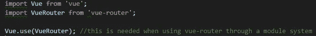
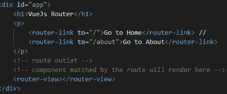
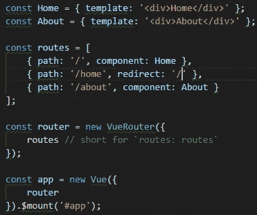
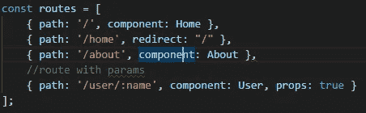
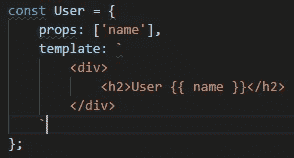
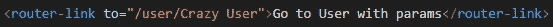
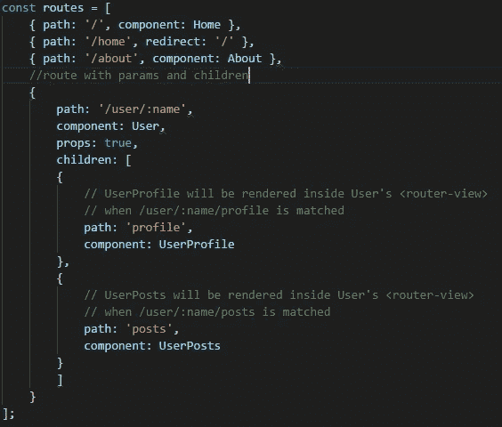
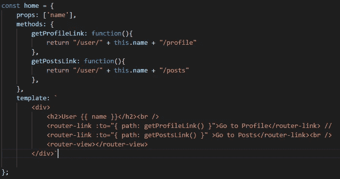
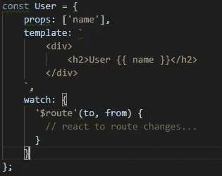
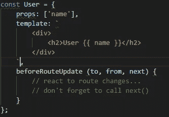

# Vue.js:使用 Vue 路由器路由

> 原文：<https://betterprogramming.pub/vuejs-routing-with-vue-router-1548f94c0575>

## 帮助您的用户到达他们要去的地方


图片提供:Vue.js

如果你正在使用 Vue.js 和 SPA，你迟早会使用 [vue-router](https://github.com/vuejs/vue-router) 来处理你的应用导航。

为什么选择 vue-router？在我看来，答案很简单:vue-router 得到了 Vue.js 团队的官方支持，并带来了所有好处(支持、文档、简单性等等)。

用他们自己的话说:

> “使用 Vue + Vue-Router 创建单页面应用程序非常简单。

在这篇博客中，我们将讨论一些在使用 vue-router 时需要考虑的最重要的事情，试图尽可能清楚地解释它们，但我们不会解决所有问题…有关更多信息，请访问 [vue-router 文档](https://router.vuejs.org)。

那么，我们开始吧。

# 安装 Vue 路由器

让我们看看安装 vue 路由器的两种方法。

直接下载:

```
<script src=”https://unpkg.com/vue-router/dist/vue-router.js"></script>
```

Npm 安装:

```
npm install vue-router
```

通过 npm 安装并使用模块系统时的用法:



# 简单路由配置

让我们创建两条简单的路线，一条是回家，另一条是大约。首先，我们需要将链接添加到 HTML:



`router-link`是我们用来生成链接的，用`to`我们设置路径。正如代码中的注释所说，`router-view`是被路由组件将要呈现的地方。

现在，让我们创建处理这些路由的配置:



首先，我们设置了几个 Vue.js 组件( *Home* 和 *About* )，这样我们就有了可以绑定路由的东西。

然后，我们用三种路径配置创建 routes 对象:

*   第一个路径(“`/`”)，呈现`Home`组件。
*   第二个路径("`/home`")重定向到"`/`"并呈现`Home`组件。
*   第三个路径(“`about`”)呈现`About`组件。

现在我们可以将刚刚配置的`routes`对象提供给`ViewRouter`实例。

最后，我们将`router`对象挂载到 Vue.js 的根实例中。

就这样，现在你的应用程序中有了几个简单的导航链接。

# 带参数的路由

耶，帕拉斯！我们喜欢它们，我们想要它们…让我们看看如何使用它们，采用我们已经开始设置的配置。



首先，让我们向我们的`routes`对象(“`/user/:name`”)添加一条带有名为`name`的参数的路线。然后我们把它绑定到一个组件上。

最后，我将道具设置为`true`(非强制，默认为`false`)。通过这样做，我们将参数作为组件中的道具进行管理，从而将组件从`$route.prams`对象中分离出来。

如果我们不这样做，我们必须通过我们的组件中前面提到的对象来访问 params(不酷)。



使用前面提到的方法，这就是如何处理组件中的参数。我们可以通过链接或编程来触发这个路由或任何路由。

通过链接:



以编程方式:


# 嵌套路由

用 Vue.js 团队的话说:

> “真正的应用程序用户界面通常由多层嵌套的组件组成。URL 的段对应于嵌套组件的某种结构也是非常常见的。”

那么，让我们来看看如何处理嵌套规则。我们将考虑在`users`组件中，我们将导航到“`user/profile`和“`user/posts`”:



使用`route`对象上的属性子对象，我们配置嵌套路由。我们正在设置的路径在父路径下运行，在本例中是“`/user/:name`”，然后我们将组件设置为在该路径下呈现。

在组件的模板中，让我们添加链接和呈现区域:



就是这样！现在您已经有了嵌套路由工作…

在图中显示的代码中，您可以看到一些“奇怪的东西”(…给它一个名字)，我不是在说那个丑陋的模板。

`to`值是通过几个函数获得的，在这些函数中，我使用了从`$route.params`的用户组件中获得的名称 param。

这是创建 URL 的一种方法……如果你不喜欢它，你可以使用其他的方法，但是记住要呈现正确的 URL，包括实际用户的名字(在这种情况下)。

# 重要细节

当您位于 URL 路径中且该路径发生更改时，组件的生命周期事件不会执行。组件只是使用同一个实例进行更新。

要重新实例化组件，可以使用两种方法。

1.  使用手表:



2.使用`beforeRouteUpdate`:



就是这样！现在，您已经很好地了解了如何使用 vue-router。很简单，对吧？