# VueJs:使用 Vue 路由器的服务器端渲染

> 原文：<https://betterprogramming.pub/vuejs-server-side-render-with-vue-router-e73d51699873>

## 通过在返回页面之前渲染页面来提高应用程序的速度

这篇文章的目的是提供你可能需要的所有信息，以确定服务器端渲染(SSR)是否是你应该考虑的一种方法。我们还将通过一个基本(但不一定简单)的例子来说明如何通过 [vue-router](https://github.com/vuejs/vue-router) 配置和使用 SSR。

我在安东尼·戈尔的博客中写了这篇文章的一个更短的、侧重于实现的版本(没有任何关于服务器端渲染的额外信息)。以防你只对实现感兴趣，我把链接留在这里: [Vue.js 使用 Vue 路由器的服务器端渲染:分步指南](https://vuejsdevelopers.com/2017/12/11/vue-ssr-router/)

# 什么时候应该考虑使用 SSR？

使用 SSR 有两个主要原因。

*   更好的 SEO。当应用程序加载时，搜索引擎爬虫将看到完全呈现的页面，因为服务器是构建第一个加载页面的服务器。
*   更快获得内容。因为第一次呈现完全由服务器构建，所以从客户端获得完全呈现的页面要快得多。这提供了更好的用户体验，对于内容时间起着关键作用的应用程序来说非常重要。

因此，如果 SEO 或获取内容的时间对你的应用程序至关重要，那么无论如何权衡，你都应该使用 SSR。在任何其他情况下，都要三思而后行，确保你赢的比你输的多，因为这种交换并不便宜。如果你唯一关心的是提高 SEO，还有其他技术可以考虑——比如预渲染。

# 权衡取舍

在选择使用 SSR 之前，您至少需要考虑三个主要问题。

*   一些三方库可能需要一些操作才能在 SSR 应用程序中运行。
*   SSR 需要一个 Node.js 服务器可以运行的环境。
*   对于一个服务器来说，这将比只提供静态文件更昂贵，所以，如果你的应用程序有或预期有高流量，准备好处理高服务器负载。

# 完整的基本实现

在开始实际实现之前，您需要理解一些主要概念:

*   SSR 首先在服务器上为实际请求的路线创建一个完全加载的应用程序版本。一旦该页面呈现在客户端，客户端代码就获得所有权。
*   您的应用程序需要两个入口构建点——一个用于服务器，一个用于客户端。

配置并不简单，目前网上关于使用`vue-router`的 SSR 的信息非常少。

所以，让我们希望下面的例子能给这个主题带来一些清晰。

## 属国

让我们看一下我们必须安装的依赖项。

*   我们将使用一个已经为 `vueJs`应用配置了基本 webpack 构建的模板开始。我们还需要安装`vue-cli`:

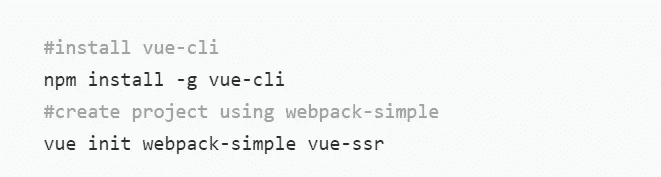

现在我们需要安装`webpack-simple`模板的所有依赖项。到目前为止，没有任何东西与 SSR 相关—我们只是设置一个通用的 vueJs 环境。

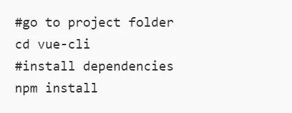

*   现在我们有了一个 vueJs 项目，可以开始添加 SSR 配置了。但是首先，我们需要添加三个依赖项，它们都与 SSR 相关。

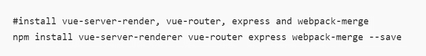

*   `vue-server-render`:用于 SSR 的 Vue 库。
*   `vue-router`:SPA 的 Vue 图书馆。
*   `express`:我们需要一个 NodeJS 服务器运行。
*   `webpack-merge`:我们将使用它来合并 webpack 配置。

## Webpack 配置

我们将需要两个 webpack 配置——一个从客户机入口文件构建，另一个从服务器入口文件构建。

对于我们的基本 webpack 配置，我们将使用我们安装的模板附带的配置，除了我们将条目更改为`entry-client.js`。

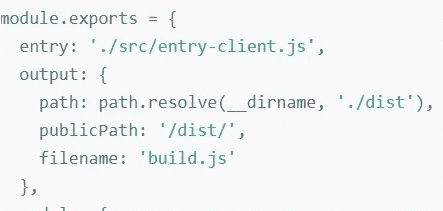

现在让我们添加服务器 webpack 配置:

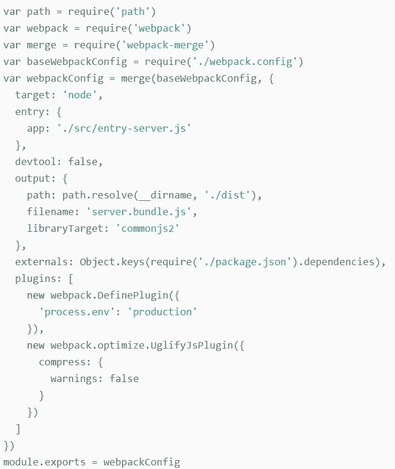

这里没有什么奇怪的，除了两件事:条目是`entry-server.js`，对于输出，我们使用`commonjs`作为库目标。

这就是 webpack 的配置。现在让我们看看在`packages.json`中构建应用程序的脚本。

## Packages.json 构建脚本

您可以根据需要进行更改，但是启动应用程序需要执行三个步骤:

*   构建客户端条目
*   构建服务器入口
*   启动服务器

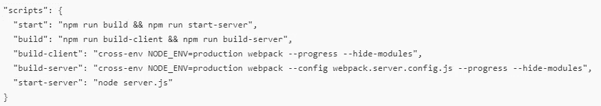

在配置中，我们使用运行我们刚刚提到的三个步骤的`start`脚本。但是如果需要的话，我们已经设置了脚本来分别运行它们。

## 文件夹结构

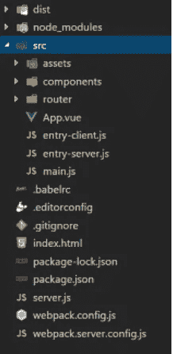

*   `dist`文件夹是 webpack 在构建`node_modules`时创建的(嗯，这个你懂的！).
*   `src`包含我们的 Vue 应用。在里面，您会发现服务器和客户机入口点、Vue `main.js`文件、`App`组件、组件文件夹(我们有`home`和`about`组件)、包含路由器配置的路由器文件夹，以及最后的资产文件夹。
*   `.babelrc`、`.gitignore`、`packages.json` ——你大概知道他们是什么。
*   `index.html`是我们应用程序的主要 HTML。
*   `server.js`是服务器配置和启动文件。
*   最后，我们已经讨论过的两种 webpack 配置。

## 索引 HTML

这是我们的主 HTML 文件。

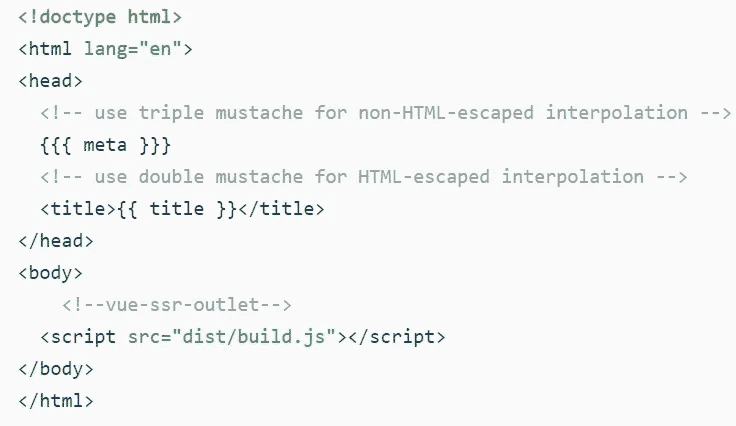

有几件事需要讨论:

*   我在这个模板中添加了一些插值，以便稍后在服务器上填充这些数据。是我想展示的 Vue 服务器端渲染的一个功能。
*   我们的目标是从 webpack 生成的客户端捆绑包的结果`build.js`。

## APP.vue 组件

该组件是我们应用程序的根组件，它有几项职责:

*   使用`vue-router`链接的菜单配置。
*   为要渲染的路线组件设置容器。
*   设置 id 为`app`的元素，用于安装应用程序的客户端部分。

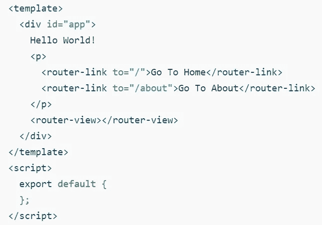

## 路由器文件配置

因为我们的应用程序将在服务器上启动，所以我们需要为每个服务器请求提供一个新的路由器实例。在路由器文件夹中，我们将有一个包含路由器配置的文件:

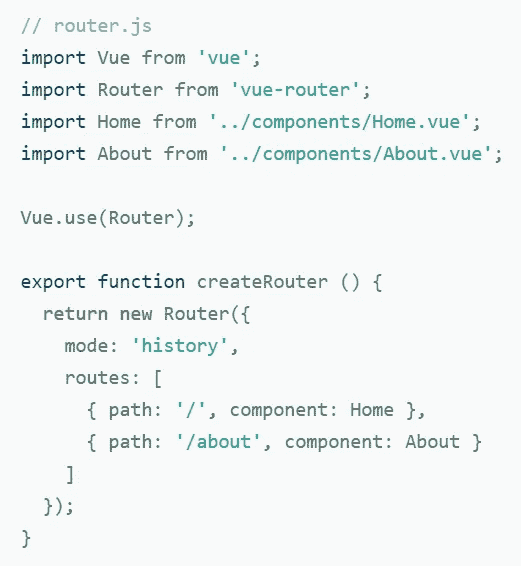

让我们看一下代码:

*   我们导入所有需要的依赖项。
*   我们告诉 Vue 用`vue-router`。
*   我们导出一个提供路由器配置新实例的函数。
*   我们在历史模式下用我们将要处理的两条路由的配置实例化路由器。

## 主 Vue 文件配置

出于同样的原因，我们需要提供一个新的路由器实例，我们需要提供一个新的应用程序实例。这个文件负责启动路由器和根应用程序组件。

服务器和客户机入口点都将使用这个文件。

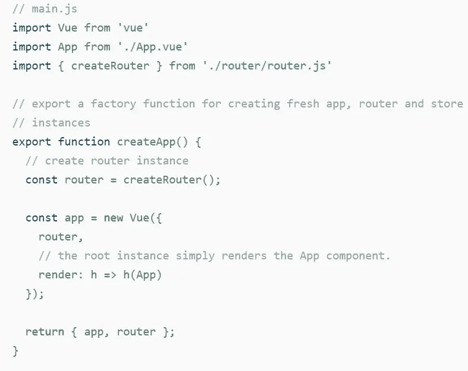

让我们看一下代码:

*   我们导入所有需要的依赖项。
*   我们导出一个函数，该函数提供了应用程序和路由器的新实例。
*   我们使用之前在“route.js”文件中看到的方法实例化路由器。
*   我们用路由器和呈现器创建一个新的应用程序实例，传递根应用程序组件。
*   我们返回两个实例。

## 客户端入口点

这段代码非常简单。这是 webpack 客户端构建配置的条目文件。

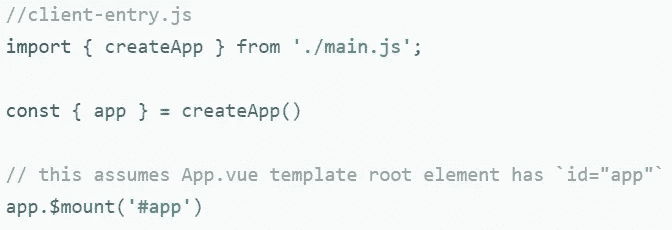

让我们看一下代码:

我们导入所有需要的依赖项。

我们从`main.js`文件创建应用程序，并保留`app`实例。

我们在一个 id 设置为`app`的节点中挂载`app`。在本例中，包含该 id 的节点是`App.vue`组件模板的根元素，如前所述。

## 服务器入口点

该文件是 webpack 服务器构建的入口点。构建的结果就是我们稍后配置服务器时的目标。

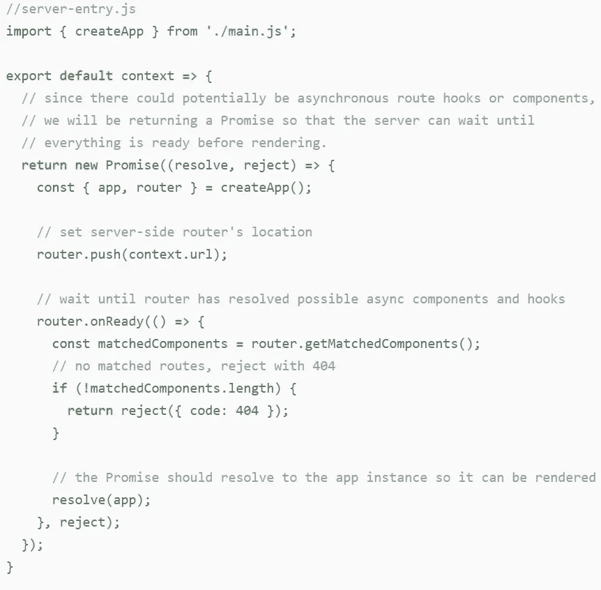

让我们看一下代码:

*   我们导入所有需要的依赖项。
*   我们导出一个接收上下文作为参数的函数。
*   这些函数返回一个承诺。
*   我们从' main.js` create app 函数实例化 app 和路由器。
*   我们从上下文中获取当前 URL(这将由服务器提供)，以便将正确的 URL 推送到路由器。
*   路由器准备就绪后，我们检查路由是否与上下文 URL 匹配。如果是，我们解决承诺并返回应用程序实例。如果不是，我们拒绝承诺。

## 配置和启动服务器

我们几乎什么都准备好了。唯一缺少的是`express`服务器的配置和启动:

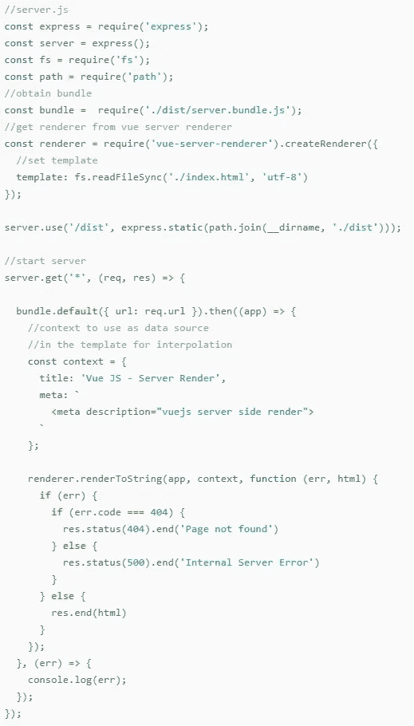

而你之前觉得太过分了！别担心，让我们深入研究代码，看看发生了什么:

*   我们正在导入`express`来创建服务器，我们也正在导入一些节点 js 功能。
*   我们导入了作为 webpack 服务器构建结果的服务器包。
*   我们导入`vue-server-renderer`库并创建渲染，为模板提供`index.html`位置。
*   我们配置了`express`路径。
*   我们启动服务器。
*   这个包是用 webpack 构建`serve-entry.js`的结果，所以我们可以使用默认的函数来接收上下文作为 URL 的参数。因为这是一个我们设置了成功和错误回调的承诺。

成功回调会做很多事情，所以我们也来看看:

*   我们用将要在`index.html`中插值的数据创建一个 const(我们之前在这个 HTML 中看到了插值)。
*   我们调用接收应用程序的渲染器的 render to string 函数(由 resolved promise 返回)、我们刚刚创建的上下文(在索引中使用插值—这是可选的)，以及回调函数(如果一切正常)。
*   呈现到字符串回调函数检查是否有任何错误。如果没有，它只是发送生成的 HTML 作为响应。

最后，我们开始监听端口 8080。

现在，如果您运行脚本“start ”,并在浏览器中打开“localhost:8080 ”,您将看到 SSR 和 vue-router 的工作情况。

女士们先生们，就是这样！

# 结论

我不认为我需要说，这是一个很大的配置，使事情的工作！然而，一旦它完成了，你就不需要经常去碰它。只要确定 SSR 是你需要的。

我把 Github 项目留给你。