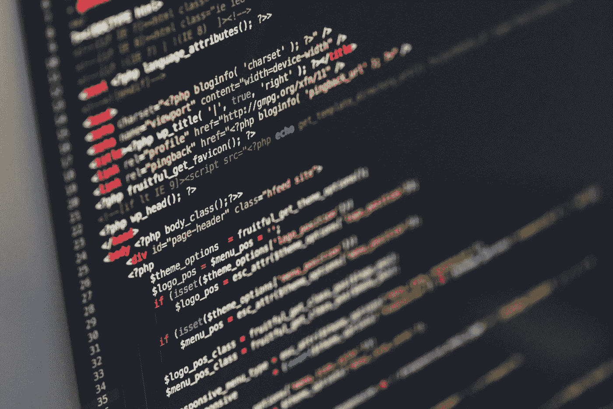
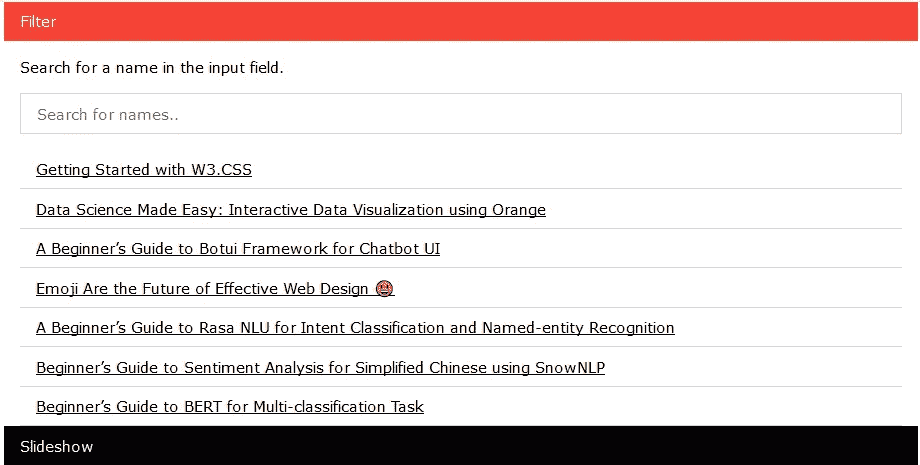
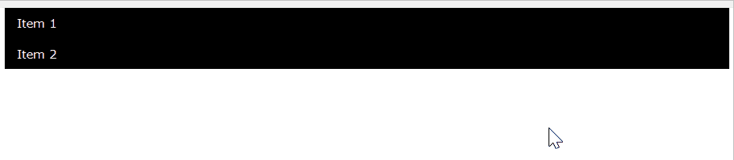
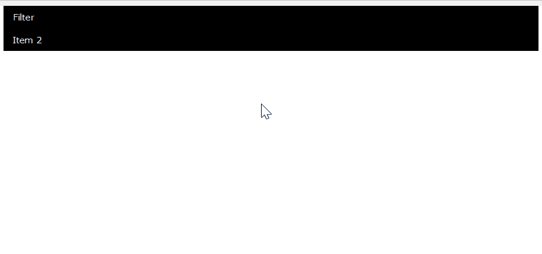
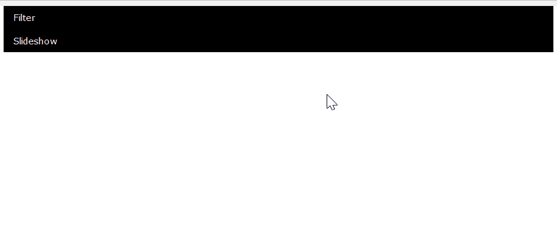
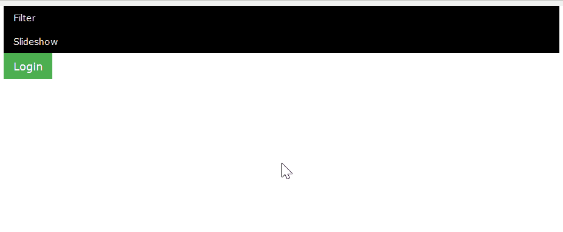

# W3。CSS 高级教程

> 原文：<https://betterprogramming.pub/w3-css-advanced-tutorial-168fcf3fde8f>

## 通过名为 W3 的轻量级 CSS 框架创建自己的响应式组件。半铸钢ˌ钢性铸铁(Cast Semi-Steel)



伊利亚·巴甫洛夫在 [Unsplash](https://unsplash.com/s/photos/css?utm_source=unsplash&utm_medium=referral&utm_content=creditCopyText) 拍摄的照片

在我之前的[文章](https://medium.com/better-programming/getting-started-with-w3-css-379ff93463d1)中，我解释了 W3.CSS 的基本概念和用法。今天，我们将重点讨论创建有用组件的高级方法，这些组件将丰富您的网站。示例包括手风琴、列表过滤器、弹出模式和图片幻灯片。

确保你熟悉 W3 的基本用法。CSS 框架，并对 JavaScript 有所了解。

在这篇文章中，我们将讨论四个主要部分:

1.  手风琴
2.  过滤器
3.  情态的
4.  幻灯片



用 W3 自制过滤器组件。CSS 框架

# 1.手风琴

安装 W3。CSS 框架，方法是将下面一行添加到 HTML 文件中:

```
<link rel="stylesheet" href="[https://www.w3schools.com/w3css/4/w3.css](https://www.w3schools.com/w3css/4/w3.css)">
```

让我们从一个简单的手风琴开始，它用于显示和隐藏 HTML 内容。这里有一个手风琴和下拉菜单的比较，适合刚接触这个术语的人

## 手风琴

*   通过向下按来显示内容。
*   内容通常是网页宽度的 100%。
*   允许打开多个部分。

## 下拉式

*   通过覆盖现有页面内容来显示内容。
*   内容宽度通常为 160 像素。
*   通常用于一次只打开一个部分。

让我们从使用以下 css 类添加一个按钮元素开始:

```
<button class="w3-button w3-block w3-black w3-left-align">Item 1</button>
```

然后，我们在按钮下面添加一个 div 元素，并以段落元素作为内容:

```
<div id="Demo1" class="w3-hide w3-container">                       <p>Content for item 1</p>
</div>
```

您可以重复上述步骤，为您的手风琴创建更多项目。完成后，让我们继续编写 Javascript 函数。创建一个接受一个参数的`toggle_accordion` 函数。将其分配给按钮元素的“事件:

```
<button onclick="toggle_accordion('Demo1')" class="w3-button w3-block w3-black w3-left-align">Item 1</button>
```

我们将添加一些代码来改变手风琴活动时的颜色。最终的 HTML 应该是这样的:

```
<!DOCTYPE html>
<html>
<title>Accordion</title>
<meta name="viewport" content="width=device-width, initial-scale=1">
<link rel="stylesheet" href="https://www.w3schools.com/w3css/4/w3.css">
<body>
<div class="w3-container">

<button onclick="toggle_accordion('Demo1')" class="w3-button w3-block w3-black w3-left-align">Item 1</button>
<div id="Demo1" class="w3-hide w3-container">
<p>Content for item 1</p>
</div>

<button onclick="toggle_accordion('Demo2')" class="w3-button w3-block w3-black w3-left-align">Item 2</button>
<div id="Demo2" class="w3-hide w3-container">
<p>Content for item 2</p>
</div>

</div>
<script>
function toggle_accordion(id) {
  let x = document.getElementById(id);
  let highlight_color = "w3-red";
  let base_color = "w3-black";
  if (x.className.indexOf("w3-show") == -1) {
    x.className += " w3-show";
    x.previousElementSibling.className = 
    x.previousElementSibling.className.replace(base_color, highlight_color);
  } else { 
    x.className = x.className.replace(" w3-show", "");
    x.previousElementSibling.className = 
    x.previousElementSibling.className.replace(highlight_color, base_color);
  }
}
</script>

</body>
</html>
```

您可以通过重新加载页面并单击按钮来轻松测试它。内容将会出现，其余的按钮将会在网页上向下按。



作者 Gif

# 2.过滤器

借助 JavaScript 的魔力，我们可以轻松创建一个过滤器组件。首先，我们需要一个包含以下 CSS 类的文本输入:

```
<input class="w3-input w3-border w3-padding" type="text" placeholder="Search for names.." id="myInput">
```

接下来，在 input 元素下添加一个简单的 list 元素:

```
<ul class="w3-ul w3-margin-top" id="myUL">                           <li>Apple</li>
<li>Orange</li>
<li>Mango</li>
</ul>
```

相应地修改列表，并创建一个名为`filter_list`的新 Javascript 函数。然后，将其赋给 input 元素的`onkeyup` 事件。

```
<input class="w3-input w3-border w3-padding" type="text" placeholder="Search for names.." id="myInput"  onkeyup="filter_list()">
```

基于`innerText` 属性，即使`li`标签内有任何其他元素，`filter_list` 函数仍然有效。以下示例显示了每个`li`标记内的锚元素:

```
<!DOCTYPE html>
<html>
<title>Filter</title>
<meta name="viewport" content="width=device-width, initial-scale=1">
<link rel="stylesheet" href="https://www.w3schools.com/w3css/4/w3.css">
<body>
<div class="w3-container">

<button onclick="toggle_accordion('Demo1')" class="w3-button w3-block w3-black w3-left-align">Filter</button>
<div id="Demo1" class="w3-hide w3-container">
    <p>Search for a name in the input field.</p>

  <input class="w3-input w3-border w3-padding" type="text" placeholder="Search for names.." id="myInput" onkeyup="filter_list()">
  <ul class="w3-ul w3-margin-top" id="myUL">
    <li><a href="https://medium.com/better-programming/getting-started-with-w3-css-379ff93463d1" target="_blank">Getting Started with W3.CSS<a/></li>
    <li><a href="https://towardsdatascience.com/data-science-made-easy-interactive-data-visualization-using-orange-de8d5f6b7f2b" target="_blank">Data Science Made Easy: Interactive Data Visualization using Orange<a/></li>
    <li><a href="https://medium.com/better-programming/a-beginners-guide-to-botui-framework-for-chatbot-ui-a4e6d9a4a74" target="_blank">A Beginner’s Guide to Botui Framework for Chatbot UI<a/></li>
    <li><a href="https://medium.com/better-programming/emoji-are-the-future-of-effective-web-design-a9bf98b18616" target="_blank">Emoji Are the Future of Effective Web Design 😃<a/></li>
    <li><a href="https://towardsdatascience.com/a-beginners-guide-to-rasa-nlu-for-intent-classification-and-named-entity-recognition-a4f0f76b2a96" target="_blank">A Beginner’s Guide to Rasa NLU for Intent Classification and Named-entity Recognition<a/></li>
    <li><a href="https://towardsdatascience.com/beginners-guide-to-sentiment-analysis-for-simplified-chinese-using-snownlp-ce88a8407efb" target="_blank">Beginner’s Guide to Sentiment Analysis for Simplified Chinese using SnowNLP<a/></li>
    <li><a href="https://towardsdatascience.com/beginners-guide-to-bert-for-multi-classification-task-92f5445c2d7c" target="_blank">Beginner’s Guide to BERT for Multi-classification Task<a/></li>
  </ul>
</div>

<button onclick="toggle_accordion('Demo2')" class="w3-button w3-block w3-black w3-left-align">Item 2</button>
<div id="Demo2" class="w3-hide w3-container">
    <p>Content for item 2</p>
</div>

</div>
<script>
function toggle_accordion(id) {
  let x = document.getElementById(id);
  let highlight_color = "w3-red";
  let base_color = "w3-black";
  if (x.className.indexOf("w3-show") == -1) {
    x.className += " w3-show";
    x.previousElementSibling.className = 
    x.previousElementSibling.className.replace(base_color, highlight_color);
  } else { 
    x.className = x.className.replace(" w3-show", "");
    x.previousElementSibling.className = 
    x.previousElementSibling.className.replace(highlight_color, base_color);
  }
}

function filter_list() {
  var input, filter, ul, li, a, i;
  input = document.getElementById("myInput");
  filter = input.value.toUpperCase();
  ul = document.getElementById("myUL");
  li = ul.getElementsByTagName("li");
  for (i = 0; i < li.length; i++) {
    txtValue = li[i].textContent || li[i].innerText;
    if (txtValue.toUpperCase().indexOf(filter) > -1) {
      li[i].style.display = "";
    } else {
      li[i].style.display = "none";
    }
  }
}
</script>

</body>
</html>
```

让我们重新加载页面来测试我们的过滤器组件。单击第一个手风琴，打开过滤器。向 Input 元素输入一些文本，您会注意到根据您的输入过滤了列表。



作者 Gif

# 3.幻灯片

通过使用一些简单的 CSS 和 Javascript，您可以轻松地创建幻灯片内容。让我们向代码中添加一些样式，以便在悬停迷你按钮时一次只显示一张幻灯片和一个指针光标。我将把它添加到 HTML 文件中，就在 body 标签之前:

```
<style>
.mySlides {display:none}
.w3-left, .w3-right, .w3-badge {cursor:pointer}                       .w3-badge {height:13px;width:13px;padding:0}                       </style>
```

继续添加以下 JavaScript 代码:

```
var slideIndex = 1;
showDivs(slideIndex);

function plusDivs(n) {
    showDivs(slideIndex += n);
}function currentDiv(n) {
    showDivs(slideIndex = n);
}function showDivs(n) {}
```

我们需要填充`showDivs` 函数，并在第二个手风琴内部创建一些 HTML 元素。查看以下要点以获得完整的代码(根据服务器中的文件修改图像路径):

```
<!DOCTYPE html>
<html>
<title>Slideshow</title>
<meta name="viewport" content="width=device-width, initial-scale=1">
<link rel="stylesheet" href="https://www.w3schools.com/w3css/4/w3.css">
<style>
.mySlides {display:none}
.w3-left, .w3-right, .w3-badge {cursor:pointer}
.w3-badge {height:13px;width:13px;padding:0}
</style>
<body>
<div class="w3-container">

<button onclick="toggle_accordion('Demo1')" class="w3-button w3-block w3-black w3-left-align">Filter</button>
<div id="Demo1" class="w3-hide w3-container">
    <p>Search for a name in the input field.</p>

  <input class="w3-input w3-border w3-padding" type="text" placeholder="Search for names.." id="myInput" onkeyup="filter_list()">
  <ul class="w3-ul w3-margin-top" id="myUL">
    <li><a href="https://medium.com/better-programming/getting-started-with-w3-css-379ff93463d1" target="_blank">Getting Started with W3.CSS<a/></li>
    <li><a href="https://towardsdatascience.com/data-science-made-easy-interactive-data-visualization-using-orange-de8d5f6b7f2b" target="_blank">Data Science Made Easy: Interactive Data Visualization using Orange<a/></li>
    <li><a href="https://medium.com/better-programming/a-beginners-guide-to-botui-framework-for-chatbot-ui-a4e6d9a4a74" target="_blank">A Beginner’s Guide to Botui Framework for Chatbot UI<a/></li>
    <li><a href="https://medium.com/better-programming/emoji-are-the-future-of-effective-web-design-a9bf98b18616" target="_blank">Emoji Are the Future of Effective Web Design 😃<a/></li>
    <li><a href="https://towardsdatascience.com/a-beginners-guide-to-rasa-nlu-for-intent-classification-and-named-entity-recognition-a4f0f76b2a96" target="_blank">A Beginner’s Guide to Rasa NLU for Intent Classification and Named-entity Recognition<a/></li>
    <li><a href="https://towardsdatascience.com/beginners-guide-to-sentiment-analysis-for-simplified-chinese-using-snownlp-ce88a8407efb" target="_blank">Beginner’s Guide to Sentiment Analysis for Simplified Chinese using SnowNLP<a/></li>
    <li><a href="https://towardsdatascience.com/beginners-guide-to-bert-for-multi-classification-task-92f5445c2d7c" target="_blank">Beginner’s Guide to BERT for Multi-classification Task<a/></li>
  </ul>
</div>

<button onclick="toggle_accordion('Demo2')" class="w3-button w3-block w3-black w3-left-align">Slideshow</button>
<div id="Demo2" class="w3-hide w3-container">
    <div class="w3-content w3-display-container" style="max-width:800px">
  
  
  
  <div class="w3-center w3-container w3-section w3-large w3-text-white w3-display-bottommiddle" style="width:100%">
    <div class="w3-left w3-hover-text-khaki" onclick="plusDivs(-1)">&#10094;</div>
    <div class="w3-right w3-hover-text-khaki" onclick="plusDivs(1)">&#10095;</div>
    <span class="w3-badge demo w3-border w3-transparent w3-hover-white" onclick="currentDiv(1)"></span>
    <span class="w3-badge demo w3-border w3-transparent w3-hover-white" onclick="currentDiv(2)"></span>
    <span class="w3-badge demo w3-border w3-transparent w3-hover-white" onclick="currentDiv(3)"></span>
  </div>
</div>
</div>

</div>
<script>
function toggle_accordion(id) {
  let x = document.getElementById(id);
  let highlight_color = "w3-red";
  let base_color = "w3-black";
  if (x.className.indexOf("w3-show") == -1) {
    x.className += " w3-show";
    x.previousElementSibling.className = 
    x.previousElementSibling.className.replace(base_color, highlight_color);
  } else { 
    x.className = x.className.replace(" w3-show", "");
    x.previousElementSibling.className = 
    x.previousElementSibling.className.replace(highlight_color, base_color);
  }
}

function filter_list() {
  var input, filter, ul, li, a, i;
  input = document.getElementById("myInput");
  filter = input.value.toUpperCase();
  ul = document.getElementById("myUL");
  li = ul.getElementsByTagName("li");
  for (i = 0; i < li.length; i++) {
    txtValue = li[i].textContent || li[i].innerText;
    if (txtValue.toUpperCase().indexOf(filter) > -1) {
      li[i].style.display = "";
    } else {
      li[i].style.display = "none";
    }
  }
}

var slideIndex = 1;
showDivs(slideIndex);

function plusDivs(n) {
  showDivs(slideIndex += n);
}

function currentDiv(n) {
  showDivs(slideIndex = n);
}

function showDivs(n) {
  var i;
  var x = document.getElementsByClassName("mySlides");
  var dots = document.getElementsByClassName("demo");
  if (n > x.length) {slideIndex = 1}
  if (n < 1) {slideIndex = x.length}
  for (i = 0; i < x.length; i++) {
    x[i].style.display = "none";  
  }
  for (i = 0; i < dots.length; i++) {
    dots[i].className = dots[i].className.replace(" w3-white", "");
  }
  x[slideIndex-1].style.display = "block";  
  dots[slideIndex-1].className += " w3-white";
}
</script>

</body>
</html>
```

让我们测试一下我们刚刚创建的幻灯片组件。您应该能够点击小按钮来更改图像。



作者 Gif

# 4.情态的

W3。CSS 框架有自己的`w3-modal`类，不用任何 JavaScript 代码就能创建一个弹出模式。让我们创建一个按钮，点击后会打开一个模态。您可以在折叠组件的正下方创建它。我们将用一个简单的 JavaScript 来分配`onclick` 事件以显示内容。

```
<button onclick="document.getElementById('id01').style.display='block'" class="w3-button w3-green w3-large">Login</button>
```

我们需要创建一个 div 元素，用`id01`作为 id，用`w3-modal`作为类。在 div 内部，我们将需要另一个 div 元素，并将`w3-modal-content`作为类。您可以根据自己的需要在里面嵌套任何其他元素。

```
<div id="id01" class="w3-modal">
<div class="w3-modal-content w3-card-4 w3-animate-zoom" style="max-width:600px">                                                     <div class="w3-center"><br>
<span onclick="document.getElementById('id01').style.display='none'" class="w3-button w3-xlarge w3-hover-red w3-display-topright" title="Close Modal">&times;</span>                             </div>                                                          <p>Content here!</p>                                              </div>
</div>
```

我已经为用户登录创建了一个模型。您最终的 [html](https://gist.github.com/wfng92/ed6dbc233a318dfcccba8c3c938c9747) 文件应该是这样的:

```
<!DOCTYPE html>
<html>
<title>Modal</title>
<meta name="viewport" content="width=device-width, initial-scale=1">
<link rel="stylesheet" href="https://www.w3schools.com/w3css/4/w3.css">
<style>
.mySlides {display:none}
.w3-left, .w3-right, .w3-badge {cursor:pointer}
.w3-badge {height:13px;width:13px;padding:0}
</style>
<body>
<div class="w3-container">

<button onclick="toggle_accordion('Demo1')" class="w3-button w3-block w3-black w3-left-align">Filter</button>
<div id="Demo1" class="w3-hide w3-container">
    <p>Search for a name in the input field.</p>

  <input class="w3-input w3-border w3-padding" type="text" placeholder="Search for names.." id="myInput" onkeyup="filter_list()">
  <ul class="w3-ul w3-margin-top" id="myUL">
    <li><a href="https://medium.com/better-programming/getting-started-with-w3-css-379ff93463d1" target="_blank">Getting Started with W3.CSS<a/></li>
    <li><a href="https://towardsdatascience.com/data-science-made-easy-interactive-data-visualization-using-orange-de8d5f6b7f2b" target="_blank">Data Science Made Easy: Interactive Data Visualization using Orange<a/></li>
    <li><a href="https://medium.com/better-programming/a-beginners-guide-to-botui-framework-for-chatbot-ui-a4e6d9a4a74" target="_blank">A Beginner’s Guide to Botui Framework for Chatbot UI<a/></li>
    <li><a href="https://medium.com/better-programming/emoji-are-the-future-of-effective-web-design-a9bf98b18616" target="_blank">Emoji Are the Future of Effective Web Design 😃<a/></li>
    <li><a href="https://towardsdatascience.com/a-beginners-guide-to-rasa-nlu-for-intent-classification-and-named-entity-recognition-a4f0f76b2a96" target="_blank">A Beginner’s Guide to Rasa NLU for Intent Classification and Named-entity Recognition<a/></li>
    <li><a href="https://towardsdatascience.com/beginners-guide-to-sentiment-analysis-for-simplified-chinese-using-snownlp-ce88a8407efb" target="_blank">Beginner’s Guide to Sentiment Analysis for Simplified Chinese using SnowNLP<a/></li>
    <li><a href="https://towardsdatascience.com/beginners-guide-to-bert-for-multi-classification-task-92f5445c2d7c" target="_blank">Beginner’s Guide to BERT for Multi-classification Task<a/></li>
  </ul>
</div>

<button onclick="toggle_accordion('Demo2')" class="w3-button w3-block w3-black w3-left-align">Slideshow</button>
<div id="Demo2" class="w3-hide w3-container">
    <div class="w3-content w3-display-container" style="max-width:800px">
  
  
  
  <div class="w3-center w3-container w3-section w3-large w3-text-white w3-display-bottommiddle" style="width:100%">
    <div class="w3-left w3-hover-text-khaki" onclick="plusDivs(-1)">&#10094;</div>
    <div class="w3-right w3-hover-text-khaki" onclick="plusDivs(1)">&#10095;</div>
    <span class="w3-badge demo w3-border w3-transparent w3-hover-white" onclick="currentDiv(1)"></span>
    <span class="w3-badge demo w3-border w3-transparent w3-hover-white" onclick="currentDiv(2)"></span>
    <span class="w3-badge demo w3-border w3-transparent w3-hover-white" onclick="currentDiv(3)"></span>
  </div>
</div>
</div>

<button onclick="document.getElementById('id01').style.display='block'" class="w3-button w3-green w3-large">Login</button>

  <div id="id01" class="w3-modal">
    <div class="w3-modal-content w3-card-4 w3-animate-zoom" style="max-width:600px">

      <div class="w3-center"><br>
        <span onclick="document.getElementById('id01').style.display='none'" class="w3-button w3-xlarge w3-hover-red w3-display-topright" title="Close Modal">&times;</span>
      </div>

      <form class="w3-container" action="/action_page.php">
        <div class="w3-section">
          <label><b>Username</b></label>
          <input class="w3-input w3-border w3-margin-bottom" type="text" placeholder="Enter Username" name="usrname" required>
          <label><b>Password</b></label>
          <input class="w3-input w3-border" type="password" placeholder="Enter Password" name="psw" required>
          <button class="w3-button w3-block w3-green w3-section w3-padding" type="submit">Login</button>
        </div>
      </form>

    </div>
  </div>
</div>
<script>
function toggle_accordion(id) {
  let x = document.getElementById(id);
  let highlight_color = "w3-red";
  let base_color = "w3-black";
  if (x.className.indexOf("w3-show") == -1) {
    x.className += " w3-show";
    x.previousElementSibling.className = 
    x.previousElementSibling.className.replace(base_color, highlight_color);
  } else { 
    x.className = x.className.replace(" w3-show", "");
    x.previousElementSibling.className = 
    x.previousElementSibling.className.replace(highlight_color, base_color);
  }
}

function filter_list() {
  var input, filter, ul, li, a, i;
  input = document.getElementById("myInput");
  filter = input.value.toUpperCase();
  ul = document.getElementById("myUL");
  li = ul.getElementsByTagName("li");
  for (i = 0; i < li.length; i++) {
    txtValue = li[i].textContent || li[i].innerText;
    if (txtValue.toUpperCase().indexOf(filter) > -1) {
      li[i].style.display = "";
    } else {
      li[i].style.display = "none";
    }
  }
}

var slideIndex = 1;
showDivs(slideIndex);

function plusDivs(n) {
  showDivs(slideIndex += n);
}

function currentDiv(n) {
  showDivs(slideIndex = n);
}

function showDivs(n) {
  var i;
  var x = document.getElementsByClassName("mySlides");
  var dots = document.getElementsByClassName("demo");
  if (n > x.length) {slideIndex = 1}
  if (n < 1) {slideIndex = x.length}
  for (i = 0; i < x.length; i++) {
    x[i].style.display = "none";  
  }
  for (i = 0; i < dots.length; i++) {
    dots[i].className = dots[i].className.replace(" w3-white", "");
  }
  x[slideIndex-1].style.display = "block";  
  dots[slideIndex-1].className += " w3-white";
}
</script>

</body>
</html>
```

单击登录按钮进行测试。您可以看到弹出模式—您可以通过单击右上角的 X 按钮来取消它。



作者 Gif

# 结论

祝贺您到达这篇文章的结尾。让我们回顾一下到目前为止我们所学的内容。

首先，我们学习创建一个简单的手风琴，用一些简单的 JavaScript 显示隐藏的内容。

接下来，我们测试了一个列表过滤器，它可以根据用户输入过滤出一个列表。不管内容是列表还是表格，过滤器组件都可以工作。

我们继续用几行 Javascript 函数创建了一个可以作为图库的幻灯片。

最后，我们构建了一个弹出式模型，作为用户的登录面板。

感谢您的阅读，下次再见！

# 参考

1.  [https://github.com/JaniRefsnes/w3css](https://github.com/JaniRefsnes/w3css)
2.  https://www.w3schools.com/w3css/w3css_downloads.asp
3.  【https://www.w3schools.com/w3css/w3css_intro.asp 
4.  [https://www.w3schools.com/w3css/w3css_references.asp](https://www.w3schools.com/w3css/w3css_references.asp)
5.  [https://gist . github . com/wfng 92/ed 6 DBC 233 a 318 dfcccba 8 C3 c 938 c 9747](https://gist.github.com/wfng92/ed6dbc233a318dfcccba8c3c938c9747)