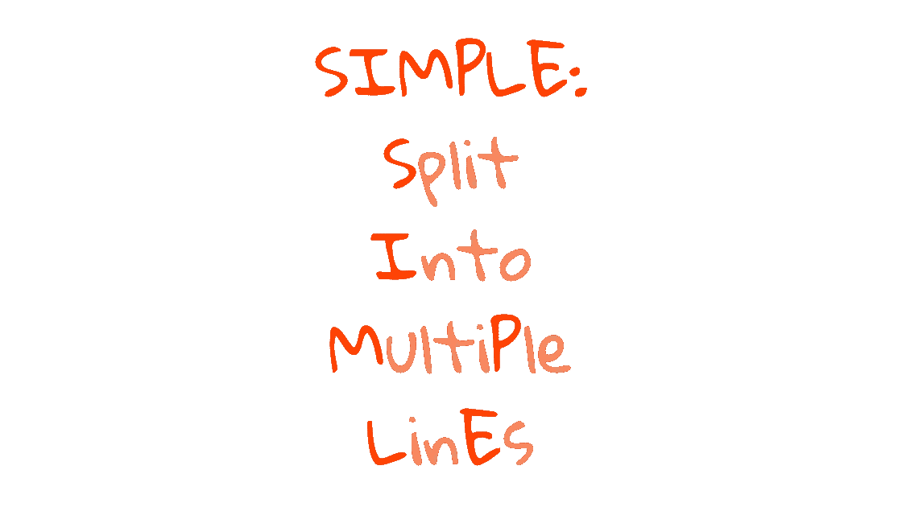
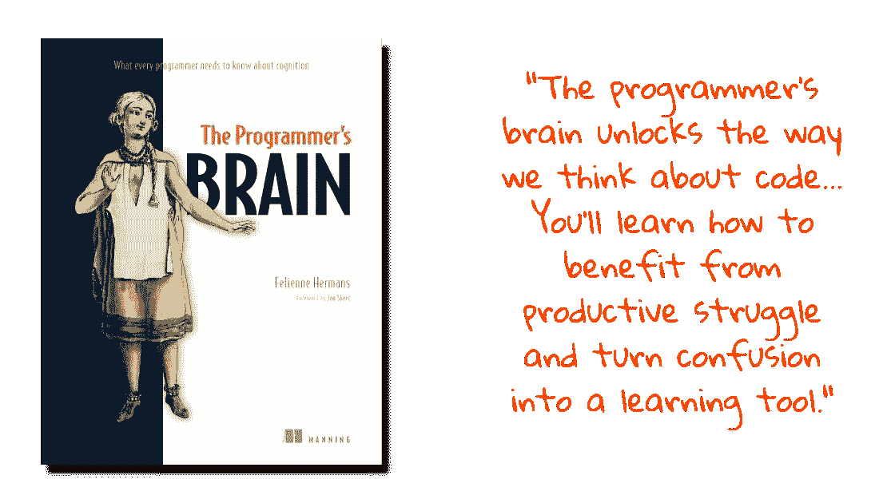

# 想要更干净的代码？使用六的规则

> 原文：<https://betterprogramming.pub/want-cleaner-code-use-the-rule-of-six-c21635ee2185>

## 一个简单而强大的框架，用于消除混乱的代码


图片由 Canva 作者提供

每个人都想写干净的代码。有整本书都是关于它的！

但是你现在不需要去读一本书来写更干净的代码。有一个“窍门”，每个程序员都可以学会，让他们的代码不那么混乱。

关键是这个:

# 每一行只做一件事

一条线，一个任务。

但是不要为之疯狂。


不要这样。(图片由 Canva 作者提供)

主要思想是:短代码比长代码需要更少的脑力去阅读。易读的代码更容易推理。理论上，代码行越短的程序越容易维护。

但是紧凑代码可能是神秘的。(看过 [APL](https://en.wikipedia.org/wiki/APL_(programming_language)) ？)而且你能分割线不代表你就应该分割线。

在某些语言中，可以在一行中将两个值赋给两个变量:

你可以把两个任务放在各自的行上:

但是，来吧。你真的*需要*来吗？如何判断一行是否应该被拆分？

# 这不全是关于线的长度

费莉恩·赫曼斯打开她的书， [*程序员的大脑*](https://www.manning.com/books/the-programmers-brain) *，*带着一个不可否认的真理:“困惑是编程的一部分。”


大概意思是该休息一下了。(图片由 Canva 作者提供)

赫尔曼斯的书(我强烈推荐)解释了你大脑的三种记忆功能如何协同工作来理解代码:

*   长期记忆(LTM):储存用于长期检索的信息，如关键词、句法、常用习语和模式。
*   短时记忆(STM):储存新信息用于短时提取(少于 30 秒！)，比如变量名和特殊值。
*   工作记忆(WM):处理来自 LTM 和短时记忆的信息，以得出结论并获得新知识。

STM 和 WM 都很小。两者一次只能存储[大约 4 到 6 个东西](https://en.m.wikipedia.org/wiki/The_Magical_Number_Seven,_Plus_or_Minus_Two)！让它们超载，你就有了一个混乱的配方。


你的大脑如何处理信息。(图片由 Canva 作者提供)

这给了我们一个判断一行代码是否太复杂的规则:

一行包含 6 条以上信息的代码应该被简化。

我称之为“六法则”

下面是 Python 中的一个例子:

这对你来说很难读吗？我也是。有一个很好的理由。

你得知道什么是`map`、`lambda`、`.split()`。变量`x`和`s`，字符串`'='`、`'?'`和`'&'`，索引`[1]`，切片`[-3:]`都占用 STM 和 WM 中的空间。

总共十件事！你的大脑跟不上。

或者你的可以。

如果是这样，你已经有了一些好的经验。

你的大脑像`s.split('?')[1]`一样把语法“组块”成“问号右边的那部分字符串”您可以使用存储在您的 LTM 中的信息来重建代码。但是你仍然只能一次处理几块。

所以…我们可以识别一行代码何时过于复杂。现在怎么办？

# 如果代码令人困惑，打破它

把它分成小块，也就是说！

我使用两种策略来分解代码。我称之为简单和 MORF。

简单的策略是增加代码行来减少认知负荷。



让我们将 SIMPLE 应用到我们之前看到的讨厌的一行程序中。从`map()`中删除第二个参数，并将其放在自己的行上:

可能还是很难读懂。在第一行中有七件事需要记录:

*   `query_params`
*   `s`
*   `.split()`
*   `'?'`
*   `[1]`
*   `'&'`
*   `[-3:]`

但是每一行要跟踪的东西比以前少了。你的大脑可以更容易地处理它们。

再次应用 SIMPLE 并将`s.split('?')[1]`移动到新的一行:

将它与原始的一行程序进行比较。哪个更容易加工？

MORF 策略采用了一种不同的方法，将代码分组到函数中。


下面是 MORF 应用于我们的一行程序的样子:

你甚至可以把 MORF 和 SIMPLE 结合起来:

你不必理解代码就能感受到效果。每一行都更容易让你的大脑处理。

还有额外的福利！

一旦你知道你的 WM 和 STM 没有超载，你就知道任何遗留的混乱都是由于你的 LTM 中缺少信息造成的。

换句话说，SIMPLE 和 MORF 不只是帮助你写出更干净的代码。他们帮助你发现知识差距，你可以通过实践来提高！

想知道更多关于你编码时大脑是如何工作的吗？

看看费莉恩·赫曼的《程序员的大脑》[, T21。](https://www.manning.com/books/the-programmers-brain)



# 锻炼

看看我们最后使用的简单代码:

一行中仍然有六个以上的“想法”,根据六的法则，应该将它们分开:

*   哪条线？
*   有哪些“想法？”
*   你会怎么分？
*   把它分开会有很大的不同吗？

用你的答案留下评论吧！

```
**Want to Connect?**Become a better coder in 5 minutes.One email, every Saturday, with one actionable tip.
Always less than five minutes of your time.[Subscribe here](https://davidamos.dev/curious-about-code-newsletter/)
```