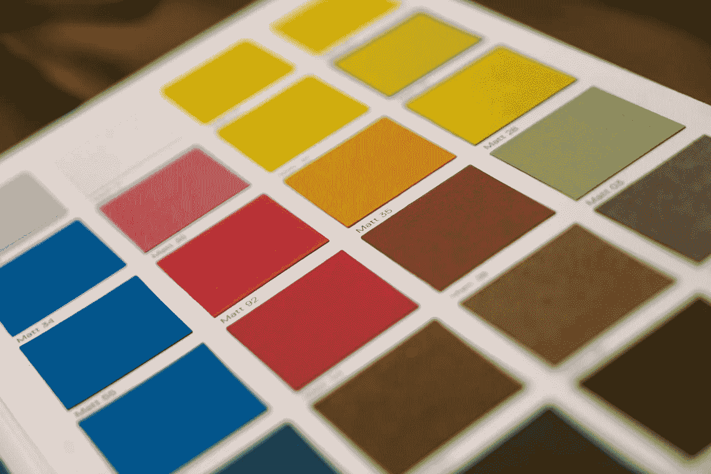
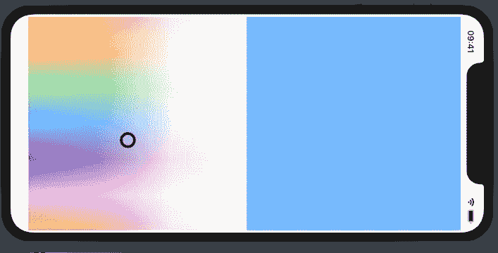
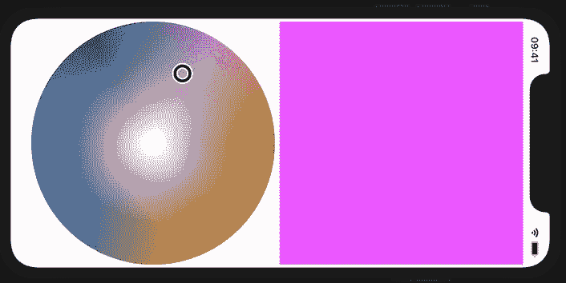
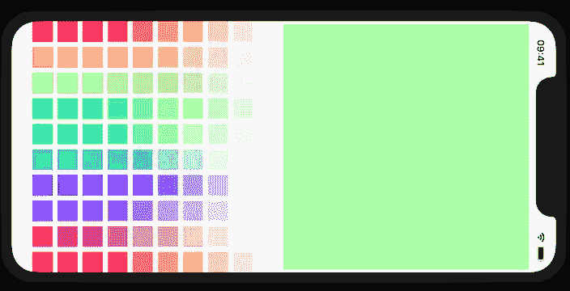

# 想要 iOS 14 中的 ColorPicker 提供更多功能吗？创建 1500 多个您自己的 SwiftUI 选择器

> 原文：<https://betterprogramming.pub/want-more-from-colorpicker-in-ios-14-create-1500-swiftui-pickers-of-your-own-7533514bf824>

## 使用 Swift Package Manager 定制颜色选择器，并在任何项目中重复使用



由[米卡·鲍梅斯特](https://unsplash.com/@mbaumi?utm_source=unsplash&utm_medium=referral&utm_content=creditCopyText)在 [Unsplash](https://unsplash.com/s/photos/paint-palette?utm_source=unsplash&utm_medium=referral&utm_content=creditCopyText) 拍摄的照片

# iOS 14 颜色选择器

iOS 14 对 SwiftUI API 进行了更新，这意味着我们可以在应用中使用一些新的视图。可能令人惊讶的是，我们现在有了一个`ColorPicker`，我们可以简单地通过为我们想要选择的颜色传递绑定来使用它。这使得在我们的 iOS、iPadOS 和 MacOS 应用程序中选择自定义颜色比以往任何时候都更容易，但是当我们想要自定义控件时呢？ColorPicker 看起来有一套相当严格的控件，开发者无法更改。

如果我们想要不同的控件呢？

如果我们想让控件看起来像我们想要的样子呢？

如果我们自己做，我们可以做任何我们想做的事！

# 1，500 多名拾色器

我也许应该解释一下我是如何在标题中找到 1500+这个数字的。

这将显示我没有夸大，同时显示你将学到的一切，所以它有多种用途。

我们为这些颜色选择器使用了四种颜色空间:

*   青色、洋红色、黄色、黑色、alpha (CMYKA)
*   色调、饱和度、亮度、alpha (HSBA)
*   红色、绿色、蓝色、阿尔法(RGBA)
*   白色，阿尔法(灰度)

您在本教程中制作的每个拾色器都占用一个颜色空间，并允许您设置每个参数，而无需为同一个参数设置多个控件。

以下是您将进行的控制:

## 帆布



画布使用 x 和 y 坐标一次选取两个参数(本例中为色调/饱和度)

您将学习创建画布，画布允许您在正方形上选取一个点。如果 *x-* 轴是亮度，而 *y-* 轴是饱和度，您选择的点的坐标将设置这两个参数。

## 车轮



轮子使用围绕一个圆旋转的度数，而不是二维坐标

你将学习创建色轮，这在表现色调(我们通常称之为*色轮*)和饱和度时更有意义。但是这些轮子可以用来显示你想要的任何参数组合，不管它看起来有多奇怪。

## 滑块


滑块一次只能选取一个参数，但可以与其他控制结合使用

您将学习创建滑块，可以拖移滑块来选择单个参数。滑块可以选择垂直而不是水平——为什么不呢？这些是自定义控件。

## 调色板



调色板可以包含任意数量的样本，并根据水平和垂直方向上的不同参数而变化

您将学习创建调色板，它在水平和垂直方向上创建自定义数量的样本。您可以选择每个方向上有多少色板，因此实际上有数百种调色板大小。

# 将控件组合到选择器中

RGBA 和 HSBA 色彩空间中的拾音器只能通过以下任何方式制作:

*   四个滑块
*   两张画布
*   两个轮子
*   两个调色板
*   一个画布和两个滑块
*   一个轮子和两个滑块
*   一个调色板和两个滑块
*   一块帆布和一个轮子
*   一块画布和一块调色板
*   一个轮子和一个调色板

RGBA 或 HSBA 参数有 24 种排列，每种排列有 10 种方式。

这意味着有 240 名 RGBA 拣货员和 240 名 HSBA 拣货员，总共 480 人。

CMYK 色彩空间中的拾色器只能是以下方式之一:

*   五个滑块
*   两张画布和一个滑块
*   两个轮子和一个滑块
*   两个调色板和一个滑块
*   一个画布、一个滚轮和一个滑块
*   一个画布、一个调色板和一个滑块
*   一个滚轮、一个调色板和一个滑块
*   一个画布和三个滑块
*   一个轮子和三个滑块
*   一个调色板和三个滑块

CMYKA 参数有 120 种排列方式，每种排列方式有 10 种。

这意味着有 1，200 个可能的 CMYK 拾取器，总共有 1，680 个。

由于它只有白度和不透明度参数，灰度只能用两个滑块、一个画布、一个调色板或一个色轮来制作。

这使得挑选者总数达到 1，684，我甚至没有包括滑块可以是水平或垂直的事实，挑选者可以排除 alpha，调色板可以是任何大小。

# 我们开始吧

虽然我将向您展示如何将这些颜色选择器快速打包，但我想我会把它留到最后。毕竟，您可能不想使用 Swift Package Manager，您可能只想将代码按原样放在项目中。记住这一点，使用 SwiftUI 作为用户界面创建一个新的单视图 [Xcode](https://developer.apple.com/xcode/) 项目。这将创建`ContentView`作为你界面中的第一个`View`，你可以修改它来预览我们将要处理的各种`View`。由于`ContentView`是在`SceneDelegate`中创建的，所以在`ContentView`中放一个你想在模拟器或物理设备上预览的`View`是很有用的。

如果你想为模拟器或设备建立另一个`View`，你需要改变`SceneDelegate`来使用那个`View`而不是`ContentView`。

当我给出一个代码的例子时，它可以在同一个文件中或者通过为每个视图创建单独的文件。

如何组织你的观点取决于你自己。

## **扩展数值类型**

我给苹果的数值类型添加了一些扩展，因为我认为它可以限制我们使用的双精度类型的范围。每当我计算角度时，我都倾向于将`halfPi`和`doublePi`作为常数添加，因为如果您不在每次需要时进行浮点除法和乘法来获得这些值，这可能会稍微提高性能。当我们谈到轮子时，它们都是需要的，但现在，我只是把它们放在这里，这样我不会忘记告诉你以后添加它们。

我最初编写了这个方法的`clampFrom`变体，它可以用来将 CGFloat 或 Double 的值限制在最小和最大值之内。但是我注意到每次我使用它的时候，我都把它限制在零和正数之间，所以我创建了`clampFromZero`来节省时间。不管怎样，我已经把`clampFrom`留在了扩展中，因为我可能会遇到一种情况，我会发现它很有用。

# **颜色模型**

由于 SwiftUI 视图在状态改变时会刷新，因此我们的颜色参数无法轻松存储在视图本身中。SwiftUI 结构属性中缺少`didSet`块，一旦我们调整了其中一个参数，更新我们选择的颜色的预览将是一个挑战。我创建的 ColourModel 类只做这些，其他的很少。它是独立于色彩空间的，这意味着不管你使用哪个色彩空间，它都包含所有的参数。

```
typealias RGBAValues = (red: Double, green: Double, blue: Double, alpha: Double)
```

我决定对颜色使用元组，因为它们纯粹是我们传递的数值组。这使得将我们需要的四五个参数作为一个单独的`Binding`传递变得容易，而不必创建一个只包含这些值而不做任何其他事情的结构。我没有将红色、绿色、蓝色和 alpha 声明为新结构类型的属性，而是简单地使用`typealias`来保存我想要的元组外观，并且我已经在一行中声明了一个唯一的类型。

请注意，我已经标记了元组内的参数。元组中参数的标签是可选的，但是我想确保在使用`RGBAValues`类型时得到正确的参数。毕竟，我不太可能在指`valuesInRGBA.blue`的时候不小心用到了`valuesInRGBA.green`。当我打算使用`valuesInRGBA.1`时，意外地使用`valuesInRGBA.2`的可能性要大得多，如果我们不给类型添加标签，这将是我们唯一的选择。

看看我还在`ColourModel`上加了什么。

这里有很多代码，但不是很复杂。

My `valuesInRGBA`和类似的元组被初始化并标记为`@Published`，这意味着任何依赖它们的 SwiftUI `View`将被告知任何变化。选择器组件将只被传递这些元组，但是`colour`属性将改变并更新层次结构中其他地方的其他视图。这可能在我们创建`PreviewColourView`时最为明显，它显示了当前的颜色，尽管与改变这些值的拾取器没有任何共同之处。显示颜色选择器的视图需要一个用`@ObservedObject`属性包装器标记的 ColourModel 实例。这将允许它将相关的颜色元组作为`Binding<RGBAValues>`传递给颜色选择器，允许在那里更改参数。

不要传递整个 ColourModel，它有颜色选择器不需要的数据和功能，最好只允许访问最少的部分。

每个元组都有一个调用`setColour()`的`didSet`闭包。`colourSpace`参数用于确定应该使用哪个元组来设置`colour`。这在阿尔法的情况下很好，它存在于每一个颜色空间。但是每隔一个元组需要传递它的颜色空间，以确保颜色设置正确。

我已经包含了`ColourSpace`枚举，它定义了所有的颜色空间。

# 创建可扩展颜色协议

`ColourModel`代码还不能编译，因为我们需要一个允许`fromValues`方法的`Color`扩展。这使得从形式为`Color.fromValues(valuesInRGBA)`的值元组中创建`Color`的实例变得更加容易，而不是像下面这样:

```
Color(red: valuesInRGB.red, green: valuesInRGB.green, blue: valuesInRGB.blue, opacity: valuesInRGB.alpha)
```

有必要有一种方法将 CMYKA 值与 RGBA 色彩空间相互转换，因为没有办法直接使用 CMYKA 参数构建 SwiftUI `Color`结构。一旦一个值元组从 CMYKA 转换成 RGBA，就可以用`Color.fromValues(valuesInRGBA)`构造一种颜色，和上面的例子一样。

在这种情况下，这并不是绝对必要的，但是我已经将这个扩展的声明分离到一个名为`ColorExtendable`的协议中。然而，这是一个介绍协议的好方法，在整个教程中都会用到。通过使用`Color: ColorExtendable`使扩展一致，我承诺我将提供协议的方法签名的实现。要求仅仅是存在一个具有特定签名的方法，这样我就知道我可以在任何相容的结构上调用这个方法。

我添加了 SwiftUI 颜色结构中没有的颜色，因为这些颜色以后会很有用。除了已经讨论过的转换和`fromValues`方法之外，我还提供了`blend`方法，在相同的颜色空间中组合颜色。这将有助于制作画布。

因为我把文档注释放在了协议中，所以没有必要对实现做同样的事情。这意味着可以按住 option 键单击这些方法和属性来显示它们是什么的文档。单击右侧面板中的问号打开快速帮助检查器，也会显示您单击的任何方法或属性的文档。

# 创建参数枚举

我创建了一个枚举来覆盖所有的参数，而不考虑颜色空间。这意味着我们可以将一个`Parameter`传递给一个适用于任何颜色空间的方法，并且我们可以使用一个 switch 语句从 RGBA 元组中获取红色，或者从 HSBA 元组中获取色调。这使得重用代码更加容易，而不需要为每个颜色空间的参数分别枚举。

Swift 中枚举的伟大之处在于我们可以添加方法和计算属性。我们有一种方法来获取任何参数的色彩空间和 RGBA 或 CMYKA 值，这对于创建渐变非常有用。

我添加了一个方法来比较`Parameter`的情况，以查看它们是否来自相同的颜色空间，另一个方法除了检查`Parameter`的情况是否不同之外，还做了同样的事情。

我们要制作的大多数控件都需要两个参数，如果参数相同，它们将无法正常工作。

# **扩展 SwiftUI 渐变结构**

渐变是使用一组`Color`实例制作的，但是`LinearGradient`用一个`startPoint`和一个`endPoint`组合了这些实例。我添加了一种更简单的方法来制作水平或垂直渐变，而不必每次都指定这些点。该扩展具有 SwiftUI 中不包含的颜色，以及为任何颜色空间计算渐变的方法。

可以从值元组创建梯度，方法是在一端将所讨论的参数减少到零，在另一端将其增加到 1。

# 创建预览颜色视图

你需要能够看到你选择的颜色，所以我提供了一个简单的预览颜色的方法。你不一定需要这个，因为你可以随心所欲地展示你的颜色。但是我将把它包含在我的选择器示例中。我包含了一个名为`square`的 bool，它将纵横比锁定为 1:1。当我测试我的选择器时，我发现这很有用，因为我倾向于将它们都放在 VStack 中，这将屏幕很好地分为选择器和预览。

# TransparencyCheckerboardView

如果你曾经在图像编辑器中处理过透明图像，你会发现白色和灰色的拼贴指示了图像透明的地方。如果你想让你的拾色器显示透明，这是很重要的，因为如果没有它，你的颜色只会显示你的拾色器所覆盖的背景色。在白色背景上，选择不透明度为零会使你选择的颜色看起来像白色，而实际上你的颜色是完全透明的。`TransparencyCheckerboardView`使用`ForEach`遍历瓷砖的索引，用交替的颜色覆盖任何需要的形状。

我表达观点的方式你可能不熟悉。我的结构不符合视图协议，它所做的只是声明属性和初始化器。不是直接符合 View，而是符合`TransparencyCheckerboardDisplayable`协议，符合 View 本身。

这是将结构分成两个不同组件的好方法:

**结构**就是视图。

**行为**是一个视图所做的事情，包括它的外观。

本质上，我们很容易确定任何符合`TransparencyCheckerboardDisplayable`的结构都有一个名为`tileSize`的`CGFloat`属性和两个名为`colour1`和`colour2`的`Color`属性。我们可以确定，一致性结构有一个名为`squareColour`的方法，我们可以发送任何瓷砖的行和列，并获得瓷砖应有的颜色。

尽管协议本身不能提供方法实现，但是协议的扩展可以。

这就是面向协议的方法使我的 SwiftUI 视图与您可能习惯的视图有很大不同的地方。由于`TransparencyCheckerboardDisplayable`符合 View，它可以提供一个`body`属性的实现，该实现将用于所有符合它的结构。这就是为什么我能够不提供身体，尽管它符合观点。当符合一个协议时，结构会自动符合该协议本身符合的任何其他协议。

需要注意的是，这不是继承。

与引用类型的类不同，结构是值类型，因此不能继承。

`TransparencyCheckerboardView`的初始化器具有使用传统灰色和白色瓷砖的`colour1`和`colour2`的默认值。虽然您可以在创建此视图时提供自定义颜色，但不指定任何颜色将允许使用默认颜色。对于占据半个 iPhone 屏幕的预览和画布，20 的平铺尺寸是可以接受的，但是调色板需要更小的平铺尺寸。这意味着我将为调色板使用构造函数`TransparencyCheckerboardView(tileSize: 10)`,但是为了使用默认大小，其他所有东西都可以在没有参数的情况下构造。

# **画布:创建幻灯片缩略图**

任何滑块的位置都由一个叫做*拇指*的形状来指示。为了让拇指与任何颜色一起工作，滑块拇指由黑白胶囊组成。如果拇指只是黑色的，它进入一个黑暗的区域，它就会消失。如果它是白色的，进入一个明亮的区域，同样的情况也会发生。同样的道理也适用于`CircleThumbView`，我们稍后将创建它用于画布和轮子。

虽然胶囊大小相同，但下面的白色胶囊线宽是原来的两倍。因此，在黑色胶囊的外部和内部都可以看到白色。

## 滑块:创建 DirectionalDragModifier 来检测用户输入

我们将需要一个自定义的拖动手势，以了解用户在滑块上选择的位置。当我开始做这个的时候，我犯了一个错误，把拖拽手势应用到了拇指上。如果你想拖动滑块，这是没问题的，但是如果你想点击滑块上的任意位置呢？对此的解决方案是将拖动手势应用于滑块本身，并让拖动手势传回一个偏移绑定。

传回偏移值允许视图定位滑块，即使实际上是画布检测拖动并告诉它去哪里。

创建一个视图扩展总是很有帮助的，它提供了一种更简单的方法来调用定制的`ViewModifier`。这使得你的修改器看起来更像苹果提供的修改器，因为你不需要在修改器视图方法中构造`ViewModifie` r。

换句话说:

```
.modifier(DirectionalDragModifier(offset:, xValue:, yValue:, size:))
```

变成了:

```
.drag(offset:, xValue:, yValue:, size:)
```

这样，长的修饰符名称可以短得多，并且更容易阅读代码。

## 创建 SliderDataBindable 协议

由于滑块一次只能选取一个参数，所以我们将以不同于所有其他控件类型的方式存储滑块所需的数据。除了有一个参数之外，这个协议的大部分与其他协议相同。我对`values`属性使用了泛型类型，这意味着我不局限于使用元组。换句话说，`SliderDataBindable`协议是在说我们不关心你如何存储你的颜色数据，不管它是一个结构，一个元组，甚至是一个单个的 Double。我们所关心的是使用什么参数，以及如何从值中获得该参数的绑定。

这些结构将出现编译错误，因为它们尚未实现协议要求的方法。由于四个颜色空间被存储为具有不同命名参数的元组，我们需要指定如何访问这些元组中的每一个。这是在扩展中完成的，因此我们创建的任何结构都将自动拥有一个版本的`getBinding`方法，而不必自己实现它。

## 滑块:创建滑块可拾取协议

我将把 *Pickable* 添加到所有控制协议的名称中，因为这是把一个枯燥的结构变成一个允许选择的结构。我会说它给`View`添加了挑选行为，但它实际上也添加了`View`主体，因为这是在协议扩展中完成的，就像对`TransparencyCheckerboardView`一样。您可能会注意到滑块可以在水平或垂直位置。

这给了我们更多的方法来创造独特的采摘。

由于每个符合`SliderPickable`协议的`View`都有相同的基本结构，这只是一个复制粘贴的例子。当在你的协议中使用一个`associatedtype`然后在一致性结构中变成一个`typealias`时，尽可能使用通用名称是有用的。

在 RGBASliderView 中，使用`let data: DataType`而不是`let data: RGBASliderData`更有意义。

换句话说，我们在每个结构中需要改变的只是`typealias`，因为其他行每次都是一样的。

## 滑块:为每个色彩空间创建视图

您可能想知道为什么我们将数据、逻辑和`View`主体从`RGBASliderView`中分离出来，并将其放在`SliderPickable`协议中。

虽然将所有的逻辑放在`View`中肯定是可能的，但这将使结构膨胀到类似于 UIKit 黑暗时期的巨大视图控制器的程度。当我第一次开始使用面向协议的编程技术时，我会对我的代码在哪里感到困惑。毕竟，按住 command 键单击一个`View`结构并选择“跳转到定义”，您将不再立即看到`body`属性。

但是，重要的是要考虑一个视图与其他视图有什么共同点。无论我们使用什么样的颜色空间，我们都需要一个可选择的控件。在那里你可以找到滑块共有的代码。我们不能对数据类型使用泛型，因为我们只有四种颜色空间的实现。这意味着我们也需要每个颜色空间的`View`结构，因为我们不想做很多 if-else 来确定我们在什么颜色空间以及我们在处理什么类型的数据。

# ColourDataBindable 协议

现在我们已经创建了 sliders，我们需要了解将用于所有其他控件的数据类型。正如我之前提到的，所有其他控件都需要两个参数，所以它们将接受一组`Parameter`案例。与数组不同，这是一种确保参数不会多于或少于两个的方法。我已经给了他们 X 和 Y 的标签，这使得它更容易到达画布的 X 和 Y 坐标。

## 扩展 ColourDataBindable 协议

就像使用`SliderDataBindable`一样，这里创建的结构不会编译，因为它们还没有实现所需的方法。我们需要能够在视图主体中调用`getBindings`方法，即使我们不知道我们在什么颜色空间或者数据将有什么结构。这意味着我们需要能够为每个参数提供 T4 的 T3 语句。我再次将它作为一个元组返回，主要是因为我认为它通过没有单独的`getXBinding`和`getYBinding`减少了代码量。

# 调色板:入门

由于调色板使用`Button`而不是自定义手势，它们看起来没有其他控件类型复杂。但是为了知道每个样本看起来是什么样子，需要一些计算。这意味着我们需要计算这些值，并且我们需要能够在点击样本时将这些值发送回`ColourModel`。对于滑块、画布和滚轮，我们直接在`ColourModel`中编辑参数，因此没有理由发回数据。

但是`Button`只在被点击时运行它的`action`闭包，所以这是一个不同的情况。

## 调色板:创建 PalettePickable 协议

值得注意的是，我将文档注释放在协议中。这为声明提供了一些上下文和解释，但它消除了在其他地方这样做的需要。我们可以在调用方法的地方按住 option 键单击方法的名称，并查看协议中的文档。我们可以点击将文本光标放在一个方法的名称中，右边面板中的快速帮助检查器也会向我们展示这一点。

对我来说，声明是定义的最佳位置，因为定义没有被长的实现块分开。

这个`View`是如何创建的应该是相当明显的。我们正在为`size.rows`中的每一行创建一个`HStack`布局，其中每一行包含一个`size.columns`中每一列的`Button`。我们调用`getSwatchColour`来获得`Color`，这可能令人惊讶地被直接用作`View`。尽管协议扩展不知道我们在什么颜色空间。它只知道这个函数会返回一个`Color`。`getSwatchParameter`也是如此，它会告诉我们将什么值发送回我们的`Binding<Double>`。

例如，如果我们点击色调为 0.2 的样本，该值将被计算并发送回`ColourModel`以相应改变当前颜色。

## 调色板:为每个色彩空间创建视图

这些结构不会很大，但我想创建一个成员式的初始化器，使用水平和垂直维度的默认值。这允许您创建一个有 100 个样本的大小合适的调色板，而不必每次都记住传递这些参数。和往常一样，我提供了一个包含`ColourModel`的预览，为了证明我关于调色板大小的观点，我通过设置自定义大小来挑战默认设置。

# 为画布和轮子创建圆形阴影视图

当我们开始制作可以二维移动的控件时，我们用于`SliderThumbView`的胶囊看起来就不那么好了。然而，这个圆是用同样的技术创建的，用一条细线将一个黑色的圆叠加在一个粗线的白色的圆上。由于这不是特定于画布或轮子的，我们不会为这些控件制作单独的拇指。

# 画布:入门

尽管在垂直方向上改变一个参数，在水平方向上改变另一个参数，画布与滑块的共同点可能多于调色板。您正在`View`的边界内拖动，任何颜色参数的值都在 0 和 1 之间。这意味着水平参数的值实际上是距前(左)边缘的距离除以画布的宽度，而垂直参数的值是距顶部的距离除以高度。

## 画布:创建双向 DragModifier 来检测用户输入

画布的拖动手势类似于滑块的拖动手势，但它同时考虑了 X 和 Y 坐标。注意我们在开始时添加的`CGFloat`和`Double`扩展中的方法是如何限制值的？夹紧`xValue`和`yValue`意味着我们总是得到一个介于 0 和 1 之间的有效参数值。因为画布的大小是作为属性传递的，所以缩略图不能移出画布。`maxY`和`maxX`减少了 25，因为这允许拇指(大小为 50)伸出画布两侧的一半。这是画布正常工作的方式，但是如果你愿意，你可以改变它。

## 画布:创建 DoubleGradientDisplayable 协议

画布需要显示一个真实的渐变，显示如果拇指移动到给定点会选择什么颜色。我发现这可以通过将两个渐变分层来实现，尽管这些渐变是什么取决于参数和色彩空间。因为`ColourDataBindable`需要一个`getBackground`方法，如果没有选择颜色，我们可以计算出背景是什么。

## 画布:创建 CanvasPickable 协议

与滑块一样，渐变背景被赋予了拖动手势。在一个`ZStack`中`CircleThumbView`在它的上面，并且它仅仅去由`bidirectionalDrag`修改器计算的偏移。无论如何，将拇指偏移到用户触摸的确切位置的代码相对容易，而拖动需要计算拖动手势从初始位置移动了多远。

## 画布:为每个色彩空间创建视图

画布视图与滑块视图没有太多不同。数据明显不同，因为它需要两个参数，但其他都是一样的。

# 轮子:入门

轮子是 canvas 的附加版本，它使用旋转而不是二维坐标来计算参数。离中心的距离作为第二个参数，这意味着我们仍然可以使用`ColourDataBindable`来达到这个目的。

## 轮子:创建 RadialDragModifier 以检测用户输入

因为我们现在正在处理一个圆，我们将需要不同的计算来找到我们的参数值。

这个修改器使用最初创建的扩展`CGPoint`以及`CGFloat`和`Double`扩展。这使得我们可以很容易地获得一个`CGPoint`和另一个`CGPoint`之间的距离，以及两点之间的角度。现在我们知道了这些值，我们就可以知道我们的参数是什么了。应该注意的是，当离中心的距离在 1 处达到峰值时，我们通过计算圆上该角度处的一个点来迫使拇指停留在圆内。

作为计算的一部分，我要减去圆周率的一半，这可能会令人困惑，但这是因为苹果的坐标系出于某种原因从右侧开始圆。我希望我的色轮从顶部开始，所以我添加了一个偏移量。这个偏移量可以在计算点之间角度的`CGPoint`扩展中找到，否则我所有的计算都会偏离 90 度。

## 轮子:创建 CircleGradientDisplayable 协议

我们不能再像使用其他控件一样使用`LinearGradient`。那些日子一去不复返了！幸运的是 SwiftUI 为我们提供了`AngularGradient`和`RadialGradient`，前者以度数或弧度绕圈，后者以圆心为起点，以指定半径为终点。

请注意，由于 previews 是一个静态属性，所以您想要添加的任何属性也需要是静态的

## 轮子:创建可选择轮子的协议

`WheelPickable`非常类似于画布，尽管我也选择在那里存储渐变。这使得创建`View`主体变得容易，因为我相信我会在初始化过程中得到某种渐变。这确实意味着由结构根据轮子给定的参数来决定它们的梯度应该是多少。

## 轮子:为每个色彩空间创建视图

因为我们并没有考虑坡度来创建车轮，所以我们需要从给定的数据和参数中创建一个。这是相对容易的，因为我们在开始时将`fromValues`添加到了`Gradient`扩展中。这只是在值元组中找到我们感兴趣的值，在一端将它减为零，在另一端将它增加到 1。色调略有不同，因为它会随着时间的推移而变化，并且需要中途多次停留。

我通过手动返回一个渐变来解决这个问题，这是彩虹的所有颜色！*

*我发现去掉橙色会使颜色分布更加准确。因为渐变无论如何都会在红色和黄色之间变成橙色，这使得色调渐变比色调参数变化得更慢。

# 创建 Swift 包

您可以将您的代码放入 Swift 包中，然后您只需一个 URL 就可以将它添加到任何项目中。如果这似乎是你想做的事情，这一部分是为你准备的。如果你希望别人为你制作这个包，可以在 GitHub 上查看[我的版本，并根据你在那里找到的 MIT 许可条款随意修改它。我欢迎提交新的问题，因为这个包是最近几天才创建的，可能有一些错误和改进。](https://github.com/sturdysturge/SwiftUIColourPickerMaker)

如果您对 Swift 软件包不感兴趣，请随意跳到本文底部的后续步骤部分。

在开始使用 Swift 软件包时，重要的是要记住，项目中未标记为私有或公共的每个类、结构、属性或方法都被赋予了默认的内部范围。

大多数情况下这是没问题的，因为 internal 意味着对同一个模块中的任何东西都是公共的。我们可以选择将颜色选择器的一部分保留在内部，只将一些部分暴露给导入它的项目。

相反，我要让事情变得简单，把一切都公开。

关于结构的一个伟大的事情是我们得到了一个成员式初始化器，而不需要创建一个。这就是为什么我之前创建的结构只有几行，但是我仍然可以通过为每个属性指定值来构造它们。然而，我们自动得到的初始化器是内部的，这意味着我们不能在包之外构造我们的视图。

进入“文件”>“新建”>“Swift 包”,并在 Mac 上的某个位置创建包。这将打开包并允许您编辑文件，即使它们与您的项目不在同一个文件夹中。

如果你在`package.swift`文件中查找，它会清楚它构建的目标文件夹是什么。这将与您创建包时给它起的名字相同。为了确保这个包不是为不受支持的目标构建的，您需要在`package.swift`中指定平台。

我是这样做的:

这里唯一的变化是靠近顶部的平台

没有这个，你需要[经常检查 API 可用性](https://www.hackingwithswift.com/new-syntax-swift-2-availability-checking)。

我们几乎只使用 iOS 13 和 MacOS Catalina APIs，那么为什么不限制平台并避免额外的工作呢？

右键单击包中与您的包同名的文件夹，因为这是文件需要被编译的地方。选择“添加文件…”选项，从您的项目中添加您需要的所有文件。

按住 Command 键点按任何结构都会给出一个生成成员初始化器的选项，这会加速这个过程。

将初始化器标记为 public 是有帮助的，但是结构本身也必须是 public。将`import YourPackageName`放在 SwiftUI 文件的顶部并试图使用你的包中的结构应该会导致 Xcode 抱怨由于它的访问级别什么是不可访问的。

这应该有助于缩小你忘记公开的任何事情。

# 后续步骤

显然，你可以在任何你想要的地方使用这些颜色选择器，无论是通过复制和粘贴代码，还是通过使用 Swift 包来加速这个过程。如果你发现了代码中的错误，请在这里或者在 GitHub 上的某期文章中告诉我。

你可以在库的[中级教程分支中找到一个项目，它使用了本教程中提到的所有代码。](https://github.com/sturdysturge/SwiftUIColourPickerMaker/tree/release/20-medium-tutorial)