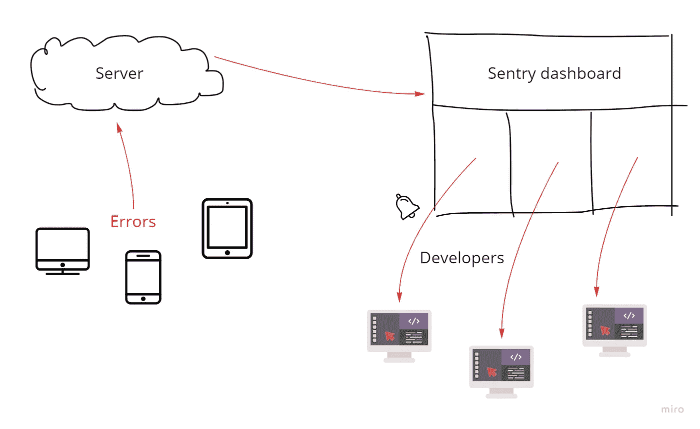
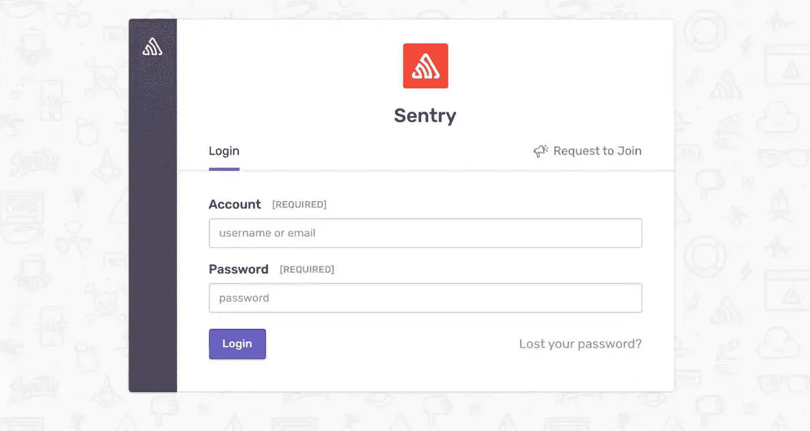
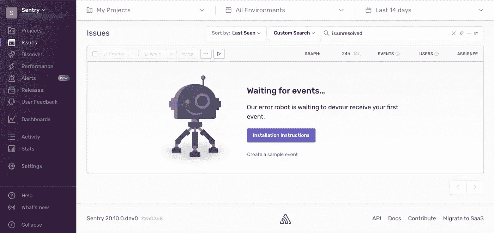

# 想要添加新功能，同时保持项目稳定吗？自动化一些任务

> 原文：<https://betterprogramming.pub/want-to-add-new-features-and-keep-the-project-stable-at-the-same-time-automate-some-tasks-1443980d69e6>

## 打破令人沮丧的循环的简单方法


在 [Unsplash](https://unsplash.com/) 上由 [Austin Distel](https://unsplash.com/@austindistel) 拍摄的照片

当你有一个建立项目的想法时，你总是在想你的下一步是什么，你的下一个发展战略是什么。

只有当你对自己目前的状态有信心，并且能够轻松地将新功能带到桌面上时，这才是可能的。你真的不想陷入修复你已经建立的东西并继续前进。

如果你自己一直在做某个项目，或者你有一个独立的技术团队在做这个项目，你可能以前遇到过这样的情况:

1.  你必须检查每一台设备和每一个有太多不同版本的平台，以确保每一个版本都运行良好，这样你就不会失去任何潜在用户。
2.  即使你写了太多的单元测试来检查路上的每一个微小的特性，还是会有一些不可预测的错误/行为出现，而你甚至没有注意到它们。
3.  您收到了一个错误报告，当您试图调试它时，您意识到该错误依赖于太多不同的变量和环境，并且您不能真正从用户那里询问那么多细节，您感到被卡住了。
4.  出了问题或出了故障，而你不知道问题的根本原因是什么，所以你打扰了所有的团队成员，以找出谁应该负责，谁可以解决问题。

那么，有什么解决办法呢？我们同时需要新功能和稳定性！

如果我们采取积极主动的方法，在错误和问题变成更大的混乱之前尽可能快地找到它们，然后我们把系统带回一个新的稳定版本，会怎么样？你可能会说:

*“嗯，我们没有足够的时间来反复测试每一件事，检查每一个用户，分析每一个日志！”*

让我们退一步，看看这是怎么回事。

当你想到从用户注意到错误并向我们报告开始的过程，然后我们创建并分配适当的任务给团队成员，然后我们尝试调试它并发布新版本——这是一个反复出现的令人沮丧的循环。

如果我们能找到一种系统的方法来自动化这个过程，我们就不再需要担心不稳定性。

> 这个过程的关键是在不浪费任何时间和精力的情况下，尽可能快地向合适的开发人员提供足够的信息。

# 说得够多了，实施该流程的最佳实用方法是什么？

我们有很好的选择，其中 [Firebase Crashlytics](https://firebase.google.com/docs/crashlytics) 是众所周知和受欢迎的选择之一。但是，如果您担心使用第三方服务，并且不知道他们到底在做什么，那么也许您可以在自己的服务器上运行开源方法并查看完整的代码，这对您来说更有意义。当然，如果你觉得舒服，你可以继续使用他们的云服务。

哨兵是那些你可以克隆并尝试的开源软件之一。

他们有一个定制的警报系统，你甚至可以看到用户面包屑和所有正在使用的变量。

它支持几乎所有的编程语言和所有的框架，所以你什么都不用做，只需要在你的代码中添加依赖。

他们还发布了一个 docker 版本，所以你可以通过运行一个命令轻松地在你的服务器上安装它。



如果你感兴趣，让我们快速设置一下:

# 设置服务器端

1.查看 [Sentry 的 Github 库](https://github.com/getsentry/sentry)获取最新版本:

```
git clone https://github.com/getsentry/self-hosted.git
```

2.克隆代码后，我们需要运行以下命令:

```
./install.sh
```

3.整个安装过程是通过 docker 自动完成的。在安装过程中，您只需选择管理员访问的用户名和密码。

安装完成后，我们需要使用以下命令运行 docker:

```
docker-compose up -d
```

4.最后，您应该能够在本地主机的端口 9000 上看到登录页面(您可以通过`config.yml`文件更改它)。

```
http://127.0.0.1:9000
```



哨兵登录页面

使用您在安装过程中选择的用户名和密码登录。



哨兵仪表板页面

如果你想调整默认配置，那么查看[安装文档](https://develop.sentry.dev/self-hosted/)。

# 设置客户端

正如我提到的，Sentry 支持几乎所有平台。

让我们看看 React 配置是如何工作的。可以查看[框架支持列表](https://docs.sentry.io/platforms/)。

1.首先，我们需要安装 sentry 包:

```
npm install --save @sentry/react @sentry/tracing
or
yarn add @sentry/react @sentry/tracing 
```

2.然后我们需要在项目的起点初始化哨兵。

3.仅仅通过添加那段代码，Sentry 就会检测出所有的错误和异常，并将它们发送到服务器。这就是我们开始的全部内容。

4.如果你想更进一步，你可以[启用版本控制特性](https://docs.sentry.io/product/releases/)，这样你就可以分离你的日志。或者您可以[启用面包屑功能](https://docs.sentry.io/product/issues/issue-details/breadcrumbs/)，这样您就可以在错误发生之前获得完整的操作列表。查看[功能列表](https://docs.sentry.io/product/)，挑选您需要的。

# 结论

我们想腾出时间在我们的项目上做更多创造性的工作，并建立我们的想法。节省时间的最好方法是将具有简单模式的任务和过程自动化。测试项目、发现错误并修复它们的过程可能会非常困难和耗时。

相反，我们可以使用用户的活动来检测错误并尽快修复它们。我们还可以通过直接向合适的开发人员提供合适的信息来消除围绕新错误的所有不必要的对话。

```
**Want to connect?**Check out [my LinkedIn profile](https://www.linkedin.com/in/reza-rafia/).
```