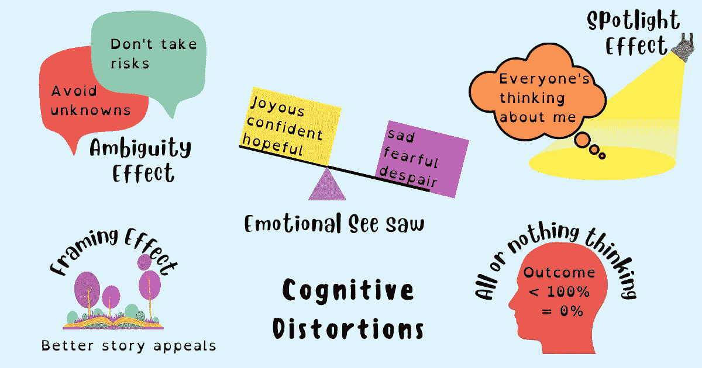

# 想要做出更好的决策？避免这 5 种认知扭曲

> 原文：<https://betterprogramming.pub/want-to-make-better-decisions-avoid-these-5-cognitive-distortions-6d35ef83b350>

## 更好地思考是指找到简单的过程，帮助我们从多个维度和角度解决问题



鸣谢:作者

我们工作的环境并不适合做出可靠的决策。我们有时也会有不合理或消极的思维模式。这导致思维习惯性的错误，造成对现实的不准确看法。

从进化的角度来看，人类发展了认知扭曲作为一种生存方法——为了眼前的生存而调整思维使人类走到了今天，但在史前时期为我们提供良好服务的相同思想不再适用于我们今天生活的信息和数字时代。

人类在科技、医药、食品、农业等方面取得了一些惊人的壮举。，但我们大脑中的神经回路还没有足够的时间来跟上新的现实。

认知偏差有许多不同的原因，但我们大脑对思维捷径的倾向起着主要作用。

> “我们日常做的大部分事情都存在于自动处理中。从握笔到急转弯以避免车祸，我们很少审视自己的习惯和缺点。我们需要捷径，但它们是有代价的。许多决策失误源于反身系统快速自动完成工作的压力。没有人早上醒来会说，‘我要思想封闭，对别人不屑一顾。’”—安妮·杜克

在高风险决策或非理性想法具有长期影响的事件中，与这些认知扭曲作斗争需要自我意识和练习良好的思维习惯，这使你能够做出有意识的决定，而不是让你的大脑自动运行。

在第 1 部分中，我将介绍这 5 种认知扭曲:

1.  模糊效应
2.  聚光灯效应
3.  框架效应
4.  情感跷跷板
5.  全有或全无思维

让我们深入了解每一个问题。

# 模糊效应

模糊效应是一种认知偏差，即决策受到缺乏信息或“模糊”的影响这一效应意味着人们倾向于选择有利结果概率已知的选项，而不是有利结果概率未知的选项。

我们都不喜欢不确定性和不知道结果会如何带来的不适。这让我们玩得安全——在放弃包含风险的大好机会的同时，选择有把握的决策。

不冒险会阻碍增长。尽职调查很重要，但不时大胆承担预期风险的能力也很重要。

人们在职业生涯的早期总是犯这种错误。他们害怕失败，担心错误对他们的职业生涯意味着什么。因此，他们不断选择他们已经知道如何做好的选项，而不是去寻找能帮助他们成长和建立新技能的机会。做他们一直做的事情或失败风险低的事情带来的短期舒适限制了他们的长期增长。

## **模糊效应认知扭曲的例子**

假设你的老板给你两个项目之间的选择。一个项目比另一个项目更清晰，成功几率更高，但学习量有限。另一个项目有许多松散的元素，不能保证成功。解决未知问题和连接缺失部分的机会应该会吸引很多人，但模糊效应使大多数人选择更安全的选择。

## **如何应对**

为了避免这种认知扭曲的影响，练习走出你的舒适区——挑选困难的问题，有目的地将自己置于让你不舒服的情境中，并要求你克服因不知道如何做某事而带来的压力和焦虑。这样做会增强你接受风险的精神力量，这样你就不会再把未知视为威胁，而是一个发挥潜力和培养新技能的机会。

简而言之，低风险=低增长。

# 聚光灯效应

聚光灯效应是一种心理现象，在这种现象中，人们倾向于认为自己受到了比实际更多的关注或关注。

高估别人注意到我们行为的程度会导致不必要的压力和焦虑。假设别人在思考我们，评判我们的行为和行动，会阻止我们保持真实或真实地表达自己。

这种认知扭曲让我们纠结于过去的错误——我们说过或做过的事情。当我们一直关注别人如何评价我们的时候，别人也在做同样的事情。他们对自己的缺陷和不完美如此激动，以至于几乎没有时间考虑你。

准确评估一个人被其他人注意到的程度是不常见的。

## **聚光灯效应认知扭曲的例子**

假设你给你的小组做了一个关于即将推出的产品线的演示。除了在讨论中突出的一个错误外，一切都很顺利。你没有为事情的进展感到高兴，而是一直在想错误被指出的那一刻。

会议结束了，大家都往前走了，但你一刻也不能停止想那个。在聚光灯效应下，你的内心对话不断重复，“我怎么会犯那个错误？大家一定觉得我很蠢。”

## **如何解决**

为了避免这种认知扭曲的影响，与其担心别人在想什么，不如提醒自己没有人真正关心你。

每个人都被困在自己的聚光灯效应中，没有认知能力把你放在聚光灯下。

简而言之，专注于做好自己的工作，不要担心别人的想法。

# 框架效应

框架效应是一种认知偏差，其中人们根据选项是否具有积极或消极的含义(例如，作为损失或作为收益)来决定选项。当积极的框架出现时，人们倾向于回避风险，但当消极的框架出现时，人们倾向于寻求风险。

即使多个选项同样有效，根据信息的呈现方式、突出的特征和框架，其中一个可能比另一个更有吸引力。

框架效应让我们选择框架更好的较差选项，而不是框架更好但较差的选项。

以研究判断和决策心理学而闻名的心理学家和经济学家丹尼尔·卡内曼指出:

> "当直接相互比较或权衡时，损失似乎大于收益."

换句话说，我们对损失厌恶的自动倾向使我们避免有损失的选择。因此，我们自然会发现突出正面属性的选项更有吸引力。

## **框架效应认知扭曲的例子**

例如:假设两个产品经理为两个要开发的新产品提出想法。一个项目经理表示，该产品有 90%的可能性会大受欢迎，而另一个项目经理则表示，该产品有 10%的可能性会失败。在框架效应下，即使两条信息指向相同的结果，你也可能选择有 90%成功率的那一条。

## **如何应对**

为了避免这种认知扭曲的影响，不要根据事情是如何被框定的来做出选择。深入挖掘，提出问题，并在当前维度之外的其他维度上进行评估。提醒你自己:仅仅因为糟糕的信息是以积极的方式构建的，并不能让这个选择变得更好。这样做并不能保证成功，但这个过程可能会带来更好的选择。

总之，不要为了更好的讲故事而堕落，要看得超越文字。

# 全有或全无思维

在全有或全无的思维中，你会走极端。你不是成功就是失败。你的老板不是对就是错。你的朋友不是公平就是不公平。你不是赢就是输。

当两个词——总是和从不——主宰你的生活时，你看不到你的生活并没有走向极端；它介于两者之间。决定并不总是好的或坏的。中间有一层灰色。

在这种认知偏差的影响下，你看不到决策和结果之间并没有 1:1 的关联——好的决策并不总是带来好的结果，而坏的决策有时也可能带来好的结果。

> “当我们从结果中回溯找出为什么会发生这些事情时，我们容易陷入各种认知陷阱，比如在只有相关性时假设因果关系，或者挑选数据来证实我们更喜欢的叙述。我们会把许多方钉子敲进圆孔，以维持我们的结果和决策之间紧密联系的假象。”—安妮·杜克

## **全有或全无思维认知扭曲的例子**

假设您决定将您组织中的聊天平台与第三方提供商集成。当你决定的时候，那家公司确实做得很好，检查了你所有的要求。这似乎是一笔很好的交易。

然而，就在第二年，该公司改变了它的集成模型，并且您意识到向您承诺的早期功能集将不再可用。即使新的聊天平台满足了你的很大一部分要求，但在“全有或全无思维”的作用下，你可能会认为这是一笔糟糕的交易。你没有意识到你在那一刻做出了最好的决定，也没有办法预测未来。

## **如何应对**

为了避免这种认知扭曲的影响，不要走极端——确定什么是重要的，并评估各种选择的利弊。与其 100%保证一定会成功，不如选择一个当下最有意义的选项。

简而言之，低于 100%的不良结果并不等同于 0%。

# 情感跷跷板

情绪跷跷板的运行方式与坐在一个真正的跷跷板上上下下时体验一系列情绪的方式非常相似。

你可能一会儿满怀希望，一会儿又感到绝望。有些日子你是不可阻挡的；其他日子，你似乎不能离开地面。有时你精力充沛，准备好迎接这个世界；其他时候，你会觉得周围的一切都在分崩离析。

被你的情绪所吸引会扰乱你的认知功能，从而削弱你清晰思考的能力。有时候，情绪的突然转变(例如，从恐惧到解脱)甚至会导致无脑。手头的认知资源越来越少，你可能会在没有考虑后果的情况下做决定。

## **情感跷跷板认知扭曲的例子**

比方说，你刚刚发现你在工作中犯了一个错误，这导致了恐惧、羞愧和尴尬等负面情绪的突然爆发。然而，没有人发现你的错误，这带来了解脱的感觉。当这种情况发生时，在你刚刚经历的情绪跷跷板的影响下，你的认知功能受损。随着手头认知能力的减少，你随后做出的决定会更少考虑，更快，或者不费吹灰之力。

## **如何解决**

为了避免这种认知扭曲的影响，要警惕强烈的情绪。当遇到这种情况时，推迟做决定或暂停，有意识地分配资源来考虑你的决定，而不是选择最简单的选择或最省力的选择。

总之，不要让你的情绪压倒你，或者控制你的思维。

> “在生活和商业中，盲点最少的人就赢了。消除盲点意味着我们看到现实，与现实互动，并更接近理解现实。我们想得更好。更好地思考就是找到简单的过程，帮助我们从多个维度和角度解决问题，让我们更好地选择适合我们的解决方案。为正确的问题找到正确的解决方案的技能是智慧的一种形式。”—谢恩·帕里什，伟大的心智模型

这是认知扭曲系列的第一部分。下周，我将分享另外五种认知扭曲，这将有助于你发现自己思维中的缺陷，并让你练习清晰思维，做出更好的决定。

# 摘要

1.  认知扭曲是导致糟糕决策和结果的思维错误。
2.  模糊效应让你规避风险，稳扎稳打，但也限制了你的学习和成长。
3.  聚光灯效应让你纠结于如何给别人留下印象，而不是专注于做好自己的工作。
4.  框架效应让你给积极的讲故事更多的权重，但是仅仅因为故事好并不能让它成为更好的选择。
5.  全有或全无的想法会丢弃任何不完美的结果。任何低于 100%的都不是 0%。
6.  情绪的波动耗尽了你的认知资源，让你倾向于容易的选择或不费力的选择。

```
Follow me here and on [Twitter](https://twitter.com/techtello) for more stories.This story was originally published at [https://www.techtello.com](https://www.techtello.com/cognitive-distortions/).
```