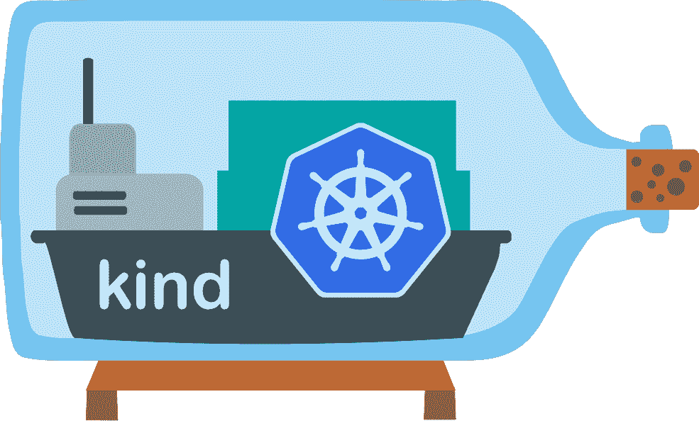

# 想从 Mac 上的 Docker 桌面迁移吗？设置您自己的替代解决方案

> 原文：<https://betterprogramming.pub/want-to-migrate-from-docker-desktop-on-mac-setup-your-own-alternative-solution-5d4fdf6128a7>

## 用具体的设置替换 Mac 上的 Docker 桌面(包括 Kubernetes)


在 [Unsplash](https://unsplash.com?utm_source=medium&utm_medium=referral) 上由 [PolaroMagnet](https://unsplash.com/@polaromagnet?utm_source=medium&utm_medium=referral) 拍摄的照片

Docker 于 2021 年 8 月 31 日宣布，他们将更新订阅。Docker 桌面端有一些变化:

> *“Docker 桌面对小型企业(员工少于 250 人，年收入少于 1000 万美元)、个人使用、教育和非商业开源项目仍然免费。”—摘自* [*Docker 博客*](https://www.docker.com/blog/updating-product-subscriptions/#:~:text=Our%20Docker%20Subscription%20Service%20Agreement,non%2Dcommercial%20open%20source%20projects.)

这是一个思考 Docker 桌面替代方案的好机会。

就我的日常使用而言，我一直在寻找 Docker 桌面的替代品。当我开发一个可负责的角色时，我用分子框架和 Docker 做测试。但这里的问题是不支持 systemd，因为 MacOSX 里没有。

为了拥有一个 Linux 主机，我运行了一个内部带有 docker 的流浪虚拟机。作为工作环境相当沉重！但最近我发现了一个简单易用的解决方案，可以在 Mac 上安装 Docker 和 Kubernetes，而无需通过 Docker 桌面。我们将看到一个工具集来实现这一点。

# 利马虚拟机

[Lima](https://github.com/lima-vm/lima) 是一个允许你在 MacOS 上启动 Linux 虚拟机的项目，具有自动文件共享、端口转发和 containerd。要在 Mac 上安装 containerd，你必须编译源代码，这可能会很繁琐和漫长。这是该项目的主要动机:

> *“Lima 的目标是向 Mac 用户推广*[*container d*](https://containerd.io/)*包括*[*nerd CTL(container d CTL)*](https://github.com/containerd/nerdctl)*，但是 Lima 也可以用于非容器应用。”——*[*https://github.com/lima-vm/lima#motivation*](https://github.com/lima-vm/lima#motivation)

Lima 可以比作一种用于 Linux 的 Windows 子系统( *WSL* )而不是 Mac 和用于 Mac 的 containerd。它用 [containerd](https://containerd.io/) 运行时和 [nerdctl](https://github.com/containerd/nerdctl) 替代 docker 命令来包装 [QEMU](https://www.qemu.org/) hypervisor。用自制软件安装非常简单:

```
$ brew install lima
```

虚拟机可以像这样启动:

```
$ limactl start
? Creating an instance "default" Proceed with the default configuration
INFO[0007] Downloading "https://github.com/containerd/nerdctl/releases/download/v0.11.2/nerdctl-full-0.11.2-linux-amd64.tar.gz" (sha256:27dbb238f9eb248ca68f11b412670db51db84905e3583834400305b2149915f2)
174.89 MiB / 174.89 MiB [----------------------------------] 100.00% 37.45 MiB/s
INFO[0013] Downloaded "nerdctl-full-0.11.2-linux-amd64.tar.gz"
INFO[0015] Attempting to download the image from "~/Downloads/hirsute-server-cloudimg-amd64.img"
INFO[0015] Attempting to download the image from "https://cloud-images.ubuntu.com/hirsute/current/hirsute-server-cloudimg-amd64.img"
558.19 MiB / 558.19 MiB [----------------------------------] 100.00% 22.66 MiB/s
INFO[0041] Downloaded image from "https://cloud-images.ubuntu.com/hirsute/current/hirsute-server-cloudimg-amd64.img"
INFO[0043] [hostagent] Starting QEMU (hint: to watch the boot progress, see "/Users/gvincent/.lima/default/serial.log")
INFO[0044] SSH Local Port: 60022
INFO[0044] [hostagent] Waiting for the essential requirement 1 of 4: "ssh"
INFO[0054] [hostagent] Waiting for the essential requirement 1 of 4: "ssh"
INFO[0081] [hostagent] Waiting for the essential requirement 1 of 4: "ssh"
INFO[0088] [hostagent] The essential requirement 1 of 4 is satisfied
INFO[0088] [hostagent] Waiting for the essential requirement 2 of 4: "sshfs binary to be installed"
INFO[0129] [hostagent] Waiting for the essential requirement 2 of 4: "sshfs binary to be installed"
INFO[0129] [hostagent] The essential requirement 2 of 4 is satisfied
INFO[0129] [hostagent] Waiting for the essential requirement 3 of 4: "/etc/fuse.conf to contain \"user_allow_other\""
INFO[0150] [hostagent] The essential requirement 3 of 4 is satisfied
INFO[0150] [hostagent] Waiting for the essential requirement 4 of 4: "the guest agent to be running"
INFO[0150] [hostagent] The essential requirement 4 of 4 is satisfied
INFO[0150] [hostagent] Mounting "/Users/gvincent"
INFO[0151] [hostagent] Mounting "/tmp/lima"
INFO[0151] [hostagent] Waiting for the optional requirement 1 of 2: "systemd must be available"
INFO[0151] [hostagent] Forwarding "/run/user/501/lima-guestagent.sock" (guest) to "/Users/gvincent/.lima/default/ga.sock" (host)
INFO[0151] [hostagent] The optional requirement 1 of 2 is satisfied
INFO[0151] [hostagent] Waiting for the optional requirement 2 of 2: "containerd binaries to be installed"
INFO[0151] [hostagent] Not forwarding TCP 127.0.0.53:53
INFO[0151] [hostagent] Not forwarding TCP 0.0.0.0:22
INFO[0151] [hostagent] Not forwarding TCP [::]:22
INFO[0154] [hostagent] The optional requirement 2 of 2 is satisfied
INFO[0154] READY. Run `lima` to open the shell.
```

虚拟机已启动并正在运行。主机文件系统通过 sshfs 挂载到虚拟机中，它与主机具有相同的路径。您可以通过在命令前加上 lima 来执行命令:

```
$ lima uname -a 
Linux lima-default 5.11.0-37-generic #41-Ubuntu SMP Mon Sep 20 16:39:20 UTC 2021 x86_64 x86_64 x86_64 GNU/Linux
```

您还可以将`nerdctl`与 Lima-VM 中的 containerd 一起使用来控制容器:

```
$ lima nerdctl run -it --rm alpine sh -c "cat /etc/os-release" NAME="Alpine Linux" 
ID=alpine VERSION_ID=3.14.2 
PRETTY_NAME="Alpine Linux v3.14" 
HOME_URL="https://alpinelinux.org/"
BUG_REPORT_URL="https://bugs.alpinelinux.org/"
```

# 安装 Docker 守护程序

我们仍将在虚拟机中安装 Docker 进行准备，因为我们需要它用于后面的 Kubernetes 部分:

```
$ lima sudo apt install docker-io
$ lima sudo docker version                                             
Client:
 Version:           20.10.7
 API version:       1.41
 Go version:        go1.13.8
 Git commit:        20.10.7-0ubuntu1~21.04.1
 Built:             Fri Aug  6 14:14:21 2021
 OS/Arch:           linux/amd64
 Context:           default
 Experimental:      trueServer:
 Engine:
  Version:          20.10.7
  API version:      1.41 (minimum version 1.12)
  Go version:       go1.13.8
  Git commit:       20.10.7-0ubuntu1~21.04.1
  Built:            Wed Aug  4 12:24:19 2021
  OS/Arch:          linux/amd64
  Experimental:     false
 containerd:
  Version:          v1.5.5
  GitCommit:        72cec4be58a9eb6b2910f5d10f1c01ca47d231c0
 runc:
  Version:          1.0.2
  GitCommit:        v1.0.2-0-g52b36a2d
 docker-init:
  Version:          0.19.0
  GitCommit:
```

# 码头上的 Kubernetes(实物)

[kind](https://sigs.k8s.io/kind) 是一个使用 Docker 容器节点运行本地 Kubernetes 集群的工具。在上一篇文章中，我向您展示了如何将其集成到您的 CI 渠道中。这里我们将把它用于本地开发目的。



来自[https://github.com/kubernetes-sigs/kind](https://github.com/kubernetes-sigs/kind)的亲切标识

在虚拟机中打开一个会话，然后转到`$HOME`:

```
$ lima
$ cd
```

安装 go 1.11+:

```
$ sudo apt install golang
```

安装`kind`:

```
$ GO111MODULE="on" go get sigs.k8s.io/[[email protected]](https://getbetterdevops.io/cdn-cgi/l/email-protection) $ sudo cp $HOME/go/bin/kind /usr/local/bin/kind
```

创建一个全新的 Kubernetes 集群:

```
$ sudo kind create cluster
Creating cluster "kind" ...
 ✓ Ensuring node image (kindest/node:v1.21.1) 🖼
 ✓ Preparing nodes 📦
 ✓ Writing configuration 📜
 ✓ Starting control-plane 🕹️
 ✓ Installing CNI 🔌
 ✓ Installing StorageClass 💾
Set kubectl context to "kind-kind"
You can now use your cluster with:kubectl cluster-info --context kind-kindThanks for using kind! 😊
```

> *通过版本参数，你可以使用一个特定的 Kubernetes 版本:* `*kind create cluster --image kindest/node:v1.21.1*`

下载与集群版本兼容的`kubectl`:

```
$ sudo curl -LO [https://storage.googleapis.com/kubernetes-release/release/v1.21.1/bin/linux/amd64/kubectl](https://storage.googleapis.com/kubernetes-release/release/v1.21.1/bin/linux/amd64/kubectl)
```

使`kubectl`二进制文件可执行:

```
$ sudo chmod +x ./kubectl
```

将二进制文件移动到您的`PATH`:

```
$ sudo mv ./kubectl /usr/local/bin/kubectl
```

测试以确保安装的版本是最新的:

```
$ sudo kubectl version --client
```

检查集群是否准备就绪:

```
$ sudo kubectl cluster-info
Kubernetes control plane is running at https://127.0.0.1:39635
CoreDNS is running at https://127.0.0.1:39635/api/v1/namespaces/kube-system/services/kube-dns:dns/proxyTo further debug and diagnose cluster problems, use 'kubectl cluster-info dump'.
```

启动 busybox pod 交互模式:

```
$ sudo kubectl run -i --rm --tty debug --image=busybox --restart=Never -- sh
If you don't see a command prompt, try pressing enter.
/ #
```

# 结论

我们已经看到了如何用 lima 替换 Docker Desktop 来轻松创建一个本地集成 containerd 的 Linux VM。我们安装了 docker 守护进程，以便能够使用 Kubernetes 和 kind。

目前唯一的缺点是，我没有找到如何在非根模式下启动 docker。将用户添加到 docker 组并不授予对 docker 套接字的权限

有了这个设置，您还可以使用 Kubernetes 并创建不同版本的集群。这是开发工作站的理想选择。我认为这正是我们所缺少的，它为 Mac 环境带来了新的可能性。

# 资源

[](https://www.docker.com/blog/updating-product-subscriptions/#:~:text=Our%20Docker%20Subscription%20Service%20Agreement,non%2Dcommercial%20open%20source%20projects) [## Docker 正在更新和扩展我们的产品订阅——Docker 博客

### 数百万开发人员使用 Docker 在任何地方构建、共享和运行任何应用程序，55%的专业开发人员…

www.docker.com](https://www.docker.com/blog/updating-product-subscriptions/#:~:text=Our%20Docker%20Subscription%20Service%20Agreement,non%2Dcommercial%20open%20source%20projects) [](https://github.com/lima-vm/lima.git) [## GitHub — lima-vm/lima: Linux 虚拟机，在 macOS 上(又名“Linux-on-Mac”，“macOS 子系统用于…

### Lima 推出了具有自动文件共享、端口转发和容器的 Linux 虚拟机。利马可以是…

github.com](https://github.com/lima-vm/lima.git) [](https://github.com/kubernetes-sigs/kind) [## GitHub—Kubernetes-sigs/kind:Docker 中的 Kubernetes—用于测试 Kubernetes 的本地集群

### kind 是一个使用 Docker 容器“节点”运行本地 Kubernetes 集群的工具。kind 主要是为…

github.com](https://github.com/kubernetes-sigs/kind)