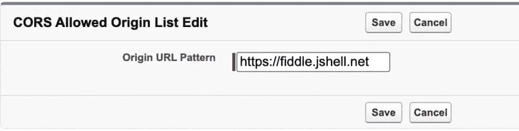

# 想要使用 Salesforce APIs 吗？CORS 的！

> 原文：<https://betterprogramming.pub/want-to-work-with-salesforce-apis-of-cors-9ac3e3d70217>

## 在本帖中，我们将仔细看看跨源资源共享，或 CORS，是如何运作的


互联网的基本功能可以归结为一个简单的交互:呼叫和响应。一台机器(客户端)向另一台机器(服务器)发送请求，另一台机器以回复作为响应。这种来回的请求-响应循环是每部电话、电视、智能冰箱或电脑发送和接收数据的方式。

然而，这种模式存在一些固有的安全风险，从应用程序漏洞到 DDoS 攻击。在本帖中，我们将仔细看看跨产地资源共享，或 [CORS](https://developer.mozilla.org/en-US/docs/Web/HTTP/CORS) ，如何减轻这些风险，以及它是如何运作的。通过使用一个与多个 Salesforce APIs 交互的小型 Node.js 应用程序，我们将看到启用和禁用 CORS 时响应的差异，以及它对我们客户端的影响。

首先，让我们更深入地了解一下 CORS 是什么以及它为什么存在。

# 网页调用外部资源

每当浏览器请求一个网页时，服务器就发回一大块 HTML。然后浏览器绘制 HTML，重要的是，在必要时继续向服务器请求更多信息。例如，如果有任何无法解析的内容，比如图像或视频，或者需要执行的代码(比如 JavaScript)，那么浏览器会继续向服务器发出请求，服务器会愉快地满足这些请求。

# 安全风险

假设您正在 Salesforce.com 浏览，您的浏览器遇到一些 JavaScript 执行对 trailhead.com 的请求。例如，假设一段代码想要使用[获取](https://javascript.info/fetch) API 获得用户已完成的踪迹列表:

```
let response = await fetch('https://api.trailhead.com/user/1/trails');
```

从表面上看，这段 JavaScript 代码是无害的，但是它提出了一个关于网络如何运行的基本问题:如果一个浏览器正在加载 Salesforce.com，它应该也能加载来自 trailhead.com 的数据吗？一个人的本能可能是说，“是的，当然。”但是，如果我们允许 Salesforce.com 从 trailhead.com 加载代码，为什么不允许从 heroku.com、github.com 或 google.com 加载代码呢？为什么不直接从任何地方加载代码呢？

从世界上的任何站点发出请求都会带来上述安全风险。在这个例子中，没有任何边界，trailhead.com 无法控制谁向他们请求数据。最理想的情况是，服务器可以列出一个名单，列出它信任的可以访问网络的人。也许 trailhead.com 会允许 Salesforce.com 的用户加载脚本，但不会允许其他地方的用户。

# 进入 CORS！

CORS 就是为了堵住这个漏洞而设计的。服务器不仅规定了哪些域可以访问它的资源，还规定了 HTTP 动词的类型。如果客户机不能满足服务器的 CORS 要求，那么数据就不能被执行或传递。CORS 是一个超越任何一种编程语言的概念，它配置在 web 服务器上，比如 nginx 或 Apache。

最重要的是，它是由浏览器强制执行的:这是无法避免的，而且由 CORS 强制执行的数据不能被该上下文之外的浏览器客户端访问。CORS 旨在实现客户的生产力和加强服务器的安全性之间的平衡。

CORS 是通过 [HTTP 头](https://developer.mozilla.org/en-US/docs/Web/HTTP/Headers)实现的，这可以被认为是附加在 HTTP 请求和响应上的额外元数据。您可能熟悉为[认证](https://developer.mozilla.org/en-US/docs/Web/HTTP/Headers/Authorization)(比如`Authorization: token xxx`)添加头，或者指定客户端理解的数据类型(通过[接受](https://developer.mozilla.org/en-US/docs/Web/HTTP/Headers/Accept))。CORS 有自己的头部类别，服务器用它来声明浏览器可以从哪里加载资源。

为了演示这在实践中意味着什么，让我们来看看使用 Salesforce 平台的演示应用程序如何与 CORS 交互。

# 演示先决条件

在开始之前，确保您的 [Salesforce 实例支持对其 API](https://developer.salesforce.com/docs/atlas.en-us.api_rest.meta/api_rest/intro_rest_compatible_editions.htm) 的访问。如果您没有访问 Salesforce 平台的权限，那么您可以[创建一个免费的开发者版帐户](https://developer.salesforce.com/signup)。您可以使用该组织来测试在 Salesforce 平台上的开发情况。

# 请求 Salesforce 资源

打开浏览器选项卡并导航至[https://jsfiddle.net](https://jsfiddle.net/)。在标有 JavaScript 的框中，粘贴以下代码行:

```
const run = async () => {
const response = await fetch('https://myInstance-dev-ed.my.salesforce.com/services/data');
const responseJson = await response.json();
responseJson.forEach( (e) => document.write(e.label + "<br/>"));
document.body.style.background = "white";
}
run();
```

用您的 Salesforce 实例的实际名称替换`myInstance-dev-ed`。单击顶部菜单栏中的运行。你应该看到…什么都没有。

然而，如果你打开[浏览器控制台](https://developer.mozilla.org/en-US/docs/Tools/Browser_Console)，你会看到一条消息，表明 CORS 已经阻止了访问:

```
Access to fetch at 
'https://myInstance-dev-ed.my.salesforce.com/services/data' from origin 
'https://fiddle.jshell.net' has been blocked by CORS policy: No 
'Access-Control-Allow-Origin' header is present on the requested resource. 
If an opaque response serves your needs, set the request's mode to 'no-cors' to fetch the resource with CORS disabled.
```

这是怎么回事？嗯，Salesforce 提供对其数据和资产的半开放访问。在这种情况下，我们尝试使用 JavaScript 的 [fetch](https://javascript.info/fetch) 函数发出请求并检索一些 JSON 数据。然而，由于 CORS，我们被阻止这样做。未经授权的访问正是 CORS 旨在防止的。

具体来说，我们被缺乏适当的[访问控制允许来源](https://developer.mozilla.org/en-US/docs/Web/HTTP/Headers/Access-Control-Allow-Origin)定义所阻碍。这个头声明了允许浏览器从哪个 URL 加载资源。如果缺少此信息，浏览器就无法加载外部资源，在本例中是 Salesforce 实例的`/services/data`路径中的内容。还有许多其他类型的 CORS 头，比如[Access-Control-Allow-Methods](https://developer.mozilla.org/en-US/docs/Web/HTTP/Headers/Access-Control-Allow-Methods)，它定义了允许浏览器使用哪些 HTTP 方法。

# 在 Salesforce 中启用 CORS

幸运的是，在 Salesforce APIs 上启用 CORS 并不需要太多时间。按照本指南中的简短步骤[，输入`https://fiddle.jshell.net`作为允许的域:](https://developer.salesforce.com/docs/atlas.en-us.204.0.api_rest.meta/api_rest/extend_code_cors.htm)



请确保此 URL 的末尾没有尾随斜杠。

单击 Save，然后再次运行该代码片段。瞧啊。虽然不多，但是您应该会看到一些 Salesforce 版本的列表。

# 其他 CORS 注意事项

虽然 Salesforce 尽最大努力提供安全检索数据的方法，但其他平台可能没有这么安全。幸运的是，CORS 还提供了能够在[中传递](https://javascript.info/fetch-crossorigin#credentials)凭证**的能力。**

如果您在不像 Salesforce 那样不使用身份验证机制的站点上导航，则凭据非常有用。通过在客户端 JavaScript 请求中设置一个附加选项(`credentials: "include"`)，浏览器的 cookies 会随请求一起发送。

自互联网诞生之初，Cookies 就被用作一种身份识别机制。虽然它们已经基本上被放弃作为一种身份验证方法，但一些网站仍然这样使用它们。服务器负责接收 cookies 并对它们执行任何额外的验证。

由于 CORS 支持在很大程度上是服务器的一个考虑因素(也就是说，服务器应该默认启用 CORS)，客户端没有太多其他事情要做。客户端可以设置不同的[模式](https://developer.mozilla.org/en-US/docs/Web/API/Request/mode)，这些模式有多种用途。例如，如果您正在构建一系列微服务，那么您可能会发现`same-origin`的严格域匹配对于双重确保请求和响应来自同一个域可能是有用的。

我们大部分时间都在谈论 CORS 和 JavaScript，但是 web 开发还有一个重要的组成部分 CORS 可以介入:不起眼的 [< iframe >](https://developer.mozilla.org/en-US/docs/Web/HTML/Element/iframe) 。iframe 元素允许您将来自另一个 URL 的内容嵌入到网页中。是什么阻止我注册[www.not-salesforce.com](https://www.not-salesforce.com/)并设置页面为 Salesforce 的内容？当然是 CORS！

# 结论

最终，不是每个服务器都支持开放的 CORS 访问，这取决于服务器。配置不当的 CORS 设置可能会妨碍合法的用户工作流，但是完全禁用 CORS 肯定会使您的应用程序更容易受到恶意客户端的攻击。一般来说，作为一名开发人员，如果一个操作可以在服务器上完成，那么它比在客户端执行工作更安全，所以如果你想禁用 CORS，请确保你有一个好的理由。

我们刚刚在这里简单看了一下 Salesforce APIs。您还可以操作数据或检索各种 Apex 数据。我们鼓励你看一下[Force.com REST API 开发者指南](https://developer.salesforce.com/docs/atlas.en-us.204.0.api_rest.meta/api_rest/intro_what_is_rest_api.htm)，了解更多关于 API 允许你做什么的信息。您还可以在 Trailhead 上找到[一组教程，帮助您构建与平台的集成。](https://trailhead.salesforce.com/)

*感谢阅读。敬请关注更多内容。*