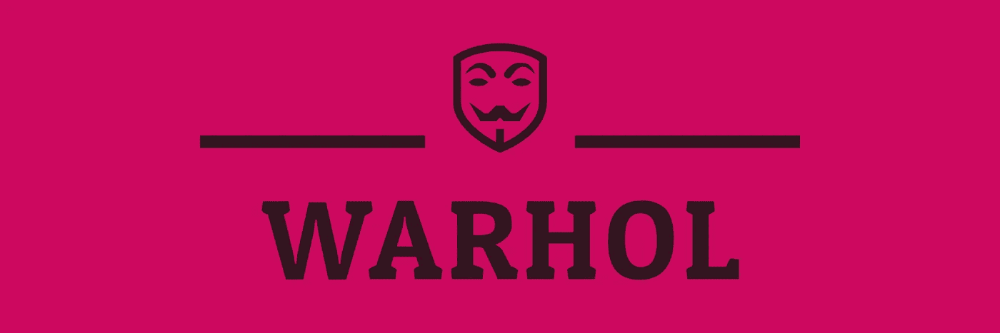
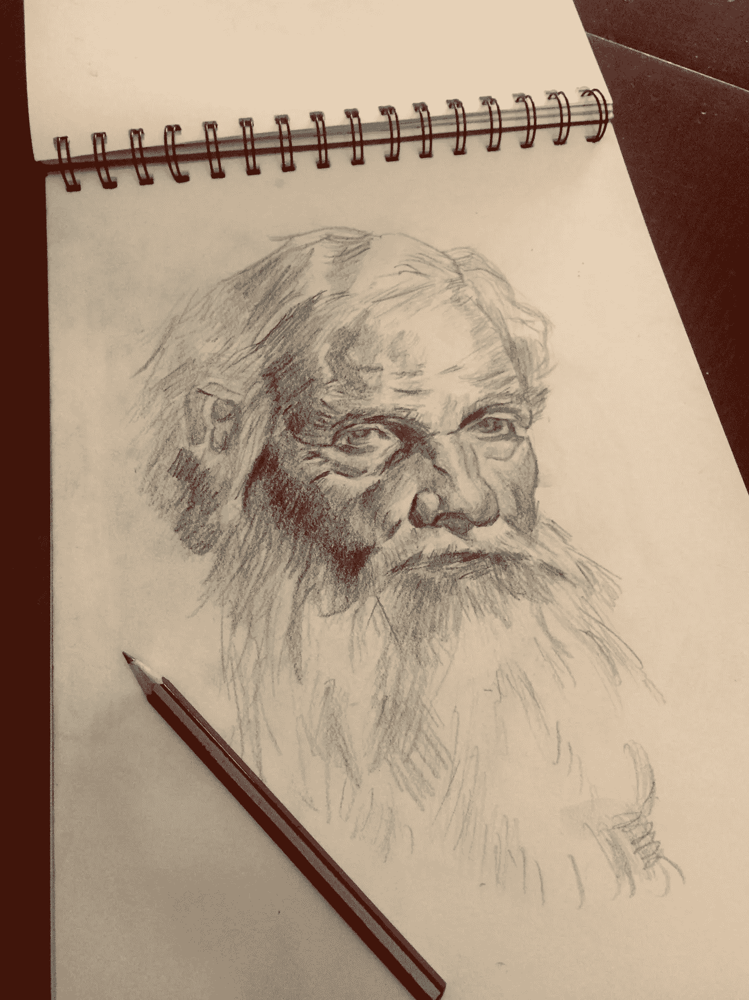
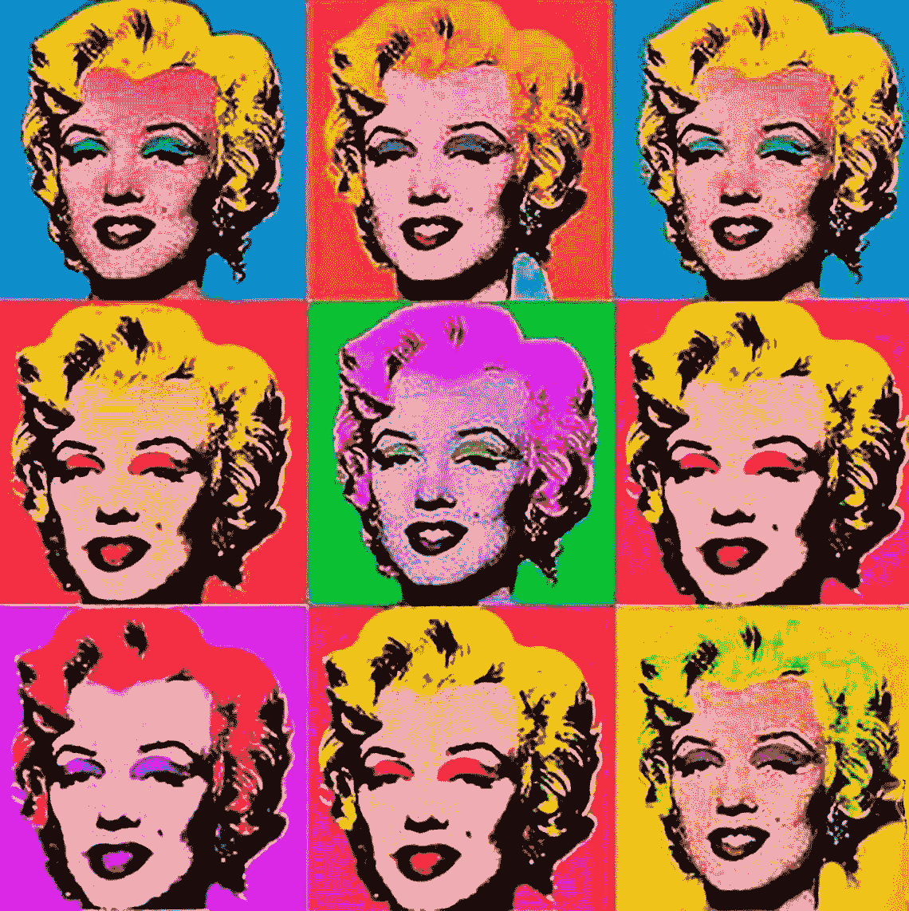

# 沃霍尔:iOS 上的人脸检测变得简单

> 原文：<https://betterprogramming.pub/warhol-face-detection-made-easy-on-ios-4b146b87b7d0>

## 只需一步，即可检测人脸并在上面绘画

# 创世纪

我喜欢画画。具体来说，我喜欢画肖像。我发现我们面部的独特性很迷人，我们每个人都有如此少的参数(眼睛、鼻子、嘴巴、耳朵和一个形状)却有不同的面貌。

一旦你开始画肖像，理论上说放置细节和找到合适的比例是最重要的。当然，你需要表现出每个特征的细节，但是给你一种与原作相似的感觉的是那些特征。如果有个 app 帮我做到这一切岂不是很好？我在 app store 里查了一下，惊讶的是，什么都没有！因为我喜欢吃我自己的狗粮，所以是时候开发一个应用程序了，给定一张肖像，提供脸部的坐标和比例，这样当我把它投影到纸和铅笔上时，我就有了一个想法。

自然，第一个任务是刷新我在 iOS 上关于人脸检测的生锈知识，并深入了解[视觉](https://developer.apple.com/documentation/vision)。

> 该框架执行面部和面部标志检测、文本检测、条形码识别、图像配准和一般特征跟踪。Vision 还允许使用定制的核心 ML 模型来完成分类或对象检测等任务。

哇，这是一大块的功能！我只需要面部和面部标志检测。地标是视觉语言中的一个特征，比如左眼、右眼……除此之外，如果我想从设备摄像头中检索人脸图像，我必须使用 AVFoundation。

在我开始深入研究之后，我的“潜在第三方库帮助开源社区警报”开始响了。令我感到惊讶的是，尽管关于它的教程很少，但没有一个库一步封装了人脸检测功能，避免了处理低级的苹果框架，并使移动应用程序上人脸检测的主要目的变得容易——在上面画一些愚蠢的东西😝

画肖像:比例，比例，比例。

# 沃霍尔

[沃霍尔](https://github.com/toupper/Warhol)取自安迪·沃霍尔的名字，他是美国艺术家、电影导演和制片人，是被称为[波普艺术](https://en.wikipedia.org/wiki/Pop_art)的[视觉艺术运动](https://en.wikipedia.org/wiki/Art_movement)的领军人物。这是因为当我想到肖像画时，我会想到:

沃霍尔，多酷的名字啊！

为什么要用？如前所述，你可以忘记相当繁琐的 Vision 和 AVFoundation Apple 框架，专注于你真正的创造性任务。这是一个工具，将帮助你实现你的独特功能。

## 特点:

[沃霍尔](https://github.com/toupper/Warhol)有什么特点？

*   摄像机中的人脸检测
*   UIImageView 中的人脸检测
*   将面部特征转换到客户坐标
*   在脸部上方绘制

# 用法示例

我不会用沃霍尔的核心 iOS SDK 来完成人脸检测的过程，因为互联网上已经有一些很好的教程——例如[，这个](https://www.raywenderlich.com/1163620-face-detection-tutorial-using-the-vision-framework-for-ios)。然而，我将详细说明我们如何从相机和图像实例中用沃霍尔接口做同样的事情。正如您将看到的，我们可以用其中的几行代码替换几百行代码和类。

## 带摄像头

在你要使用的文件中导入沃霍尔。创建一个`CameraFaceDetectionViewController`的实例，并将将要绘制的视图分配给前者的`cameraFrontView`属性。(我们马上就会看到如何绘制)。然后，您可以呈现视图控制器:

为了绘图，我们应该创建一个符合沃霍尔协议 FaceView 的 UIView 的子类。给定更新后的视图模型属性，我们可以绘制他们的`func draw(_ rect: CGRect)`函数。每当沃霍尔检测到人脸变化时，它就更新视图模型并在视图上调用`setNeedsDisplay()`,这样它就可以触发绘制过程:

一个被隔离的被沃霍尔提炼的我。绘图由客户端应用程序完成，在本例中是项目示例应用程序。

您可以实施`CameraFaceDetectionDelegate`协议来对人脸检测中的任何变化做出反应。当您不想在顶部绘制，而只想获得面部特征(界标)坐标时，这可能很方便。这些封装在给定参数`FaceViewModel`中。

## 带图像

为了检测面部特征并在上面绘制，我们应该将描述面部的 UIImageView 传递给 SDK，并在图像的上面绘制一个闭包:

如果不是修改过去的图像，而是希望生成一个新的 UIImageView 实例并保留原来的实例，请使用`drawLandmarksInNewImage`:

# 源头

要了解更多关于沃霍尔的信息并使用它，请访问 [GitHub 回购页面](https://github.com/toupper/Warhol)。您可以通过 CocoaPods、Carthage 和 Swift Package Manager 将框架作为子报告添加到您的项目中。

# 未来

这只是一个开始——在检测人脸时，有很多很酷的事情要做。下一个版本将会看到更多出色的特性，例如:

*   更多的面部标志被转换。
*   像在 Instagram 或 Snapchat Stories 上一样，在顶部提供录制的视频和绘图。
*   免费的过滤器，因此客户只需在一些有助于定制用户体验的图形中进行选择。

当然，我会感谢你对沃霍尔的贡献。PRs 非常欢迎新的想法、改进、修正和建议。该项目受麻省理工学院许可，如有问题，请使用 GitHub 中的专用部分。在这个故事的第二部分中，你可以学习如何在检测到的人脸上简单地叠加。

快乐的战争！😜