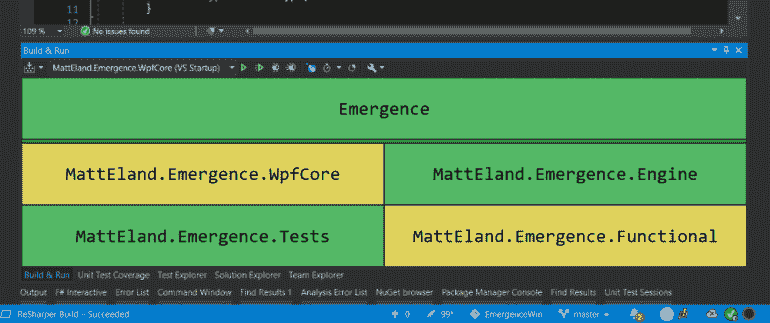
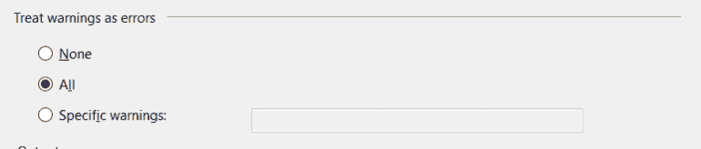

# 警告不是一种天赋

> 原文：<https://betterprogramming.pub/warnings-are-not-pieces-of-flair-2acc8f894eb7>

## 一个简短的关于编译器或 linter 警告的危险的咆哮



# 警示灯

我从事编程已经超过 30 年了，让我这样告诉你吧——我打开一个新的(对我来说)遗留项目并在没有警告的情况下构建它的次数大概可以用一只手来计算。

这是为什么呢？

我觉得有点像我车上的胎压灯。这辆车跑得很好，轮胎看起来也很好，但尽管带它去检查，尽管告诉汽车的车载计算机重新校准其轮胎压力预期，灯仍然亮着。

久而久之，我倾向于把这种黄灯过滤掉，作为“正常操作”的一部分。

我们对代码做同样的事情。如果它没有阻止构建的成功，我们倾向于忽略它——特别是如果警告已经出现的话。

# 我们为什么关心？

当然，这样做的危险在于，如果你忽略了现有的警告，那么新的警告就会隐藏在显眼的地方。

我的车就是一个完美的例子——虽然它运行良好，但如果它突然*出现气压问题，我不会注意到，直到我的轮胎明显瘪了。*

类似地，你可能正忙于解决一个问题，而你的编译器或 linter 正试图向你指出一些东西，但是它被淹没在噪音中。这种事在我身上至少发生过十次。

# 我们明白了。你不喜欢警告。那又怎样？

那么，我们实际上能做些什么呢？

从*实际阅读*你的警告开始。

我知道，这是一个新的概念，但你需要看看你有不同类型的警告。您应该查看每种类型的警告数量，并首先解决数量最多、最严重的警告。

养成习惯，每次你做改变的时候，告诉编译器/linter 忽略一小组警告，随着时间的推移，你可以还清你的警告债务。

你会惊奇地发现，即使在 15 分钟的时间内，你也能处理多少警告。有时，仅仅搜索和理解一个警告就能教会你关于编程的新东西，并巩固你自己都不知道的漏洞。

# 对警告说不

一旦你达到了梦寐以求的 0 警告级别，我建议你跳出困境，更进一步。

将编译器/linter 警告视为构建错误。

好了，请不要再向我扔东西了。让我解释一下。

如果您得到 0 个警告，您可以通过导致构建失败(如果它们引入了新的编译器或 linter 警告)来阻止更高的警告。

如果这样做，一旦警告存在，它对引入它的开发人员来说立即有意义，不能被忽略。

请注意，这并不一定会使开发人员机器上的构建显式失败。您可以在您的 CI/CD 构建管道中使用比在正常开发中更严格的过程。

# 将警告视为错误

这一点的实现细节会因语言而异，但是让我们来看看。NET 和 JavaScript/TypeScript，因为这是我写得最多的。

因为。NET 构建，在 [Visual Studio](https://visualstudio.microsoft.com/) 中，您可以在 build 选项卡上进入单个项目的设置，并更改它对活动构建概要文件的警告处理:



对于 JavaScript 和 TypeScript，这将取决于你用什么来编写[林挺](https://en.wikipedia.org/wiki/Lint_%28software%29)，但我会假设你用的是 [ESLint](https://eslint.org/) ，因为它非常流行，而且我之前已经深入研究过[了](https://killalldefects.com/2019/11/28/standardizing-typescript-with-eslint-npm-prettier/)。

ESLint 允许您通过修改 Lint 配置来在粒度级别配置规则处理。

例如，如果我想将`max-lines`分析规则视为一个违反错误，而不是一个警告，我会编写如下代码:

```
"rules": { 
  "max-lines": ["error", {"max": 200, "skipBlankLines": true}] 
}
```

您可以在每次遇到新的警告时采用类似的方法，并在 lint 配置中为它添加一个`error`级别的规则。

# 关闭

因此，警告可能不会杀死你，但是它们是随着时间的推移保持软件质量的一个有价值的工具。是否处理过去的警告或将新的警告视为错误取决于您。

我的主要忠告是:你需要注意应用程序中的每一个警告，因为你的代码试图告诉你一些事情。

如果我们不再把警告当作装饰，我们可以停下来听听我们的代码试图告诉我们什么，然后做我们都想做的事情:更快地交付更好的软件。