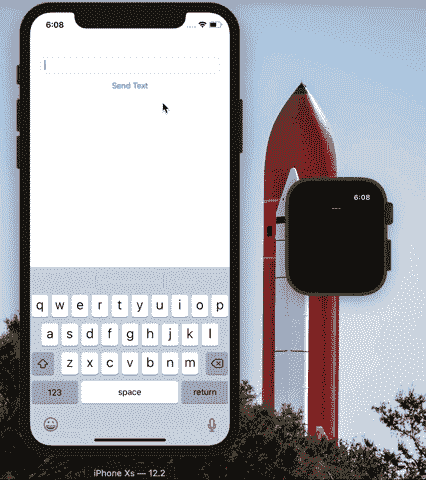
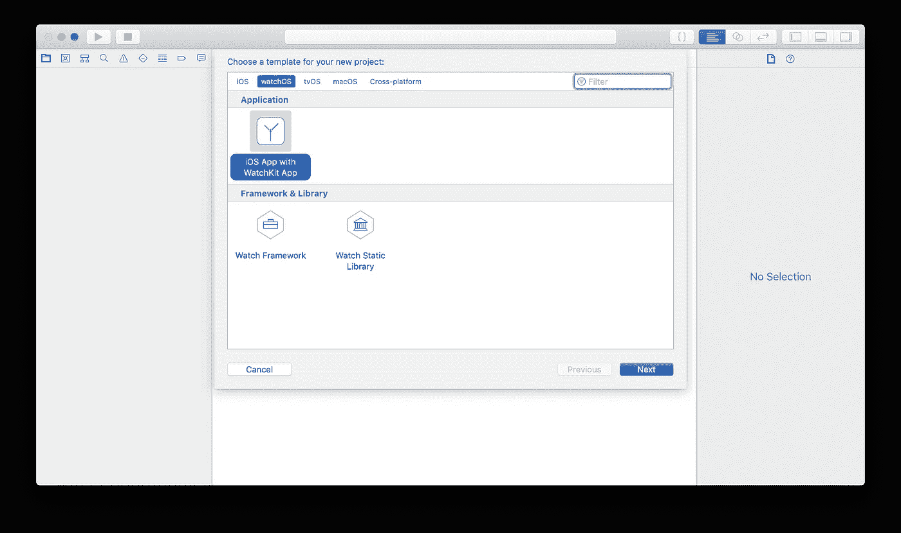
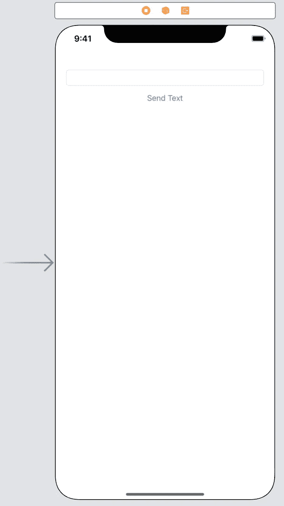
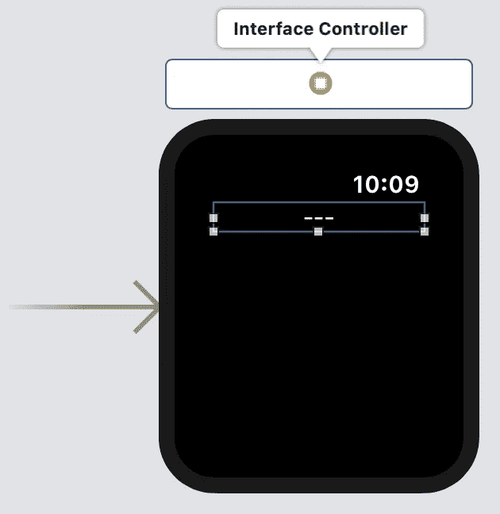

# 如何使用 Swift for iOS 来观察连通性

> 原文：<https://betterprogramming.pub/watchconnectivity-swift-1f8cffb7c7a9>

## 使用 Swift 和 Xcode 在 iOS 和 watchOS 之间共享数据的教程

手表连接演示

# 介绍

我一直在互联网上搜索一个关于 [WatchConnectivity](https://developer.apple.com/documentation/watchconnectivity) 的很好的例子(在 [Swift](https://developer.apple.com/swift/) )。

搜索了一段时间后，我无法真正找到我想要的，所以我决定通过苹果文档和其他一些来源来了解这个主题。

我希望把这个话题做成一个系列，如果我找不到好的教程，我会使用苹果文档和其他资源来学习这个话题。然后，我将创建一个演示应用程序，并在这里写一个故事，来展示我所学到的一切。

我还会将本教程的项目文件放在本文底部它们自己的部分，这样你就可以下载它们并跟随本教程。

# **它是什么，有什么用？**

从根本上说，WatchConnectivity 是一种在 iOS 应用程序和 watchOS 应用程序之间共享数据的简单方法，反之亦然。

我在 App Store 上创建了一些应用程序，这些应用程序将受益于这一功能。如果能够“同步”(因为没有更好的词)你手机上的乐谱和你手表上的乐谱就好了，反之亦然。

现在我已经学会了如何使用 WatchConnectivity，我肯定会在我的游戏中实现它。

# 要求

*   Xcode 10
*   Swift 4(及更高版本)

我假设您已经安装并设置了 [Xcode](https://developer.apple.com/xcode/) ，并且准备好开始了，因为这是一个稍微高级一点的教程，不仅仅是向您展示您可以在 Xcode 中打印变量。

# 入门指南

第一件事是打开 Xcode 并选择`iOS App with WatchKit App`。这样我们就不用再去找目标了。

在下一个屏幕中，选择一个`Product Name`并填写剩余的必要字段。你可以不选`Include Notification Scene`，因为在 Xcode 10.2.1 中它是默认选中的，我们在本教程中不需要它。

现在您有了一个空白的 Xcode 项目。

# **界面**

我总是喜欢先构建界面，因为我喜欢看到我所做的事情取得进展，构建 UI 总是让我觉得我已经完成了一些事情。

首先，进入`Main.storyboard`，将一个`Text Field` 和一个`Button`拖到 iOS 故事板上。

根据您的要求配置`Text Field`和`Button`。按住`Command-Alt-Enter`进入助理编辑，在`ViewController.swift`做`IBOutlets`。

这是我的界面加了一个`Text Field`和一个`Button`后的样子。

现在打开你的`Interface.storyboard`，我们就可以开始配置 Apple Watch 应用的外观了。一个警告强硬；用户界面看起来不会很好，因为我想尽可能做最简单的教程，不想被外观所困扰。

对于手表应用程序，您需要的只是屏幕顶部的一个`label` ，让它做与 iOS 应用程序相同的事情，并将标签连接到`InterfaceController.swift`中的一个`IBOutlet` 。

当我完成时，我的 Apple Watch UI 看起来是这样的(标签中的破折号只是我喜欢在这些情况下使用的占位符的一个例子)。

# **代码**

我们已经创建了一个最低限度的用户界面，但是现在是你来这里的时候了——让一切工作的代码。

先从 iOS 这边的事情说起。

下面是我的`ViewController.swift`完全完成版。我想让你看看这实际上有多难。

在代码下面是对文件中所有内容的解释。

*   第三行。为了让你的手表和手机相互通话，我们需要引入一个框架来实现这一点，所以我们引入了 WatchConnectivity。
*   第五行。在减速 `Class ViewController: UIViewController`之后，我们必须允许 iOS 应用程序使用上面的导入语句，因此我们为应用程序添加了`WCSessionDelegate`以利用 WatchConnectivity 框架。
*   第九行。这只是`Main.storyboard`上`Text Field`的出口。
*   第 13 行。为了使访问`WCSession`类更容易一点，我将它存储在一个变量中。
*   第 20–22 行。将上述变量设置为默认会话，并将`WCSession`委托设置为`ViewController`，最后激活会话`WCSession`。
*   第 28 行。这是`Main.storyboard`上`Button`的动作。
*   第 30 行。这将变量`txt` 设置为`Text Field`，该变量当前在字段本身中
*   第 31 行。为了能够向手表发送任何数据，我们必须用我们想要发送的数据创建一个字典。对于本教程，我只是在键`message`下发送一个字符串( `txt`)给手表。
*   第 33–37 行。这是实际向手表发送数据的方法。我在处理`print(error.localizedDescription)`的时候也犯了一些错误，但是你不必这么做。只要将变量`message` 传递给方法`wcSession.sendMessage()`就可以了。
*   第 42–58 行。这些只是委托`WCSessionDelegate`附带的默认方法，但是在本教程中我们不需要它们。

所以一旦你完成了这些，你的 iOS 应用程序就应该准备好了。

# 事物的观察面

现在，让我们开始观察事物的另一面。你会在下面找到我的`InterfaceController.swift`的完整版本，但我还是会相对详细地浏览一遍。

*   四号线。就像在`ViewController.swift`中一样，我们需要导入 WatchConnectivity ，这样我们就可以使用那个框架。
*   第六行。我们需要将`WCSessionDelegate`添加到`InterfaceController`(这将再次使用我们在本教程中不会使用的默认方法)。
*   10 号线。`Interface.storyboard`的标签出口。
*   第 14 行。`WCSession`变量同上。
*   第 26–28 行。来自`ViewController.swift`的相同代码，基本上只是确保`WCSession` 会话在`ViewController`和`InterfaceController`启动后立即启动。
*   第 37 行。来自`WCSessionDelegate`的方法，允许手表在收到来自 iOS 应用程序的消息时运行代码。
*   第 39 行。将变量`text`设置为 iOS 应用程序发送的消息。`didRecieveMessage` 方法传递数据字典。这个字典和 iOS 应用程序发送的字典是一样的，所以方括号*内的字符串*必须和`ViewController.swift`中的字典中的键相同。
*   第 41 行。这会将标签`text`设置为字典中传递给`didRecieveMessage` 方法的值。

这就是 watchOS 代码！

# **运行应用程序**

现在你所要做的就是运行将应用程序部署到 Apple Watch 的方案。Apple Watch 应用程序加载后(第一次可能需要几分钟)，在 iPhone 主屏幕上点按该应用程序。现在你应该有两个应用程序在运行。

剩下要做的就是在文本栏中键入一条信息，然后点击按钮——点击按钮后几秒钟内就可以看到 Apple Watch 上的标签更新。这方面的演示可以显示在页面的顶部。

# **结论**

我喜欢用介质写这篇文章。我是教程写作的新手，所以请在下面留下任何评论或反馈。

我认为这是写作和尝试一些好东西的良好开端！感谢阅读。

# 项目文件

这是本教程的 GitHub 项目的链接。

 [## ewalk40/WatchConnectivityDemo

### WatchOS 5 WatchConnectivity 演示应用。在…上创建帐户，为 ewalk40/WatchConnectivityDemo 开发做出贡献

github.com](https://github.com/ewalk40/WatchConnectivityDemo)