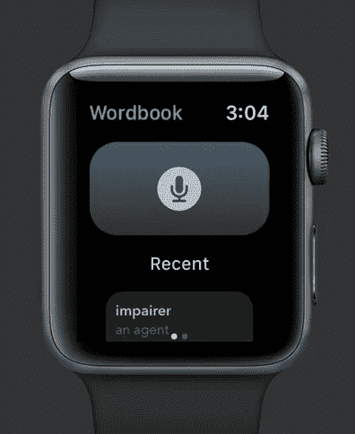
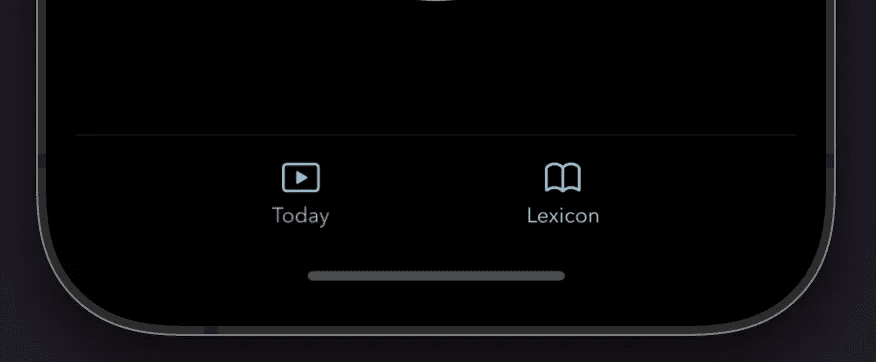

# SwiftUI 中 NavigationView 内的 WatchTabView

> 原文：<https://betterprogramming.pub/watchtabview-that-can-work-inside-navigationview-in-swiftui-f7b7f4b3fe40>

## 为 watchOS 创建优雅的标签

SwiftUI 中的官方 [TabView](https://developer.apple.com/documentation/swiftui/tabview) 看起来简洁优雅。但不幸的是，如果你把它放在 iOS 和 WatchOS 的 NavigationView 中，它仍然无法正常工作。

在 iOS 上，如果在`NavigationView`中嵌入了一个`TabView`，它会重置导航状态，并不时地将`NavigationView`弹出回 root，尤其是当应用程序进入后台或恢复时。我向苹果的开发者技术支持确认了我看到了一个 bug。

在 watchOS 上，更糟糕的是，如果`TabView`嵌入在`NavigationView`中，滑动就根本无法工作。

经过几次尝试，我发现避免这些错误的一个方法是将`NavigationView`放在`TabView`中。但这意味着我必须为每个标签放置一个`NavigationView`，不仅代码变得混乱和多余，而且标签栏显示在每个视图中——这在某些情况下可能是不希望的行为，并且多个`NavigationView`还会破坏应用程序内的整个导航流程控制。

# iOS 解决方案

幸运的是，在 iOS 中实现类似于`TabView`的视图很简单。只有一个`HStack`和一个`@State`来控制显示哪个视图。

它看起来和真实的 TabView 一模一样。

# WatchOS 解决方案

当我在做我的副业项目: [Wordbook](https://apps.apple.com/app/id1498633177) 时，TabView 变得更加复杂，因为它涉及到处理滑动手势、分页器、动画和焦点切换。

首先，我在顶层使用带有圆点的`ZStack`来模拟分页指示器。这里的技巧部分是我必须使用`.edgesIgnoringSafeArea(.bottom)`将分页指示器定位在正确的位置——靠近底部边缘。

第二个棘手的部分是处理`DragGesture`并计算手指释放时的动画，以使滑动动作看起来平滑。

然后就是焦点状态了。因为我们使用`ZStack`和`offset`来决定显示哪个选项卡，这意味着视图仍然在那里，即使它们没有显示在屏幕上也可能保持焦点。

尤其是在有列表的情况下，如果我们不将焦点设置到刚刚移动到中心舞台的选项卡上，您会发现滚动数字表冠不起作用。

多亏了从 watchOS 8.0 开始才提供的`@FocusState`，我们可以在添加了`onTabChanged`事件回调函数后简单地控制焦点。只要确保你使用了`focusable(_:)`修改器使视图如`VStack`、`Text`成为可聚焦的，默认情况下是不可聚焦的。

# 决赛成绩