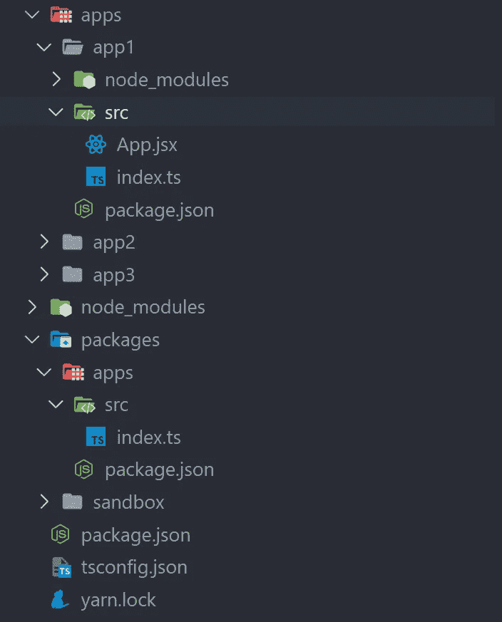
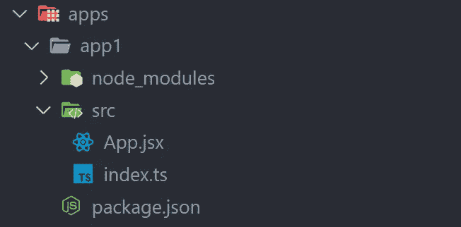

# 我们自动解决合并冲突，下面是方法

> 原文：<https://betterprogramming.pub/we-automated-resolving-merge-conflicts-and-heres-how-b0320c206e10>

## 一天可以避免冲突

由 [David Ballew](https://unsplash.com/@daveballew?utm_source=medium&utm_medium=referral) 在 [Unsplash](https://unsplash.com?utm_source=medium&utm_medium=referral) 上拍摄的照片

在开源的世界里，维护或贡献一个活跃的知识库并不像看起来那么简单，合并冲突是每个人都必须处理的事情，但是没有人喜欢它。B̶u̶t 在[菲尔文](https://felvin.com/)，w̶e̶̶l̶o̶v̶e̶̶m̶e̶r̶g̶e̶̶c̶o̶n̶f̶l̶i̶c̶t̶s 也没什么不同。

这篇文章将带你了解以下内容:

*   Felvin 和即时应用
*   即时应用程序的结构
*   创建即时应用程序
*   合并我们面临的冲突
*   自动化和解决合并冲突

# Felvin 和即时应用

Felvin ，一种非常强大的人们查找信息的方式，通过将你在搜索引擎上看到的一切转换成一个插件来实现。

要了解更多关于 Felvin 和 Felvin 如何工作的信息，请点击[这里](https://docs.felvin.com/)。

**即时应用**是你在搜索查询中得到的小互动卡。我们可以为各种用例构建即时应用程序，如字典、查看足球比分、股票价格或你的想法笔记，甚至从公司 slack 或任何东西中搜索历史记录！点击[这里](https://felvin.com/)了解更多！

# 结构

顾名思义， [instant-apps](https://github.com/felvin-search/instant-apps) 是在开源社区的帮助下创建的应用程序集合，以及测试这些应用程序的沙箱，所有这些都在一个存储库中。

我们通过创建单独的 react 应用程序，然后将所有应用程序作为节点模块导出到单个 react 应用程序来实现这一点。

下面是回购的文件夹结构。社区创建的应用在`apps/`下，例如:app1 和 app2。这些应用程序都有自己的`package.json`、`App.jsx`和`index.ts`。

[即时应用](https://github.com/felvin-search/instant-apps)的文件夹结构

`packages/apps`导入所有应用程序，然后将其导出到沙盒中。

`packages/apps/src/index.ts`:

`packages/apps/package.json`:

最后，`yarn.lock`文件看起来像这样:

现在，我们已经对结构有了基本的了解，让我们看看一个新的即时应用程序是如何创建的，以及它如何影响回购。

# 创建即时应用程序

运行`yarn create-app`可以创建一个新的即时应用。

创建新应用程序将会生成以下内容:

新应用程序的文件夹结构(app1)

并更新`./packages/apps/src/index.ts`、`./packages/apps/package.json`和`./yarn.lock`

# 合并冲突

通过创建一个新的应用程序，我们知道有几个文件(准确地说是 3 个)被更新了，这些通常是合并冲突背后的罪魁祸首。

让我们看一个例子来更好地理解这一点。

下图显示了我们通常是如何遇到合并冲突的。

数字流程图

我们创建了一个新的分支，并在 App1 v1.0.0 发布后立即开始开发 App2 v1.0.0。当我们在开发 App2 的时候，已经有了 App1 的新版本，即 v1.0.1。

其他人从 App1 v1.0.1 发布开始为 App3 v1.0.0 创建了一个新的分支，他们设法在我们之前完成了他们的应用。于是，他们的分公司就并入了我们之前的`master` 分公司。

当我们最终完成 App2 v1.0.0 并准备合并到`master` 分支时，我们会面临以下合并冲突，并且有一个模式:

## `1\. /packages/apps/src/index.ts`

在`index.ts`文件中，冲突并不复杂。它可以通过接受当前和即将到来的更改来解决，但需要我们使用正则表达式或文本编辑器来解决这个问题。

## 2.`packages/apps/package.json`

在`package.json`的情况下，事情就大不一样了。这有点复杂，因为涉及到应用程序的多个版本。Git 确实可以选择接受基于文件的传入(`— theirs`)和当前(`— ours`)变更，但是这对我们没有用。

## 3.`yarn.lock`

与`package.json`类似，`yarn.lock`也有冲突的应用程序版本，但是，如果`package.json`已经解决，只需运行`yarn`或`yarn install`就可以解决冲突。

在这一点上，我们可以重定基础，然后尝试合并它，但重定基础是一个坏主意。你可以在这里阅读为什么这不是个好主意。

> ……你可以肯定，真实的 T21 历史将比改写的(或伪造的)历史更有用。
> 
> [-弗雷德里克·莫尔肯](https://medium.com/u/800b98e64951?source=post_page-----b0320c206e10--------------------------------)

# 自动化和解决合并冲突

为了自动化合并和解决冲突的过程，我们选择使用 python 和 shell 的组合。像 **glob** 、 **os** 和 **json** 这样的内置 python 库已经足够了。我们还使用来自`./packages/apps/src/index.ts`和`./packages/apps/package.json`的样板代码作为常量。

要解决合并冲突，这里最好的方法是从头开始生成`./packages/apps/src/index.ts`和`./packages/apps/package.json`，方法是遍历存储库中的所有应用程序，并获取这些应用程序的名称和版本。我们写了一个类来做同样的事情。首先，我们初始化一堆与获取每个应用程序路径相关的东西，它们是`package.json`、`./packages/apps/src/index.ts`和`./packages/apps/package.json`。

然后我们迭代每个应用程序的`package.json`来获得名称和版本。
为了便于理解，从现在开始，将提供注释来更好地说明每一步发生了什么。

## 1.解析'`./packages/apps/src/index.ts'`

## 2.解析'`./packages/apps/package.json'`

## 3.解析'`yarn.lock'`

如前所述，生成`yarn.lock`只需要我们在解析完其他两个文件后立即运行`yarn`或`yarn install`。为此，我们:

a)首先，获取当前分支的名称
b)然后运行`git merge master`，由于存在冲突，在合并之前会停止。
c)运行`yarn`或`yarn install`d)暂存所有文件
e)使用默认合并消息完成合并，我们也可以使用`--continue`标志继续合并，但这需要我们更改合并日志并通过 vim 进行编辑。

你可以在这里看一下实际代码[。](https://github.com/felvin-search/instant-apps/tree/master/scripts)

# 摘要

合并冲突有时可能是痛苦的，但是如果您发现冲突的重复模式，您可能可以驯服它，或者通过自动化它使它成为您的伙伴。这篇文章不是为了帮助大众，而是为了记录我的经历，或者甚至是为那些面临类似情况的人激发灵感，因为当我们试图找出解决合并冲突的方法时，我们找不到太多。你需要问自己的唯一问题是——*“我们的合并冲突有模式吗？”*

特别感谢[哈什·古普塔](https://medium.com/u/8efd95d5df6e?source=post_page-----b0320c206e10--------------------------------)促使我写这篇博客

