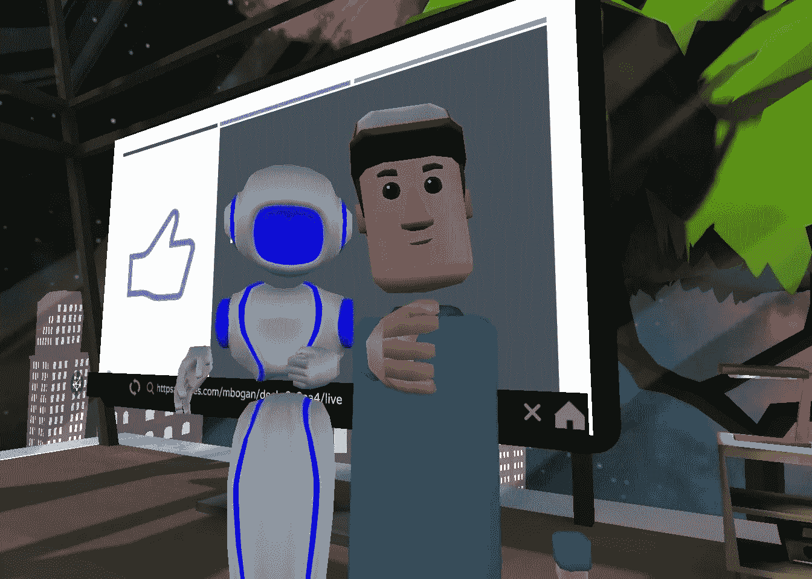
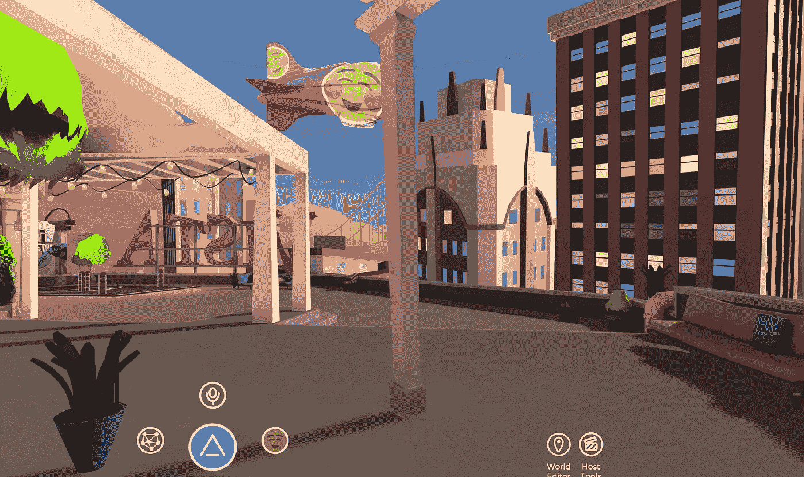
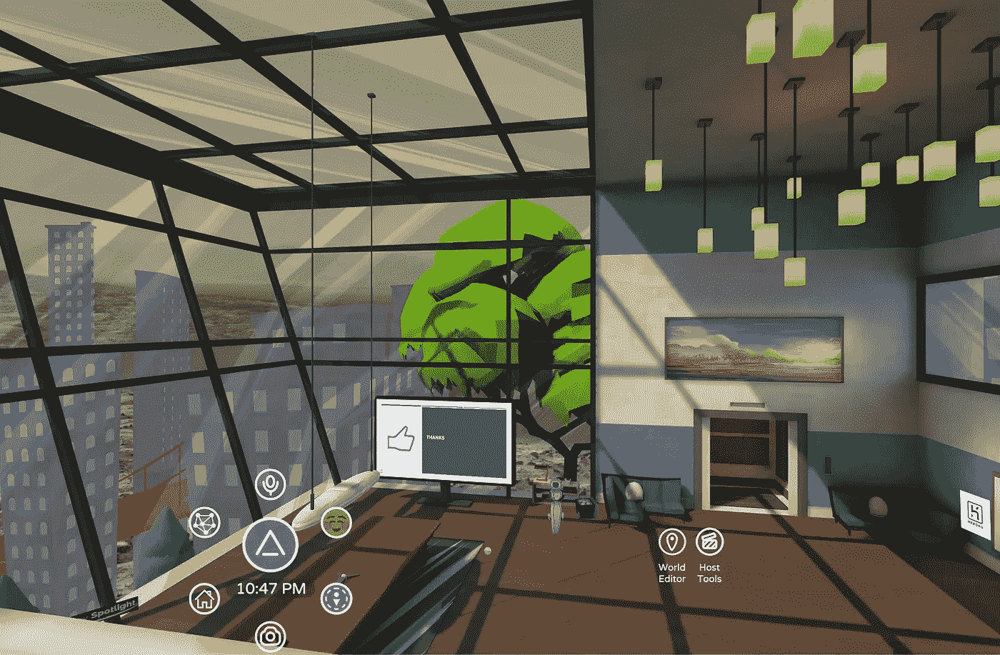
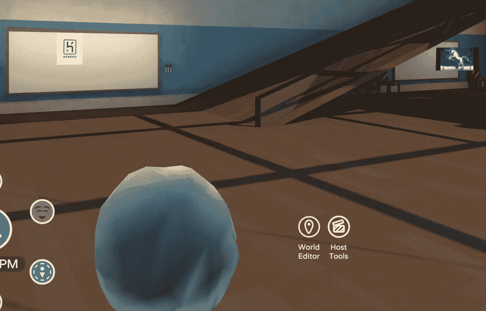
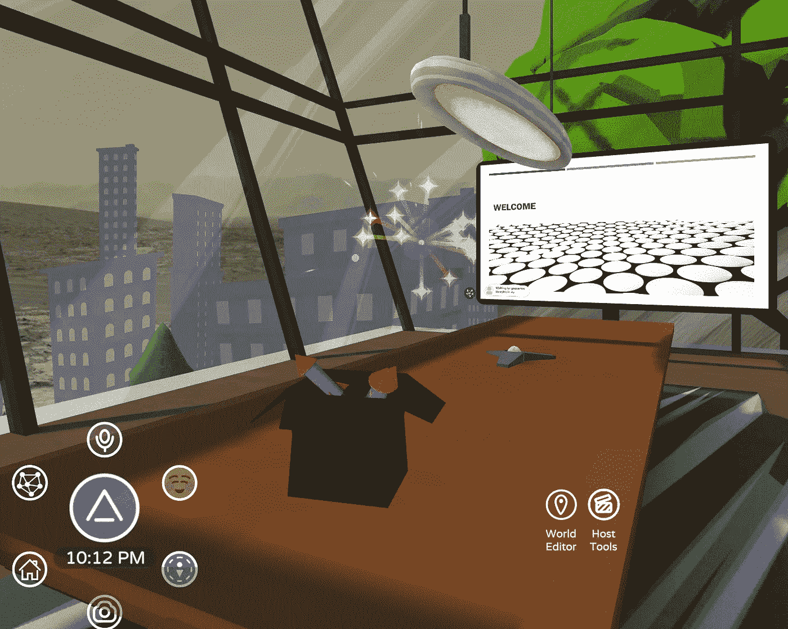
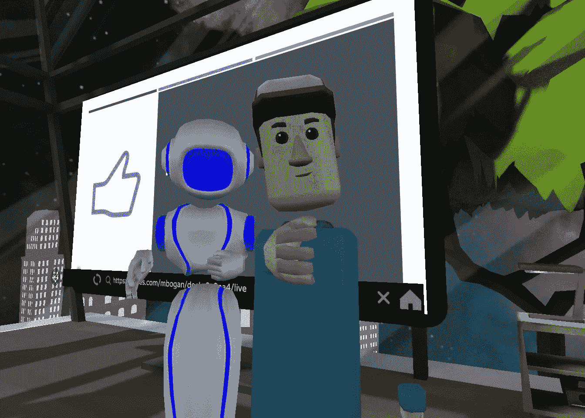
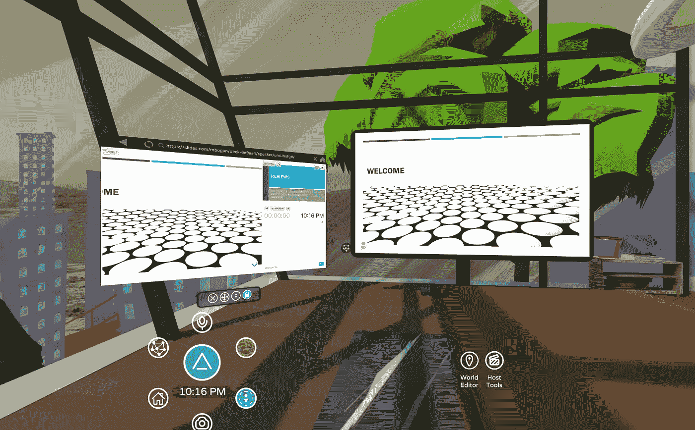
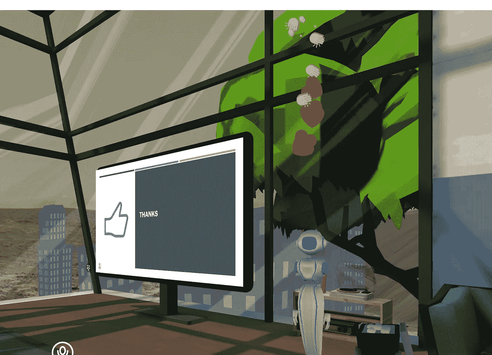

# 我们刚刚开了第一次虚拟现实公司状态会议

> 原文：<https://betterprogramming.pub/we-just-had-our-first-virtual-reality-company-status-meeting-5f244634db89>

## 事情是这样的

现在几乎所有能在家工作的人都在家工作。

我们很幸运能在一个已经可以定期在家轻松工作的行业中工作，但是在办公室工作仍然有一些难以替代的方面。其中之一就是单口相声。

每周一我们都会和 Heroku 开一个简短的会议。(如果你不熟悉 Heroku，他们是一家 PaaS 公司，帮助你部署、管理和扩展应用。)我和 Heroku 的同事詹妮弗(Jennifer)在美国的另一边，我们俩通常都用 Zoom 或谷歌视频聊天工具开会。我们都习惯了远程会议，但我们也有很多面对面的会议，至少过去是这样。我们想尝试一些更有针对性的东西来应对我们目前的情况，表明我们长期可能的发展方向，以及一些更有趣的东西！你知道，更多的东西“[准备好的玩家一](https://www.youtube.com/watch?v=cSp1dM2Vj48)所以，我们决定在虚拟现实(VR)上进行状态会议。

事情是这样的。

# 安排我们的第一次虚拟现实会议

我们在会面的前几天决定了 VR，所以我立即开始寻找我们可以使用的可能的应用程序。我只找到了两款我的 Oculus Go 支持的:[鲁米](https://www.dogheadsimulations.com/)和 [Altspace VR](https://altvr.com) 。我安装了两个虚拟世界，并做了快速演练。虽然这两个应用程序似乎都可用，但我无法让 PDF viewer 与 rumii 配合使用，而且它不支持 Oculus Go 的幻灯片显示，所以我决定使用 Altspace VR。詹妮弗有一个 Oculus Quest，但 Altspace 可以与所有主要的耳机配合使用。

当你第一次进入 Altspace 时，你会突然出现在你自己装修的房子里。你有几个房间，城市的美景，还有一个可以练习篮球的篮球场(真的很难)。这比我在现实生活中买得起的要好得多！

我房子外面的景色

有一个游戏内菜单会一直跟着你浮动。这可以让你与其他人聊天，退出到主菜单，搜索当前的直播事件，并传送到 Altspace 内的其他 VR 世界。

# 创造一个虚拟世界

要主持我自己的私人会议，我必须首先创造我自己的“世界”(基本上我是按照[这些指令](https://help.altvr.com/hc/en-us/articles/360031120113)来的。如果你想举办自己的会议，你也需要这样做，因为有些细节我不会在这里介绍。)

*注意:您必须从 PC 帐户启用世界功能，才能在耳机菜单上看到“创建世界”选项，这是一项测试功能。*

当你创建一个新的世界时，有几个基础模板可供选择:海滩、舞会、游戏室、礼堂、公园等等。我选了(击鼓……)会议室模板。该模板创建了一个典型的会议室环境—一张长桌、一台电视、几块白板、一些私人会议区，以及一个无论选择什么天空都可以看到的漂亮的从地板到天花板的视野。我换了好几次天空，从火星开始，到日落，到星云结束。

我们会议室的鸟瞰图

这是一个标准的房间开始，但我定制了一些可用的项目。例如，我使用图片项目添加 Heroku 徽标:

一块白板上的 Heroku 标志，另一块上的独角兽，我手里的雪球。

你可以在房间里添加一长串预制物品。大多数项目是静态的，并不真正做任何事情。想象一堆营火漂浮在你房间中央的空气中。你可以看着它，它很漂亮，当你试图走过它时，它会挡住你的路，但这就是它所做的一切。

但是有些物品是互动的——这些更有趣。我在我们的房间里添加了两个互动项目，包括一盒你可以实际投掷的雪球(当有人说他们错过了最后期限时，作为破冰者，甚至只是为了好玩)和一盒你可以实际发射的烟花(例如，当有人说，*嘿，我们的* [*零停机 CI/CD 项目*](https://dev.to/heroku/zero-downtime-deployments-best-practices-for-ci-cd-on-heroku-3j5o) *终于完成了*！)

烟花！

我发现房间角落里的电视是最有用的特征。使用这台电视，您可以显示幻灯片。

幻灯片前的自拍

你在会议前使用[slides.com](https://slides.com/)制作你的幻灯片，并通过在电视上输入你的幻灯片的 URL 将它连接到你的虚拟世界。幻灯片也支持 YouTube 视频，虽然我没有尝试过。

要控制幻灯片，请使用您的个人浏览器。Altspace 中的每个人都有一个只对自己可见的个人网络浏览器。按需，它在他们的虚拟空间中开放。

左边是个人浏览器“遥控器”，右边是带幻灯片的电视。

你可以用这个浏览器进行日常的网上冲浪、搜索等等。但是，您也可以将它用作 slideshow 的“遥控器”，控制电视上的幻灯片。设置起来有些困难(同样，遵循这些说明)。我不得不做相当多的“戴上耳机，改变设置，摘下耳机，阅读说明。”但经过一番努力，我让滑梯开始工作了。

在会议期间，你还可以做一些有趣的小事情，比如在你的头上放上表情符号，并使用一对一的信息功能进行私人对话。

心和掌声！

# 一些挑战

我有两个主要问题来安排和主持我们的会议。

第一个问题实际上是让我们两个在同一个房间里。你可能认为这很容易，但事实并非如此。为了邀请某人到你的房间，你首先必须将他们添加为好友——我们都不能使用“搜索朋友”功能。这可能是用户的错误，但我们从来没有能够解决它。

相反，我们最终发现，如果我们在同一个房间，我们可以点击对方发送朋友邀请。于是我们在其中一个公共的、容易找到的房间里见了面，像朋友一样联系起来。效果很好。然而，詹妮弗仍然无法进入我的定制房间。经过一番挖掘，我们最终发现我必须将她添加到我的自定义世界设置中的“允许列表”中，然后重新加载这个世界。

第二个问题是无法记笔记。正如我上面提到的，房间里有几块白板，但遗憾的是我们不能在上面写字。作为一个勤于记笔记的人，这可能是一个有用的功能。每次我想记录一个笔记，我都必须翻转我的耳机，在我现实世界的记事本上写。从字面上和象征意义上来说，这是一种痛苦，因为耳机不会真的弹起。所以我不得不把它推到我的眼睛上，它以各种痛苦的方式把我的眼镜压在我的头上。但是我的短期记忆很糟糕，所以做笔记是必须的。

# 召开虚拟现实会议

抛开这些问题不谈，一旦我们开始了会议，会议进行得非常顺利，而且非常有趣！我展示了我的幻灯片，我们讨论了一些即将推出的 Heroku 功能，计划了未来与 [Lightning Web Components](https://developer.salesforce.com/docs/component-library/documentation/en/lwc) 的合作，并为我们的下一次会议创建了一些行动项目。真的，这是一次典型的面对面的、站着说话不腰疼的会面，除了我们两个都在国内处于自我隔离的状态。

# 我的想法

总的来说，虚拟状态会议是成功的。VR 世界本身让我想起了早期的 AOL 聊天室。(我知道，我是在秀年龄！)

它充满了一个折衷的，有点稀疏，早期采用者的分类。许多人在公共休息室徘徊，不确定他们到底应该做什么。当你第一次进入虚拟世界时，你会对这种体验感到惊讶——这是你以前从未见过的。然而，大约一个小时后，你会想“好吧，但是现在怎么办？”就像早期有聊天板的互联网一样，这个平台仍然在寻找除了聊天之外最好的用途。例如，我无意中进入了一个活跃但奇怪的反人类纸牌游戏世界，里面充满了一群兴奋、健谈、有时甚至粗鲁的人——就像一个老式的学校聊天室。

但是私人房间和状态会议感觉像是一个自然的用例，即使是在第一次体验的时候。与 Zoom 或 Skype 不同，它实际上感觉像一次真实的面对面的会议。我有一种视频会议所没有的隐私感。没有人盯着我看，我也没有看别人的压力。重点是会议、幻灯片和内容。总的来说，感觉更加放松和自然。

# 结论

像任何新的形式一样，虚拟现实状态会议需要一些调整，但在会议结束时，我感到很舒服。我认为随着时间的推移，一些功能的改进，以及耳机的普及，VR 将成为远程会议的首选方式。

对于一个一直拥抱远程，但现在可能被迫更全面地采用远程的行业来说，VR 可能是答案。这是早期的技术，有几个错误，有时很难弄清楚(即使对于像我这样的技术人员)。我们花了一个晚上的大部分时间来准备第一次会议，但总的来说这是一次很棒的经历。我认为虚拟现实可能不仅会吸引状态会议，还会吸引(现在是禁忌的)大型团体聚会和会议。

目前的隔离肯定会改变我们的生活，在某些方面是暂时的，在其他方面是永久的。一些技术将会以更快的速度投入使用。我们可能最终会看到电影首次以流媒体形式发行，而不是在影院上映。我们可能会看到远程教育成为常态。一旦我们发现即使是大公司也可以让员工在家全职工作，我们还会觉得需要昂贵的办公室吗？我们会继续为商务舱、跨国航班买单吗？也许吧。但我认为，我们中的许多人将很容易适应在家工作，不会回到办公室，虚拟会议可能会成为主流。

我们计划在同一个房间举行下一次会议。这一次，我们给了自己一些我在菜单上找到的新角色——音乐家和飞行员。我真的不知道这是什么意思，但我们很高兴找到答案！