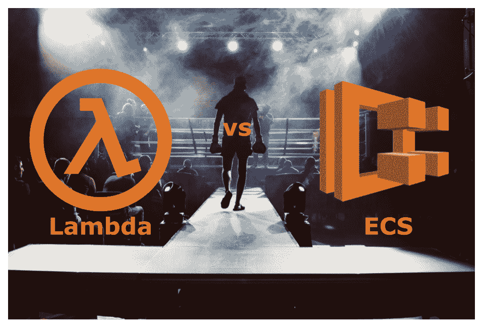
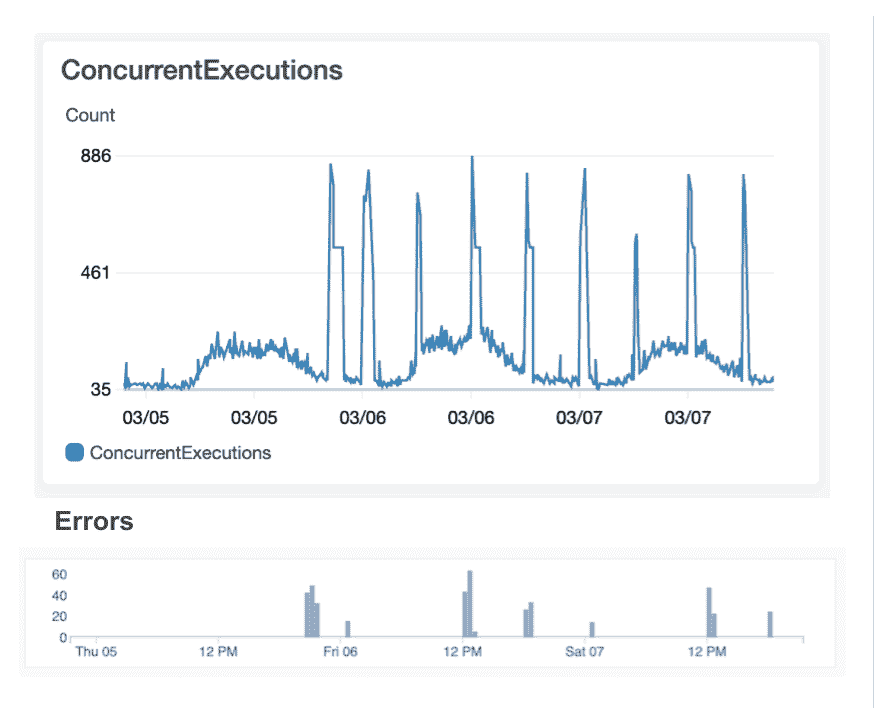
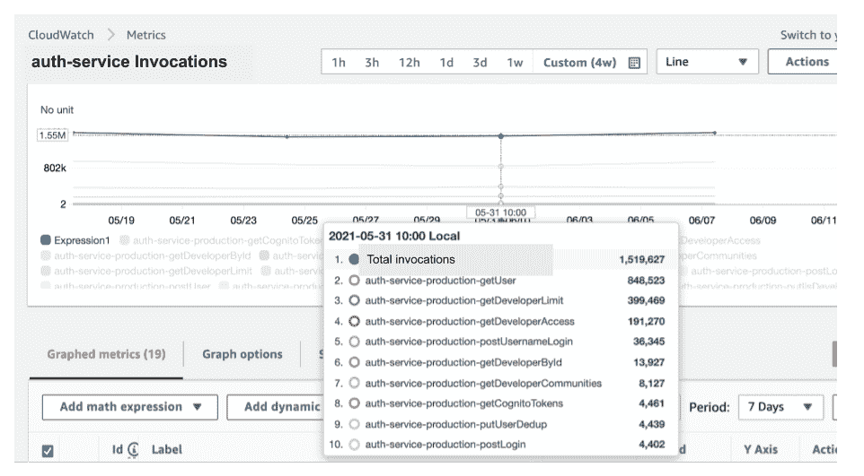
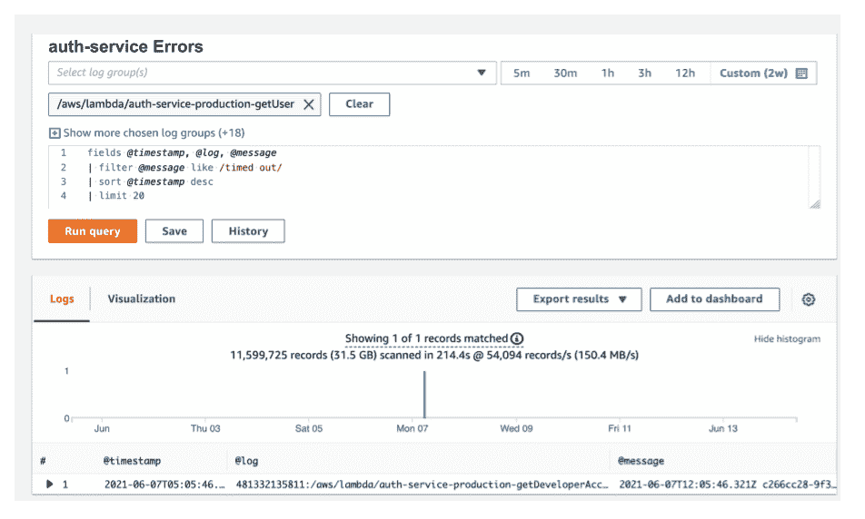

# 我们从 AWS Lambda 迁移到 ECS，但希望最终迁移回来

> 原文：<https://betterprogramming.pub/we-migrated-from-aws-lambda-to-ecs-but-hope-to-eventually-migrate-back-8ad25a60501b>

## Lambda 的陷阱让我们放弃了

图片来源:[出席者](https://unsplash.com/@attentieattentie)在 [Unsplash](https://unsplash.com/)

*作者注:本文表达的观点是我个人的，不一定代表我雇主的观点。*

这是一个关于我们如何从 Lambda 迁移到 ECS 的故事，因为 2%的错误率和有限的并发控制。还有，关于 AWS 最近如何修复他们的错误率问题，以及并发控制的增强如何让我们回到 Lambda。

当我在 2018 年第一次开始在 [Knock](https://www.knockcrm.com/) 工作时，我们正在手动管理的 AWS EC2 实例上运行我们的整个堆栈。

因此，扩展和维护我们的基础架构非常困难，而且由于我们无法分配资源消耗，我们正在浪费资金。我们正在考虑像 AWS 弹性容器服务(ECS)和 AWS 最近的无服务器选项 Lambda 这样的托管容器服务。

AWS 声称 Lambda 是一个可靠的、功能丰富的环境，它抽象出任何必须管理服务器的概念，我们对能够专注于代码的前景感到兴奋。

不幸的是，在生产中使用 Lambda 一年后，我们发现 Lambda 是一种相对不可靠的技术，当它用于交付面向客户的功能时，AWS 层 2%的错误率导致了非常差的用户体验。因此，我们决定将一些面向客户的 Lambdas 迁移到 ECS。

在我们深入细节之前，我想澄清一下，这篇文章并不是给 AWS 的关于 Lambda 的恐吓信。

正如你将在后面读到的，在 2020 年，AWS 对 Lambda 网络进行了改进，这几乎完全降低了我们看到的错误率。

这就剩下了对并发性的关注，在某些用例中，并发性是可以减轻的，但不是全部。

因为所有的 lambda 都有一个共享的并发池，所以任何一个 lambda 中的突发活动都很容易导致关键任务功能的严重阻塞，从而导致不可接受的用户体验。

总的来说，我希望 AWS 最终会增强 Lambda 的并发模型，并继续致力于工程师花更少时间管理服务器的承诺。

# 我们在 Lambda 上运行的是什么？

让我们从描述我们在 Lambda 上运行的服务类型开始，毕竟，在某些用例中，我们有时可以容忍延迟和故障。

第一类服务由 RESTful APIs 的后端组成，前端是 API Gateway，后端是每个路由的 Lambda 函数。

我们在这一层同时运行 Node.js (Typescript)和 Python 代码。虽然这里的编程语言选择对我们在本文中讨论的内容没有什么影响，但它们确实会影响成本和整体 Lambda 并发性和延迟。

这里主要说明的是，这些 API 中的大多数是由前端同步调用的，因此，显著的延迟和故障是不可接受的，因为它对用户来说表现为停机时间。

第二类服务主要由后台任务组成，这些任务从 SQS 队列中读取消息，然后在 RDS 实例和 S3 桶上执行 IO 操作。

在我们的例子中，这个管道中没有任何东西对时间太敏感，所以如果这些后台任务偶尔失败，一个重试机制就足以保持我们的系统健康和每个人都满意。

# 从 2019 年到 2020 年，Lambda 误差率高达 2%

直到我们在产品中推出 RESTful APIs，我们才开始注意到 AWS Lambda 的 AWS 层中的瞬时错误很常见。特别是，我们开始注意到 CloudWatch 中的错误，Lambda 甚至会在运行任何应用层代码之前超时。我们知道应用程序代码没有运行，因为我们的应用程序代码做的第一件事就是记录传入的请求，而来自我们的应用层的这些日志语句丢失了。换句话说，由于问题发生在 AWS 层，我们无法调整来防止这种情况发生。例如:

> 开始请求 id:56 a12 BF 8–43e b-4b6c-8a 20-c73fa 2152 c6b 版本:$最新
> 
> **【应用程序日志中缺失的条目】**
> 
> 结束请求 id:56 a12 BF 8–43e b-4b6c-8a 20-c73fa 2152 c6b
> 
> 报告请求 id:56 a12 BF 8–43e b-4b6c-8a 20-c73fa 2152 c6b 持续时间:30019.42 毫秒计费持续时间:30000 毫秒内存大小:1024 MB 最大已用内存:77 MB
> 
> 2019–08–22t 20:10:31.270 z 56 a12 BF 8–43eb-4b6c-8a 20-c 73 fa 2152 c 6b**任务 30.02 秒后超时**

2019 年 8 月 28 日，我们通过支持票联系了 AWS，他们确认 1–2%的故障率有些正常:

> 总结一下对话，我们谈到了 1%-2%的失败率并非超出峰值的可能性范围，建议的实施是在客户端回退并重试

AWS 推荐一种重试机制，但在实践中，检测这些问题的唯一方法是设置一个更积极的超时，然后重试。

关键代码路径中的一些遗留代码在负载繁重时可能需要几秒钟才能运行，Lambda 冷启动曾经相当重要。

因此，假设我们实现了五秒钟的超时，然后在此时重试。这将导致用户不得不等待至少五秒钟，当这种情况发生率为 2%时，这是不可接受的！

此外，我们的后端是分布式的，因此操作并不总是原子的，这意味着当中止 Lambda 调用并重试请求时，重复请求的可能性会增加。

这对我们来说是一个重大的交易破坏者，所以我们决定在 2019 年底开始从 Lambda 迁移出去。

# 共享并发导致执行受限和用户受挫

有人可能会说 Lambda 的并发控制能力严重不足，因为每个 AWS 帐户的 Lambda 货币都有一个区域上限。

这意味着任何突发的 Lambda 活动都可能导致面向客户的 Lambda 被抑制。在这里，我将面向客户的 Lambdas 定义为那些通过 UI 处理来自用户的同步请求的 Lambdas。

换句话说，Lambda 驱动的后台任务会让这些面向客户的 Lambda 变得饥饿，并会导致你的应用程序变得无响应。这对您的用户来说表现为停机，如果频繁发生，这是完全不可接受的。

如下组图表所示，您可以看到面向客户的错误峰值大致与我们客户的 Lambda 并发峰值相关:

达到最大并发时出现的错误。图片来源:作者

这并不容易避免，因为我们的帐户上有 1，000 个并发 Lambda 的限制，绑定 Lambda 执行的唯一方法是保留 1，000 个池的一部分。换句话说，每次你为一个 Lambda 保留并发性，你就永远带走了其他 Lambda 的潜在并发性，导致一个尴尬的杂耍行为，其中你有一些 Lambda 是静态有界的，而其他的不是。

如果您熟悉 AWS 弹性容器服务(ECS)或弹性 Kubernetes 服务(EKS)，您会知道通过增加或减少为服务运行的任务数量来控制容器(工作池)的数量是相当简单的。换句话说，您可以完全控制如何分配您的资源，而不会像 Lambda 那样被锁定在一个原始的每个功能的并发模型中。在本文的后面部分，我们将研究我认为 AWS 如何改进其并发控制以促进更好的资源共享。

给定 Lambda 的基本并发控制，我们能做些什么来防止限制我们面向用户的 Lambda 呢？是的，您可以:

1.  使用保留并发临时约束更多 Lambdas 的并发
2.  向 AWS 支持部门提交请求，将您的并发限制从 1，000 提高到 1，000
3.  将 SQS 读数的批量最大增加到 10。这意味着用更少的兰博达服务同样的 SQS 交通。让我们只希望在你的 Lambdas 被抑制之前，你的代码能以这种方式工作
4.  为面向用户的 Lambdas 设置保留或提供的并发性。如果只有几个 lambda，这没什么，但是如果每个 RESTful API 路径都有一个 lambda，那么可能会有数百个 lambda，很快就会陷入实际上锁定所有并发性的境地。例如，假设您只有 10 个 lambda/routes，并将每个 lambda 的保留并发数设置为 20，则总的保留并发数为 20 x 10 = 200(回想一下，您整个 AWS 帐户的最大并发数为 1，000)。这个数字可以很快增加，更重要的是，这些 Lambda 中的每一个现在都被绑定到最大并发数 20，这意味着您面向用户的 Lambda 不会随着您的流量增加而扩展，这是您最初使用 Lambda 的一个重要原因。
5.  对于资源密集型和/或可以异步处理的事情，例如发送电子邮件和生成报告，在 API 端点前建立一个 SQS 队列。这允许面向客户的 Lambdas 更快地完成它们的执行，因为资源密集型工作被推迟了。虽然这通常是一个很好的模式，因为它减少了用户的延迟，但它并不总是足以将 Lambda 并发性保持在足够低的水平以防止节流，如果您使用 Lambda 运行后台任务，它可能只会增加后台任务的并发性。
6.  将面向用户的 Lambdas 移动到不同的区域，这样您就可以访问不同的 1000 个并发池。这可能会大大增加部署的复杂性，甚至可能意味着其他服务，如 Cognito、DynamoDB、SQS 等。，将需要移动到另一个区域。

当使用 Lambda 时，这些缓解措施中有很多是值得考虑的，但是它们没有解决导致节流的非常有限的并发控制的根本问题。如果你使用这些缓解措施，你基本上只是在招致技术债务，你以后会陷入困境。

差错率和不可避免的节流？这两个都是交易破坏者，所以我们别无选择，只能从 Lambda 迁移出去。

# 重构我们的代码，使其可以在 Lambda 和 ECS 上运行

既然我们已经决定从 Lambda 迁移出去，我们想知道是否有一种方法可以对我们的代码进行最小的修改，这样它也可以在 Docker 环境中运行。

我们选择 AWS 的弹性容器服务(ECS)来运行我们的容器，因为它相对容易管理，并且我们的 DevOps 团队有带宽来支持。幸运的是，我们注意到我们已经实现的 Lambda 处理程序利用了一个很好的抽象，可以用来从 Docker 支持的框架转换到 Lambda 框架，反之亦然。我们需要做的只是创建一个包装器，它将:

1.  将 ExpressJS 请求有效负载转换为 Lambda 处理程序所需的*事件*有效负载
2.  将 Lambda 响应转换为 ExpressJS 响应
3.  使用一个包装器，允许我们重用所有现有的 Lambda 处理程序代码，并在 ExpressJS 框架上运行它！我们选择使用 ExpressJS 来构建 RESTful API，因为我们使用 Node.js，而 ExpressJS 是一个久经考验的框架。下面的实现是用 JS 编写的，但是该模式可以在任何 web 框架和任何编程语言中使用。(我们的实际实现是在 TypeScript 中。)

让我们来看看一些代码，看看我们是如何做到这一点的。考虑一个简化版本的 Lambda 处理程序，它实现了一个`POST /lead/:leadId`路由，接受一个`{ name, email }`的 JSON 主体:

我们使用下面的代码创建了一个`lambdaToExpress`函数，它可以在 ExpressJS 和 Lambda 之间来回转换:

然后，我们使用新的包装器注册了 ExpressJS 路由。下面是它的代码:

仅用几行代码，我们就增强了单一代码库，以支持 Lambda 和 ExpressJS。需要注意的一点是，`lambdaToExpress`和`handler`函数都在执行`JSON.stringify()` 和`JSON.parse()`，这增加了一点额外的开销。也就是说，这些操作非常迅速，在大的计划中是不明显的。

代码都设置好了，但是 AWS 的 API 网关提供的东西呢？

由于我们的 API 的一部分是面向外部的，我们需要支持速率限制。为了实现这一点，我们引入了[节点速率限制器-灵活的](https://github.com/animir/node-rate-limiter-flexible/wiki/Overall-example#authorized-and-not-authorized-users)(由 ElasticCache 支持)来实现速率限制。并且，我们简单地将这个速率限制检查添加到我们的`lambdaToExpress`包装器中，以便在一个地方实现它。

我们使用[无服务器框架](https://www.google.com/search?q=severless+framework&oq=severless+framework&aqs=chrome..69i57j0i10i433j0i10l8.3121j0j7&sourceid=chrome&ie=UTF-8)来部署我们的 Lambdas，你可能会使用这个框架来部署代码到 ECS，但是我们发现 [Terraform](https://www.terraform.io/) 是一个稍微更通用的工具，用于配置非无服务器基础设施，并且已经使用 Terraform 来部署其他微服务。

所以，我们在我们的`serverless.yml`配置旁边创建了[地形模块](https://www.terraform.io/docs/language/modules/develop/index.html)，并用 [Jenkinsfiles](https://www.jenkins.io/doc/book/pipeline/jenkinsfile/) 部署它们。

现在，我们在 ECS 上运行！

我们已经在 AWS Lambda 上愉快地运行了一年多的 RESTful API 后端，并且发现我们已经降低了 90%的计算成本！在以后的文章中，我将深入 Lambda 和 ECS 之间的成本比较。

# Lambda 将其错误率从 2%降至 0.0000625%

如果你还记得更早的时候，2019 年 8 月，我们发现 AWS Lambda 的错误率高达 2%！

2019 年 9 月，AWS 发布了一篇 blob 帖子，吹捧 Lambda 的联网改进，这将减少冷启动引起的延迟。我们对这个消息感到非常兴奋，因为这意味着 AWS 已经承认了这个问题，并正在积极地解决这个问题。

我们已经将一些后端从 Lambda 迁移到 ECS，但是在 Lambda 上还有很多剩余的功能。

2021 年，我们进行了另一项分析，发现 Lambda 的最新版本导致的错误率仅为 0.0000625%。这比 2%有了显著的提高！

下面是我们对 auth-service 的分析，auth-service 是一个 RESTful API，负责我们系统中的认证和授权功能。在七天的时间里，auth-service 有大约 160 万次调用，只有一次导致超时。

授权服务调用。图片来源:作者

授权服务错误。图片来源:作者

由于错误率如此之低，我们对面向用户的 Lambdas 的错误率担忧已经消除！但是对并发控制的持续关注呢？

# AWS 如何改进其并发控制？

如果您还记得，我们最终执行了上面提到的许多并发缓解措施，并将许多 Lambdas 转移到了 ECS。

之后，我们得到了一个相对舒适的大约 200 个 Lambdas 的集合，因此，并发性现在不再是一个问题。

也就是说，我们现在避免对任何新的面向用户的服务使用 Lambda。而且，我们通常避免在大量后台工作中使用它，因为我们担心过度使用会导致我们剩下的几个面向用户的 Lambdas 受到限制。

尽管目前的策略如此，我还是希望有一天 AWS 能够实现一个功能更加丰富的 Lambda 并发控制实现，更好地模仿 ECS 环境。以下是一些会带来巨大变化的增强功能:

## 最大并发

让我们将 Lambda 的最大并发性定义为特定 Lambda 的最大并发调用设置。这个值**不同于**保留并发，因为最大并发的值不会从 AWS 帐户可用的总并发中减去。

这里有一个例子:假设 Lambda 的最大并发数是 100，而你的帐户的全局最大并发数是 1000(AWS 的默认值)。

直到有超过 100 个 Lambda 实例同时运行时，Lambda 才会被调节。其他 Lambda，例如 Lambda B/C，如果 Lambda 没有正在运行的实例，则仍然可以消耗多达 1，000 个实例。

这实质上意味着，无论如何，Lambda A 不能消耗总数 1000 个实例中的 100 个以上，但不要求我们从总数 1000 个实例中为 Lambda A 留出 100 个实例

这个设置有点类似于 ECS 服务，它可以突发到最大任务的上限，但不要求我们保留一部分集群，即使该服务没有运行所有实例。

## 组最大并发数

我们认为服务是一组相关的 Lambdas。例如，考虑包含服务的 10 个 RESTful 端点的 10 个 Lambdas。或者，定义 ETL 管道的工人的 10 个 Lambdas。通常，我们希望为一组 Lambda 定义一个并发上限，例如，我们不希望我们的 ETL 管道消耗当前 1000 个 Lambda 调用中的 100 个以上。

通过首先允许您将 Lambdas 标记为组的一部分，可以有效地实现组最大并发。其次，您可以设置该组的最大并发数。或者 AWS 甚至可以重用“堆栈”的概念，并拥有堆栈最大并发性。

这个组最大并发性类似于您可能拥有的 ECS 服务，其中每个容器执行多个(一组)操作，例如，web 服务器为多个 RESTful API 端点发送请求。

## 无需联系 AWS 支持即可提高全客户最大并发能力

有些人会指出，你总是可以通过联系 AWS 支持来增加你的总 Lambda 并发性。

事实上，我们这样做是为了将我们的*完全账户并发数*从 1000 提高到 2000。AWS 支持人员对此相当顺从，但是他们花了几天时间来进行更改，我们需要提供理由。

一直以来，我们面向用户的 Lambdas 都受到了限制，我们的用户很不高兴。我甚至听说过一些公司能够让 AWS 将其最大并发数增加到几十万个 Lambdas。

这很好，但是为什么还需要特别批准呢？一家公司愿意为增加的使用量付费这一事实还不够吗？

与 ECS 相比，每个帐户的最大并发数设置类似于如何轻松自定义 ECS 群集中的节点数量，这实际上定义了可以并发运行的 ECS 任务的最大数量。

当然，ECS 具有自动扩展功能，允许您根据自己的需求扩展群集。所有这些扩展都不需要 AWS 的特别批准。

如果 AWS 能够实现这些控制，它将使 AWS Lambda 的并发控制与 ECS 和 EKS 的并发控制平起平坐，我将再次倡导在我们系统的更多领域使用 Lambda。

# Lambda 什么时候发光？

即使有其有限的并发控制，Lambda 仍在以下领域大放异彩:

1.  用于后台任务，例如朗读 SQS 的任务。当然，你可以竖起类似于[芹菜](https://docs.celeryproject.org/en/stable/)或[公牛](https://github.com/OptimalBits/bull)的东西来得到类似的东西，但是将 Lambda 连接到 SQS 队列或许多其他 AWS 触发器中的一个，是一件非常简单的事情。注意:Lambda 的最大超时是 15 分钟，所以它只适合运行相对快速的任务。
2.  当您有其他 Lambda 没有突发到消耗所有可用并发时，比如当您有相对少量的 Lambda 活动时。
3.  当您希望优化自动缩放，以便只为您使用的内容付费时。Lambda 在单个调用层自动伸缩，因此在低流量期间可以节省大量资金
4.  作为运行代码的地方，无需管理基础设施

# 结论

无服务器的承诺——开发者不需要管理基础设施——非常有吸引力，我不想让这个梦想破灭。

AWS 已经修复了 Lambdas 的错误率问题，但 Lambda 仍然缺乏更好的并发控制。

在这些并发控制得到增强之前，如果您的 Lambda 使用量很大并且会导致节流，您可能会希望将 ECS 或 EKS 用于面向用户的服务。

我怀疑 AWS 将继续发展 Lambda 技术，直到它成为 ECS 的强大替代品，当它实现时，我将再次宣扬在任何地方使用 Lambda 的优点。

感谢阅读。

## 关于作者

杰夫·考克斯是 [Knock](https://www.knockcrm.com/) 的软件架构总监，也是 [MSON](https://github.com/redgeoff/mson) 的创造者，这是一种新的声明式编程语言，它将允许任何人可视化地开发软件。