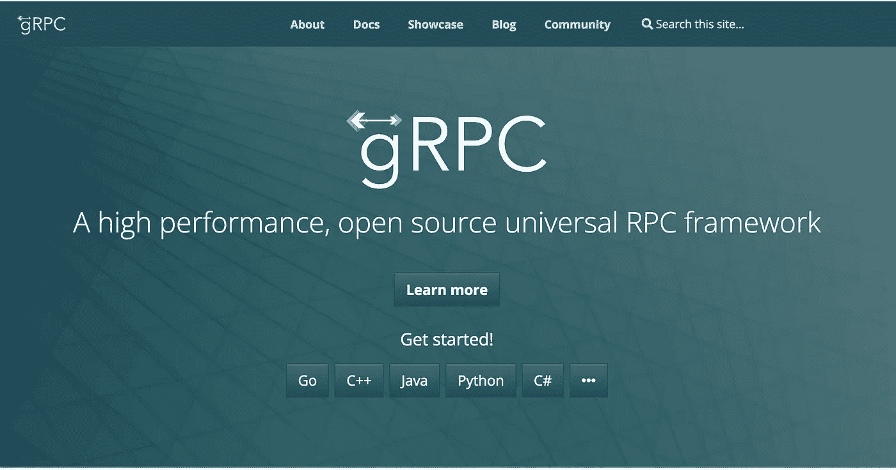
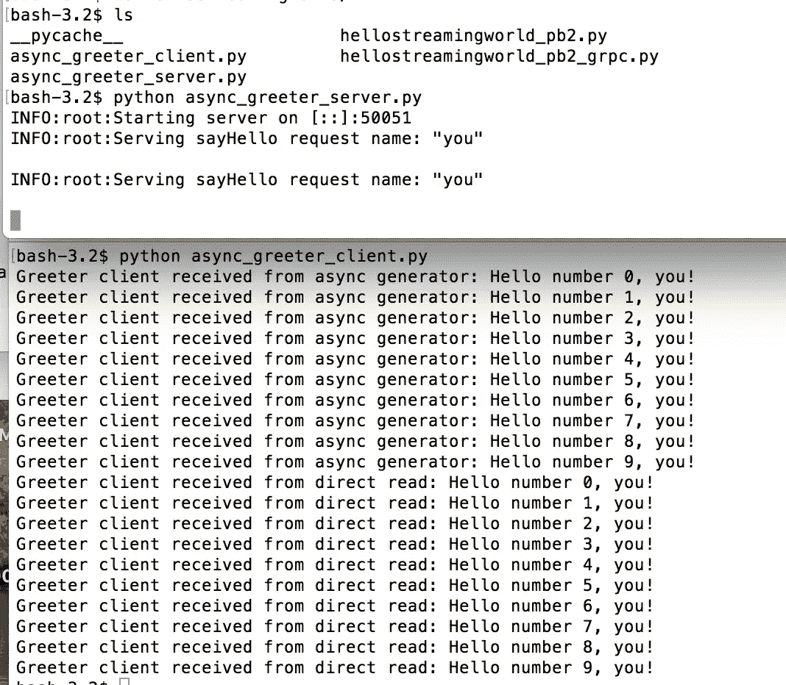
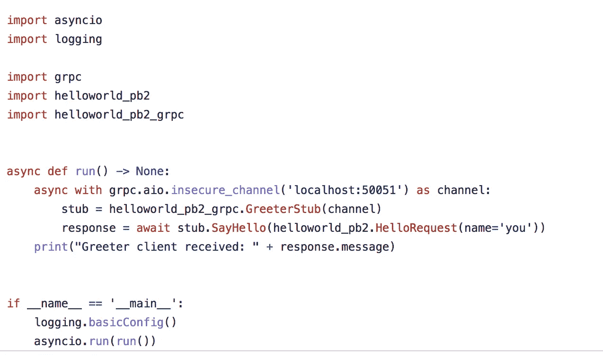

# 我们需要 gRPC 吗？

> 原文：<https://betterprogramming.pub/we-need-grpc-7ce6f13312d8>

## …从技术上讲，我们不需要它，但它有自己的使用案例



[https://grpc.io/](https://grpc.io/)

我准备写一篇关于中间件的长篇大论的帖子，以回应有人在一次聚会上问我的一个问题，但我意识到我错了——尽管 [gRPC 可以用于中间件](https://github.com/grpc-ecosystem/go-grpc-middleware)，最好的描述方式是将[描述为一个 RPC 系统，可以作为其余](https://towardsdatascience.com/reasons-to-choose-grpc-over-rest-and-how-to-adopt-it-into-your-python-apis-197ac28e22b4)架构风格的替代。这种说法本身就有问题(有人说它是合理的，有人说它是风马牛不相及的)，但这可能是开始讨论的最简单的地方:

*   它使用比 JSON 更小更快的协议缓冲区[。有人在博客上写了一个基准测试](https://developers.google.com/protocol-buffers/docs/overview)[，这里](https://medium.com/sahibinden-technology/benchmarking-rest-vs-grpc-5d4b34360911)比较了 gRPC/协议缓冲区和 REST/json
*   [gRPC 跨语言和平台工作](https://grpc.io/)。例如，你可以用 Java 写一个服务器，用 Python 写一个客户端。这个过程相对简单
*   gRPC 是开源的

我不愿意建议每个开发人员抛弃他们当前的技术而选择 gRPC，尽管已经有相当多的文章做出了这样的声明。对于为什么我们可能需要 gRPC，我简单的回答是，它已经被广泛采用了。根据维基百科的页面:*许多不同的组织都采用了 gRPC，如* [*【优步】*](https://en.wikipedia.org/wiki/Uber)*[*【8】*](https://en.wikipedia.org/wiki/GRPC#cite_note-8)*[*Square*](https://en.wikipedia.org/wiki/Square,_Inc.)*[*【网飞*](https://en.wikipedia.org/wiki/Netflix)*[*IBM*](https://en.wikipedia.org/wiki/IBM)[*【思科】*](https://en.wikipedia.org/wiki/Cisco_Systems)*[*瞻博网络*](https://en.wikipedia.org/wiki/Juniper_Networks)*[*【9】*](https://en.wikipedia.org/wiki/GRPC#cite_note-9)*[*Spotify*](https://en.wikipedia.org/wiki/Spotify)*[*【10】*](https://en.wikipedia.org/wiki/GRPC#cite_note-10)*[](https://en.wikipedia.org/wiki/GRPC#cite_note-12)*********

**一篇非常简洁的文章可以在[这里](https://www.altexsoft.com/blog/what-is-grpc/)找到，它简要概述了 gRPC 如何使用轻量级消息，执行速度比 REST/JSON 快 5-8 倍，并具有内置通信功能。在把这篇文章汇总成我能找到的所有其他文章之前，让我先描述一下它是如何工作的:**

**你在一个协议缓冲文件中定义了一个服务…出于某种原因，Google 在它的文档中使用的例子是矩形属性。根据编程语言的不同，您可以使用 proto 编译器生成一些特定于语言的文件。现在您有了可以使用的文件，包括一个存根(一个 RPC 概念)。在这里，您可以创建客户端和服务器。**

# **给我看看**

**好吧，就是这样。这只是他们固定的 Python 例子。你可以直接从他们的 [GitHub](https://github.com/grpc/grpc) 下载，可以在一个名为 examples 的文件夹中找到。它开箱即用吗？埃文的数据点，但绝对不是。**

****

**[https://github . com/grpc/grpc/blob/master/examples/python/hello world/async _ greeter _ client . py](https://github.com/grpc/grpc/blob/master/examples/python/helloworld/async_greeter_client.py)。这个想法是你自己写你自己的 greet_client 和 greeter_server 等价物。另外两个文件是自动生成的，包含 RPC 代码特有的存根。**

**当您自己编写实现时，您可以混合使用。你可以用多种语言编写一个服务器，然后用多种语言编写一个客户端。重点是？如果你做了一个服务器，人们可以编写定制的客户端，用他们选择的语言与它对话。**

**我脑子里有一个完整的例子。我打算用 corgi.proto 编写一个服务，它将具有 corgi 权重和 corgi 长度……它将使用 C++和双向流。我没有做到这一点，所以我决定只使用开箱即用的示例，但这也不起作用，所以在我等待 C++依赖项的时候，我浏览了一堆论坛，直到我可以使用他们的现成 Python 示例。所以是的，就是这样。服务器在上面，客户端在下面。**

**我们可以给你看一些非常非常棒的代码。**

****

**这是 Python，我不是超级熟悉，但还是继续吧。`helloworld_pb2`和`helloworld_pb2_grpc`是上述从协议缓冲区创建的两个文件。**

**`insecure_channel`表示没有 SSL/TLS，这是一个异步调用(没错，有整整一节是关于认证的。这一部分相当简单，至少在客户端是如此)。它附带了免费的开源 gRPC/Python 文档，这是一个很好的起点。您将看到有几个选项…您可以让客户端和服务器进行单个请求/回复，或者您可以使用双向流，或者您可以做类似这样的事情。**

**是的。这就是了。客户端和服务器。**

# **后退一步**

**咻。好吧。现在事情变得有趣了。**

**[这篇](/understanding-grpc-60737b23e79e)是一篇病毒式的文章(嗯，“病毒”是我使用的一个不太严谨的术语)，为 gRPC 辩护——你可以在评论中看到一些不同的观点。这里有一个有趣的。**

```
**Sorry, Arun, RPCs are an archaic technology that I used back in the 70s when it was all we had. Software engineering has come a long way since then.We've learned to avoid tight coupling of components for many compelling reasons. It is a fundamental principle of microservice architecture. It is painful watching developers making the same mistakes again for the same old reasons.JSON didn't exist when Roy Fielding wrote his dissertation on REST, but it is a useful "self-defining" message syntax. Protocol buffers are anything but self-defining and require a complex system for distributed schema management to work at all. That may be justifiable when data compression is the overriding concern, but it makes loosely-coupled microservices impossible to implement.A properly designed RESTful solution is a far better match for the implementation of a microservice architecture.[https://medium.com/nerd-for-tech/microservice-architecture-622e4148f1](https://medium.com/nerd-for-tech/microservice-architecture-622e4148f1)--Dick Dowdell [https://dick-dowdell.medium.com/?source=responses-----60737b23e79e----4----------------------------](https://dick-dowdell.medium.com/?source=responses-----60737b23e79e----4----------------------------)**
```

**我的看法？我真的不知道，但这是一个令人着迷的讨论。**

**gRPC 现在在业界很有用，google 协议缓冲区更受欢迎。它很快。让同一套协议缓冲文件在几秒钟内产生不同的语言绑定是有好处的。这可能是未来。但是同时我们还需要使用 REST APIs 吗？**

**当然，对于各种各样的事情。这是典型的惯性权衡，在技术领域如此普遍，尽管至少上面的评论表明，可能有其他原因让我们想对此三思。**

**一个好的项目应该是用 gRPC 构建一个完整的端到端系统。由于其性质，这也可以作为一个整洁的语言学习练习。Python？当然可以。C++客户端？为什么不呢？**

# **结束语**

**我希望继续讨论第二个 post addressing 中间件，也许是 ZeroMQ 的现成例子。**

**这里有一篇关于老虎的文章，许多人无情地将它倾倒在点击诱饵标题上，“休息正在死去，摆脱它。”我觉得有趣的是，有人认为 GRPC 是老虎的更好版本。**

**它代表什么？不知道。**

**总有一天[我会发明自己的项目，叫做柯基](https://medium.com/@kurt.shibainu/every-tech-article-ever-part-1-of-3-40df957d3e0c)。**